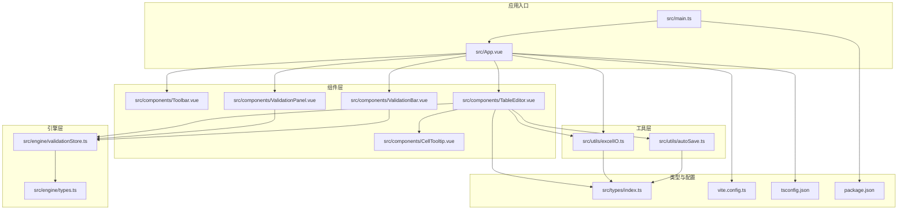
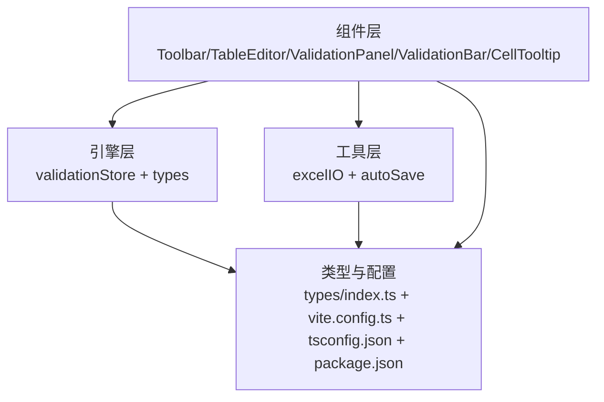
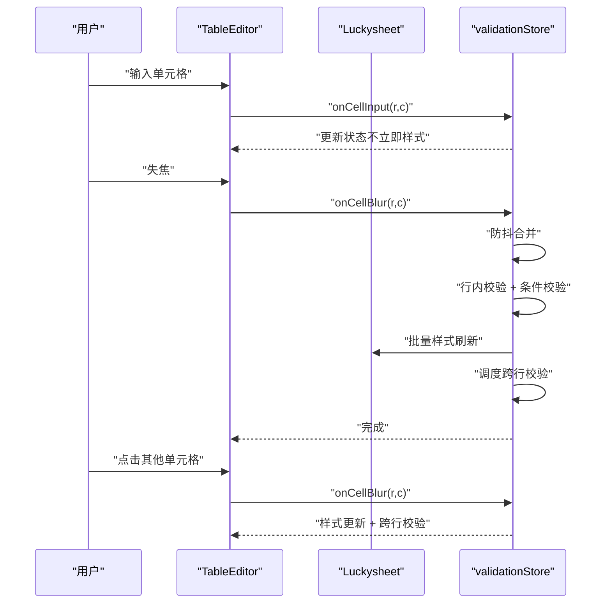
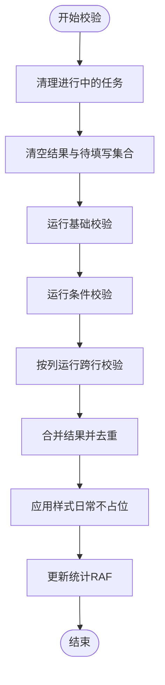
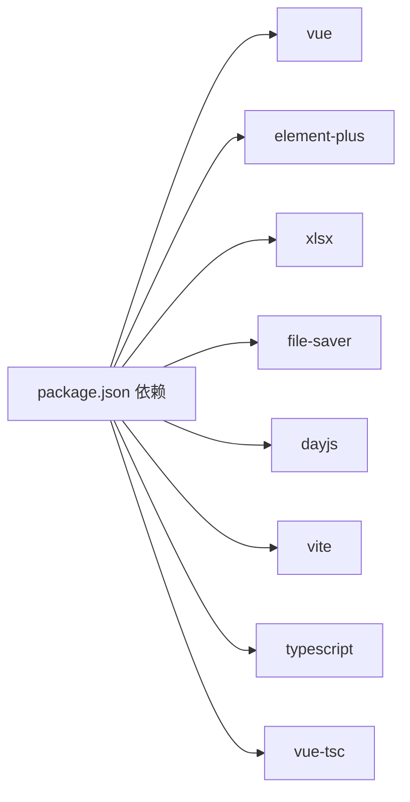

# 开发指南

<cite>
**本文引用的文件**
- [package.json](file://package.json)
- [vite.config.ts](file://vite.config.ts)
- [tsconfig.json](file://tsconfig.json)
- [src/main.ts](file://src/main.ts)
- [src/App.vue](file://src/App.vue)
- [src/components/TableEditor.vue](file://src/components/TableEditor.vue)
- [src/components/Toolbar.vue](file://src/components/Toolbar.vue)
- [src/components/ValidationPanel.vue](file://src/components/ValidationPanel.vue)
- [src/components/ValidationBar.vue](file://src/components/ValidationBar.vue)
- [src/components/CellTooltip.vue](file://src/components/CellTooltip.vue)
- [src/engine/validationStore.ts](file://src/engine/validationStore.ts)
- [src/engine/types.ts](file://src/engine/types.ts)
- [src/utils/excelIO.ts](file://src/utils/excelIO.ts)
- [src/utils/autoSave.ts](file://src/utils/autoSave.ts)
- [src/types/index.ts](file://src/types/index.ts)
</cite>

## 目录
1. [简介](#简介)
2. [项目结构](#项目结构)
3. [核心组件](#核心组件)
4. [架构总览](#架构总览)
5. [详细组件分析](#详细组件分析)
6. [依赖关系分析](#依赖关系分析)
7. [性能考量](#性能考量)
8. [调试与排错指南](#调试与排错指南)
9. [结论](#结论)
10. [附录](#附录)

## 简介
SmartForm 是一个基于 Vue 3 + TypeScript 的在线表格填表与校验工具，集成了 Luckysheet 作为底层电子表格引擎，并提供了完整的导入/导出、实时校验、跨行依赖、草稿自动保存与可视化提示等功能。本开发指南面向新老开发者，提供从代码规范、命名约定、注释标准到组件开发、状态管理、路由配置、API 接口模板、调试技巧、性能优化、测试策略、代码审查要点、扩展点与插件化思路、常见场景解决方案、重构建议与架构演进指导，以及团队协作与发布流程管理的完整实践。

## 项目结构
项目采用按功能域划分的组织方式，核心目录如下：
- src/components：UI 组件层（工具栏、表格编辑器、校验面板、校验状态条、单元格提示）
- src/engine：校验引擎与状态管理（验证规则、依赖跟踪、跨行校验、状态存储）
- src/utils：通用工具（Excel IO、自动保存）
- src/types：类型定义（表头、单元格、自动保存数据、Luckysheet 类型）
- 根级配置：Vite、TypeScript、包管理

图表来源
- [src/main.ts:1-9](file://src/main.ts#L1-L9)
- [src/App.vue:1-70](file://src/App.vue#L1-L70)
- [src/components/TableEditor.vue:1-399](file://src/components/TableEditor.vue#L1-L399)
- [src/components/Toolbar.vue:1-83](file://src/components/Toolbar.vue#L1-L83)
- [src/components/ValidationPanel.vue:1-438](file://src/components/ValidationPanel.vue#L1-L438)
- [src/components/ValidationBar.vue:1-64](file://src/components/ValidationBar.vue#L1-L64)
- [src/components/CellTooltip.vue:1-126](file://src/components/CellTooltip.vue#L1-L126)
- [src/engine/validationStore.ts:1-474](file://src/engine/validationStore.ts#L1-L474)
- [src/engine/types.ts:1-48](file://src/engine/types.ts#L1-L48)
- [src/utils/excelIO.ts:1-105](file://src/utils/excelIO.ts#L1-L105)
- [src/utils/autoSave.ts:1-71](file://src/utils/autoSave.ts#L1-L71)
- [src/types/index.ts:1-79](file://src/types/index.ts#L1-L79)
- [vite.config.ts:1-11](file://vite.config.ts#L1-L11)
- [tsconfig.json:1-26](file://tsconfig.json#L1-L26)
- [package.json:1-26](file://package.json#L1-L26)

章节来源
- [src/main.ts:1-9](file://src/main.ts#L1-L9)
- [src/App.vue:1-70](file://src/App.vue#L1-L70)
- [vite.config.ts:1-11](file://vite.config.ts#L1-L11)
- [tsconfig.json:1-26](file://tsconfig.json#L1-L26)
- [package.json:1-26](file://package.json#L1-L26)

## 核心组件
- 应用入口与挂载：创建 Vue 应用、安装 Element Plus 插件、挂载根组件。
- 主界面布局：工具栏、主编辑区（表格编辑器）、校验面板、校验状态条。
- 表格编辑器：集成 Luckysheet，封装导入/导出、自动保存、单元格提示、失焦校验、跨行校验、Shift+滚轮横向滚动。
- 校验引擎：集中式状态管理，防抖与批处理样式更新，全量校验与统计。
- 工具层：Excel 文件读写、本地草稿持久化与时间戳格式化。

章节来源
- [src/main.ts:1-9](file://src/main.ts#L1-L9)
- [src/App.vue:18-40](file://src/App.vue#L18-L40)
- [src/components/TableEditor.vue:13-328](file://src/components/TableEditor.vue#L13-L328)
- [src/engine/validationStore.ts:15-473](file://src/engine/validationStore.ts#L15-L473)
- [src/utils/excelIO.ts:10-104](file://src/utils/excelIO.ts#L10-L104)
- [src/utils/autoSave.ts:4-70](file://src/utils/autoSave.ts#L4-L70)

## 架构总览
整体采用“组件层-引擎层-工具层-类型与配置”的分层架构，组件通过事件与暴露方法与引擎交互，引擎负责状态与校验逻辑，工具层提供 IO 与持久化能力，类型定义贯穿各层保证一致性。

图表来源
- [src/components/Toolbar.vue:21-56](file://src/components/Toolbar.vue#L21-L56)
- [src/components/TableEditor.vue:18-328](file://src/components/TableEditor.vue#L18-L328)
- [src/components/ValidationPanel.vue:99-200](file://src/components/ValidationPanel.vue#L99-L200)
- [src/components/ValidationBar.vue:22-24](file://src/components/ValidationBar.vue#L22-L24)
- [src/components/CellTooltip.vue:23-68](file://src/components/CellTooltip.vue#L23-L68)
- [src/engine/validationStore.ts:1-474](file://src/engine/validationStore.ts#L1-L474)
- [src/utils/excelIO.ts:1-105](file://src/utils/excelIO.ts#L1-L105)
- [src/utils/autoSave.ts:1-71](file://src/utils/autoSave.ts#L1-L71)
- [src/types/index.ts:1-79](file://src/types/index.ts#L1-L79)
- [vite.config.ts:1-11](file://vite.config.ts#L1-L11)
- [tsconfig.json:1-26](file://tsconfig.json#L1-L26)
- [package.json:1-26](file://package.json#L1-L26)

## 详细组件分析

### 组件：Toolbar（导入/导出）
- 功能职责：提供导入 Excel、导出 Excel 的按钮与文件选择器；通过事件向上抛出导入数据与导出触发。
- 关键点：事件定义与参数类型声明、Element Plus 图标与消息提示、文件读取异常处理。
- 最佳实践：保持事件语义清晰，避免在组件内做复杂业务逻辑，将解析与转换交给上层或工具层。

章节来源
- [src/components/Toolbar.vue:21-56](file://src/components/Toolbar.vue#L21-L56)

### 组件：TableEditor（Luckysheet 编辑器）
- 功能职责：初始化 Luckysheet、构建表头与列宽、拦截单元格更新钩子、实时校验、失焦校验、跨行校验、草稿恢复、自动保存、Shift+滚轮横向滚动、单元格 Tooltip 展示。
- 关键点：hook 中的 cellUpdateBefore/cellUpdated/cellMousedown 时机控制；防抖与跨行延迟执行；样式批处理减少渲染开销；全量校验与导出前样式应用。
- 性能注意：批处理样式刷新、RAF 更新统计、清理定时器与事件监听。

图表来源
- [src/components/TableEditor.vue:102-127](file://src/components/TableEditor.vue#L102-L127)
- [src/components/TableEditor.vue:248-315](file://src/components/TableEditor.vue#L248-L315)
- [src/engine/validationStore.ts:248-344](file://src/engine/validationStore.ts#L248-L344)

章节来源
- [src/components/TableEditor.vue:13-399](file://src/components/TableEditor.vue#L13-L399)
- [src/engine/validationStore.ts:15-474](file://src/engine/validationStore.ts#L15-L474)

### 组件：ValidationPanel（校验面板）
- 功能职责：展示错误/警告统计、按行分组的问题列表、待填写项列表、导航到单元格、重新校验。
- 关键点：按行聚合错误、严重度分类、依赖描述展示、滚动到可视区域。

章节来源
- [src/components/ValidationPanel.vue:99-200](file://src/components/ValidationPanel.vue#L99-L200)

### 组件：ValidationBar（校验状态条）
- 功能职责：展示已填写行数、错误/警告数量与状态提示。
- 关键点：订阅 validationStore 状态，简洁的 UI 提示。

章节来源
- [src/components/ValidationBar.vue:22-24](file://src/components/ValidationBar.vue#L22-L24)

### 组件：CellTooltip（单元格提示）
- 功能职责：在鼠标附近显示单元格错误/警告消息，支持边界溢出自适应定位。
- 关键点：Teleport 到 body、样式类随严重度变化、动画与可见性控制。

章节来源
- [src/components/CellTooltip.vue:23-68](file://src/components/CellTooltip.vue#L23-L68)

### 引擎：validationStore（校验状态与样式）
- 功能职责：集中维护校验结果、统计错误/警告/待填写数量、防抖失焦校验、跨行延迟校验、样式批处理、全量校验与导出前样式应用。
- 关键点：Map 存储单元格结果、Set 维护待填写、批处理样式队列、RAF 更新统计、清理定时器防止内存泄漏。

图表来源
- [src/engine/validationStore.ts:408-452](file://src/engine/validationStore.ts#L408-L452)
- [src/engine/validationStore.ts:102-148](file://src/engine/validationStore.ts#L102-L148)
- [src/engine/validationStore.ts:318-344](file://src/engine/validationStore.ts#L318-L344)

章节来源
- [src/engine/validationStore.ts:15-474](file://src/engine/validationStore.ts#L15-L474)

### 工具：excelIO（Excel 读写）
- 功能职责：读取 Excel 文件为二维数组、导出当前表格为 xlsx 文件、标准化日期格式、跳过全空行、设置列宽。
- 关键点：使用 XLSX 读取与写入、FileReader 异步处理、错误捕获与提示。

章节来源
- [src/utils/excelIO.ts:10-104](file://src/utils/excelIO.ts#L10-L104)

### 工具：autoSave（自动保存）
- 功能职责：保存/读取/清除草稿、格式化时间戳、获取当前单元格数据。
- 关键点：localStorage 容错、异常日志记录、草稿恢复确认对话框。

章节来源
- [src/utils/autoSave.ts:4-70](file://src/utils/autoSave.ts#L4-L70)

### 类型：types（公共类型）
- 功能职责：定义表头列、单元格数据、自动保存数据、Luckysheet 全局接口、表头配置与自动保存键。
- 关键点：与引擎与工具层共享，保证类型一致性。

章节来源
- [src/types/index.ts:1-79](file://src/types/index.ts#L1-L79)
- [src/engine/types.ts:1-48](file://src/engine/types.ts#L1-L48)

## 依赖关系分析
- 运行时依赖：Vue 3、Element Plus、xlsx、file-saver、dayjs。
- 构建与开发：Vite、@vitejs/plugin-vue、TypeScript、vue-tsc。
- 项目内依赖：组件依赖引擎与工具层；引擎依赖类型定义；工具层依赖类型定义。

图表来源
- [package.json:11-24](file://package.json#L11-L24)

章节来源
- [package.json:1-26](file://package.json#L1-26)

## 性能考量
- 样式批处理：将多次样式变更合并为一次刷新，减少 Luckysheet 重绘次数。
- 防抖与延迟：失焦校验与跨行校验均采用防抖与延迟策略，降低高频输入带来的计算压力。
- RAF 统计：使用 requestAnimationFrame 批量更新统计，避免频繁 DOM 访问。
- 本地草稿：定时保存草稿，避免长时间编辑丢失；导出前全量校验时启用占位空格以保证样式一致。
- 横向滚动：通过操作 Luckysheet 自带横向滚动条并触发其内部事件，避免无效的原生 scrollLeft 修改。

章节来源
- [src/engine/validationStore.ts:102-148](file://src/engine/validationStore.ts#L102-L148)
- [src/engine/validationStore.ts:248-315](file://src/engine/validationStore.ts#L248-L315)
- [src/engine/validationStore.ts:318-344](file://src/engine/validationStore.ts#L318-L344)
- [src/components/TableEditor.vue:355-382](file://src/components/TableEditor.vue#L355-L382)

## 调试与排错指南
- 控制台与日志：自动保存失败、文件读取失败、Luckysheet 未加载等均有明确日志与兜底处理。
- 校验未通过：导出前弹窗汇总错误/警告数量与前 N 条详情；支持“继续导出”或取消。
- 草稿恢复：检测到本地草稿弹出确认框，支持恢复或忽略。
- 事件与钩子：确认 Luckysheet 钩子回调是否被正确注册与释放，避免重复绑定导致的性能问题。
- 样式异常：检查样式批处理队列是否被及时刷新，必要时调用同步刷新函数。

章节来源
- [src/components/TableEditor.vue:218-237](file://src/components/TableEditor.vue#L218-L237)
- [src/components/TableEditor.vue:240-273](file://src/components/TableEditor.vue#L240-L273)
- [src/engine/validationStore.ts:102-148](file://src/engine/validationStore.ts#L102-L148)

## 结论
SmartForm 通过清晰的分层设计与完善的校验机制，实现了高性能、易用的在线表格填表体验。遵循本文的开发规范与最佳实践，可在保证质量的前提下高效扩展功能、优化性能并提升团队协作效率。

## 附录

### 代码规范与命名约定
- 文件与目录：采用小写与中划线组合，功能域优先；组件以 .vue 结尾，工具与引擎以 .ts 结尾。
- 组件：首字母大写驼峰命名；模板使用语义化标签与语义化类名。
- 方法与变量：使用小驼峰；常量使用全大写蛇形；布尔变量以 is/has/should 前缀。
- 类型：接口与类型使用大驼峰；枚举与字面量类型使用联合类型。
- 路径别名：统一使用 @/* 作为 src 的别名，便于迁移与维护。

章节来源
- [tsconfig.json:19-21](file://tsconfig.json#L19-L21)

### 注释标准
- 函数/方法：简述用途、参数与返回值；复杂逻辑分步骤注释。
- 关键流程：对钩子、防抖、批处理、清理等关键路径添加注释说明。
- 外部依赖：对 Luckysheet API 使用处标注兼容性与降级策略。

章节来源
- [src/components/TableEditor.vue:335-382](file://src/components/TableEditor.vue#L335-L382)
- [src/engine/validationStore.ts:238-344](file://src/engine/validationStore.ts#L238-L344)

### 组件开发模板
- 事件与暴露方法：使用 defineEmits 与 defineExpose，保持对外接口稳定。
- 生命周期：在 onMounted 中初始化外部依赖，在 onBeforeUnmount 中清理定时器与事件监听。
- 状态管理：通过引擎提供的 store 或工具函数进行状态读取与更新。
- 样式与主题：统一使用 Element Plus 组件与样式变量，避免硬编码颜色与尺寸。

章节来源
- [src/components/Toolbar.vue:27-30](file://src/components/Toolbar.vue#L27-L30)
- [src/components/TableEditor.vue:294-297](file://src/components/TableEditor.vue#L294-L297)
- [src/components/ValidationPanel.vue:105-106](file://src/components/ValidationPanel.vue#L105-L106)

### 状态管理模板
- 集中式状态：使用 reactive 包裹状态，提供读取与更新方法；对批量操作使用批处理队列。
- 统计与缓存：使用 RAF 批量更新统计，避免频繁遍历。
- 清理策略：在组件卸载与导出前清理定时器与批处理队列。

章节来源
- [src/engine/validationStore.ts:15-57](file://src/engine/validationStore.ts#L15-L57)
- [src/engine/validationStore.ts:456-465](file://src/engine/validationStore.ts#L456-L465)

### 路由配置与页面入口
- 当前项目为单页应用，路由配置位于根级 vite.config.ts；如需路由，建议在 src/router 下新增模块并按需懒加载。
- 页面入口统一在 src/main.ts 中挂载，保持最小改动以适配多页面。

章节来源
- [vite.config.ts:4-10](file://vite.config.ts#L4-L10)
- [src/main.ts:6-8](file://src/main.ts#L6-L8)

### API 接口开发模板
- 导入：使用 readExcelFile 返回二维数组，向上抛出 import 事件。
- 导出：在导出前调用 validateBeforeExport，根据返回值决定是否继续导出。
- 错误处理：对文件读取、网络请求、Luckysheet API 调用进行 try/catch 并提示用户。

章节来源
- [src/components/Toolbar.vue:38-52](file://src/components/Toolbar.vue#L38-L52)
- [src/App.vue:29-39](file://src/App.vue#L29-L39)
- [src/utils/excelIO.ts:10-56](file://src/utils/excelIO.ts#L10-L56)

### 测试策略
- 单元测试：针对工具函数（readExcelFile、exportExcel、saveToLocal、loadFromLocal）编写异步测试用例。
- 集成测试：模拟 Luckysheet 钩子与 validationStore 的交互，验证防抖、批处理与跨行校验链路。
- 端到端测试：使用真实浏览器环境，覆盖导入/导出、草稿恢复、Shift+滚轮等交互。

章节来源
- [src/utils/excelIO.ts:10-104](file://src/utils/excelIO.ts#L10-L104)
- [src/utils/autoSave.ts:4-70](file://src/utils/autoSave.ts#L4-L70)
- [src/engine/validationStore.ts:248-344](file://src/engine/validationStore.ts#L248-L344)

### 代码审查要点
- 依赖注入：组件间通信尽量通过 props 与事件，避免直接访问全局对象。
- 异步与错误：所有异步操作必须有错误捕获与用户提示。
- 性能：避免在渲染路径中进行重型计算，使用防抖、批处理与 RAF。
- 可维护性：复杂逻辑拆分为小函数，添加注释与类型约束。

章节来源
- [src/components/TableEditor.vue:102-127](file://src/components/TableEditor.vue#L102-L127)
- [src/engine/validationStore.ts:102-148](file://src/engine/validationStore.ts#L102-L148)

### 扩展点与插件系统
- 校验规则扩展：在引擎层新增规则与依赖描述，通过 types.ts 定义规则结构，validationStore 中注册。
- 组件扩展：新增 UI 组件时，遵循现有事件与暴露方法模式，确保与 App.vue 的交互一致。
- 工具扩展：新增工具函数时，统一在 utils 下维护，提供类型定义并在 types/index.ts 中补充。

章节来源
- [src/engine/types.ts:14-23](file://src/engine/types.ts#L14-L23)
- [src/engine/validationStore.ts:1-12](file://src/engine/validationStore.ts#L1-L12)
- [src/types/index.ts:1-28](file://src/types/index.ts#L1-L28)

### 常见开发场景解决方案
- 导入 Excel 后全量校验：在导入完成后调用 runFullValidation 与 applyAllValidationStyles。
- 导出前校验：validateBeforeExport 返回 false 时中断导出，返回 true 时继续。
- 草稿恢复：checkDraft 弹窗确认，确认后恢复草稿并进入全量校验。
- 失焦校验与跨行校验：onCellBlur 触发防抖，随后执行行内与条件校验，并调度跨行校验。

章节来源
- [src/components/TableEditor.vue:185-215](file://src/components/TableEditor.vue#L185-L215)
- [src/components/TableEditor.vue:240-273](file://src/components/TableEditor.vue#L240-L273)
- [src/components/TableEditor.vue:218-237](file://src/components/TableEditor.vue#L218-L237)
- [src/engine/validationStore.ts:256-315](file://src/engine/validationStore.ts#L256-L315)

### 重构建议与架构演进
- 分层解耦：将 Luckysheet 的具体实现抽象为适配器，便于未来替换或升级。
- 规则引擎：将校验规则与依赖描述抽取为可配置文件，支持动态加载与热更新。
- 状态持久化：将 validationStore 的状态持久化到本地或服务端，支持多标签页协同。
- 性能监控：埋点统计关键路径耗时（防抖、批处理、跨行校验），持续优化。

章节来源
- [src/engine/validationStore.ts:15-57](file://src/engine/validationStore.ts#L15-L57)
- [src/engine/validationStore.ts:318-344](file://src/engine/validationStore.ts#L318-L344)

### 团队协作规范与发布流程
- 版本控制：采用 Git 分支模型（如 Git Flow），主分支受保护，特性分支合并前需代码审查。
- 提交规范：使用 Conventional Commits，明确 feat/fix/docs/chore 等类型。
- 代码审查：强制双人审查，关注性能、可维护性与安全性。
- 发布流程：本地构建与预览，CI/CD 自动化打包与上传，发布后进行回归测试。

章节来源
- [package.json:6-9](file://package.json#L6-L9)
- [vite.config.ts:4-10](file://vite.config.ts#L4-L10)