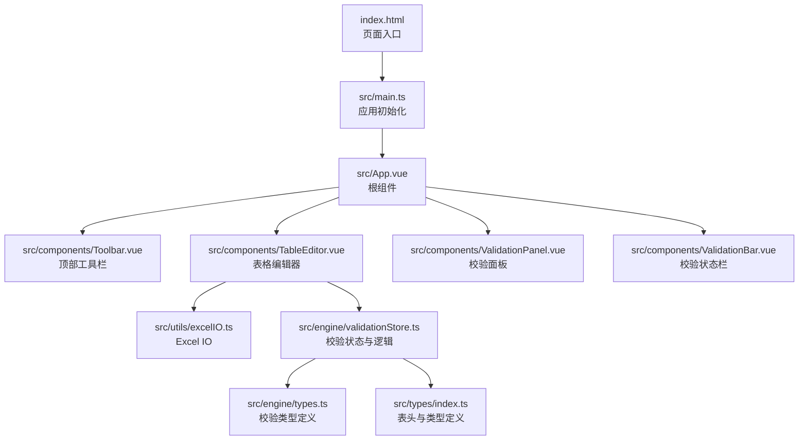
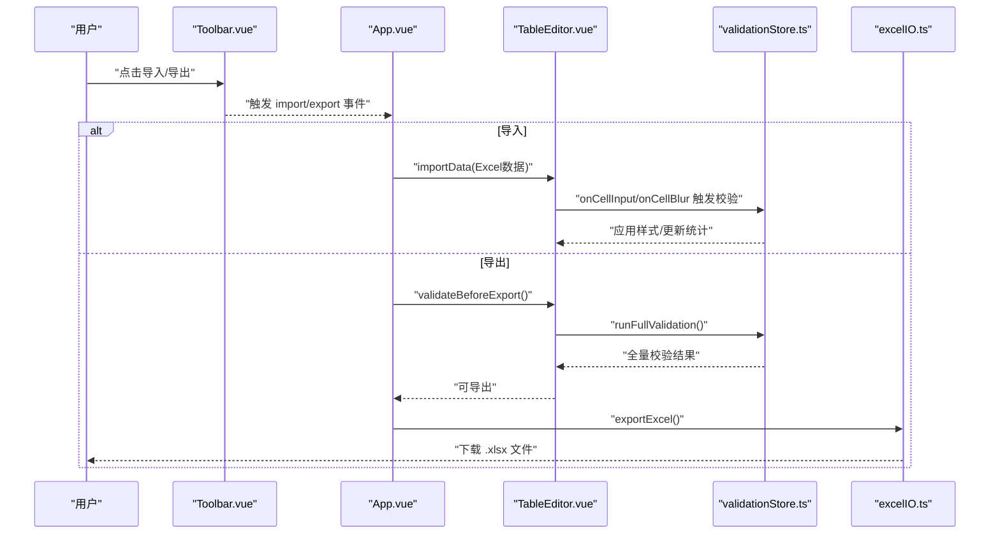
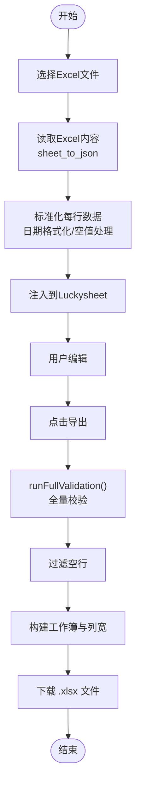
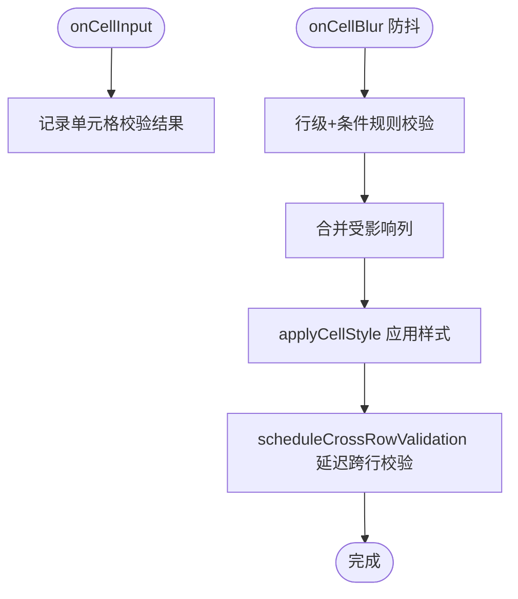
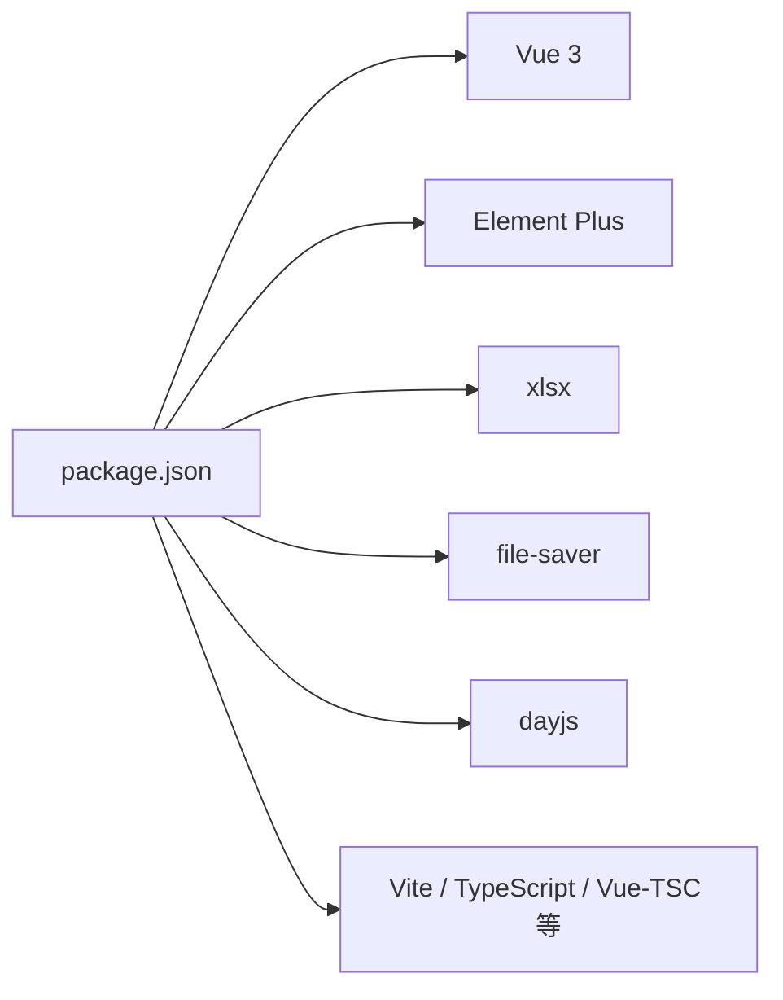

# 快速开始

<cite>
**本文引用的文件**
- [package.json](file://package.json)
- [vite.config.ts](file://vite.config.ts)
- [tsconfig.json](file://tsconfig.json)
- [tsconfig.node.json](file://tsconfig.node.json)
- [index.html](file://index.html)
- [启动工具.bat](file://启动工具.bat)
- [src/main.ts](file://src/main.ts)
- [src/App.vue](file://src/App.vue)
- [src/components/Toolbar.vue](file://src/components/Toolbar.vue)
- [src/utils/excelIO.ts](file://src/utils/excelIO.ts)
- [src/engine/validationStore.ts](file://src/engine/validationStore.ts)
- [src/types/index.ts](file://src/types/index.ts)
- [src/engine/types.ts](file://src/engine/types.ts)
- [src/components/TableEditor.vue](file://src/components/TableEditor.vue)
</cite>

## 目录
1. [简介](#简介)
2. [项目结构](#项目结构)
3. [核心组件](#核心组件)
4. [架构总览](#架构总览)
5. [详细组件分析](#详细组件分析)
6. [依赖分析](#依赖分析)
7. [性能考虑](#性能考虑)
8. [故障排查指南](#故障排查指南)
9. [结论](#结论)
10. [附录](#附录)

## 简介
本指南面向希望快速上手 SmartForm 项目的开发者，覆盖环境要求、依赖安装、开发环境配置与首次运行全流程。项目基于 Vue 3 + TypeScript + Vite 构建，集成 Luckysheet 电子表格与 Element Plus UI 组件库，支持 Excel 导入导出与实时/延迟校验。

## 项目结构
SmartForm 采用“源码分层 + 工程配置”组织方式：
- 源码位于 src 目录，按功能划分为组件、引擎、类型与工具模块
- 工程配置集中在根目录，包含包管理、TypeScript 编译、Vite 开发服务器与构建参数
- 页面入口通过 index.html 引入 Luckysheet CDN 并挂载 Vue 应用

图表来源
- [index.html](file://index.html)
- [src/main.ts](file://src/main.ts)
- [src/App.vue](file://src/App.vue)
- [src/components/Toolbar.vue](file://src/components/Toolbar.vue)
- [src/components/TableEditor.vue](file://src/components/TableEditor.vue)
- [src/utils/excelIO.ts](file://src/utils/excelIO.ts)
- [src/engine/validationStore.ts](file://src/engine/validationStore.ts)
- [src/engine/types.ts](file://src/engine/types.ts)
- [src/types/index.ts](file://src/types/index.ts)

章节来源
- [package.json](file://package.json)
- [vite.config.ts](file://vite.config.ts)
- [tsconfig.json](file://tsconfig.json)
- [index.html](file://index.html)

## 核心组件
- 应用入口与挂载：Vue 应用在 main.ts 中创建并挂载至 index.html 的 #app 容器，同时注册 Element Plus。
- 页面根组件：App.vue 组织工具栏、表格编辑器、校验面板与状态栏，并协调导入/导出流程。
- 表格编辑器：TableEditor.vue 基于 Luckysheet 初始化工作表，拦截单元格更新事件，驱动校验引擎并在失焦时应用样式。
- 校验引擎：validationStore.ts 提供单元格/行/跨行校验、样式批处理、统计与全量导出前校验。
- Excel IO：excelIO.ts 封装 xlsx 与 file-saver，负责 Excel 文件读写与列宽设置。
- 类型系统：types/index.ts 定义表头列、单元格数据与自动保存结构；engine/types.ts 定义校验结果与严重度。

章节来源
- [src/main.ts](file://src/main.ts)
- [src/App.vue](file://src/App.vue)
- [src/components/TableEditor.vue](file://src/components/TableEditor.vue)
- [src/engine/validationStore.ts](file://src/engine/validationStore.ts)
- [src/utils/excelIO.ts](file://src/utils/excelIO.ts)
- [src/types/index.ts](file://src/types/index.ts)
- [src/engine/types.ts](file://src/engine/types.ts)

## 架构总览
下图展示从用户交互到数据落盘的关键链路：工具栏触发导入/导出，TableEditor 与校验引擎协作，最终通过 Excel IO 输出文件。

图表来源
- [src/components/Toolbar.vue](file://src/components/Toolbar.vue)
- [src/App.vue](file://src/App.vue)
- [src/components/TableEditor.vue](file://src/components/TableEditor.vue)
- [src/engine/validationStore.ts](file://src/engine/validationStore.ts)
- [src/utils/excelIO.ts](file://src/utils/excelIO.ts)

## 详细组件分析

### 环境与依赖要求
- Node.js：建议使用长期支持版本 LTS（具体版本请参考团队或 CI 策略）。项目使用 npm 作为包管理器。
- 浏览器兼容性：项目通过 Vite 与现代 TS/JS 编译目标运行，推荐使用主流桌面浏览器（Chrome/Firefox/Safari/Edge）。
- 第三方依赖：Vue 3、Element Plus、xlsx、file-saver、dayjs；开发依赖包括 Vite、TypeScript、@vitejs/plugin-vue、vue-tsc。

章节来源
- [package.json](file://package.json)
- [tsconfig.json](file://tsconfig.json)

### 依赖安装与首次运行
- 使用提供的启动脚本一键安装与启动开发服务器，自动清理旧依赖、安装依赖并启动 Vite。
- 启动脚本会打开浏览器访问本地开发地址，端口默认 3000。
- 若需手动操作，可使用 npm 脚本：安装依赖、启动开发服务器、构建预览。

章节来源
- [启动工具.bat](file://启动工具.bat)
- [package.json](file://package.json)
- [vite.config.ts](file://vite.config.ts)

### 开发环境配置
- Vite 配置：启用 Vue 插件，开发服务器监听 3000 端口并自动打开浏览器。
- TypeScript 配置：严格模式、ESNext 模块解析、路径别名 @/* 指向 src/*，包含 .vue/.ts/.tsx/.d.ts 文件。
- HTML 入口：引入 Luckysheet CDN（CSS/JS），并在末尾加载 /src/main.ts。

章节来源
- [vite.config.ts](file://vite.config.ts)
- [tsconfig.json](file://tsconfig.json)
- [tsconfig.node.json](file://tsconfig.node.json)
- [index.html](file://index.html)

### 热重载与调试
- Vite 默认提供热重载能力，修改源码后浏览器自动刷新。
- 建议在浏览器开发者工具中：
  - Console 查看运行时错误与日志
  - Network 检查 Luckysheet CDN 加载是否正常
  - Elements 检查 #app 挂载点与 DOM 结构
  - Sources 设置断点调试 TypeScript/Vue 组件

章节来源
- [vite.config.ts](file://vite.config.ts)
- [index.html](file://index.html)

### 导入/导出流程
- 导入：通过 Toolbar 打开文件选择，使用 xlsx 读取 Excel，跳过表头并标准化每行数据，再注入到 Luckysheet。
- 导出：在导出前触发全量校验，过滤空行，构建工作簿并设置列宽，最后以时间戳命名下载。

图表来源
- [src/components/Toolbar.vue](file://src/components/Toolbar.vue)
- [src/utils/excelIO.ts](file://src/utils/excelIO.ts)
- [src/engine/validationStore.ts](file://src/engine/validationStore.ts)

章节来源
- [src/components/Toolbar.vue](file://src/components/Toolbar.vue)
- [src/utils/excelIO.ts](file://src/utils/excelIO.ts)
- [src/engine/validationStore.ts](file://src/engine/validationStore.ts)

### 校验引擎与样式应用
- 即时校验：输入时对单个单元格执行基础规则校验，仅维护状态，不立即渲染样式。
- 失焦校验：防抖（约 200ms）后执行行级与条件规则校验，合并影响列并同步样式；随后延迟执行跨行规则（约 800ms）。
- 全量校验：导出前一次性执行全部规则，应用样式并标记待填写项。
- 样式批处理：批量更新 Luckysheet 单元格样式，减少多次 API 调用带来的性能损耗。

图表来源
- [src/engine/validationStore.ts](file://src/engine/validationStore.ts)

章节来源
- [src/engine/validationStore.ts](file://src/engine/validationStore.ts)

### 类型与表头定义
- 表头列：定义 30 列字段、标签、宽度与索引，作为 Excel 列与 Luckysheet 列宽的基础。
- 单元格数据：Luckysheet 单元格结构包含值、格式、背景等属性。
- 自动保存：以 localStorage 存储 celldata 与时间戳，支持草稿恢复。

章节来源
- [src/types/index.ts](file://src/types/index.ts)
- [src/engine/types.ts](file://src/engine/types.ts)

## 依赖分析
- 运行时依赖：Vue 3 作为框架核心；Element Plus 提供 UI 组件；xlsx 与 file-saver 负责 Excel 读写；dayjs 用于日期格式化。
- 开发依赖：Vite 作为构建与开发服务器；TypeScript 与 vue-tsc 提供类型检查；@vitejs/plugin-vue 支持 .vue 单文件组件。

图表来源
- [package.json](file://package.json)

章节来源
- [package.json](file://package.json)

## 性能考虑
- 样式批处理：通过批量更新 Luckysheet 样式减少重绘次数。
- 防抖与延迟：输入防抖与跨行校验延迟，降低高频变更导致的计算压力。
- 全量校验：导出前一次性校验，避免频繁刷新 UI。
- 列宽优化：根据表头宽度设置列宽，提升渲染效率与可读性。

章节来源
- [src/engine/validationStore.ts](file://src/engine/validationStore.ts)
- [src/utils/excelIO.ts](file://src/utils/excelIO.ts)

## 故障排查指南
- Node.js 未安装或不在 PATH：启动脚本会提示安装 Node.js 并退出。请安装 LTS 版本并重新执行。
- 依赖安装失败：启动脚本会清理 node_modules 并使用国内镜像源重装。若仍失败，检查网络与代理设置。
- Luckysheet 未加载：页面通过 CDN 引入 Luckysheet，若控制台报错请检查网络连通性与 CDN 可达性。
- 开发服务器无法启动：确认端口 3000 未被占用；如需更换端口，可在 Vite 配置中调整。
- 导入/导出异常：检查 Excel 文件格式与表头是否匹配；导出前确保已触发全量校验。
- 样式不生效：确认已正确应用 applyCellStyle；必要时在导出前调用 applyAllValidationStyles。

章节来源
- [启动工具.bat](file://启动工具.bat)
- [index.html](file://index.html)
- [vite.config.ts](file://vite.config.ts)
- [src/engine/validationStore.ts](file://src/engine/validationStore.ts)

## 结论
通过本指南，您可以在本地快速搭建并运行 SmartForm 项目，掌握从依赖安装、开发服务器启动到导入导出与校验流程的完整操作路径。建议结合浏览器调试工具与日志输出逐步定位问题，充分利用热重载提升开发效率。

## 附录
- 常用命令
  - 安装依赖：npm install
  - 启动开发服务器：npm run dev 或使用启动脚本
  - 构建生产包：npm run build
  - 预览生产包：npm run preview
- 关键配置
  - Vite：端口 3000，自动打开浏览器
  - TypeScript：严格模式、ESNext 模块解析、路径别名 @/*
  - HTML：Luckysheet CDN 引入与 main.ts 入口加载

章节来源
- [package.json](file://package.json)
- [vite.config.ts](file://vite.config.ts)
- [tsconfig.json](file://tsconfig.json)
- [index.html](file://index.html)