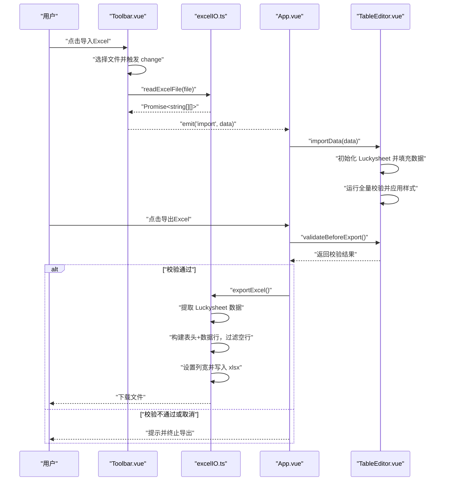
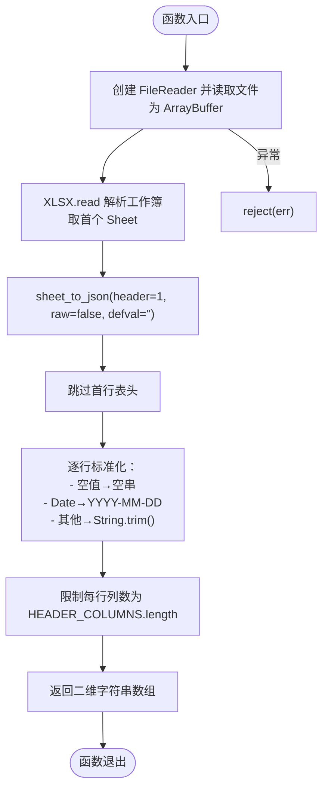
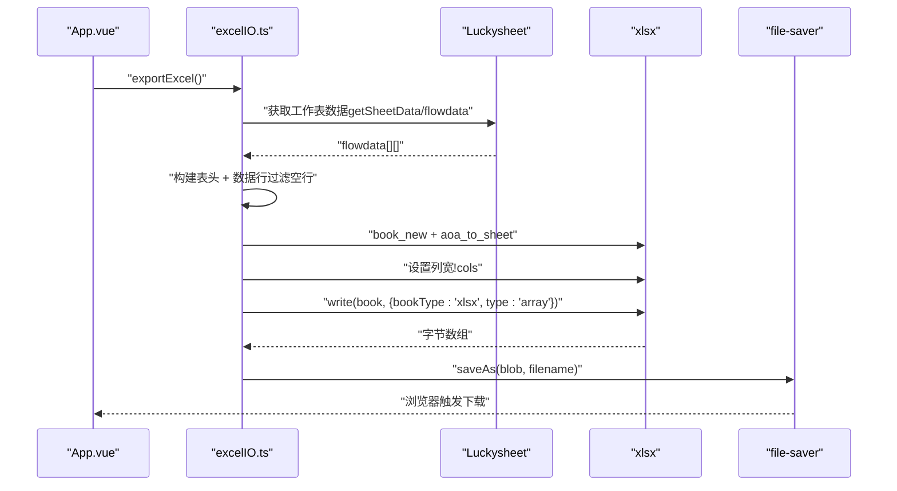

# Excel 文件处理

<cite>
**本文引用的文件**
- [excelIO.ts](file://src/utils/excelIO.ts)
- [index.ts（类型定义）](file://src/types/index.ts)
- [Toolbar.vue](file://src/components/Toolbar.vue)
- [TableEditor.vue](file://src/components/TableEditor.vue)
- [App.vue](file://src/App.vue)
- [main.ts](file://src/main.ts)
- [package.json](file://package.json)
</cite>

## 目录
1. [简介](#简介)
2. [项目结构](#项目结构)
3. [核心组件](#核心组件)
4. [架构总览](#架构总览)
5. [详细组件分析](#详细组件分析)
6. [依赖关系分析](#依赖关系分析)
7. [性能考量](#性能考量)
8. [故障排查指南](#故障排查指南)
9. [结论](#结论)
10. [附录](#附录)

## 简介
本文件聚焦于 Excel 文件处理能力，围绕以下目标展开：
- 深入解析 readExcelFile 的实现原理：文件读取、解析、数据标准化与格式转换。
- 详述导出功能 exportExcel 的机制：Luckysheet 数据提取、表头处理、数据过滤与文件生成策略。
- 覆盖格式兼容性、日期标准化、空值处理与性能优化。
- 提供完整的错误处理与异常场景处理建议，并给出可操作的调试技巧与使用示例路径。

## 项目结构
该项目基于 Vue 3 + TypeScript + Vite 构建，Excel 处理逻辑集中在工具模块与组件交互层：
- 工具层：src/utils/excelIO.ts 提供读取与导出能力。
- 类型层：src/types/index.ts 定义表头列、Luckysheet 单元格数据结构与全局接口。
- 组件层：Toolbar.vue 触发文件选择与导入；App.vue 协调导入/导出流程；TableEditor.vue 与 Luckysheet 集成并承载数据。
- 应用入口：src/main.ts 引入 Element Plus 并挂载应用。

图表来源
- [excelIO.ts:1-105](file://src/utils/excelIO.ts#L1-L105)
- [index.ts（类型定义）:1-79](file://src/types/index.ts#L1-L79)
- [Toolbar.vue:1-83](file://src/components/Toolbar.vue#L1-L83)
- [TableEditor.vue:1-200](file://src/components/TableEditor.vue#L1-L200)
- [App.vue:1-70](file://src/App.vue#L1-L70)

章节来源
- [main.ts:1-9](file://src/main.ts#L1-L9)
- [package.json:1-26](file://package.json#L1-L26)

## 核心组件
- Excel 工具函数
  - readExcelFile：异步读取 Excel 文件，返回二维字符串数组（不含表头），并对日期与空值进行标准化。
  - exportExcel：从 Luckysheet 当前工作表提取数据，构建导出行（含表头），过滤空行，生成 xlsx 并下载。
- 类型与常量
  - HEADER_COLUMNS：定义 30 列表头字段、标签、宽度与索引。
  - CellData/LuckysheetGlobal：Luckysheet 单元格与全局对象的类型描述。
- 组件交互
  - Toolbar.vue：负责文件选择、调用 readExcelFile 并向父组件发出导入事件。
  - App.vue：在导出前触发 TableEditor.validateBeforeExport，再调用 exportExcel。
  - TableEditor.vue：初始化 Luckysheet、导入数据、执行校验、暴露导入与导出前置校验方法。

章节来源
- [excelIO.ts:10-56](file://src/utils/excelIO.ts#L10-L56)
- [excelIO.ts:61-104](file://src/utils/excelIO.ts#L61-L104)
- [index.ts（类型定义）:44-79](file://src/types/index.ts#L44-L79)
- [Toolbar.vue:34-56](file://src/components/Toolbar.vue#L34-L56)
- [App.vue:29-39](file://src/App.vue#L29-L39)
- [TableEditor.vue:184-215](file://src/components/TableEditor.vue#L184-L215)

## 架构总览
下图展示了从用户操作到最终文件生成的关键流程与模块交互。

图表来源
- [Toolbar.vue:34-56](file://src/components/Toolbar.vue#L34-L56)
- [excelIO.ts:10-56](file://src/utils/excelIO.ts#L10-L56)
- [App.vue:29-39](file://src/App.vue#L29-L39)
- [TableEditor.vue:239-273](file://src/components/TableEditor.vue#L239-L273)
- [excelIO.ts:61-104](file://src/utils/excelIO.ts#L61-L104)

## 详细组件分析

### readExcelFile 实现原理
- 文件读取与解析
  - 使用 FileReader 将文件读取为 ArrayBuffer，再转为 Uint8Array 传入 xlsx 解析器。
  - 通过 XLSX.read 读取工作簿，取首个工作表，使用 XLSX.utils.sheet_to_json 读取为二维数组。
  - header: 1 指定第一行为表头；raw: false 获取格式化后的文本；defval: '' 统一空单元格默认值为空串。
- 数据裁剪与标准化
  - 跳过首行（表头），从第二行开始作为数据行。
  - 每行标准化为固定列数（由 HEADER_COLUMNS.length 决定），不足补空串。
  - 对空值与 undefined 统一转为空串；对 Date 类型使用 dayjs 格式化为“YYYY-MM-DD”；其他值先转为字符串再 trim。
- 错误处理
  - FileReader onerror 统一抛出“文件读取失败”错误。
  - onload 中 try/catch 包裹解析与转换逻辑，异常直接 reject，便于上层捕获。

图表来源
- [excelIO.ts:10-56](file://src/utils/excelIO.ts#L10-L56)

章节来源
- [excelIO.ts:10-56](file://src/utils/excelIO.ts#L10-L56)

### exportExcel 实现机制
- 数据提取
  - 通过 window.luckysheet 访问实例，优先调用 getSheetData，其次尝试 flowdata，若均不可用则直接返回。
  - 从第二行开始遍历，按列顺序读取单元格内容，支持 cell.m（显示值）与 cell.v（原始值）。
- 表头与数据行构建
  - 表头来自 HEADER_COLUMNS.label 数组。
  - 数据行逐列拼接，遇到非空值即标记该行存在有效数据。
- 数据过滤与文件生成
  - 过滤掉整行为空的数据行。
  - 使用 XLSX.utils.book_new 创建工作簿，aoa_to_sheet 将二维数组写入工作表。
  - 设置列宽：根据 HEADER_COLUMNS.width 计算 wch 并写入 ws['!cols']。
  - 写入工作簿为 xlsx 字节流，使用 file-saver 下载，文件名包含时间戳。
- 错误处理
  - 若无法获取 flowdata 或 Luckysheet 未就绪，直接返回，避免无意义操作。

图表来源
- [excelIO.ts:61-104](file://src/utils/excelIO.ts#L61-L104)

章节来源
- [excelIO.ts:61-104](file://src/utils/excelIO.ts#L61-L104)

### 表头与列宽配置
- 表头定义
  - HEADER_COLUMNS 定义了 30 列的字段名、显示标签、列宽与索引，确保导入/导出一致性。
- 列宽计算
  - 导出时根据列宽（单位像素）除以近似换算因子（约 8）得到 wch，写入 ws['!cols'] 控制列宽。

章节来源
- [index.ts（类型定义）:44-79](file://src/types/index.ts#L44-L79)
- [excelIO.ts:95-96](file://src/utils/excelIO.ts#L95-L96)

### 组件交互与生命周期
- Toolbar.vue
  - 提供文件选择输入框（仅接受 .xlsx/.xls），触发 readExcelFile 并上报导入事件。
- App.vue
  - 导出前调用 TableEditor.validateBeforeExport，若校验失败或用户取消，则终止导出。
- TableEditor.vue
  - 初始化 Luckysheet，冻结首行（表头），禁止表头行编辑；提供导入数据与导出前校验方法。
  - 导入数据时，将二维字符串数组转换为 Luckysheet 的 CellData 结构并填充。

章节来源
- [Toolbar.vue:34-56](file://src/components/Toolbar.vue#L34-L56)
- [App.vue:29-39](file://src/App.vue#L29-L39)
- [TableEditor.vue:56-127](file://src/components/TableEditor.vue#L56-L127)
- [TableEditor.vue:184-215](file://src/components/TableEditor.vue#L184-L215)

## 依赖关系分析
- 外部依赖
  - xlsx：Excel 文件解析与写入。
  - file-saver：浏览器端文件下载。
  - dayjs：日期格式化。
- 内部依赖
  - excelIO.ts 依赖 HEADER_COLUMNS 与 dayjs/xlsx/file-saver。
  - Toolbar.vue 依赖 excelIO.ts 与 Element Plus。
  - App.vue 依赖 Toolbar.vue 与 excelIO.ts。
  - TableEditor.vue 依赖 types/index.ts 与 validationStore（校验逻辑）。

图表来源
- [package.json:11-24](file://package.json#L11-L24)
- [excelIO.ts:1-4](file://src/utils/excelIO.ts#L1-L4)
- [Toolbar.vue:25](file://src/components/Toolbar.vue#L25)
- [App.vue:24](file://src/App.vue#L24)
- [TableEditor.vue:15](file://src/components/TableEditor.vue#L15)

章节来源
- [package.json:11-24](file://package.json#L11-L24)

## 性能考量
- 读取与解析
  - 使用 sheet_to_json(header=1, raw=false, defval='') 可减少二次格式化成本，但会保留显示文本，需配合 trim 与日期格式化。
  - cellDates: true 使日期被解析为 Date 对象，便于后续统一格式化。
- 导出阶段
  - 过滤空行避免生成冗余行，降低文件体积与渲染压力。
  - 列宽预设减少浏览器自动调整列宽的开销。
- 内存与 UI
  - 导入大数据量时建议分批处理或提示进度；当前实现一次性读取并初始化 Luckysheet，注意浏览器内存占用。
  - 导出前执行 validateBeforeExport，避免无效导出导致重复操作。

[本节为通用性能建议，不直接分析具体文件，故无章节来源]

## 故障排查指南
- 导入失败
  - 现象：弹出“导入失败: …”提示。
  - 排查要点：
    - 确认文件格式为 .xlsx/.xls。
    - 检查文件是否损坏或被杀毒软件拦截。
    - 查看控制台是否有 FileReader 或 XLSX 解析异常。
  - 参考路径：[Toolbar.vue:43-49](file://src/components/Toolbar.vue#L43-L49)，[excelIO.ts:53-55](file://src/utils/excelIO.ts#L53-L55)
- Luckysheet 未加载
  - 现象：控制台输出“Luckysheet未加载，请检查CDN引入”，或导出无响应。
  - 排查要点：
    - 确认页面已正确引入 Luckysheet 资源。
    - 检查 window.luckysheet 是否可用。
  - 参考路径：[TableEditor.vue:57-61](file://src/components/TableEditor.vue#L57-L61)，[excelIO.ts:62-66](file://src/utils/excelIO.ts#L62-L66)
- 导出前校验不通过
  - 现象：弹窗提示错误或警告，阻止导出。
  - 排查要点：
    - 修复错误项或确认是否继续导出。
    - 参考 TableEditor 的 validateBeforeExport 流程。
  - 参考路径：[TableEditor.vue:239-273](file://src/components/TableEditor.vue#L239-L273)，[App.vue:33-39](file://src/App.vue#L33-L39)
- 日期格式异常
  - 现象：日期显示不符合预期。
  - 排查要点：
    - 确认 Excel 中日期列为日期格式，readExcelFile 会将其统一格式化为“YYYY-MM-DD”。
  - 参考路径：[excelIO.ts:38-40](file://src/utils/excelIO.ts#L38-L40)
- 空值与空白行
  - 现象：导出文件出现多余空行或空值显示异常。
  - 排查要点：
    - 导入阶段已将空值统一为“”，导出阶段会过滤整行为空的数据行。
  - 参考路径：[excelIO.ts:36-38](file://src/utils/excelIO.ts#L36-L38)，[excelIO.ts:74-88](file://src/utils/excelIO.ts#L74-L88)

章节来源
- [Toolbar.vue:43-49](file://src/components/Toolbar.vue#L43-L49)
- [excelIO.ts:53-55](file://src/utils/excelIO.ts#L53-L55)
- [TableEditor.vue:57-61](file://src/components/TableEditor.vue#L57-L61)
- [excelIO.ts:62-66](file://src/utils/excelIO.ts#L62-L66)
- [TableEditor.vue:239-273](file://src/components/TableEditor.vue#L239-L273)
- [App.vue:33-39](file://src/App.vue#L33-L39)
- [excelIO.ts:38-40](file://src/utils/excelIO.ts#L38-L40)
- [excelIO.ts:74-88](file://src/utils/excelIO.ts#L74-L88)

## 结论
本系统通过明确的职责划分与类型约束，实现了稳定可靠的 Excel 导入/导出能力：
- 导入侧：统一日期格式、空值处理与列数限制，保证数据一致性。
- 导出侧：提取 Luckysheet 数据、构建表头与数据行、过滤空行、设置列宽并生成文件。
- 错误处理覆盖文件读取、Luckysheet 初始化与导出前校验等关键环节。
建议在生产环境中结合业务需求进一步增强：
- 大文件分片读取与进度提示；
- 更细粒度的列宽与样式控制；
- 导入/导出任务队列与并发控制。

[本节为总结性内容，不直接分析具体文件，故无章节来源]

## 附录

### 使用示例（步骤说明）
- 导入 Excel
  1) 打开页面，点击“导入Excel”按钮。
  2) 选择本地 .xlsx/.xls 文件，等待解析与导入完成。
  3) 成功后，表格中将显示数据，同时执行全量校验。
  - 参考路径：[Toolbar.vue:34-56](file://src/components/Toolbar.vue#L34-L56)，[App.vue:29-31](file://src/App.vue#L29-L31)
- 导出 Excel
  1) 点击“导出Excel”按钮，系统先执行导出前校验。
  2) 校验通过后，自动生成带时间戳的 xlsx 文件并触发下载。
  - 参考路径：[App.vue:33-39](file://src/App.vue#L33-L39)，[excelIO.ts:61-104](file://src/utils/excelIO.ts#L61-L104)

### 关键 API 一览
- readExcelFile(file: File): Promise<string[][]>
  - 功能：读取 Excel 文件并返回二维字符串数组（不含表头）。
  - 返回：Promise，解析失败时 reject。
  - 参考路径：[excelIO.ts:10-56](file://src/utils/excelIO.ts#L10-L56)
- exportExcel(): void
  - 功能：将 Luckysheet 当前工作表导出为 xlsx 文件。
  - 参考路径：[excelIO.ts:61-104](file://src/utils/excelIO.ts#L61-L104)
- 表头与列宽
  - HEADER_COLUMNS：30 列定义，含字段、标签、宽度与索引。
  - 参考路径：[index.ts（类型定义）:44-79](file://src/types/index.ts#L44-L79)