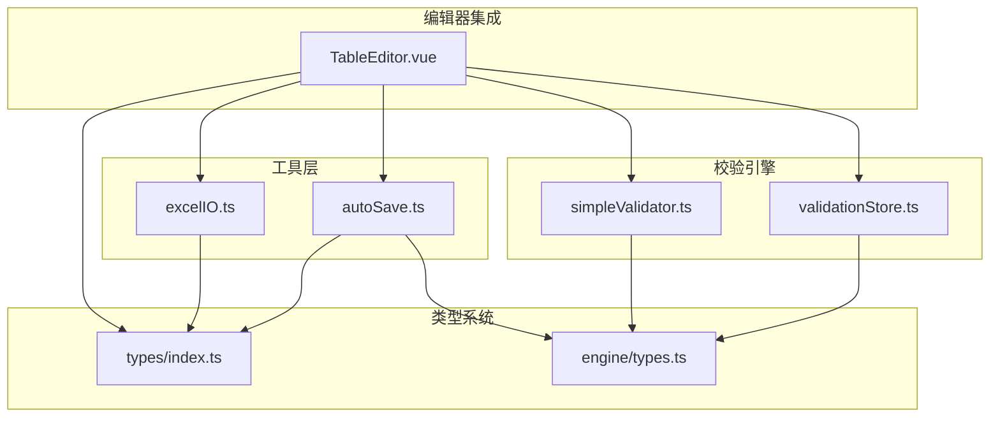
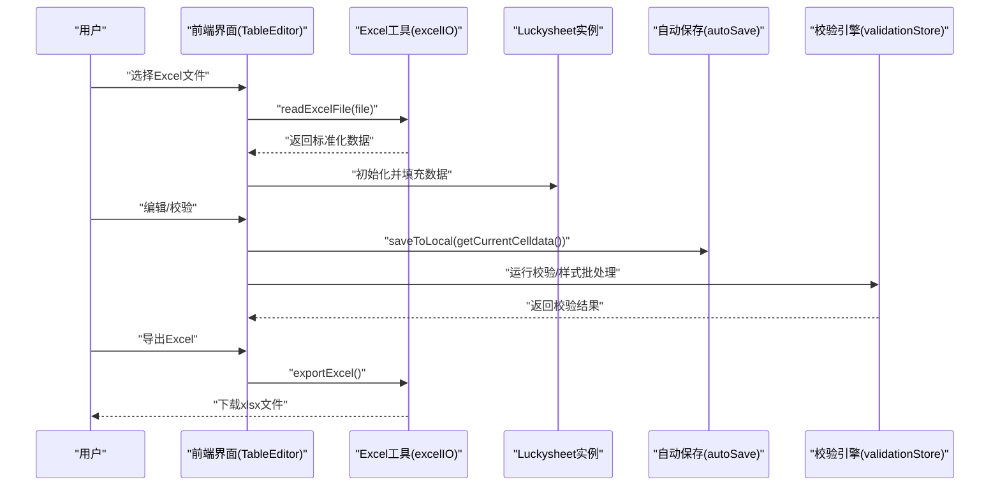
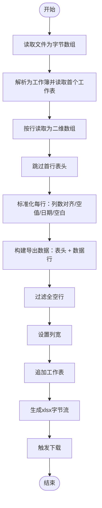
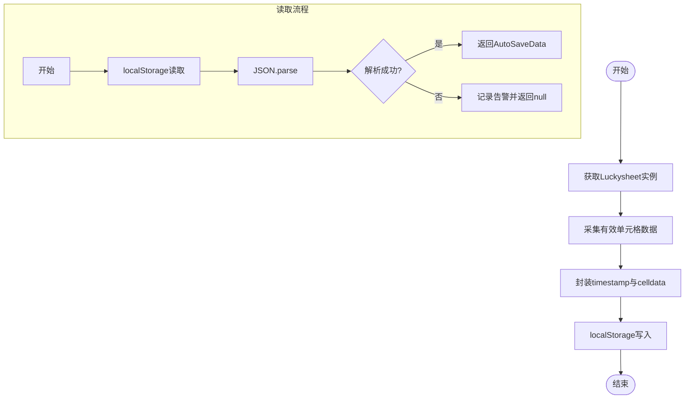
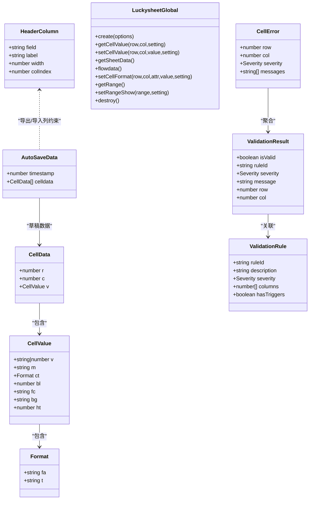
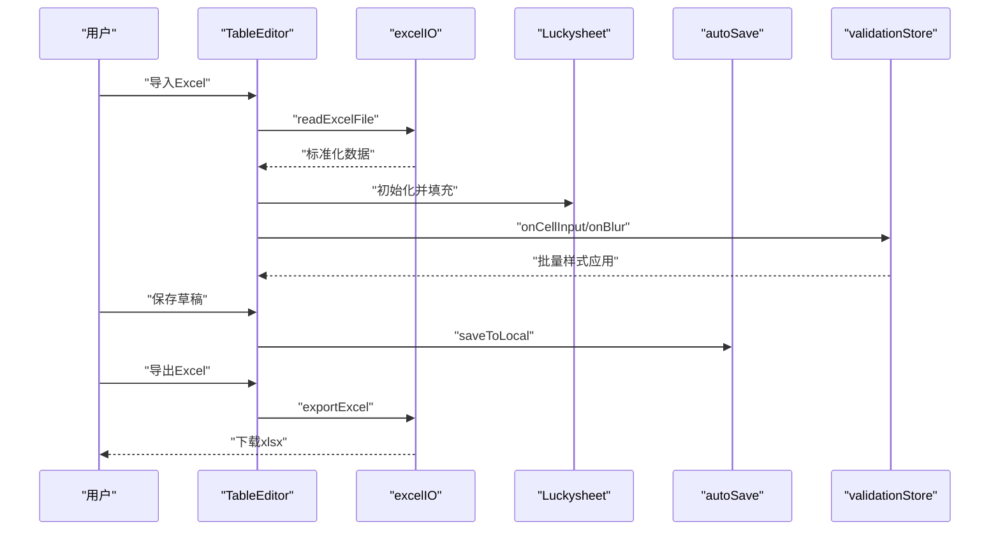
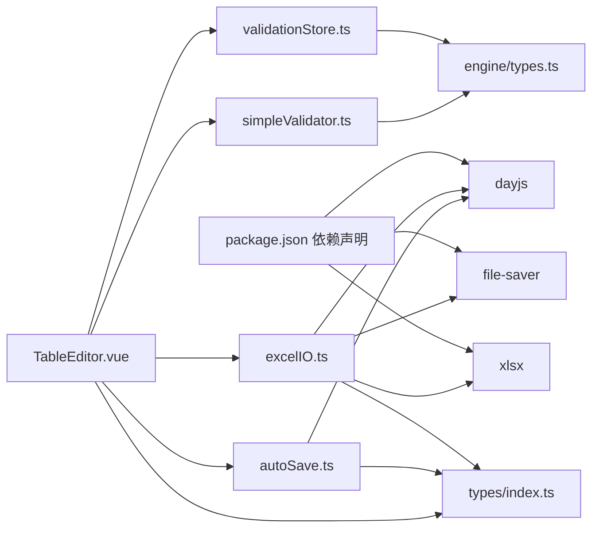

# 数据处理与文件操作

<cite>
**本文引用的文件**
- [excelIO.ts](file://src/utils/excelIO.ts)
- [autoSave.ts](file://src/utils/autoSave.ts)
- [index.ts](file://src/types/index.ts)
- [types.ts](file://src/engine/types.ts)
- [validationStore.ts](file://src/engine/validationStore.ts)
- [simpleValidator.ts](file://src/engine/simpleValidator.ts)
- [TableEditor.vue](file://src/components/TableEditor.vue)
- [package.json](file://package.json)
</cite>

## 目录
1. [简介](#简介)
2. [项目结构](#项目结构)
3. [核心组件](#核心组件)
4. [架构总览](#架构总览)
5. [详细组件分析](#详细组件分析)
6. [依赖关系分析](#依赖关系分析)
7. [性能考量](#性能考量)
8. [故障排查指南](#故障排查指南)
9. [结论](#结论)
10. [附录](#附录)

## 简介
本技术文档聚焦 SmartForm 的数据处理与文件操作能力，围绕以下目标展开：
- 深入解析 excelIO.ts 的 Excel 文件读取与导出实现、数据格式转换与标准化策略。
- 详述 autoSave.ts 的自动保存机制、草稿管理与本地持久化方案。
- 完整梳理 TypeScript 类型系统在项目中的定义、接口规范与类型安全保障。
- 提供数据导入导出全流程、错误处理策略、性能优化与内存管理最佳实践。
- 给出数据验证、格式标准化与异常处理的具体实现路径。

## 项目结构
SmartForm 的数据处理与文件操作主要分布在如下模块：
- 工具层：src/utils/excelIO.ts、src/utils/autoSave.ts
- 类型系统：src/types/index.ts、src/engine/types.ts
- 校验引擎：src/engine/simpleValidator.ts、src/engine/validationStore.ts
- 编辑器集成：src/components/TableEditor.vue
- 依赖声明：package.json

图表来源
- [excelIO.ts:1-105](file://src/utils/excelIO.ts#L1-L105)
- [autoSave.ts:1-71](file://src/utils/autoSave.ts#L1-L71)
- [index.ts:1-79](file://src/types/index.ts#L1-L79)
- [types.ts:1-48](file://src/engine/types.ts#L1-L48)
- [simpleValidator.ts:1-418](file://src/engine/simpleValidator.ts#L1-L418)
- [validationStore.ts:1-445](file://src/engine/validationStore.ts#L1-L445)
- [TableEditor.vue:46-72](file://src/components/TableEditor.vue#L46-L72)

章节来源
- [excelIO.ts:1-105](file://src/utils/excelIO.ts#L1-L105)
- [autoSave.ts:1-71](file://src/utils/autoSave.ts#L1-L71)
- [index.ts:1-79](file://src/types/index.ts#L1-L79)
- [types.ts:1-48](file://src/engine/types.ts#L1-L48)
- [simpleValidator.ts:1-418](file://src/engine/simpleValidator.ts#L1-L418)
- [validationStore.ts:1-445](file://src/engine/validationStore.ts#L1-L445)
- [TableEditor.vue:46-72](file://src/components/TableEditor.vue#L46-L72)

## 核心组件
- Excel 文件读取与导出：通过文件读取器与第三方库完成二进制解析、格式化文本提取、日期标准化与列宽适配，并生成 xlsx 文件下载。
- 自动保存与草稿管理：基于浏览器本地存储，序列化当前表格单元格数据，支持草稿读取、清理与时间戳格式化。
- 类型系统：定义表头列、单元格数据、自动保存数据结构、Luckysheet 全局对象接口以及校验相关的枚举与接口。
- 校验引擎：提供单元格/行/全量校验、统计缓存、样式批处理与防抖策略，确保渲染性能与一致性。
- 编辑器集成：初始化 Luckysheet 实例、构建表头与列宽、挂载自动保存与校验事件。

章节来源
- [excelIO.ts:10-105](file://src/utils/excelIO.ts#L10-L105)
- [autoSave.ts:3-71](file://src/utils/autoSave.ts#L3-L71)
- [index.ts:1-79](file://src/types/index.ts#L1-L79)
- [types.ts:1-48](file://src/engine/types.ts#L1-L48)
- [simpleValidator.ts:1-418](file://src/engine/simpleValidator.ts#L1-L418)
- [validationStore.ts:1-445](file://src/engine/validationStore.ts#L1-L445)
- [TableEditor.vue:46-72](file://src/components/TableEditor.vue#L46-L72)

## 架构总览
下图展示数据从 Excel 导入到表格渲染、自动保存与校验的整体流程。

图表来源
- [excelIO.ts:10-105](file://src/utils/excelIO.ts#L10-L105)
- [autoSave.ts:3-71](file://src/utils/autoSave.ts#L3-L71)
- [validationStore.ts:408-445](file://src/engine/validationStore.ts#L408-L445)
- [TableEditor.vue:46-72](file://src/components/TableEditor.vue#L46-L72)

## 详细组件分析

### Excel 文件读取与导出（excelIO.ts）
- 读取流程
  - 使用文件读取器将文件转为字节数组，交由解析库读取为工作簿。
  - 选取首个工作表，按“行优先”方式读取为二维数组，跳过首行表头。
  - 标准化处理：每行固定列数（与表头一致）、空值补空串、日期统一格式化、非日期值去除首尾空白。
- 导出流程
  - 从 Luckysheet 获取当前数据，构建导出数据（表头 + 数据行）。
  - 过滤全空行，避免冗余；设置列宽与工作表名。
  - 生成 xlsx 字节流并触发下载，文件名包含时间戳。

图表来源
- [excelIO.ts:10-105](file://src/utils/excelIO.ts#L10-L105)

章节来源
- [excelIO.ts:10-105](file://src/utils/excelIO.ts#L10-L105)

### 自动保存与草稿管理（autoSave.ts）
- 保存草稿
  - 采集当前表格有效单元格数据，封装时间戳与数据结构后写入本地存储。
- 读取草稿
  - 从本地存储读取并反序列化，异常时记录告警并返回空。
- 清理草稿
  - 移除指定键对应的本地存储项。
- 时间戳格式化
  - 将毫秒级时间戳格式化为可读字符串，便于用户识别。
- 当前单元格数据采集
  - 通过 Luckysheet API 获取二维数组，遍历非空单元格，抽取值、显示文本、格式等必要字段。

图表来源
- [autoSave.ts:3-71](file://src/utils/autoSave.ts#L3-L71)

章节来源
- [autoSave.ts:3-71](file://src/utils/autoSave.ts#L3-L71)

### 类型系统与接口规范（types/index.ts、engine/types.ts）
- 表头列定义
  - 固定30列，包含字段名、标签、宽度与列索引，作为导入/导出与列宽适配的权威依据。
- 单元格数据结构
  - 包含行列索引与值对象，值对象覆盖原始值、显示文本、格式、样式等属性，满足渲染与导出需求。
- 自动保存数据结构
  - 记录草稿时间戳与单元格数据列表，支撑草稿恢复与展示。
- Luckysheet 全局对象接口
  - 定义创建、读写、格式设置、销毁等方法签名，确保与外部库交互的类型安全。
- 校验相关类型
  - 严重度枚举、校验结果、规则定义、单元格错误集合与术语替换映射，提供消息标准化能力。

图表来源
- [index.ts:1-79](file://src/types/index.ts#L1-L79)
- [types.ts:1-48](file://src/engine/types.ts#L1-L48)

章节来源
- [index.ts:1-79](file://src/types/index.ts#L1-L79)
- [types.ts:1-48](file://src/engine/types.ts#L1-L48)

### 数据导入导出全流程与校验集成
- 导入
  - 用户选择文件 → 工具读取并标准化 → 编辑器初始化 Luckysheet 并填充数据 → 触发即时校验与样式批处理。
- 导出
  - 编辑器收集当前数据 → 过滤空行 → 设置列宽 → 写入工作簿 → 下载文件。
- 校验
  - 即时输入校验（不改变样式） → 失焦统一应用样式 → 批量刷新减少重绘 → 全量导出前再次校验并应用样式。

图表来源
- [excelIO.ts:10-105](file://src/utils/excelIO.ts#L10-L105)
- [autoSave.ts:3-71](file://src/utils/autoSave.ts#L3-L71)
- [validationStore.ts:248-253](file://src/engine/validationStore.ts#L248-L253)
- [TableEditor.vue:46-72](file://src/components/TableEditor.vue#L46-L72)

章节来源
- [excelIO.ts:10-105](file://src/utils/excelIO.ts#L10-L105)
- [autoSave.ts:3-71](file://src/utils/autoSave.ts#L3-L71)
- [validationStore.ts:248-253](file://src/engine/validationStore.ts#L248-L253)
- [TableEditor.vue:46-72](file://src/components/TableEditor.vue#L46-L72)

## 依赖关系分析
- 第三方库
  - xlsx：Excel 解析与写入。
  - file-saver：浏览器端文件下载。
  - dayjs：日期格式化与时间戳处理。
- 项目内部依赖
  - excelIO.ts 依赖类型系统中的表头列定义。
  - autoSave.ts 依赖类型系统中的自动保存数据结构与键名。
  - 校验引擎依赖类型系统中的校验相关接口与术语替换。
  - 编辑器组件依赖类型系统与工具模块，同时与校验引擎协作。

图表来源
- [package.json:11-24](file://package.json#L11-L24)
- [excelIO.ts:1-105](file://src/utils/excelIO.ts#L1-L105)
- [autoSave.ts:1-71](file://src/utils/autoSave.ts#L1-L71)
- [index.ts:1-79](file://src/types/index.ts#L1-L79)
- [types.ts:1-48](file://src/engine/types.ts#L1-L48)
- [simpleValidator.ts:1-418](file://src/engine/simpleValidator.ts#L1-L418)
- [validationStore.ts:1-445](file://src/engine/validationStore.ts#L1-L445)
- [TableEditor.vue:46-72](file://src/components/TableEditor.vue#L46-L72)

章节来源
- [package.json:11-24](file://package.json#L11-L24)
- [excelIO.ts:1-105](file://src/utils/excelIO.ts#L1-L105)
- [autoSave.ts:1-71](file://src/utils/autoSave.ts#L1-L71)
- [index.ts:1-79](file://src/types/index.ts#L1-L79)
- [types.ts:1-48](file://src/engine/types.ts#L1-L48)
- [simpleValidator.ts:1-418](file://src/engine/simpleValidator.ts#L1-L418)
- [validationStore.ts:1-445](file://src/engine/validationStore.ts#L1-L445)
- [TableEditor.vue:46-72](file://src/components/TableEditor.vue#L46-L72)

## 性能考量
- 数据读取与解析
  - 使用二进制读取与解析库，避免大文件内存峰值过高；按需读取首个工作表。
- 格式标准化
  - 统一日期格式与空白处理，减少后续渲染与校验的不确定性。
- 导出优化
  - 过滤全空行，降低文件体积与渲染压力；列宽按像素宽度换算，提升可读性。
- 样式批处理
  - 批量样式队列与刷新合并，减少 Luckysheet 重绘次数；导出前一次性应用样式。
- 缓存与防抖
  - 校验结果与统计采用缓存与请求动画帧刷新，避免频繁遍历与渲染。
- 本地存储
  - 仅保存有效单元格数据，控制草稿体积；异常捕获避免阻塞主线程。

章节来源
- [excelIO.ts:10-105](file://src/utils/excelIO.ts#L10-L105)
- [validationStore.ts:98-123](file://src/engine/validationStore.ts#L98-L123)
- [validationStore.ts:408-445](file://src/engine/validationStore.ts#L408-L445)
- [simpleValidator.ts:13-25](file://src/engine/simpleValidator.ts#L13-L25)

## 故障排查指南
- Excel 文件读取失败
  - 检查文件是否为受支持的格式；确认读取器回调与解析库参数正确；查看错误日志定位具体环节。
- 导出文件为空或列宽异常
  - 确认 Luckysheet 数据已正确采集；检查表头列定义与列宽映射；验证过滤全空行逻辑。
- 自动保存失败
  - 捕获本地存储异常并记录告警；检查键名一致性与 JSON 序列化；确认浏览器允许本地存储。
- 校验样式未生效
  - 确认样式批处理队列已刷新；导出前执行全量校验；检查单元格值是否为空导致占位符逻辑影响显示。
- 术语替换与消息标准化
  - 校验消息在存储前会进行术语替换，若发现消息未更新，检查替换映射与调用点。

章节来源
- [excelIO.ts:49-55](file://src/utils/excelIO.ts#L49-L55)
- [autoSave.ts:9-14](file://src/utils/autoSave.ts#L9-L14)
- [validationStore.ts:420-426](file://src/engine/validationStore.ts#L420-L426)
- [types.ts:40-47](file://src/engine/types.ts#L40-L47)

## 结论
SmartForm 在数据处理与文件操作方面形成了清晰的分层架构：工具层负责文件读写与本地持久化，类型系统提供强类型保障，校验引擎确保数据质量，编辑器组件完成集成与交互。通过批处理、缓存与防抖等策略，系统在性能与用户体验之间取得平衡。建议在后续迭代中进一步完善错误分类与重试机制、扩展更多格式支持与更细粒度的内存管理策略。

## 附录
- 关键实现路径参考
  - Excel 读取：[excelIO.ts:10-56](file://src/utils/excelIO.ts#L10-L56)
  - Excel 导出：[excelIO.ts:61-104](file://src/utils/excelIO.ts#L61-L104)
  - 自动保存写入：[autoSave.ts:4-14](file://src/utils/autoSave.ts#L4-L14)
  - 自动保存读取：[autoSave.ts:17-26](file://src/utils/autoSave.ts#L17-L26)
  - 草稿清理：[autoSave.ts:29-31](file://src/utils/autoSave.ts#L29-L31)
  - 当前单元格采集：[autoSave.ts:41-70](file://src/utils/autoSave.ts#L41-L70)
  - 表头列定义：[index.ts:44-75](file://src/types/index.ts#L44-L75)
  - 校验结果与规则：[types.ts:5-31](file://src/engine/types.ts#L5-L31)
  - 术语替换与消息标准化：[types.ts:34-47](file://src/engine/types.ts#L34-L47)
  - 全量校验与样式应用：[validationStore.ts:408-445](file://src/engine/validationStore.ts#L408-L445)
  - 即时输入校验与样式批处理：[validationStore.ts:248-253](file://src/engine/validationStore.ts#L248-L253)
  - 编辑器初始化与列宽构建：[TableEditor.vue:46-72](file://src/components/TableEditor.vue#L46-L72)