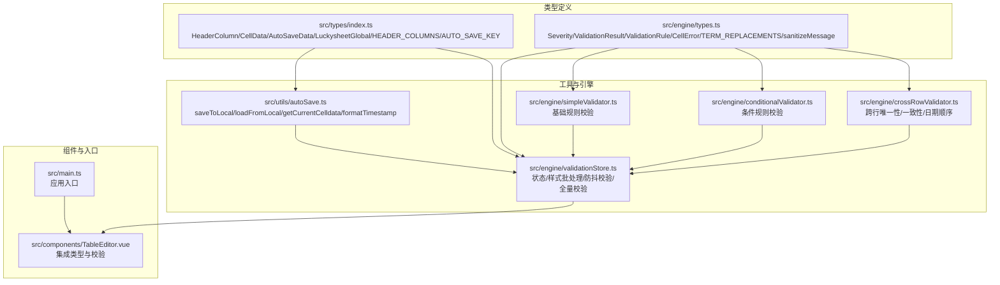
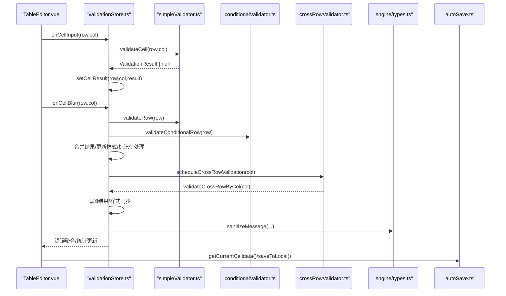
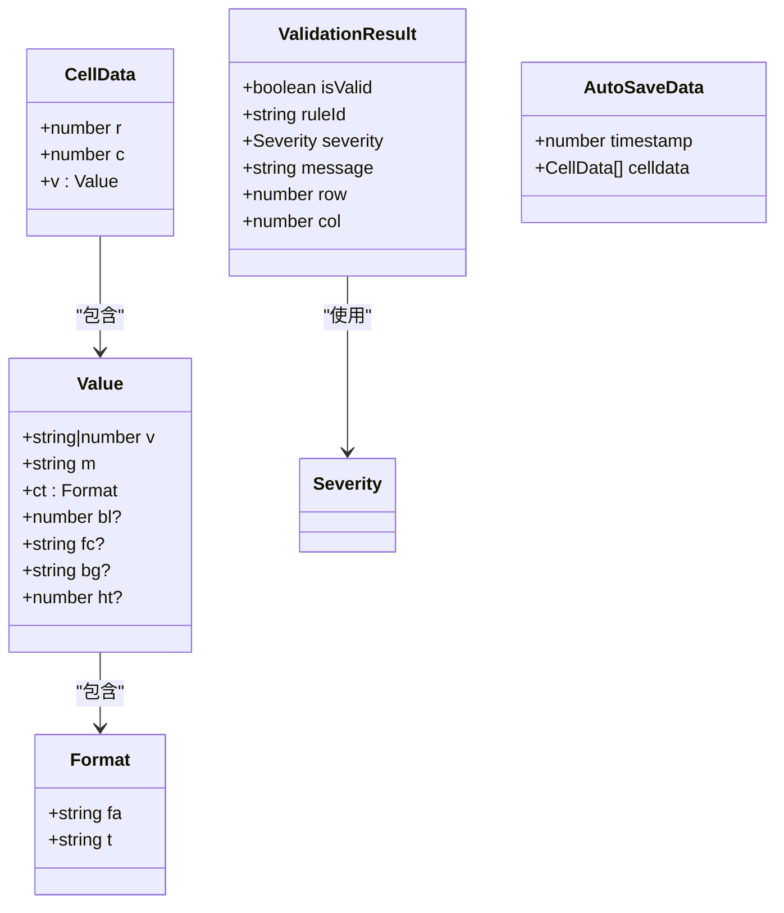
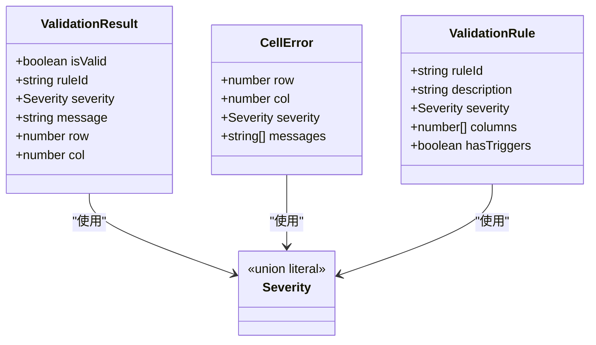
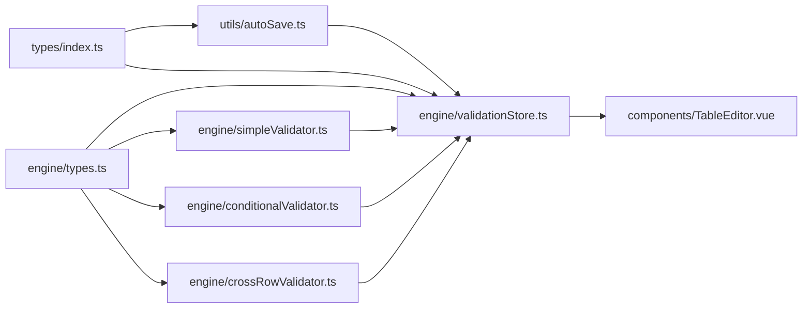

# 类型系统定义

<cite>
**本文引用的文件**
- [src/types/index.ts](file://src/types/index.ts)
- [src/engine/types.ts](file://src/engine/types.ts)
- [src/utils/autoSave.ts](file://src/utils/autoSave.ts)
- [src/engine/validationStore.ts](file://src/engine/validationStore.ts)
- [src/engine/simpleValidator.ts](file://src/engine/simpleValidator.ts)
- [src/engine/conditionalValidator.ts](file://src/engine/conditionalValidator.ts)
- [src/engine/crossRowValidator.ts](file://src/engine/crossRowValidator.ts)
- [src/components/TableEditor.vue](file://src/components/TableEditor.vue)
- [src/main.ts](file://src/main.ts)
</cite>

## 目录
1. [简介](#简介)
2. [项目结构与类型分布](#项目结构与类型分布)
3. [核心类型总览](#核心类型总览)
4. [架构概览与类型协作](#架构概览与类型协作)
5. [详细类型分析](#详细类型分析)
6. [依赖关系与耦合分析](#依赖关系与耦合分析)
7. [性能与类型安全考量](#性能与类型安全考量)
8. [故障排查与常见问题](#故障排查与常见问题)
9. [结论与最佳实践](#结论与最佳实践)
10. [附录：类型参考与使用示例路径](#附录类型参考与使用示例路径)

## 简介
本文件系统性梳理并解释本项目的 TypeScript 类型体系，覆盖接口、类型别名、枚举与工具函数的定义与使用。重点围绕以下核心数据模型展开：
- 表头列定义与表头常量
- Luckysheet 单元格数据格式
- 自动保存数据结构
- 校验严重度与校验结果
- 校验规则与单元格错误信息
- 术语替换与消息净化
- 校验状态与样式应用

同时，文档阐述类型安全保证机制、泛型使用策略、接口继承关系，并提供类型推导、类型断言与类型守卫的使用指导，以及完整类型定义参考、使用示例路径与最佳实践建议。

## 项目结构与类型分布
类型定义主要分布在以下模块：
- 类型入口与通用类型：src/types/index.ts
- 校验引擎类型：src/engine/types.ts
- 自动保存工具：src/utils/autoSave.ts
- 校验状态与样式应用：src/engine/validationStore.ts
- 校验规则实现：src/engine/simpleValidator.ts、src/engine/conditionalValidator.ts、src/engine/crossRowValidator.ts
- 组件集成与类型使用：src/components/TableEditor.vue、src/main.ts

图表来源
- [src/types/index.ts:1-79](file://src/types/index.ts#L1-L79)
- [src/engine/types.ts:1-48](file://src/engine/types.ts#L1-L48)
- [src/utils/autoSave.ts:1-71](file://src/utils/autoSave.ts#L1-L71)
- [src/engine/validationStore.ts:1-474](file://src/engine/validationStore.ts#L1-L474)
- [src/engine/simpleValidator.ts:1-200](file://src/engine/simpleValidator.ts#L1-L200)
- [src/engine/conditionalValidator.ts:1-200](file://src/engine/conditionalValidator.ts#L1-L200)
- [src/engine/crossRowValidator.ts:1-200](file://src/engine/crossRowValidator.ts#L1-L200)
- [src/components/TableEditor.vue:1-200](file://src/components/TableEditor.vue#L1-L200)
- [src/main.ts:1-9](file://src/main.ts#L1-L9)

章节来源
- [src/types/index.ts:1-79](file://src/types/index.ts#L1-L79)
- [src/engine/types.ts:1-48](file://src/engine/types.ts#L1-L48)
- [src/utils/autoSave.ts:1-71](file://src/utils/autoSave.ts#L1-L71)
- [src/engine/validationStore.ts:1-474](file://src/engine/validationStore.ts#L1-L474)
- [src/engine/simpleValidator.ts:1-200](file://src/engine/simpleValidator.ts#L1-L200)
- [src/engine/conditionalValidator.ts:1-200](file://src/engine/conditionalValidator.ts#L1-L200)
- [src/engine/crossRowValidator.ts:1-200](file://src/engine/crossRowValidator.ts#L1-L200)
- [src/components/TableEditor.vue:1-200](file://src/components/TableEditor.vue#L1-L200)
- [src/main.ts:1-9](file://src/main.ts#L1-L9)

## 核心类型总览
- 接口与类型别名
  - HeaderColumn：表头列定义，包含字段名、标签、宽度与列索引
  - CellData：Luckysheet 单元格数据格式，包含行列坐标与值对象（含原始值、显示值、单元格格式、样式等）
  - AutoSaveData：自动保存数据结构，包含时间戳与单元格数据数组
  - LuckysheetGlobal：Luckysheet 全局对象类型，定义创建、读写、范围、销毁等方法
  - Severity：校验严重度枚举，限定为特定字面量联合类型
  - ValidationResult：校验结果，包含是否有效、规则ID、严重度、消息、行与列
  - ValidationRule：校验规则定义，包含规则ID、描述、严重度、涉及列、是否条件触发
  - CellError：单元格错误信息，包含行列、最严重级别与消息列表
- 常量
  - HEADER_COLUMNS：固定长度的表头列配置数组
  - AUTO_SAVE_KEY：localStorage 中草稿数据的键名
  - TERM_REPLACEMENTS：术语替换映射
- 工具函数
  - sanitizeMessage：对消息文本进行术语替换
  - getCurrentCelldata：从 Luckysheet 当前工作表提取非空单元格数据
  - saveToLocal/loadFromLocal/clearLocal：草稿本地存储读写清空
  - formatTimestamp：时间戳格式化

章节来源
- [src/types/index.ts:1-79](file://src/types/index.ts#L1-L79)
- [src/engine/types.ts:1-48](file://src/engine/types.ts#L1-L48)
- [src/utils/autoSave.ts:1-71](file://src/utils/autoSave.ts#L1-L71)

## 架构概览与类型协作
类型系统贯穿“数据模型—校验引擎—状态管理—UI 组件”的全链路：
- 数据模型层：通过 CellData、HeaderColumn、AutoSaveData 描述 Luckysheet 数据与表头配置
- 校验层：ValidationResult、CellError、Severity 提供统一的校验语义；规则定义 ValidationRule 与条件/跨行校验器配合
- 状态层：validationStore 维护校验结果 Map、统计计数、待处理单元格集合，并负责样式批处理与防抖
- 工具层：autoSave 提供草稿持久化与读取，支持时间戳格式化
- 组件层：TableEditor 通过类型与校验状态驱动 Tooltip 展示与样式应用

图表来源
- [src/components/TableEditor.vue:100-170](file://src/components/TableEditor.vue#L100-L170)
- [src/engine/validationStore.ts:240-344](file://src/engine/validationStore.ts#L240-L344)
- [src/engine/simpleValidator.ts:1-200](file://src/engine/simpleValidator.ts#L1-L200)
- [src/engine/conditionalValidator.ts:1-200](file://src/engine/conditionalValidator.ts#L1-L200)
- [src/engine/crossRowValidator.ts:1-200](file://src/engine/crossRowValidator.ts#L1-L200)
- [src/engine/types.ts:40-47](file://src/engine/types.ts#L40-L47)
- [src/utils/autoSave.ts:40-71](file://src/utils/autoSave.ts#L40-L71)

章节来源
- [src/components/TableEditor.vue:100-170](file://src/components/TableEditor.vue#L100-L170)
- [src/engine/validationStore.ts:240-344](file://src/engine/validationStore.ts#L240-L344)
- [src/engine/simpleValidator.ts:1-200](file://src/engine/simpleValidator.ts#L1-L200)
- [src/engine/conditionalValidator.ts:1-200](file://src/engine/conditionalValidator.ts#L1-L200)
- [src/engine/crossRowValidator.ts:1-200](file://src/engine/crossRowValidator.ts#L1-L200)
- [src/engine/types.ts:40-47](file://src/engine/types.ts#L40-L47)
- [src/utils/autoSave.ts:40-71](file://src/utils/autoSave.ts#L40-L71)

## 详细类型分析

### 数据模型设计：CellData、ValidationResult、AutoSaveData
- CellData
  - 结构要点：行列坐标 r/c，值对象 v 包含原始值 v、显示值 m、单元格格式 ct（含格式字符串与类型）、可选样式属性（粗体、颜色、背景、高度等）
  - 约束与含义：ct.fa/t 用于 Luckysheet 格式化；样式字段用于渲染与提示
  - 使用场景：构建表头、导入数据、草稿保存、样式应用
- ValidationResult
  - 结构要点：isValid、ruleId、severity、message、row、col
  - 约束与含义：severity 为字面量联合类型，确保严重度取值受控；message 经过术语替换净化
  - 使用场景：规则校验返回、状态聚合、错误展示
- AutoSaveData
  - 结构要点：timestamp、celldata
  - 约束与含义：timestamp 为毫秒级时间戳；celldata 为非空单元格集合
  - 使用场景：localStorage 存储与恢复草稿

图表来源
- [src/types/index.ts:9-28](file://src/types/index.ts#L9-L28)
- [src/engine/types.ts:4-12](file://src/engine/types.ts#L4-L12)

章节来源
- [src/types/index.ts:9-28](file://src/types/index.ts#L9-L28)
- [src/engine/types.ts:4-12](file://src/engine/types.ts#L4-L12)
- [src/utils/autoSave.ts:4-31](file://src/utils/autoSave.ts#L4-L31)

### 校验类型与规则：Severity、ValidationRule、CellError
- Severity
  - 定义：字面量联合类型，限定为 CRITICAL/HIGH/MEDIUM
  - 作用：统一严重度语义，便于排序与样式映射
- ValidationRule
  - 结构要点：ruleId、description、severity、columns（涉及列）、hasTriggers（条件触发）
  - 作用：描述规则维度与触发条件，支撑规则注册与执行
- CellError
  - 结构要点：row、col、severity、messages（多条消息）
  - 作用：聚合单元格内所有规则的错误信息，用于 Tooltip 与统计

图表来源
- [src/engine/types.ts:1-31](file://src/engine/types.ts#L1-L31)

章节来源
- [src/engine/types.ts:1-31](file://src/engine/types.ts#L1-L31)

### 表头与全局对象：HeaderColumn、LuckysheetGlobal
- HeaderColumn
  - 结构要点：field、label、width、colIndex
  - 作用：定义表头列的业务字段、显示标签、列宽与索引，用于构建表头单元格与列宽配置
- LuckysheetGlobal
  - 方法要点：create/getCellValue/setCellValue/getSheetData/flowdata/setCellFormat/getRange/setRangeShow/destroy
  - 作用：抽象 Luckysheet API，便于在工具函数与校验器中安全调用

章节来源
- [src/types/index.ts:1-41](file://src/types/index.ts#L1-L41)

### 术语替换与消息净化：TERM_REPLACEMENTS、sanitizeMessage
- TERM_REPLACEMENTS
  - 定义：记录术语映射，如“住户客户类型”→“租户客户类型”
- sanitizeMessage
  - 流程：遍历映射表，逐项替换消息文本
  - 作用：统一术语表达，提升用户体验

章节来源
- [src/engine/types.ts:33-47](file://src/engine/types.ts#L33-L47)

### 自动保存与草稿读取：AutoSaveData、saveToLocal、loadFromLocal、getCurrentCelldata
- saveToLocal
  - 行为：构造 AutoSaveData 并写入 localStorage
- loadFromLocal
  - 行为：从 localStorage 读取并解析为 AutoSaveData（类型断言）
- getCurrentCelldata
  - 行为：遍历当前工作表，筛选非空单元格，转换为 CellData 数组
- formatTimestamp
  - 行为：将时间戳格式化为可读字符串

章节来源
- [src/utils/autoSave.ts:3-38](file://src/utils/autoSave.ts#L3-L38)
- [src/utils/autoSave.ts:40-71](file://src/utils/autoSave.ts#L40-L71)

### 校验状态与样式应用：validationStore
- 状态 state
  - 结果集：Map<string, ValidationResult[]>
  - 计数：errorCount、warningCount
  - 行统计：filledRows、totalRows
  - 待处理：pendingCells（集合）
- 样式批处理
  - 批队列 styleBatch，定时刷新 flushStyleBatch
  - 同步刷新 flushStyleBatchSync 与取消 cancelStyleBatch
- 防抖与跨行延迟
  - onCellInput/onCellBlur 防抖，blurDebounceTimer/pendingBlur
  - 跨行校验延迟执行 scheduleCrossRowValidation/executeCrossRowValidation
- 样式应用
  - applyCellStyle/applyAllValidationStyles 根据最严重规则映射边框与背景色
- 全量校验
  - runFullValidation 调用 simple/conditional/crossRow 校验器，合并结果并更新统计与待处理状态

章节来源
- [src/engine/validationStore.ts:15-23](file://src/engine/validationStore.ts#L15-L23)
- [src/engine/validationStore.ts:98-148](file://src/engine/validationStore.ts#L98-L148)
- [src/engine/validationStore.ts:238-344](file://src/engine/validationStore.ts#L238-L344)
- [src/engine/validationStore.ts:406-452](file://src/engine/validationStore.ts#L406-L452)

### 规则实现与类型约束
- 简单规则（simpleValidator）
  - 必填/格式/枚举/日期等规则均返回 ValidationResult | null
  - 使用 getCellText 统一空值处理与日期格式化
- 条件规则（conditionalValidator）
  - 通过 hasOwnerInfo/hasTenantInfo/isSaleDateRequired 等条件函数判断是否触发
  - 返回 ValidationResult | null
- 跨行规则（crossRowValidator）
  - 唯一性、一致性、日期顺序等跨行校验，返回 ValidationResult[]

章节来源
- [src/engine/simpleValidator.ts:27-44](file://src/engine/simpleValidator.ts#L27-L44)
- [src/engine/conditionalValidator.ts:19-34](file://src/engine/conditionalValidator.ts#L19-L34)
- [src/engine/crossRowValidator.ts:21-53](file://src/engine/crossRowValidator.ts#L21-L53)

## 依赖关系与耦合分析
- 类型依赖
  - validationStore.ts 依赖 engine/types.ts 的 ValidationResult、CellError、Severity
  - autoSave.ts 依赖 types/index.ts 的 AutoSaveData、CellData 与常量
  - 校验器依赖 simpleValidator/conditionalValidator/crossRowValidator 的公共接口
- 组件依赖
  - TableEditor.vue 引入 HeaderColumn、CellData、autoSave 工具与 validationStore
- 耦合点
  - 表头列索引与规则列索引强耦合（如列索引 0/6/7/8/12/13/14/21/22/24/25/26/28）
  - 样式应用依赖 Luckysheet API（setCellFormat/getCellValue）

图表来源
- [src/types/index.ts:1-79](file://src/types/index.ts#L1-L79)
- [src/engine/types.ts:1-48](file://src/engine/types.ts#L1-L48)
- [src/utils/autoSave.ts:1-71](file://src/utils/autoSave.ts#L1-L71)
- [src/engine/validationStore.ts:1-474](file://src/engine/validationStore.ts#L1-L474)
- [src/engine/simpleValidator.ts:1-200](file://src/engine/simpleValidator.ts#L1-L200)
- [src/engine/conditionalValidator.ts:1-200](file://src/engine/conditionalValidator.ts#L1-L200)
- [src/engine/crossRowValidator.ts:1-200](file://src/engine/crossRowValidator.ts#L1-L200)
- [src/components/TableEditor.vue:1-200](file://src/components/TableEditor.vue#L1-L200)

章节来源
- [src/types/index.ts:1-79](file://src/types/index.ts#L1-L79)
- [src/engine/types.ts:1-48](file://src/engine/types.ts#L1-L48)
- [src/utils/autoSave.ts:1-71](file://src/utils/autoSave.ts#L1-L71)
- [src/engine/validationStore.ts:1-474](file://src/engine/validationStore.ts#L1-L474)
- [src/engine/simpleValidator.ts:1-200](file://src/engine/simpleValidator.ts#L1-L200)
- [src/engine/conditionalValidator.ts:1-200](file://src/engine/conditionalValidator.ts#L1-L200)
- [src/engine/crossRowValidator.ts:1-200](file://src/engine/crossRowValidator.ts#L1-L200)
- [src/components/TableEditor.vue:1-200](file://src/components/TableEditor.vue#L1-L200)

## 性能与类型安全考量
- 性能优化
  - 样式批处理：批量收集样式变更后一次性刷新，减少 Luckysheet API 调用次数
  - 防抖与跨行延迟：onCellBlur 防抖与跨行校验延迟，降低频繁计算与渲染压力
  - 缓存与统计：requestAnimationFrame 刷新统计，避免高频遍历
  - 数据缓存：simpleValidator 对 flowdata 进行版本化缓存，invalidateDataCache 触发失效
- 类型安全
  - Severity 使用字面量联合类型，确保严重度取值受控
  - ValidationResult 的 message 经 sanitizeMessage 替换，避免术语不一致
  - CellData 的 v.ct/fa/t 与样式字段为可选，兼容不同单元格格式
  - 类型断言用于 localStorage 解析（AutoSaveData），结合 try/catch 保证健壮性

章节来源
- [src/engine/validationStore.ts:98-148](file://src/engine/validationStore.ts#L98-L148)
- [src/engine/validationStore.ts:238-344](file://src/engine/validationStore.ts#L238-L344)
- [src/engine/simpleValidator.ts:13-25](file://src/engine/simpleValidator.ts#L13-L25)
- [src/engine/types.ts:1-12](file://src/engine/types.ts#L1-L12)
- [src/utils/autoSave.ts:17-26](file://src/utils/autoSave.ts#L17-L26)

## 故障排查与常见问题
- 校验结果为空或缺失
  - 检查 onCellInput/onCellBlur 是否正确调用，确认防抖与跨行延迟未阻塞
  - 确认 getCellText 对空值与日期格式的处理逻辑
- 样式未生效
  - 检查 applyCellStyle/applyAllValidationStyles 的调用时机与参数 useSpaceHack
  - 确认 Luckysheet 实例可用（window.luckysheet）
- 术语替换无效
  - 检查 TERM_REPLACEMENTS 映射是否覆盖目标术语
  - 确认 sanitizeMessage 在写入/追加结果时被调用
- 草稿读取失败
  - 检查 AUTO_SAVE_KEY 与 localStorage 权限
  - 确认 loadFromLocal 的类型断言与异常捕获

章节来源
- [src/engine/validationStore.ts:157-185](file://src/engine/validationStore.ts#L157-L185)
- [src/engine/validationStore.ts:198-236](file://src/engine/validationStore.ts#L198-L236)
- [src/engine/types.ts:33-47](file://src/engine/types.ts#L33-L47)
- [src/utils/autoSave.ts:17-26](file://src/utils/autoSave.ts#L17-L26)

## 结论与最佳实践
- 最佳实践
  - 使用字面量联合类型（Severity）与严格的接口定义（CellData/ValidationResult）确保类型安全
  - 在工具函数中使用类型断言时配合 try/catch 与防御性检查
  - 将样式应用与数据计算分离，利用批处理与防抖降低性能开销
  - 通过 sanitizeMessage 统一术语表达，提升用户体验一致性
- 扩展建议
  - 为复杂规则定义专用接口（如 RuleContext），增强可维护性
  - 引入更细粒度的错误分类（如“格式错误/业务错误”），细化样式与提示
  - 对列索引与规则列建立映射表，减少硬编码耦合

## 附录：类型参考与使用示例路径
- 类型定义参考
  - HeaderColumn/CellData/AutoSaveData/LuckysheetGlobal/HEADER_COLUMNS/AUTO_SAVE_KEY：[src/types/index.ts:1-79](file://src/types/index.ts#L1-L79)
  - Severity/ValidationResult/ValidationRule/CellError/TERM_REPLACEMENTS/sanitizeMessage：[src/engine/types.ts:1-48](file://src/engine/types.ts#L1-L48)
- 工具与引擎
  - saveToLocal/loadFromLocal/getCurrentCelldata/formatTimestamp：[src/utils/autoSave.ts:1-71](file://src/utils/autoSave.ts#L1-L71)
  - validationStore 状态与流程：[src/engine/validationStore.ts:1-474](file://src/engine/validationStore.ts#L1-L474)
  - 简单规则实现：[src/engine/simpleValidator.ts:1-200](file://src/engine/simpleValidator.ts#L1-L200)
  - 条件规则实现：[src/engine/conditionalValidator.ts:1-200](file://src/engine/conditionalValidator.ts#L1-L200)
  - 跨行规则实现：[src/engine/crossRowValidator.ts:1-200](file://src/engine/crossRowValidator.ts#L1-L200)
- 组件与入口
  - TableEditor 集成与类型使用：[src/components/TableEditor.vue:1-200](file://src/components/TableEditor.vue#L1-L200)
  - 应用入口：[src/main.ts:1-9](file://src/main.ts#L1-L9)