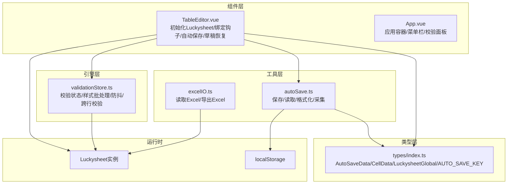
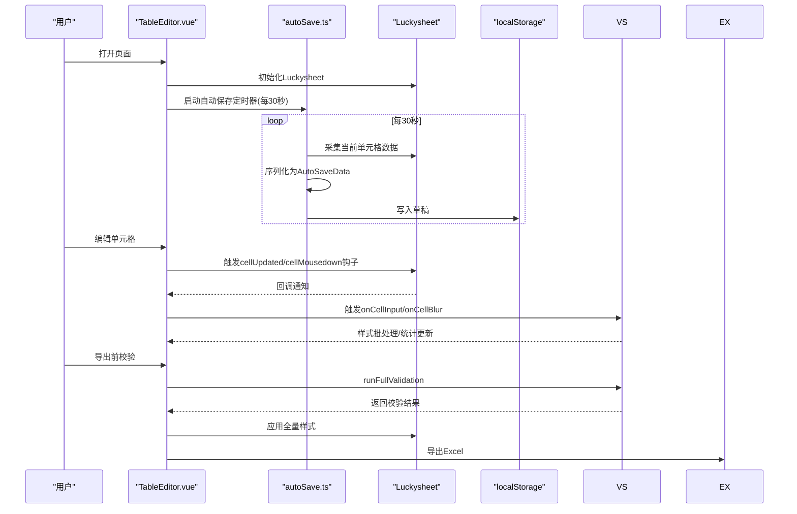
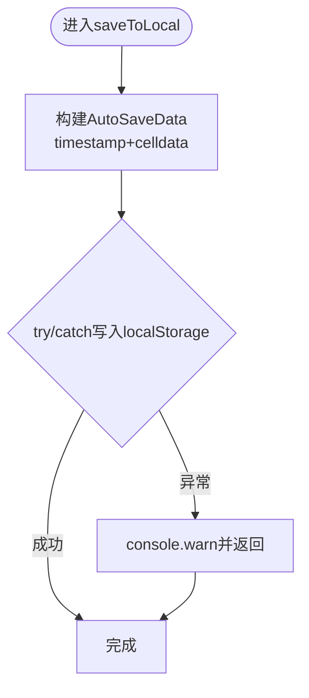
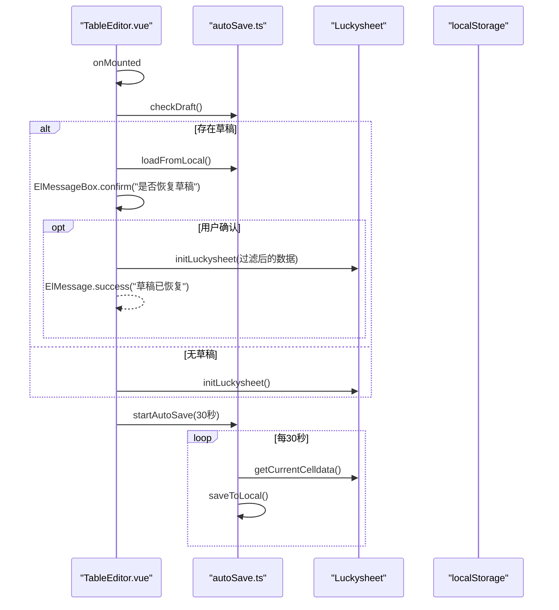
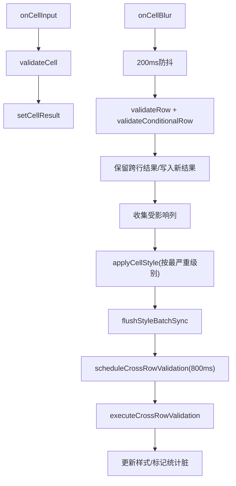
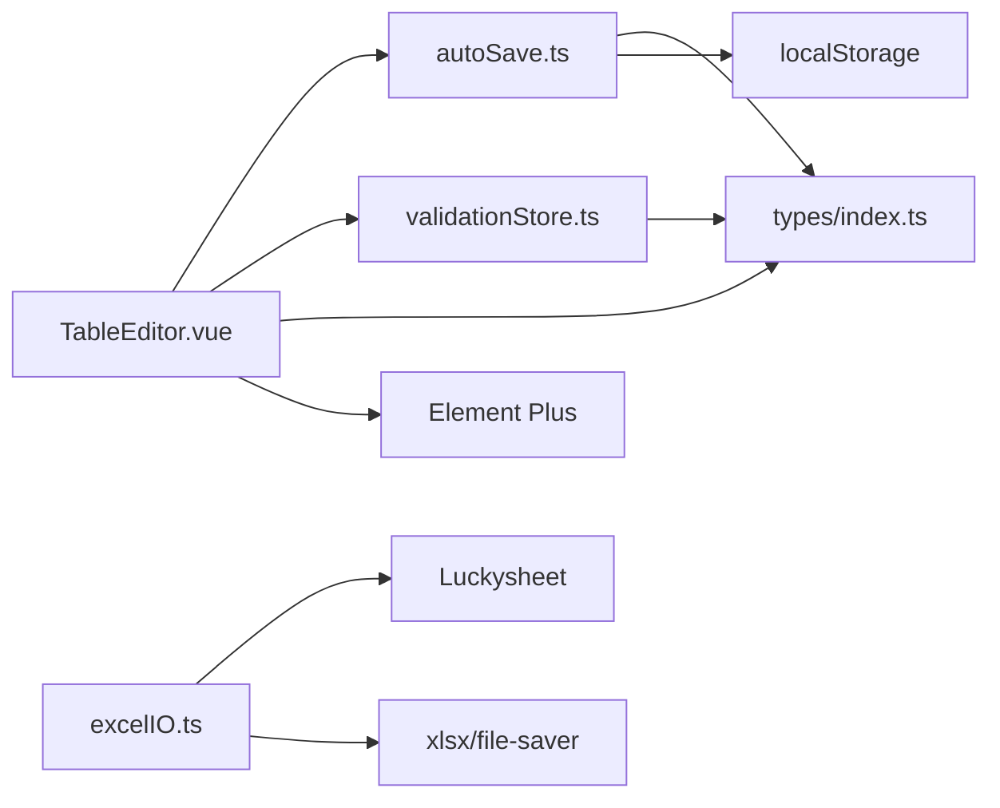

# 自动保存机制

<cite>
**本文引用的文件**
- [src/utils/autoSave.ts](file://src/utils/autoSave.ts)
- [src/components/TableEditor.vue](file://src/components/TableEditor.vue)
- [src/types/index.ts](file://src/types/index.ts)
- [src/engine/validationStore.ts](file://src/engine/validationStore.ts)
- [src/utils/excelIO.ts](file://src/utils/excelIO.ts)
- [src/App.vue](file://src/App.vue)
- [src/main.ts](file://src/main.ts)
- [package.json](file://package.json)
</cite>

## 目录
1. [简介](#简介)
2. [项目结构](#项目结构)
3. [核心组件](#核心组件)
4. [架构总览](#架构总览)
5. [详细组件分析](#详细组件分析)
6. [依赖关系分析](#依赖关系分析)
7. [性能考量](#性能考量)
8. [故障排查指南](#故障排查指南)
9. [结论](#结论)
10. [附录](#附录)

## 简介
本文件针对自动保存机制进行系统化技术文档编写，重点覆盖以下方面：
- 定时任务管理：自动保存的启动、停止与周期控制
- 数据序列化与持久化：草稿数据结构、序列化策略与本地存储
- 草稿恢复流程：检测、提示与恢复逻辑
- 时间间隔控制与数据更新策略：如何平衡实时性与性能
- 冲突解决与并发控制：多窗口或多标签页下的潜在冲突
- 性能优化技术：节流/防抖、批量写入与内存管理
- 错误处理机制：异常捕获、降级与用户提示
- 数据迁移与备份恢复：版本演进与数据兼容
- 使用示例与最佳实践：集成步骤与注意事项

## 项目结构
该项目采用前端单页应用架构，自动保存能力位于工具层与组件层之间，通过类型定义与验证引擎协同工作。关键目录与文件如下：
- 工具层：自动保存工具模块负责草稿的读取、写入与格式化
- 组件层：表格编辑器负责初始化 Luckysheet、绑定钩子、触发自动保存与草稿恢复
- 引擎层：验证状态管理负责校验结果的聚合与样式应用
- 类型层：定义草稿数据结构、单元格数据格式与全局对象类型
- 导出工具：负责将当前编辑数据导出为 Excel 文件

图表来源
- [src/utils/autoSave.ts:1-71](file://src/utils/autoSave.ts#L1-L71)
- [src/components/TableEditor.vue:1-399](file://src/components/TableEditor.vue#L1-L399)
- [src/engine/validationStore.ts:1-474](file://src/engine/validationStore.ts#L1-L474)
- [src/utils/excelIO.ts:1-105](file://src/utils/excelIO.ts#L1-L105)
- [src/types/index.ts:1-79](file://src/types/index.ts#L1-L79)

章节来源
- [src/utils/autoSave.ts:1-71](file://src/utils/autoSave.ts#L1-L71)
- [src/components/TableEditor.vue:1-399](file://src/components/TableEditor.vue#L1-L399)
- [src/types/index.ts:1-79](file://src/types/index.ts#L1-L79)

## 核心组件
- 自动保存工具模块（autoSave.ts）
  - 提供草稿保存、读取、清除与时间戳格式化
  - 采集当前 Luckysheet 中的单元格数据并序列化至 localStorage
- 表格编辑器组件（TableEditor.vue）
  - 初始化 Luckysheet 并绑定钩子
  - 在生命周期内启动/停止自动保存定时器
  - 检测并提示恢复草稿，支持用户确认或忽略
- 验证状态管理（validationStore.ts）
  - 管理校验结果、统计与样式批处理
  - 提供防抖与跨行校验调度，减少渲染压力
- 类型定义（types/index.ts）
  - 定义草稿数据结构 AutoSaveData 与单元格数据 CellData
  - 定义 Luckysheet 全局对象接口与自动保存键名

章节来源
- [src/utils/autoSave.ts:1-71](file://src/utils/autoSave.ts#L1-L71)
- [src/components/TableEditor.vue:1-399](file://src/components/TableEditor.vue#L1-L399)
- [src/engine/validationStore.ts:1-474](file://src/engine/validationStore.ts#L1-L474)
- [src/types/index.ts:1-79](file://src/types/index.ts#L1-L79)

## 架构总览
自动保存机制围绕“定时采集 -> 序列化 -> 持久化 -> 恢复”闭环展开，同时与 Luckysheet 的钩子事件、验证引擎的状态管理紧密耦合。

图表来源
- [src/components/TableEditor.vue:275-291](file://src/components/TableEditor.vue#L275-L291)
- [src/utils/autoSave.ts:4-31](file://src/utils/autoSave.ts#L4-L31)
- [src/engine/validationStore.ts:248-315](file://src/engine/validationStore.ts#L248-L315)
- [src/utils/excelIO.ts:61-104](file://src/utils/excelIO.ts#L61-L104)

## 详细组件分析

### 自动保存工具模块（autoSave.ts）
- 功能职责
  - 保存：将当前单元格数据与时间戳封装为草稿并写入 localStorage
  - 读取：从 localStorage 读取草稿，解析为 AutoSaveData
  - 清除：移除草稿键，释放空间
  - 格式化：将时间戳转换为可读字符串
  - 采集：从 Luckysheet 实例中提取有效单元格数据，构建 CellData 数组
- 数据结构
  - AutoSaveData：包含 timestamp 与 celldata
  - CellData：包含行列索引与单元格值对象（含显示值、格式、样式等）
- 错误处理
  - 写入与读取均包裹 try/catch，出现异常时记录警告并返回空值
- 性能特性
  - 采集过程遍历二维数组，复杂度 O(R*C)，其中 R 为行数，C 为列数
  - 仅在 celldata 非空时写入，避免冗余写入

图表来源
- [src/utils/autoSave.ts:4-14](file://src/utils/autoSave.ts#L4-L14)

章节来源
- [src/utils/autoSave.ts:1-71](file://src/utils/autoSave.ts#L1-L71)
- [src/types/index.ts:9-28](file://src/types/index.ts#L9-L28)

### 表格编辑器组件（TableEditor.vue）
- 生命周期与初始化
  - onMounted：延时后检查草稿，若无草稿则初始化 Luckysheet；随后启动自动保存定时器
  - onBeforeUnmount：停止自动保存、移除事件监听、清理验证定时器
- 自动保存定时器
  - 每 30 秒执行一次：采集当前 celldata，若非空则保存
  - 支持显式 startAutoSave/stopAutoSave 控制
- 草稿恢复
  - 检测 localStorage 中的草稿，格式化时间戳后弹窗提示用户选择恢复或忽略
  - 恢复时过滤表头行（r>0），初始化 Luckysheet 并提示成功
- Luckysheet 钩子
  - cellUpdated：触发 onCellInput，进行即时校验（轻量规则）
  - cellMousedown：触发上次编辑单元格的 onCellBlur（200ms 防抖），并延迟显示 tooltip
- 导出前校验
  - 调用 runFullValidation，应用全量样式；若存在错误则阻断导出，警告则二次确认

图表来源
- [src/components/TableEditor.vue:217-237](file://src/components/TableEditor.vue#L217-L237)
- [src/components/TableEditor.vue:275-291](file://src/components/TableEditor.vue#L275-L291)
- [src/utils/autoSave.ts:40-70](file://src/utils/autoSave.ts#L40-L70)

章节来源
- [src/components/TableEditor.vue:1-399](file://src/components/TableEditor.vue#L1-L399)
- [src/utils/autoSave.ts:1-71](file://src/utils/autoSave.ts#L1-L71)

### 验证状态管理（validationStore.ts）
- 防抖与跨行校验
  - onCellInput：即时校验单个单元格，不触发布局更新
  - onCellBlur：200ms 防抖，执行行级与条件校验，保留跨行结果并更新样式
  - 跨行校验延迟 800ms 执行，避免频繁重绘
- 样式批处理
  - 使用 styleBatch 队列与 flushStyleBatch，合并多次样式设置，减少渲染次数
- 统计缓存
  - 使用 requestAnimationFrame 在必要时一次性计算错误/警告数量与填充行数
- 清理
  - cleanupTimers：清理所有定时器与待处理任务，防止内存泄漏

图表来源
- [src/engine/validationStore.ts:248-315](file://src/engine/validationStore.ts#L248-L315)
- [src/engine/validationStore.ts:317-344](file://src/engine/validationStore.ts#L317-L344)
- [src/engine/validationStore.ts:456-465](file://src/engine/validationStore.ts#L456-L465)

章节来源
- [src/engine/validationStore.ts:1-474](file://src/engine/validationStore.ts#L1-L474)

### 类型定义（types/index.ts）
- AutoSaveData：timestamp + celldata
- CellData：r、c、v（v 包含显示值、格式、样式等）
- LuckysheetGlobal：Luckysheet API 的最小可用集合
- AUTO_SAVE_KEY：localStorage 的键名

章节来源
- [src/types/index.ts:1-79](file://src/types/index.ts#L1-L79)

### 导出工具（excelIO.ts）
- 读取 Excel：解析文件为二维数组，跳过表头，标准化每行长度
- 导出 Excel：从 Luckysheet 采集数据，构建工作簿并导出为 xlsx

章节来源
- [src/utils/excelIO.ts:1-105](file://src/utils/excelIO.ts#L1-L105)

## 依赖关系分析
- 组件与工具
  - TableEditor.vue 依赖 autoSave.ts 的采集与持久化能力
  - TableEditor.vue 依赖 validationStore.ts 的校验与样式应用
- 类型与工具
  - autoSave.ts 与 TableEditor.vue 共享 types/index.ts 中的结构定义
- 外部依赖
  - Luckysheet：提供单元格数据与样式 API
  - localStorage：持久化草稿
  - Element Plus：消息框与消息提示
  - xlsx 与 file-saver：Excel 读写与下载

图表来源
- [src/components/TableEditor.vue:14-22](file://src/components/TableEditor.vue#L14-L22)
- [src/utils/autoSave.ts:1](file://src/utils/autoSave.ts#L1)
- [src/engine/validationStore.ts:1-11](file://src/engine/validationStore.ts#L1-L11)
- [src/utils/excelIO.ts:1-4](file://src/utils/excelIO.ts#L1-L4)
- [package.json:11-24](file://package.json#L11-L24)

章节来源
- [src/components/TableEditor.vue:1-399](file://src/components/TableEditor.vue#L1-L399)
- [src/utils/autoSave.ts:1-71](file://src/utils/autoSave.ts#L1-L71)
- [src/engine/validationStore.ts:1-474](file://src/engine/validationStore.ts#L1-L474)
- [src/utils/excelIO.ts:1-105](file://src/utils/excelIO.ts#L1-L105)
- [package.json:1-26](file://package.json#L1-L26)

## 性能考量
- 采集与序列化
  - 采集过程遍历二维数组，复杂度 O(R*C)；建议在大数据量场景下限制行数或采用分页
  - 序列化为 JSON，注意大对象可能导致内存峰值上升
- 定时器与节流
  - 默认 30 秒写入一次，兼顾实时性与性能；可根据业务需求调整
  - onCellInput 与 onCellBlur 已内置防抖与跨行延迟，避免频繁渲染
- 样式批处理
  - 使用 styleBatch 与 flushStyleBatch 合并样式更新，减少渲染次数
- 内存管理
  - onBeforeUnmount 清理定时器与事件监听，避免内存泄漏
  - 统计脏标记与 RAF 仅在必要时触发，降低主线程压力

[本节为通用性能讨论，不直接分析具体文件]

## 故障排查指南
- 自动保存失败
  - 现象：控制台出现警告
  - 排查：检查 localStorage 是否可用、磁盘配额是否充足
  - 处理：降级为提示用户手动保存，或缩短保存周期
- 草稿恢复失败
  - 现象：恢复弹窗后未生效
  - 排查：确认草稿数据结构完整、过滤表头行逻辑正确
  - 处理：重新初始化 Luckysheet，或清空草稿后重试
- 导出前校验阻断
  - 现象：存在错误导致无法导出
  - 排查：查看错误列表与严重度，优先修复 CRITICAL 级别
  - 处理：根据提示逐项修正，或在警告情况下二次确认导出
- 样式更新异常
  - 现象：样式未及时反映
  - 排查：确认 flushStyleBatchSync 是否被调用，以及 Luckysheet 实例是否存在
  - 处理：在批量更新后主动触发同步刷新

章节来源
- [src/utils/autoSave.ts:9-13](file://src/utils/autoSave.ts#L9-L13)
- [src/components/TableEditor.vue:217-237](file://src/components/TableEditor.vue#L217-L237)
- [src/engine/validationStore.ts:456-465](file://src/engine/validationStore.ts#L456-L465)

## 结论
自动保存机制通过定时采集、序列化与 localStorage 持久化，实现了对编辑进度的可靠保护，并与 Luckysheet 钩子、验证引擎形成高效协作。通过防抖、跨行延迟与样式批处理等优化手段，在保证用户体验的同时控制了性能开销。建议在生产环境中结合业务场景调整保存周期、增加版本控制与迁移策略，并完善异常监控与用户提示。

[本节为总结性内容，不直接分析具体文件]

## 附录

### 时间间隔控制与数据更新策略
- 默认保存周期：30 秒
- 触发条件：celldata 非空时才写入，避免冗余
- 更新策略：仅在用户编辑后触发保存，不阻塞主线程

章节来源
- [src/components/TableEditor.vue:275-291](file://src/components/TableEditor.vue#L275-L291)

### 冲突解决与并发控制
- 当前实现未显式处理多窗口/多标签页并发写入
- 建议方案：引入版本号或时间戳比较，后写入者覆盖先写入者；或采用锁机制

[本节为概念性建议，不直接分析具体文件]

### 草稿数据结构与版本管理
- 结构：timestamp + celldata
- 版本：当前未引入版本字段，建议后续加入 version 字段以便迁移
- 清理策略：提供 clearLocal 方法，支持一键清理草稿

章节来源
- [src/utils/autoSave.ts:28-31](file://src/utils/autoSave.ts#L28-L31)
- [src/types/index.ts:24-28](file://src/types/index.ts#L24-L28)

### 数据迁移与备份恢复
- 迁移：建议在升级时提供迁移脚本，将旧键名或旧结构转换为新结构
- 备份：导出 Excel 作为离线备份；草稿可作为临时备份

章节来源
- [src/utils/excelIO.ts:61-104](file://src/utils/excelIO.ts#L61-L104)

### 使用示例与最佳实践
- 集成步骤
  - 在组件挂载时调用 checkDraft 与 startAutoSave
  - 在导出前调用 validateBeforeExport
  - 在卸载时调用 stopAutoSave 与 cleanupTimers
- 最佳实践
  - 根据数据规模调整保存周期
  - 在大数据量场景下考虑分页或增量保存
  - 为关键操作（如导入）提供明确的提示与回退路径

章节来源
- [src/components/TableEditor.vue:299-328](file://src/components/TableEditor.vue#L299-L328)
- [src/engine/validationStore.ts:408-452](file://src/engine/validationStore.ts#L408-L452)