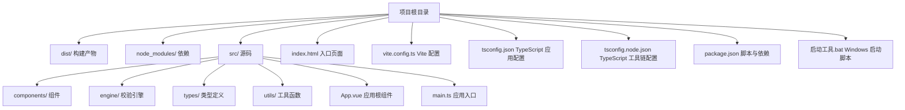
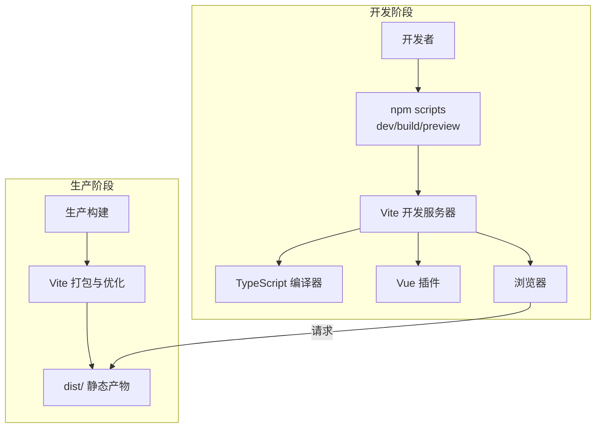
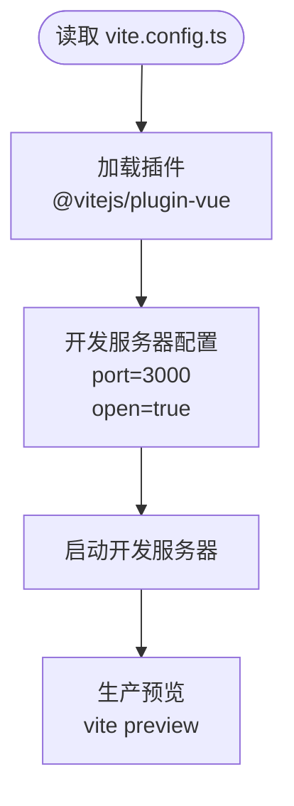
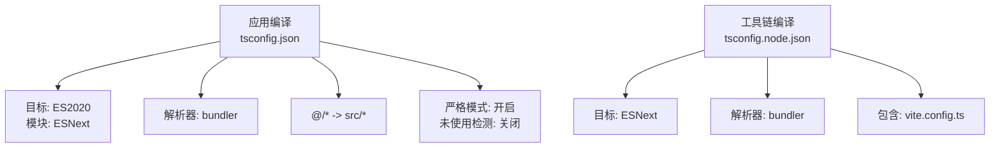
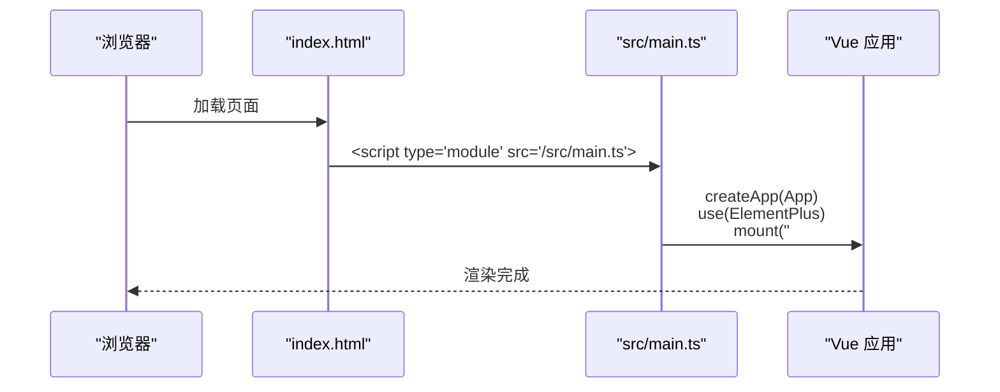
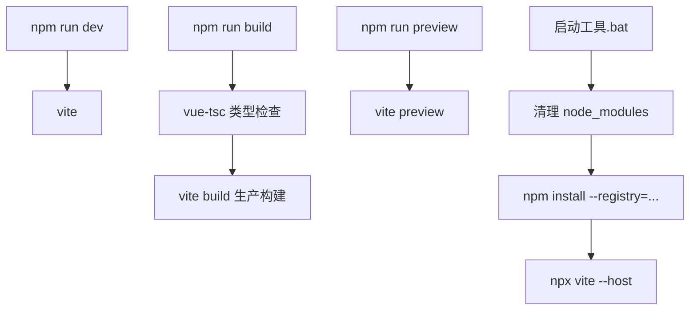
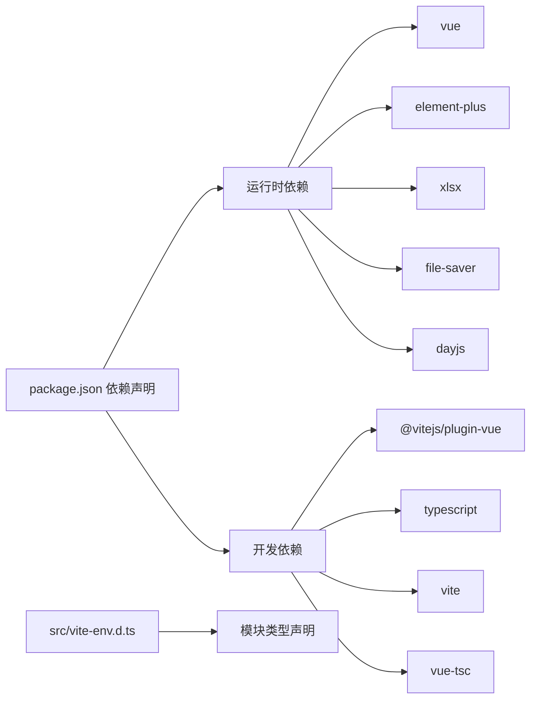

# 构建与部署

<cite>
**本文引用的文件**   
- [vite.config.ts](file://vite.config.ts)
- [package.json](file://package.json)
- [tsconfig.json](file://tsconfig.json)
- [tsconfig.node.json](file://tsconfig.node.json)
- [index.html](file://index.html)
- [src/main.ts](file://src/main.ts)
- [src/vite-env.d.ts](file://src/vite-env.d.ts)
- [启动工具.bat](file://启动工具.bat)
</cite>

## 目录
1. [简介](#简介)
2. [项目结构](#项目结构)
3. [核心组件](#核心组件)
4. [架构总览](#架构总览)
5. [详细组件分析](#详细组件分析)
6. [依赖关系分析](#依赖关系分析)
7. [性能考量](#性能考量)
8. [故障排除指南](#故障排除指南)
9. [结论](#结论)
10. [附录](#附录)

## 简介
本指南面向 SmartForm 项目，系统讲解从开发到生产的构建与部署流程，覆盖 Vite 构建工具配置、TypeScript 编译配置、开发服务器设置、生产优化策略、资源处理与缓存策略、多场景部署方案（本地服务器、CDN、容器化）以及常见问题排查与性能优化建议。文档以仓库现有配置为基础，结合实际代码文件进行说明，帮助读者快速搭建稳定高效的前端工程化流水线。

## 项目结构
SmartForm 采用基于 Vite 的 Vue 3 单页应用结构，核心文件集中在根目录与 src 目录中，入口 HTML 指定挂载点与外部依赖引入，TypeScript 配置分别针对应用与 Vite 工具链进行隔离编译。

图表来源
- [index.html](file://index.html)
- [vite.config.ts](file://vite.config.ts)
- [tsconfig.json](file://tsconfig.json)
- [tsconfig.node.json](file://tsconfig.node.json)
- [package.json](file://package.json)
- [src/main.ts](file://src/main.ts)
- [启动工具.bat](file://启动工具.bat)

章节来源
- [index.html](file://index.html)
- [vite.config.ts](file://vite.config.ts)
- [tsconfig.json](file://tsconfig.json)
- [tsconfig.node.json](file://tsconfig.node.json)
- [package.json](file://package.json)
- [src/main.ts](file://src/main.ts)
- [启动工具.bat](file://启动工具.bat)

## 核心组件
- Vite 构建与开发服务器：通过插件化机制集成 Vue SFC 支持，提供热更新与预览能力；默认监听端口与自动打开浏览器。
- TypeScript 编译：应用侧使用 ESNext 模块与严格模式，配合 bundler 解析器；工具链侧仅解析 Vite 配置文件。
- 应用入口与运行时：在 main.ts 中注册 Element Plus 并挂载应用；HTML 页面通过模块脚本加载入口。
- 包管理与脚本：通过 npm scripts 提供 dev/build/preview 命令，结合 npx 执行 Vite。

章节来源
- [vite.config.ts](file://vite.config.ts)
- [tsconfig.json](file://tsconfig.json)
- [tsconfig.node.json](file://tsconfig.node.json)
- [src/main.ts](file://src/main.ts)
- [package.json](file://package.json)

## 架构总览
下图展示从开发到生产的典型流程：开发者通过 npm scripts 启动 Vite 开发服务器，TypeScript 编译器与 Vite 插件协同处理源码，浏览器加载入口页面并按需请求资源；生产构建阶段由 Vite 执行打包与优化，生成静态产物。

图表来源
- [package.json](file://package.json)
- [vite.config.ts](file://vite.config.ts)
- [tsconfig.json](file://tsconfig.json)
- [index.html](file://index.html)

## 详细组件分析

### Vite 配置分析
- 插件体系：启用官方 Vue 插件以支持单文件组件与模板编译。
- 开发服务器：默认监听 3000 端口并自动打开浏览器，支持主机绑定以便局域网访问。
- 可扩展点：当前未启用预构建依赖、路由映射或代理等高级特性，适合小型项目起步。

图表来源
- [vite.config.ts](file://vite.config.ts)

章节来源
- [vite.config.ts](file://vite.config.ts)

### TypeScript 配置分析
- 应用编译配置（tsconfig.json）：
  - 目标与模块：ES2020 + ESNext 模块，利于现代浏览器与打包器按需处理。
  - 解析器：bundler，避免传统 node 解析导致的兼容性问题。
  - 路径别名：@/* 映射至 src/*，便于统一导入。
  - 严格模式：开启严格检查，关闭 unused locals/params 以平衡工程化效率。
- 工具链配置（tsconfig.node.json）：
  - 仅用于解析 Vite 配置文件，采用 ESNext 模块与 bundler 解析器。

图表来源
- [tsconfig.json](file://tsconfig.json)
- [tsconfig.node.json](file://tsconfig.node.json)

章节来源
- [tsconfig.json](file://tsconfig.json)
- [tsconfig.node.json](file://tsconfig.node.json)

### 应用入口与页面结构
- 入口文件：在 main.ts 中创建应用实例、安装 Element Plus 并挂载到 #app。
- 页面结构：index.html 定义视口、标题与图标，引入 Luckysheet 的 CDN 样式与脚本，并通过模块脚本加载 src/main.ts。

图表来源
- [index.html](file://index.html)
- [src/main.ts](file://src/main.ts)

章节来源
- [index.html](file://index.html)
- [src/main.ts](file://src/main.ts)

### 构建与脚本流程
- 开发：npm run dev 启动 Vite 开发服务器。
- 构建：npm run build 先执行类型检查（vue-tsc），再执行 Vite 生产构建。
- 预览：npm run preview 启动静态预览服务器。
- 启动工具：Windows 批处理脚本自动检测 Node、清理旧依赖并安装、最终调用 npx vite --host。

图表来源
- [package.json](file://package.json)
- [启动工具.bat](file://启动工具.bat)

章节来源
- [package.json](file://package.json)
- [启动工具.bat](file://启动工具.bat)

## 依赖关系分析
- 运行时依赖：Vue 3、Element Plus、xlsx、file-saver、dayjs。
- 开发依赖：@vitejs/plugin-vue、TypeScript、Vite、vue-tsc。
- 类型声明：vite-env.d.ts 声明 .vue 模块类型，确保 IDE 与编译器识别单文件组件。

图表来源
- [package.json](file://package.json)
- [src/vite-env.d.ts](file://src/vite-env.d.ts)

章节来源
- [package.json](file://package.json)
- [src/vite-env.d.ts](file://src/vite-env.d.ts)

## 性能考量
- 构建优化建议（基于现有配置现状）：
  - 当前未启用预构建依赖与路由映射，可考虑在后续迭代中加入，以减少冷启动时间与首屏体积。
  - 代码分割：可通过路由级懒加载与动态导入实现按需加载，降低初始包体。
  - 资源压缩：Vite 默认启用 esbuild 压缩，可结合产物分析工具定位大体积依赖并评估替换或拆分。
  - 缓存策略：生产部署时为静态资源添加长效缓存与版本号指纹，HTML 不缓存或短缓存。
- TypeScript 严格性与编译速度：
  - 严格模式有助于早期发现潜在问题；若构建时间过长，可在 CI 中单独运行类型检查，开发阶段以更快的增量编译为主。
- 外部 CDN 依赖：
  - Luckysheet 通过 CDN 引入，可显著减小自有包体，但需关注网络稳定性与离线可用性，必要时提供降级方案。

章节来源
- [vite.config.ts](file://vite.config.ts)
- [tsconfig.json](file://tsconfig.json)
- [index.html](file://index.html)

## 故障排除指南
- Node.js 未安装或不在 PATH：
  - 启动工具会检测并提示安装，确认安装后重试。
- 依赖安装失败：
  - 使用国内镜像源安装；如仍失败，清理 node_modules 后重装。
- 开发服务器无法访问或端口冲突：
  - 修改 vite.config.ts 中 server.port 或使用 --host 参数；确保防火墙放行。
- 类型检查报错阻塞构建：
  - 先在本地修复类型错误；CI 中可将类型检查与构建分离，先执行 vue-tsc 再 vite build。
- 浏览器空白或样式缺失：
  - 确认 index.html 中 Luckysheet CDN 是否可达；检查控制台网络错误与 CSP 设置。
- 预览服务无法访问：
  - 使用 npm run preview 或 npx vite preview；确保端口未被占用。

章节来源
- [启动工具.bat](file://启动工具.bat)
- [vite.config.ts](file://vite.config.ts)
- [package.json](file://package.json)
- [index.html](file://index.html)

## 结论
SmartForm 当前的构建与部署配置简洁高效，满足中小型前端项目的日常开发与上线需求。建议在保持现有优势的基础上，逐步引入代码分割、产物分析与缓存策略，完善 CI/CD 流水线，并对 CDN 依赖制定容灾预案，以进一步提升性能与可靠性。

## 附录

### 部署前准备清单
- 环境要求：Node.js 与 npm 版本满足 package.json 中的范围；确保网络可访问 npm 镜像与 CDN。
- 本地验证：执行 npm run build 与 npm run preview，确认产物无异常。
- 静态托管：将 dist/ 目录部署至静态服务器或 CDN；为静态资源设置长缓存与版本指纹。

### 不同部署场景实施方案
- 本地服务器：
  - 使用静态服务器（如 nginx/Apache）指向 dist/；配置 gzip/br 压缩与缓存头。
- CDN：
  - 将静态资源上传至 CDN；HTML 与动态接口走自有域名；CDN 缓存策略按资源类型区分。
- 容器化部署：
  - 使用 Nginx 镜像作为反向代理，挂载 dist/；或在多阶段构建中将构建产物复制到精简镜像。
- CI/CD 集成建议：
  - 分阶段流水线：安装依赖 → 类型检查 → 构建 → 预览/测试 → 产物归档 → 发布。
  - 缓存策略：缓存 node_modules 与构建缓存，缩短流水线时间。

### 常见问题与调试技巧
- 构建缓慢：优先检查依赖体积与类型检查耗时；拆分大型组件与第三方库。
- 兼容性问题：关注目标浏览器支持度；必要时引入 polyfill 或调整 tsconfig.target。
- 调试技巧：利用浏览器开发者工具 Network 面板观察资源加载；查看 Console 错误与 Source Map 定位问题。