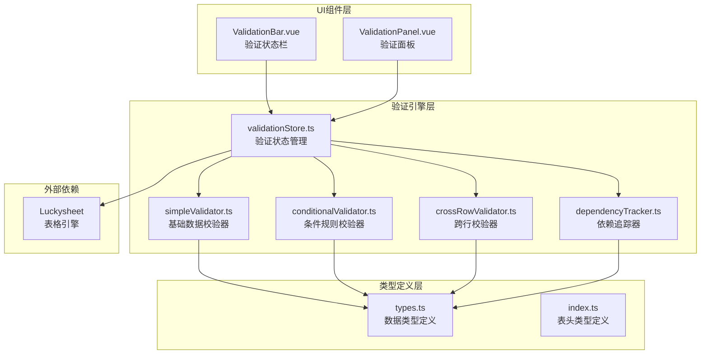
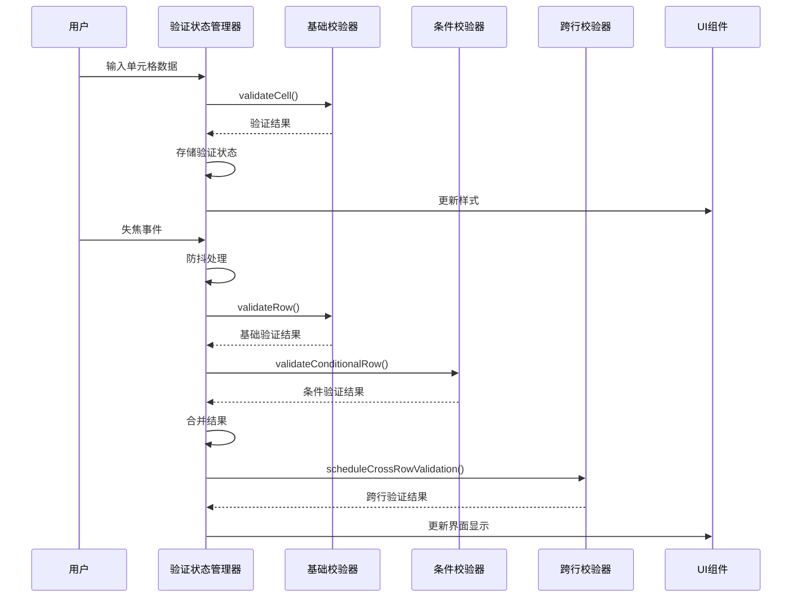
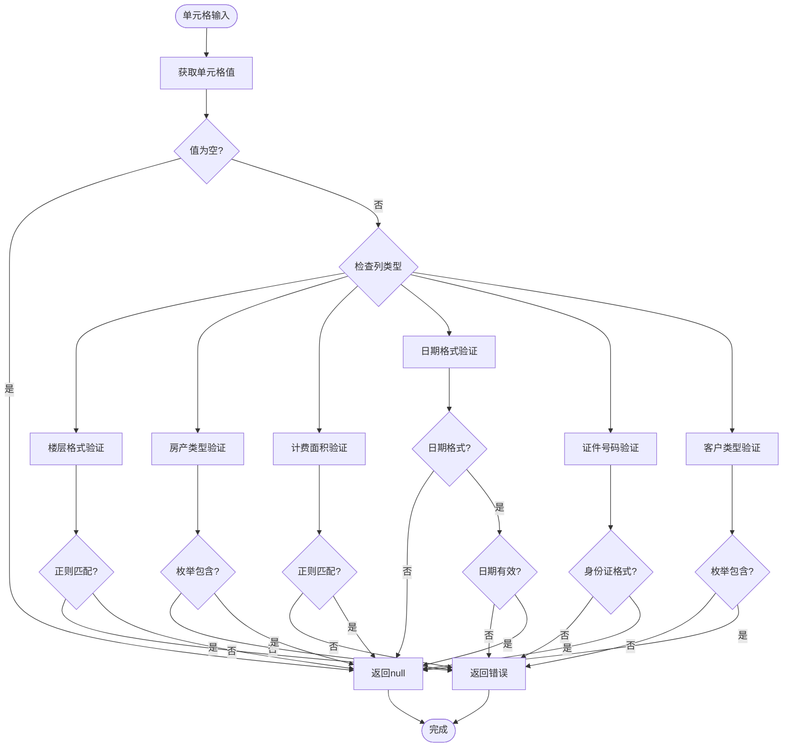
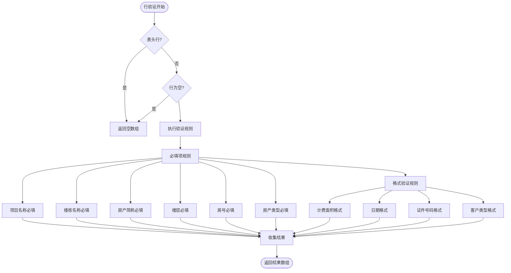
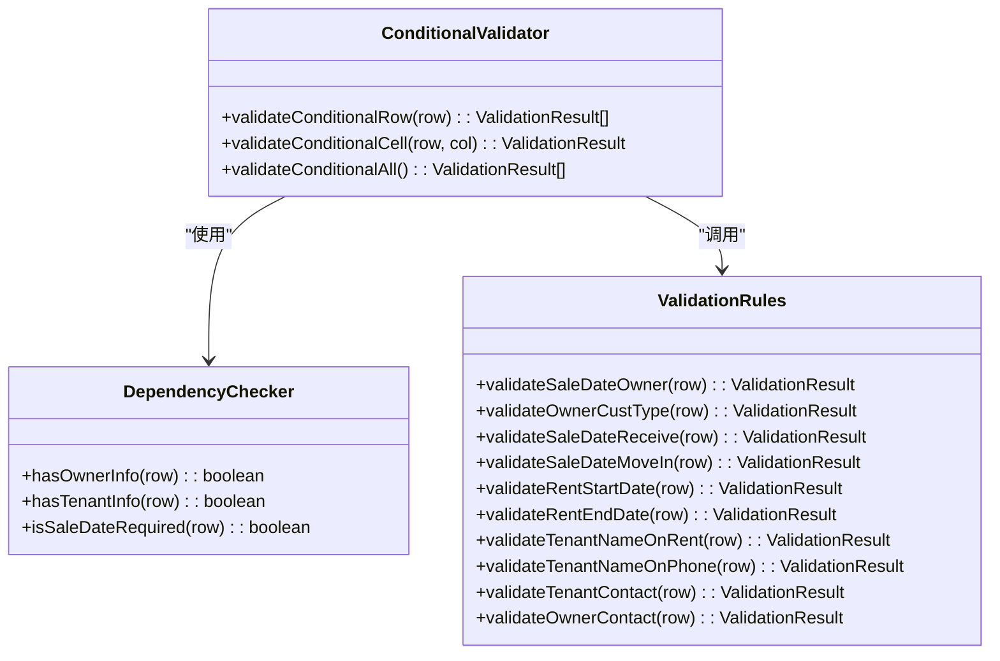
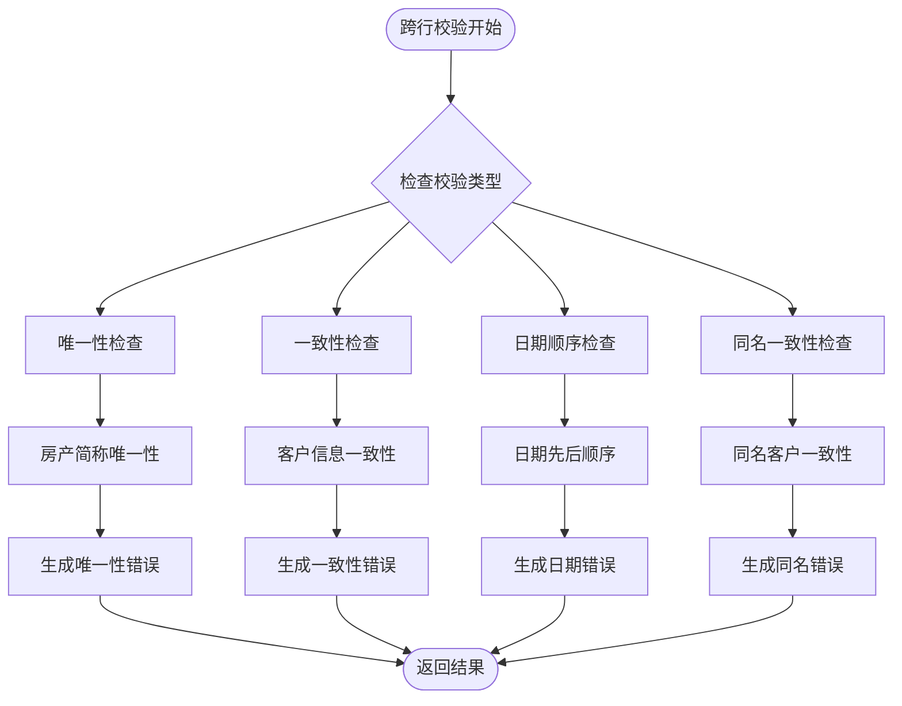
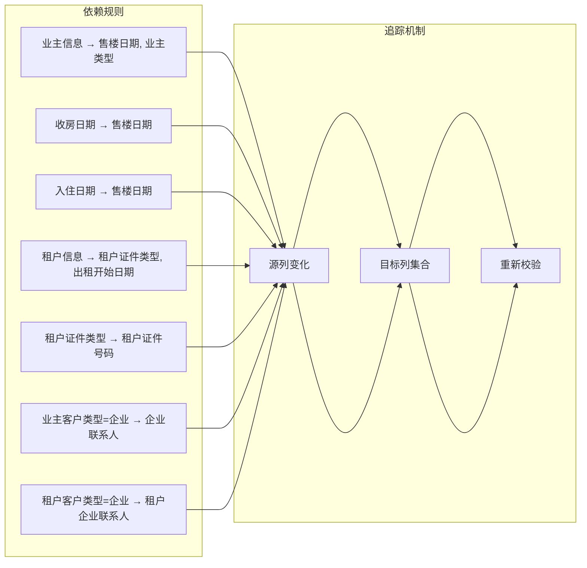
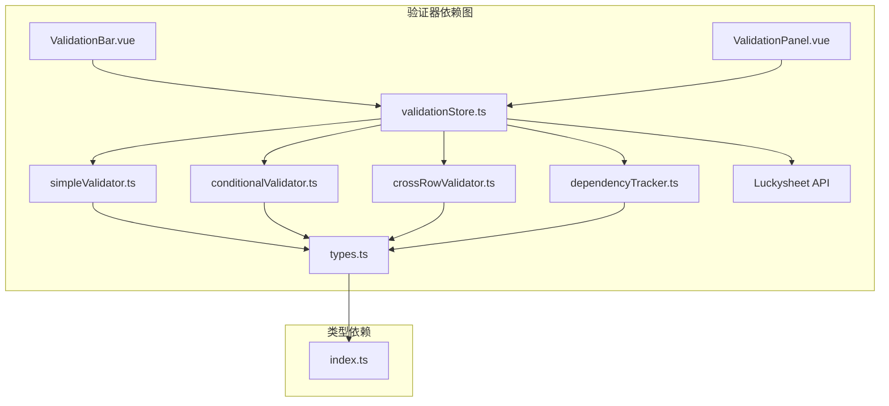

# 基础数据校验器

<cite>
**本文档引用的文件**
- [simpleValidator.ts](file://src/engine/simpleValidator.ts)
- [validationStore.ts](file://src/engine/validationStore.ts)
- [types.ts](file://src/engine/types.ts)
- [conditionalValidator.ts](file://src/engine/conditionalValidator.ts)
- [crossRowValidator.ts](file://src/engine/crossRowValidator.ts)
- [dependencyTracker.ts](file://src/engine/dependencyTracker.ts)
- [ValidationBar.vue](file://src/components/ValidationBar.vue)
- [ValidationPanel.vue](file://src/components/ValidationPanel.vue)
- [index.ts](file://src/types/index.ts)
</cite>

## 目录
1. [简介](#简介)
2. [项目结构](#项目结构)
3. [核心组件](#核心组件)
4. [架构概览](#架构概览)
5. [详细组件分析](#详细组件分析)
6. [依赖关系分析](#依赖关系分析)
7. [性能考虑](#性能考虑)
8. [故障排除指南](#故障排除指南)
9. [结论](#结论)

## 简介

SmartForm 的基础数据校验器是一个完整的前端数据验证系统，专为房产管理表格设计。该系统实现了多层次的数据验证策略，包括基础数据校验、条件规则校验、跨行一致性校验等，确保用户输入的数据符合业务规则和格式要求。

系统采用模块化设计，将不同类型的数据验证规则分离到独立的模块中，支持实时校验、批量校验和条件触发校验等多种验证模式。通过与 Luckysheet 表格引擎的深度集成，提供了流畅的用户体验和准确的验证反馈。

## 项目结构

SmartForm 校验系统采用清晰的分层架构，主要包含以下核心模块：



**图表来源**
- [simpleValidator.ts:1-419](file://src/engine/simpleValidator.ts#L1-L419)
- [validationStore.ts:1-474](file://src/engine/validationStore.ts#L1-L474)
- [types.ts:1-48](file://src/engine/types.ts#L1-L48)

**章节来源**
- [simpleValidator.ts:1-419](file://src/engine/simpleValidator.ts#L1-L419)
- [validationStore.ts:1-474](file://src/engine/validationStore.ts#L1-L474)
- [types.ts:1-48](file://src/engine/types.ts#L1-L48)

## 核心组件

### 基础数据校验器 (simpleValidator.ts)

基础数据校验器是整个验证系统的核心，负责实现最基础的数据验证规则。它提供了三个核心验证函数：

- `validateCell()`: 单元格级别即时验证，主要用于用户输入时的实时反馈
- `validateRow()`: 行级别完整验证，用于用户失焦时的详细校验
- `validateAll()`: 全局验证，用于批量校验和导出前的完整性检查

系统支持多种验证规则类型：
- **必填项检查**: 确保关键字段不能为空
- **数据格式验证**: 使用正则表达式验证特定格式
- **数值范围校验**: 验证数值的有效范围
- **枚举值验证**: 确保选择值在允许范围内

**章节来源**
- [simpleValidator.ts:275-395](file://src/engine/simpleValidator.ts#L275-L395)

### 验证状态管理 (validationStore.ts)

验证状态管理器负责协调各个验证器的工作，维护验证结果的状态，并提供与 UI 组件的交互接口。其核心功能包括：

- **状态存储**: 使用 Vue 响应式系统管理验证结果
- **防抖机制**: 优化用户体验，减少不必要的计算
- **样式应用**: 将验证结果转换为视觉反馈
- **跨行校验调度**: 管理跨行验证的延迟执行

**章节来源**
- [validationStore.ts:15-474](file://src/engine/validationStore.ts#L15-L474)

### 类型定义系统

系统提供了完整的 TypeScript 类型定义，确保代码的类型安全性和可维护性：

- **ValidationResult**: 标准化的验证结果结构
- **Severity**: 严重程度等级定义
- **CellError**: 单元格错误信息结构
- **HeaderColumn**: 表头列定义

**章节来源**
- [types.ts:4-48](file://src/engine/types.ts#L4-L48)

## 架构概览

SmartForm 的验证系统采用了分层架构设计，各层职责明确，相互协作：



**图表来源**
- [validationStore.ts:248-315](file://src/engine/validationStore.ts#L248-L315)
- [simpleValidator.ts:275-375](file://src/engine/simpleValidator.ts#L275-L375)

## 详细组件分析

### 基础数据校验器详细分析

#### 单元格级别即时验证 (validateCell)

单元格级别的即时验证是用户体验的关键组成部分，它提供了实时的反馈机制：



**图表来源**
- [simpleValidator.ts:275-325](file://src/engine/simpleValidator.ts#L275-L325)

#### 行级别完整验证 (validateRow)

行级别的验证提供了更全面的数据质量检查，包括必填项和格式验证：



**图表来源**
- [simpleValidator.ts:330-375](file://src/engine/simpleValidator.ts#L330-L375)

#### 全局验证 (validateAll)

全局验证用于批量检查所有数据，通常在导出或提交前执行：

**章节来源**
- [simpleValidator.ts:377-395](file://src/engine/simpleValidator.ts#L377-L395)

### 条件规则校验器

条件规则校验器实现了基于业务逻辑的动态验证，根据用户输入的内容自动触发相应的验证规则：



**图表来源**
- [conditionalValidator.ts:183-220](file://src/engine/conditionalValidator.ts#L183-L220)

**章节来源**
- [conditionalValidator.ts:1-325](file://src/engine/conditionalValidator.ts#L1-L325)

### 跨行校验器

跨行校验器负责检查数据的一致性和唯一性，确保整个表格数据的完整性：



**图表来源**
- [crossRowValidator.ts:21-275](file://src/engine/crossRowValidator.ts#L21-L275)

**章节来源**
- [crossRowValidator.ts:1-276](file://src/engine/crossRowValidator.ts#L1-L276)

### 依赖追踪器

依赖追踪器实现了智能的依赖关系管理，当源字段发生变化时自动重新校验受影响的目标字段：



**图表来源**
- [dependencyTracker.ts:18-88](file://src/engine/dependencyTracker.ts#L18-L88)

**章节来源**
- [dependencyTracker.ts:1-158](file://src/engine/dependencyTracker.ts#L1-L158)

## 依赖关系分析

SmartForm 的验证系统具有清晰的依赖关系，各模块之间通过明确定义的接口进行交互：



**图表来源**
- [validationStore.ts:1-12](file://src/engine/validationStore.ts#L1-L12)
- [simpleValidator.ts:1-6](file://src/engine/simpleValidator.ts#L1-L6)

系统采用松耦合的设计原则，各验证器可以独立测试和维护，同时通过统一的接口进行集成。这种设计使得系统具有良好的扩展性和可维护性。

**章节来源**
- [validationStore.ts:1-12](file://src/engine/validationStore.ts#L1-L12)
- [simpleValidator.ts:1-6](file://src/engine/simpleValidator.ts#L1-L6)

## 性能考虑

SmartForm 的验证系统在设计时充分考虑了性能优化，采用了多种策略来确保系统的高效运行：

### 缓存机制
- **数据缓存**: 避免重复创建大数组，提高数据访问效率
- **统计缓存**: 使用 requestAnimationFrame 优化统计更新频率
- **样式批处理**: 合并样式更新操作，减少 DOM 操作次数

### 防抖和节流
- **失焦防抖**: 200ms 防抖延迟，避免频繁的验证操作
- **跨行校验延迟**: 800ms 延迟执行，确保用户输入完成后再进行复杂校验
- **定时器清理**: 在适当时机清理定时器，防止内存泄漏

### 懒加载和按需验证
- **条件触发**: 仅在必要时执行相关验证规则
- **增量更新**: 仅更新受影响的单元格和行
- **批量处理**: 合并多个验证操作为单个批次

### 内存管理
- **弱引用**: 使用 Set 和 Map 管理状态，便于垃圾回收
- **定时器清理**: 提供专门的清理函数防止内存泄漏
- **响应式优化**: 使用 Vue 响应式系统自动跟踪依赖

**章节来源**
- [validationStore.ts:33-57](file://src/engine/validationStore.ts#L33-L57)
- [validationStore.ts:255-315](file://src/engine/validationStore.ts#L255-L315)
- [validationStore.ts:457-465](file://src/engine/validationStore.ts#L457-L465)

## 故障排除指南

### 常见问题及解决方案

#### 验证结果不更新
**症状**: 修改单元格后验证结果显示没有变化  
**原因**: 可能是缓存问题或事件绑定问题  
**解决方案**: 
1. 检查 `invalidateDataCache()` 是否正确调用
2. 确认 `onCellInput` 和 `onCellBlur` 事件绑定正常
3. 验证 Luckysheet API 是否可用

#### 样式更新异常
**症状**: 验证错误的单元格没有显示正确的样式  
**原因**: 样式批处理队列问题  
**解决方案**:
1. 检查 `flushStyleBatch()` 是否正确执行
2. 确认 `batchSetCellFormat` 调用顺序
3. 验证 Luckysheet 格式设置 API

#### 性能问题
**症状**: 大表格验证时出现卡顿  
**原因**: 验证操作过于频繁或数据量过大  
**解决方案**:
1. 检查防抖和节流设置
2. 优化正则表达式性能
3. 考虑分页验证策略

#### 跨行校验不准确
**症状**: 跨行唯一性或一致性校验结果不正确  
**原因**: 数据格式问题或边界条件处理不当  
**解决方案**:
1. 检查数据预处理逻辑
2. 验证边界条件处理
3. 确认数据类型转换正确

### 调试技巧

#### 开启调试模式
```typescript
// 在开发环境中启用详细日志
const DEBUG = process.env.NODE_ENV === 'development'

// 添加验证过程的日志输出
if (DEBUG) {
  console.log(`验证行 ${row} 的列 ${col}`, { value, result })
}
```

#### 性能监控
```typescript
// 性能测量工具
function measurePerformance(name: string, fn: Function) {
  const start = performance.now()
  const result = fn()
  const end = performance.now()
  console.log(`${name}: ${end - start}ms`)
  return result
}

// 使用示例
const results = measurePerformance('validateRow', () => validateRow(row))
```

#### 错误处理最佳实践
```typescript
// 安全的 API 调用
function safeGetCellValue(row: number, col: number): any {
  try {
    const ls = (window as any).luckysheet
    return ls ? ls.getCellValue(row, col) : null
  } catch (error) {
    console.error('获取单元格值失败:', error)
    return null
  }
}
```

**章节来源**
- [validationStore.ts:457-465](file://src/engine/validationStore.ts#L457-L465)

## 结论

SmartForm 的基础数据校验器是一个设计精良、功能完善的前端验证系统。它通过模块化的设计、清晰的分层架构和完善的性能优化，为用户提供了一个高效、可靠的验证体验。

系统的主要优势包括：

1. **模块化设计**: 各种验证规则分离到独立模块，便于维护和扩展
2. **多层次验证**: 支持即时验证、行级验证和全局验证，满足不同场景需求
3. **智能依赖管理**: 通过依赖追踪器实现条件触发的验证机制
4. **性能优化**: 采用多种优化策略确保系统在大数据量下的响应速度
5. **用户体验**: 提供实时反馈和直观的视觉指示

未来的发展方向可以包括：
- 增加更多自定义验证规则的支持
- 实现验证规则的动态配置
- 优化移动端的验证体验
- 增强验证结果的可追溯性

这个验证系统为 SmartForm 提供了坚实的数据质量保障，是构建可靠业务应用的重要基础设施。