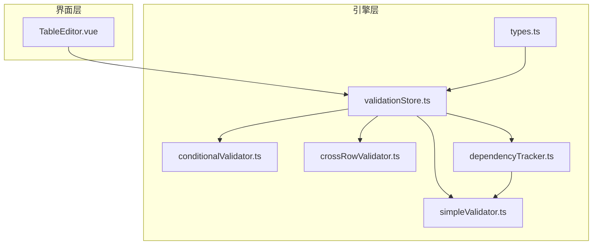
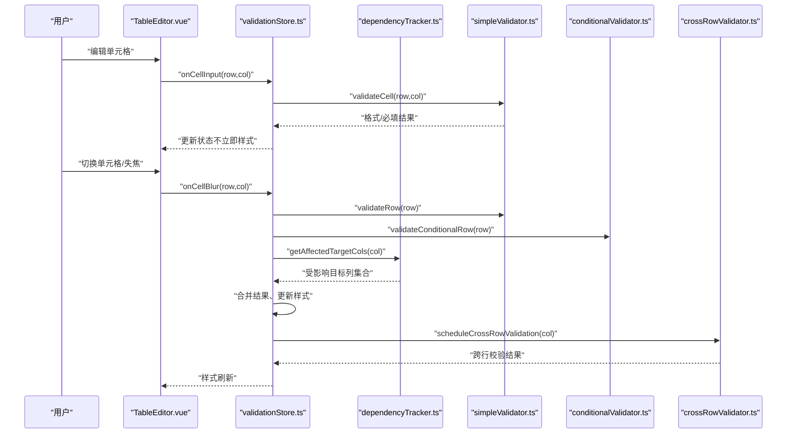
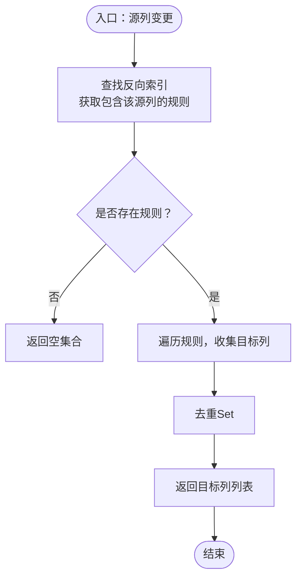
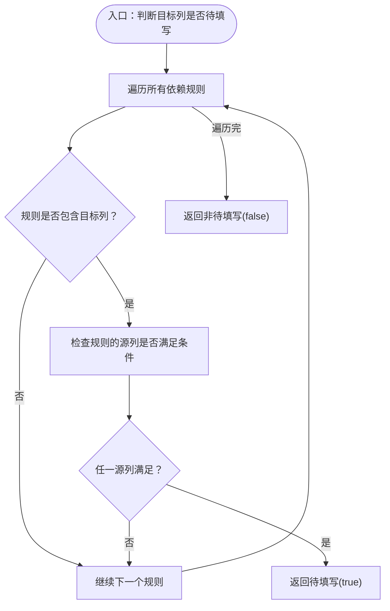
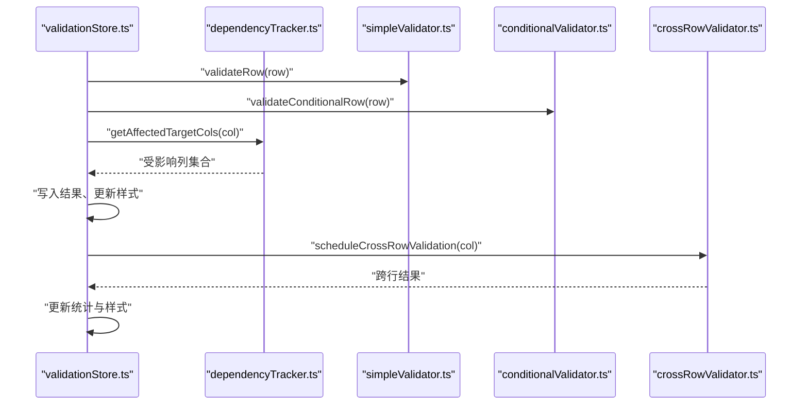
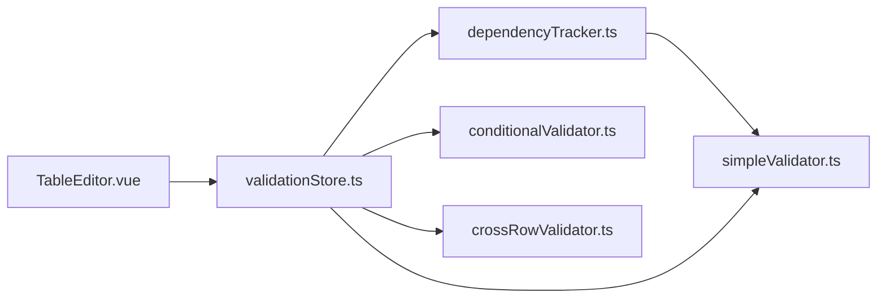

# 数据依赖追踪器

<cite>
**本文引用的文件**
- [dependencyTracker.ts](file://src/engine/dependencyTracker.ts)
- [validationStore.ts](file://src/engine/validationStore.ts)
- [simpleValidator.ts](file://src/engine/simpleValidator.ts)
- [conditionalValidator.ts](file://src/engine/conditionalValidator.ts)
- [crossRowValidator.ts](file://src/engine/crossRowValidator.ts)
- [types.ts](file://src/engine/types.ts)
- [TableEditor.vue](file://src/components/TableEditor.vue)
</cite>

## 目录
1. [简介](#简介)
2. [项目结构](#项目结构)
3. [核心组件](#核心组件)
4. [架构总览](#架构总览)
5. [详细组件分析](#详细组件分析)
6. [依赖关系分析](#依赖关系分析)
7. [性能考量](#性能考量)
8. [故障排查指南](#故障排查指南)
9. [结论](#结论)
10. [附录](#附录)

## 简介
本技术文档围绕 SmartForm 的数据依赖追踪器展开，系统性阐述 dependencyTracker.ts 的数据关联分析能力，包括：
- 依赖关系的建立与存储
- 影响范围的计算
- 条件显示逻辑的实现
- 关键函数工作原理：getAffectedTargetCols、isPendingRequired、getPendingCols、getRevalidationCols
- 依赖图构建算法、循环依赖检测与处理
- 动态依赖关系的更新机制
- 与校验器的集成方式
- 性能优化策略与内存使用控制

## 项目结构
SmartForm 的校验体系采用分层设计：
- engine 层：包含校验引擎与依赖追踪器
  - simpleValidator.ts：基础格式与必填规则
  - conditionalValidator.ts：条件触发规则
  - crossRowValidator.ts：跨行唯一性、一致性、日期顺序
  - dependencyTracker.ts：依赖关系与“待填写”状态管理
  - validationStore.ts：状态管理与流程编排
  - types.ts：通用类型与消息净化
- components 层：UI 编辑器与交互组件
  - TableEditor.vue：Luckysheet 集成与事件钩子

图表来源
- [validationStore.ts:1-12](file://src/engine/validationStore.ts#L1-L12)
- [dependencyTracker.ts:1-157](file://src/engine/dependencyTracker.ts#L1-L157)
- [simpleValidator.ts:1-419](file://src/engine/simpleValidator.ts#L1-L419)
- [conditionalValidator.ts:1-325](file://src/engine/conditionalValidator.ts#L1-L325)
- [crossRowValidator.ts:1-276](file://src/engine/crossRowValidator.ts#L1-L276)
- [types.ts:1-48](file://src/engine/types.ts#L1-L48)
- [TableEditor.vue:102-126](file://src/components/TableEditor.vue#L102-L126)

章节来源
- [validationStore.ts:1-12](file://src/engine/validationStore.ts#L1-L12)
- [dependencyTracker.ts:1-157](file://src/engine/dependencyTracker.ts#L1-L157)
- [TableEditor.vue:102-126](file://src/components/TableEditor.vue#L102-L126)

## 核心组件
- 依赖追踪器（dependencyTracker.ts）
  - 以规则集合定义依赖关系，构建“源列 → 规则”的反向索引
  - 提供影响范围计算、条件显示判断、待填写状态查询、重校验列集生成
- 校验存储（validationStore.ts）
  - 聚合简单、条件、跨行校验结果，维护状态与样式批处理
  - 在失焦校验中联动依赖追踪器，计算受影响列并更新样式
- 基础校验（simpleValidator.ts）
  - 提供单元格文本读取、行非空判断、基础格式与必填规则
  - 为依赖追踪器提供数据读取能力
- 条件校验（conditionalValidator.ts）
  - 实现与依赖追踪器互补的条件触发规则，覆盖售楼日期、租户/业主客户类型等
- 跨行校验（crossRowValidator.ts）
  - 实现唯一性、一致性、日期顺序等跨行规则
- 类型与消息净化（types.ts）
  - 统一校验结果结构、术语替换与消息净化

章节来源
- [dependencyTracker.ts:7-157](file://src/engine/dependencyTracker.ts#L7-L157)
- [validationStore.ts:1-474](file://src/engine/validationStore.ts#L1-L474)
- [simpleValidator.ts:27-52](file://src/engine/simpleValidator.ts#L27-L52)
- [conditionalValidator.ts:19-325](file://src/engine/conditionalValidator.ts#L19-L325)
- [crossRowValidator.ts:17-276](file://src/engine/crossRowValidator.ts#L17-L276)
- [types.ts:1-48](file://src/engine/types.ts#L1-L48)

## 架构总览
依赖追踪器在整体校验流程中的作用：
- 在用户输入与失焦阶段，根据源列变化推导受影响的目标列
- 结合“待填写”状态判断，为 UI 提供视觉反馈（边框与背景色）
- 与条件校验器协同，既保证规则完整性，又避免重复计算

图表来源
- [TableEditor.vue:108-124](file://src/components/TableEditor.vue#L108-L124)
- [validationStore.ts:248-315](file://src/engine/validationStore.ts#L248-L315)
- [dependencyTracker.ts:79-88](file://src/engine/dependencyTracker.ts#L79-L88)
- [simpleValidator.ts:275-325](file://src/engine/simpleValidator.ts#L275-L325)
- [conditionalValidator.ts:183-220](file://src/engine/conditionalValidator.ts#L183-L220)
- [crossRowValidator.ts:256-275](file://src/engine/crossRowValidator.ts#L256-L275)

## 详细组件分析

### 依赖追踪器（dependencyTracker.ts）
- 数据结构
  - 依赖规则：包含触发源列集合、受影响目标列集合、描述信息
  - 反向索引：以源列为键，映射到所有包含该源列的规则
- 核心函数
  - getAffectedTargetCols：基于源列查找所有规则，收集目标列并去重
  - getDependencyDescriptions：按目标列聚合规则描述，用于 tooltip
  - isPendingRequired：判断目标列是否处于“待填写”状态（条件满足即触发）
  - getPendingCols：扫描某行所有目标列，返回“待填写”列集合
  - getRevalidationCols：返回源列与其受影响目标列的并集，用于批量重校验
- 条件逻辑
  - 企业客户类型的特殊判断：仅当客户类型为“企业”时，才要求企业联系人必填
  - OR 条件：只要任一源列满足条件，目标列即进入“待填写”

图表来源
- [dependencyTracker.ts:67-88](file://src/engine/dependencyTracker.ts#L67-L88)

图表来源
- [dependencyTracker.ts:112-129](file://src/engine/dependencyTracker.ts#L112-L129)

章节来源
- [dependencyTracker.ts:7-157](file://src/engine/dependencyTracker.ts#L7-L157)
- [simpleValidator.ts:27-44](file://src/engine/simpleValidator.ts#L27-L44)

### 校验存储（validationStore.ts）与依赖追踪器的集成
- 失焦校验流程
  - 执行简单与条件校验，清理跨行结果后写入新结果
  - 通过 getAffectedTargetCols 计算受影响列，合并源列，统一更新样式
  - 延迟执行跨行校验，避免阻塞主流程
- “待填写”状态管理
  - 若单元格为空且无错误，且 isPendingRequired 为真，则加入 pendingCells 并应用特殊样式
- 全量校验
  - 在导出前运行，扫描所有行的“待填写”列，统一应用样式

图表来源
- [validationStore.ts:269-315](file://src/engine/validationStore.ts#L269-L315)
- [validationStore.ts:371-383](file://src/engine/validationStore.ts#L371-L383)
- [validationStore.ts:408-452](file://src/engine/validationStore.ts#L408-L452)

章节来源
- [validationStore.ts:248-315](file://src/engine/validationStore.ts#L248-L315)
- [validationStore.ts:371-383](file://src/engine/validationStore.ts#L371-L383)
- [validationStore.ts:408-452](file://src/engine/validationStore.ts#L408-L452)

### 条件校验器（conditionalValidator.ts）与依赖追踪器的互补
- 条件校验器实现与依赖追踪器相同的业务语义，但以独立规则形式存在
- 两者共同保障“条件触发必填”的一致性，避免遗漏
- 在失焦校验中，依赖追踪器负责影响范围计算，条件校验器负责具体规则验证

章节来源
- [conditionalValidator.ts:19-325](file://src/engine/conditionalValidator.ts#L19-L325)

### 跨行校验器（crossRowValidator.ts）
- 负责唯一性、一致性、日期顺序等跨行规则
- 与依赖追踪器解耦，通过延迟调度在失焦流程末尾执行，减少对主流程的影响

章节来源
- [crossRowValidator.ts:17-276](file://src/engine/crossRowValidator.ts#L17-L276)

### 类型与消息净化（types.ts）
- 统一校验结果结构与术语替换，提升用户体验与国际化支持

章节来源
- [types.ts:1-48](file://src/engine/types.ts#L1-L48)

## 依赖关系分析
- 依赖追踪器依赖 simpleValidator 的 getCellText 读取单元格值
- 校验存储同时依赖依赖追踪器与各类校验器，形成闭环
- UI 层通过 TableEditor.vue 钩子触发 onCellInput/onCellBlur，驱动校验流程

图表来源
- [dependencyTracker.ts:5](file://src/engine/dependencyTracker.ts#L5)
- [validationStore.ts:4-11](file://src/engine/validationStore.ts#L4-L11)
- [TableEditor.vue:18](file://src/components/TableEditor.vue#L18)

章节来源
- [dependencyTracker.ts:5](file://src/engine/dependencyTracker.ts#L5)
- [validationStore.ts:4-11](file://src/engine/validationStore.ts#L4-L11)
- [TableEditor.vue:18](file://src/components/TableEditor.vue#L18)

## 性能考量
- 反向索引构建
  - 一次性构建“源列 → 规则”映射，查询复杂度 O(1)，降低每次变更时的遍历成本
- 去重与集合操作
  - 使用 Set 进行目标列去重，避免重复计算
- 批处理样式更新
  - 样式更新采用队列与同步刷新策略，减少 Luckysheet API 调用次数
- 防抖与RAF
  - 失焦防抖（200ms）、统计更新使用 requestAnimationFrame，降低主线程压力
- 跨行校验延迟
  - 通过定时器延迟执行，避免阻塞主流程

章节来源
- [dependencyTracker.ts:67-88](file://src/engine/dependencyTracker.ts#L67-L88)
- [validationStore.ts:33-57](file://src/engine/validationStore.ts#L33-L57)
- [validationStore.ts:103-148](file://src/engine/validationStore.ts#L103-L148)
- [validationStore.ts:256-266](file://src/engine/validationStore.ts#L256-L266)
- [validationStore.ts:319-331](file://src/engine/validationStore.ts#L319-L331)

## 故障排查指南
- 依赖规则未生效
  - 检查源列与目标列索引是否正确
  - 确认 isPendingRequired 中的特殊条件（如“企业”类型）是否满足
- “待填写”状态异常
  - 核对 getPendingCols 的目标列集合是否完整
  - 检查单元格值是否为空导致误判
- 样式未更新
  - 确认 onCellBlur 流程是否执行 getAffectedTargetCols 并更新样式
  - 检查样式批处理队列是否被取消或清空
- 跨行校验未触发
  - 检查延迟定时器是否被清理或提前执行
  - 确认 validateCrossRowByCol 的列映射是否覆盖目标列

章节来源
- [dependencyTracker.ts:112-129](file://src/engine/dependencyTracker.ts#L112-L129)
- [validationStore.ts:300-315](file://src/engine/validationStore.ts#L300-L315)
- [validationStore.ts:319-344](file://src/engine/validationStore.ts#L319-L344)

## 结论
依赖追踪器通过简洁而高效的规则模型与反向索引，实现了对复杂业务依赖关系的快速响应。它与简单、条件、跨行校验器协同，配合 UI 的事件钩子与样式批处理机制，形成了低开销、高可用的数据校验与可视化反馈体系。建议在扩展新规则时保持“源列集合 + 目标列集合 + 描述”的清晰结构，并遵循特殊条件的显式表达，以确保可维护性与一致性。

## 附录
- 复杂依赖关系建模示例
  - 多层嵌套依赖：例如“租户信息”作为源，触发“租户证件类型”和“出租开始日期”，再进一步影响“租户客户名称”
  - 条件显示：当“收房日期”或“入住日期”任一有值时，“售楼日期”进入“待填写”
  - 隐藏字段：依赖追踪器不直接控制可见性，但可通过“待填写”状态引导用户填写；若需隐藏字段，可在 UI 层结合业务规则进行控制
- 循环依赖检测与处理
  - 依赖规则以“单向”源 → 目标建模，天然避免循环依赖
  - 若业务需求出现循环，建议拆分为多个阶段或引入中间状态，避免死循环
- 动态依赖关系更新机制
  - 依赖规则在初始化时构建反向索引；若规则动态变更，需重建索引并清理缓存
- 与校验器的集成要点
  - 依赖追踪器仅负责影响范围与“待填写”状态，具体规则由 simple/conditional/crossRow 校验器实现
  - 在失焦流程中优先计算受影响列，再执行相应校验，最后统一应用样式