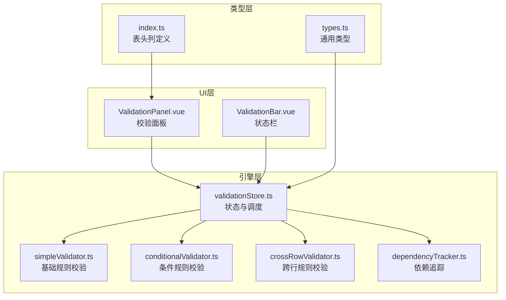
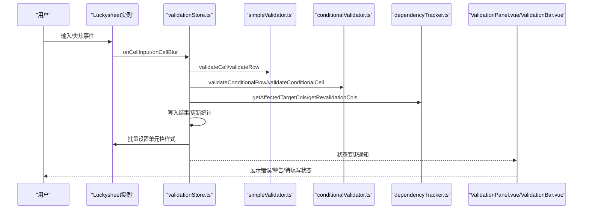
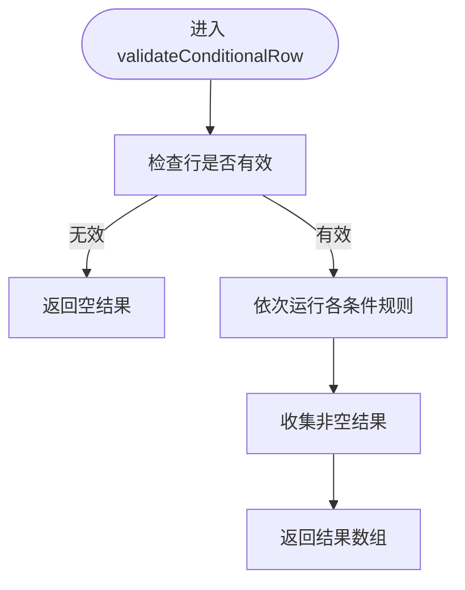
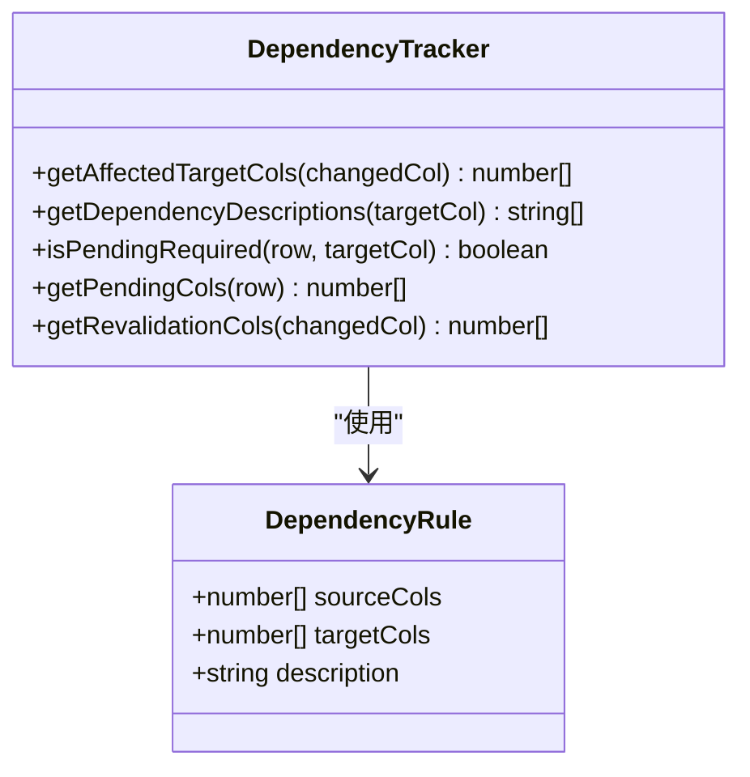
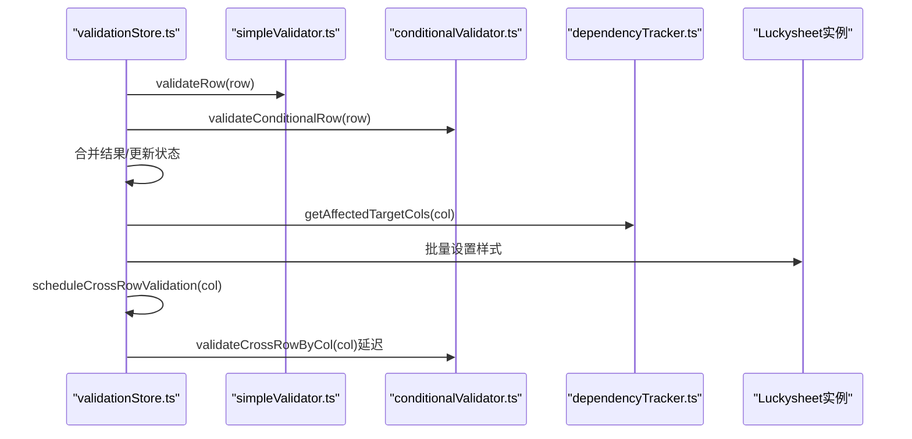
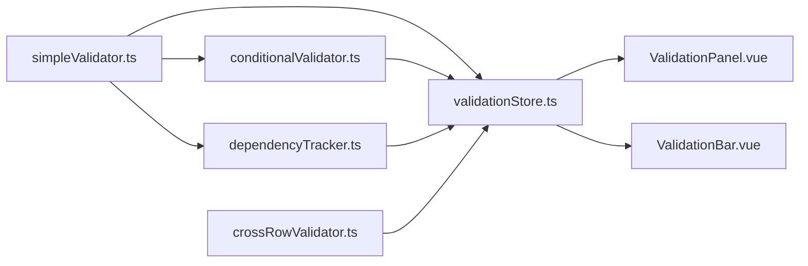

# 条件触发校验器

<cite>
**本文档引用的文件**
- [conditionalValidator.ts](file://src/engine/conditionalValidator.ts)
- [dependencyTracker.ts](file://src/engine/dependencyTracker.ts)
- [validationStore.ts](file://src/engine/validationStore.ts)
- [simpleValidator.ts](file://src/engine/simpleValidator.ts)
- [crossRowValidator.ts](file://src/engine/crossRowValidator.ts)
- [types.ts](file://src/engine/types.ts)
- [index.ts](file://src/types/index.ts)
- [ValidationPanel.vue](file://src/components/ValidationPanel.vue)
- [ValidationBar.vue](file://src/components/ValidationBar.vue)
</cite>

## 目录
1. [简介](#简介)
2. [项目结构](#项目结构)
3. [核心组件](#核心组件)
4. [架构总览](#架构总览)
5. [详细组件分析](#详细组件分析)
6. [依赖关系分析](#依赖关系分析)
7. [性能考虑](#性能考虑)
8. [故障排除指南](#故障排除指南)
9. [结论](#结论)
10. [附录](#附录)

## 简介
本文件面向 SmartForm 的条件触发校验器，系统性阐述 conditionalValidator.ts 的条件校验机制，包括：
- 基于其他单元格值的动态校验规则
- 条件表达式的解析与执行
- 与 dependencyTracker.ts 的协作关系
- 数据依赖关系追踪与影响范围分析
- 触发时机、执行顺序与性能优化策略
- 复杂条件规则的实现示例（多条件组合、嵌套条件、动态条件）
- 与基础校验的优先级关系、错误消息合并处理、UI 样式应用逻辑

## 项目结构
SmartForm 的校验体系采用“引擎 + UI”分层设计：
- 引擎层：simpleValidator.ts（基础规则）、conditionalValidator.ts（条件规则）、crossRowValidator.ts（跨行规则）、dependencyTracker.ts（依赖追踪）、validationStore.ts（状态与调度）
- 类型层：types.ts（通用类型）、index.ts（表头列定义）
- UI 层：ValidationPanel.vue（校验面板）、ValidationBar.vue（底部状态栏）

图表来源
- [validationStore.ts:1-474](file://src/engine/validationStore.ts#L1-L474)
- [conditionalValidator.ts:1-325](file://src/engine/conditionalValidator.ts#L1-L325)
- [simpleValidator.ts:1-419](file://src/engine/simpleValidator.ts#L1-L419)
- [crossRowValidator.ts:1-276](file://src/engine/crossRowValidator.ts#L1-L276)
- [dependencyTracker.ts:1-158](file://src/engine/dependencyTracker.ts#L1-L158)
- [types.ts:1-48](file://src/engine/types.ts#L1-L48)
- [index.ts:1-79](file://src/types/index.ts#L1-L79)
- [ValidationPanel.vue:1-438](file://src/components/ValidationPanel.vue#L1-L438)
- [ValidationBar.vue:1-64](file://src/components/ValidationBar.vue#L1-L64)

章节来源
- [validationStore.ts:1-474](file://src/engine/validationStore.ts#L1-L474)
- [conditionalValidator.ts:1-325](file://src/engine/conditionalValidator.ts#L1-L325)
- [simpleValidator.ts:1-419](file://src/engine/simpleValidator.ts#L1-L419)
- [crossRowValidator.ts:1-276](file://src/engine/crossRowValidator.ts#L1-L276)
- [dependencyTracker.ts:1-158](file://src/engine/dependencyTracker.ts#L1-L158)
- [types.ts:1-48](file://src/engine/types.ts#L1-L48)
- [index.ts:1-79](file://src/types/index.ts#L1-L79)
- [ValidationPanel.vue:1-438](file://src/components/ValidationPanel.vue#L1-L438)
- [ValidationBar.vue:1-64](file://src/components/ValidationBar.vue#L1-L64)

## 核心组件
- conditionalValidator.ts：实现 8 条条件触发规则，基于其他单元格值动态决定目标字段是否必填或格式要求。
- dependencyTracker.ts：维护“源列 → 目标列”的依赖关系，提供受影响目标列查询、待填写状态判断、依赖描述获取等能力。
- validationStore.ts：统一的状态管理与调度中心，负责 ON_INPUT/ON_BLUR 的防抖与跨行延迟执行、样式批处理、统计更新、全量校验等。
- simpleValidator.ts：基础规则集合（必填、格式类），为条件规则提供前置保障。
- crossRowValidator.ts：跨行唯一性、一致性、日期顺序等规则，与条件规则协同工作。
- types.ts 与 index.ts：定义通用类型、严重度、校验结果结构以及表头列定义。

章节来源
- [conditionalValidator.ts:1-325](file://src/engine/conditionalValidator.ts#L1-L325)
- [dependencyTracker.ts:1-158](file://src/engine/dependencyTracker.ts#L1-L158)
- [validationStore.ts:1-474](file://src/engine/validationStore.ts#L1-L474)
- [simpleValidator.ts:1-419](file://src/engine/simpleValidator.ts#L1-L419)
- [crossRowValidator.ts:1-276](file://src/engine/crossRowValidator.ts#L1-L276)
- [types.ts:1-48](file://src/engine/types.ts#L1-L48)
- [index.ts:1-79](file://src/types/index.ts#L1-L79)

## 架构总览
条件触发校验器与依赖追踪器的协作流程如下：
- 用户在单元格输入或失焦时，validationStore.ts 调用 simpleValidator.ts 的基础规则校验，并根据列变化通过 dependencyTracker.ts 计算受影响的目标列。
- 对受影响列执行 conditionalValidator.ts 的条件规则校验，并将结果写入状态。
- UI 层根据状态应用样式与提示，同时支持全量校验与导出时的样式刷新。

图表来源
- [validationStore.ts:240-344](file://src/engine/validationStore.ts#L240-L344)
- [conditionalValidator.ts:180-310](file://src/engine/conditionalValidator.ts#L180-L310)
- [dependencyTracker.ts:75-157](file://src/engine/dependencyTracker.ts#L75-L157)
- [simpleValidator.ts:271-375](file://src/engine/simpleValidator.ts#L271-L375)
- [ValidationPanel.vue:98-201](file://src/components/ValidationPanel.vue#L98-L201)
- [ValidationBar.vue:22-24](file://src/components/ValidationBar.vue#L22-L24)

## 详细组件分析

### conditionalValidator.ts：条件规则校验器
- 功能定位：实现 8 条“has_triggers=true”的条件触发规则，基于其他单元格值动态决定目标字段是否必填或格式要求。
- 关键点：
  - 基础依赖：通过 simpleValidator.ts 的 getCellText/isRowNotEmpty 获取单元格文本与行非空判断。
  - 条件检测函数：hasOwnerInfo、hasTenantInfo、isSaleDateRequired 等，用于快速判定触发条件。
  - 规则实现：validateSaleDateOwner、validateOwnerCustType、validateSaleDateReceive、validateSaleDateMoveIn、validateTenantNameOnRent、validateTenantNameOnPhone、validateRentStartDate、validateRentEndDate、validateTenantContact、validateOwnerContact。
  - 公开接口：
    - validateConditionalRow(row)：逐行校验所有条件规则，返回结果数组。
    - validateConditionalCell(row, col)：针对特定单元格的条件校验（ON_BLUR 使用）。
    - validateConditionalAll()：全量行条件校验。
- 性能特征：按行扫描，规则数量固定；对每行执行常数次条件判断与字符串比较。

图表来源
- [conditionalValidator.ts:180-220](file://src/engine/conditionalValidator.ts#L180-L220)

章节来源
- [conditionalValidator.ts:1-325](file://src/engine/conditionalValidator.ts#L1-L325)
- [simpleValidator.ts:27-52](file://src/engine/simpleValidator.ts#L27-L52)

### dependencyTracker.ts：依赖追踪器
- 功能定位：维护“源列 → 目标列”的依赖关系，提供以下能力：
  - getAffectedTargetCols(changedCol)：当源列变化时，返回受影响的目标列集合（去重）。
  - getDependencyDescriptions(targetCol)：为目标列返回依赖描述（用于 tooltip 提示）。
  - isPendingRequired(row, targetCol)：判断目标列是否处于“待填写”状态（即其依赖条件被触发）。
  - getPendingCols(row)：获取某行所有“待填写”列。
  - getRevalidationCols(changedCol)：返回需要重新校验的列集合（源列+目标列）。
- 数据结构：DEPENDENCY_RULES 定义了 7 条依赖规则；sourceToRules 通过 Map 构建反向索引，便于 O(1) 查询。
- 特殊处理：对“客户类型=企业”的条件进行特殊判断（例如业主客户类型、租户客户类型）。

图表来源
- [dependencyTracker.ts:7-157](file://src/engine/dependencyTracker.ts#L7-L157)

章节来源
- [dependencyTracker.ts:1-158](file://src/engine/dependencyTracker.ts#L1-L158)

### validationStore.ts：状态与调度中心
- 状态管理：state.results（单元格结果映射）、state.pendingCells（待填写集合）、统计计数等。
- 核心流程：
  - ON_INPUT：清空旧结果，执行基础规则校验，仅更新状态，不立即应用样式。
  - ON_BLUR：防抖执行（200ms），合并基础与条件规则结果，清除跨行规则中保留的条目，写入新结果，批量应用样式并更新待填写状态，随后延迟执行跨行规则（800ms）。
  - 全量校验：清理定时器，执行基础、条件、跨行规则，合并结果，计算统计，应用全量样式。
- 性能优化：
  - requestAnimationFrame 刷新统计，避免频繁遍历。
  - 样式批处理（batchSetCellFormat）与定时器合并，减少 Luckysheet API 调用次数。
  - 跨行规则延迟执行，避免阻塞 UI。
- 错误合并：按单元格聚合多个规则结果，取最严重级别作为单元格最终严重度。

图表来源
- [validationStore.ts:240-344](file://src/engine/validationStore.ts#L240-L344)
- [dependencyTracker.ts:75-157](file://src/engine/dependencyTracker.ts#L75-L157)

章节来源
- [validationStore.ts:1-474](file://src/engine/validationStore.ts#L1-L474)

### simpleValidator.ts：基础规则校验
- 负责必填与格式类规则（如项目名称、楼栋名称、房产简称、楼层、房号、房产类型、计费面积、日期、证件号码、客户类型等）。
- ON_INPUT 仅校验格式类规则，空值不报错，避免即时反馈干扰。
- 与 conditionalValidator.ts 的关系：前者提供基础必填/格式校验，后者提供条件触发的必填/格式校验，二者共同构成完整校验体系。

章节来源
- [simpleValidator.ts:1-419](file://src/engine/simpleValidator.ts#L1-L419)

### crossRowValidator.ts：跨行规则校验
- 负责唯一性、一致性、日期顺序等跨行规则，与条件规则协同工作。
- 在 ON_BLUR 时延迟执行，避免与条件规则冲突。

章节来源
- [crossRowValidator.ts:1-276](file://src/engine/crossRowValidator.ts#L1-L276)

### types.ts 与 index.ts：类型与表头定义
- types.ts：定义 Severity、ValidationResult、CellError、ValidationRule 等类型，以及术语替换与消息清洗。
- index.ts：定义表头列定义（30列），用于 UI 展示列名与导航。

章节来源
- [types.ts:1-48](file://src/engine/types.ts#L1-L48)
- [index.ts:1-79](file://src/types/index.ts#L1-L79)

## 依赖关系分析
- conditionalValidator.ts 依赖 simpleValidator.ts 的 getCellText/isRowNotEmpty。
- dependencyTracker.ts 依赖 simpleValidator.ts 的 getCellText。
- validationStore.ts 依赖 conditionalValidator.ts、simpleValidator.ts、crossRowValidator.ts、dependencyTracker.ts。
- UI 层（ValidationPanel.vue、ValidationBar.vue）依赖 validationStore.ts 的状态与方法。

图表来源
- [validationStore.ts:1-12](file://src/engine/validationStore.ts#L1-L12)
- [conditionalValidator.ts:5-6](file://src/engine/conditionalValidator.ts#L5-L6)
- [dependencyTracker.ts:5](file://src/engine/dependencyTracker.ts#L5)
- [simpleValidator.ts:1-2](file://src/engine/simpleValidator.ts#L1-L2)
- [crossRowValidator.ts:5-6](file://src/engine/crossRowValidator.ts#L5-L6)
- [ValidationPanel.vue:101-102](file://src/components/ValidationPanel.vue#L101-L102)
- [ValidationBar.vue:23](file://src/components/ValidationBar.vue#L23)

章节来源
- [validationStore.ts:1-12](file://src/engine/validationStore.ts#L1-L12)
- [conditionalValidator.ts:5-6](file://src/engine/conditionalValidator.ts#L5-L6)
- [dependencyTracker.ts:5](file://src/engine/dependencyTracker.ts#L5)
- [simpleValidator.ts:1-2](file://src/engine/simpleValidator.ts#L1-L2)
- [crossRowValidator.ts:5-6](file://src/engine/crossRowValidator.ts#L5-L6)
- [ValidationPanel.vue:101-102](file://src/components/ValidationPanel.vue#L101-L102)
- [ValidationBar.vue:23](file://src/components/ValidationBar.vue#L23)

## 性能考虑
- 防抖与批处理
  - ON_BLUR 使用 200ms 防抖，合并基础与条件规则结果，避免频繁 UI 刷新。
  - 样式批处理通过定时器合并多次 setCellFormat 调用，最后一次性刷新。
- 统计更新
  - 使用 requestAnimationFrame 将统计更新延迟到下一帧，避免频繁遍历。
- 跨行规则延迟
  - 跨行规则延迟 800ms 执行，降低 ON_BLUR 时的计算压力。
- 缓存与版本控制
  - simpleValidator.ts 提供数据缓存与版本失效机制，减少重复创建大数组的成本。
- 触发范围最小化
  - 通过 dependencyTracker.ts 的 getAffectedTargetCols 仅对受影响列重新校验，避免全表扫描。

章节来源
- [validationStore.ts:238-344](file://src/engine/validationStore.ts#L238-L344)
- [simpleValidator.ts:8-16](file://src/engine/simpleValidator.ts#L8-L16)

## 故障排除指南
- 现象：条件规则未生效
  - 检查是否在 validateConditionalRow/validateConditionalCell 中正确调用条件检测函数（如 hasOwnerInfo、hasTenantInfo）。
  - 确认 getCellText 返回值与期望一致（空值处理、日期格式转换）。
- 现象：依赖追踪不准确
  - 检查 DEPENDENCY_RULES 中的 sourceCols/targetCols 是否与业务需求一致。
  - 确认 isPendingRequired 对“客户类型=企业”的特殊判断逻辑。
- 现象：样式未及时更新
  - 确认 ON_BLUR 流程中是否调用了 applyCellStyle 并刷新了样式批处理。
  - 检查 getAffectedTargetCols 是否包含受影响的目标列。
- 现象：全量校验异常
  - 确认 runFullValidation 是否清理了定时器并重新执行基础、条件、跨行规则。
  - 检查 applyAllValidationStyles 是否在导出前调用。

章节来源
- [conditionalValidator.ts:180-310](file://src/engine/conditionalValidator.ts#L180-L310)
- [dependencyTracker.ts:75-157](file://src/engine/dependencyTracker.ts#L75-L157)
- [validationStore.ts:406-452](file://src/engine/validationStore.ts#L406-L452)

## 结论
conditionalValidator.ts 与 dependencyTracker.ts 协作实现了灵活的条件触发校验机制，结合 validationStore.ts 的防抖、批处理与延迟执行策略，既保证了用户体验，又兼顾了性能与可维护性。通过明确的触发条件、最小化的重新校验范围与完善的错误合并与样式应用，形成了从输入到失焦再到全量校验的完整闭环。

## 附录

### 条件规则与依赖关系速览
- 条件规则（来自 conditionalValidator.ts）
  - 售楼日期必填（有业主信息、收房日期有值、入住日期有值）
  - 业主客户类型必填（有业主信息）
  - 出租开始日期必填（有租户信息）
  - 出租结束日期必填（有租户信息）
  - 租户客户名称必填（出租开始日期填写、租户联系电话非空）
  - 租户企业联系人必填（租户客户类型=企业）
  - 企业联系人必填（业主客户类型=企业）
- 依赖关系（来自 dependencyTracker.ts）
  - 业主信息 → 售楼日期、业主客户类型
  - 收房日期 → 售楼日期
  - 入住日期 → 售楼日期
  - 租户信息 → 租户证件类型、出租开始日期
  - 租户证件类型 → 租户证件号码
  - 业主客户类型=企业 → 企业联系人
  - 租户客户类型=企业 → 租户企业联系人

章节来源
- [conditionalValidator.ts:38-176](file://src/engine/conditionalValidator.ts#L38-L176)
- [dependencyTracker.ts:17-61](file://src/engine/dependencyTracker.ts#L17-L61)