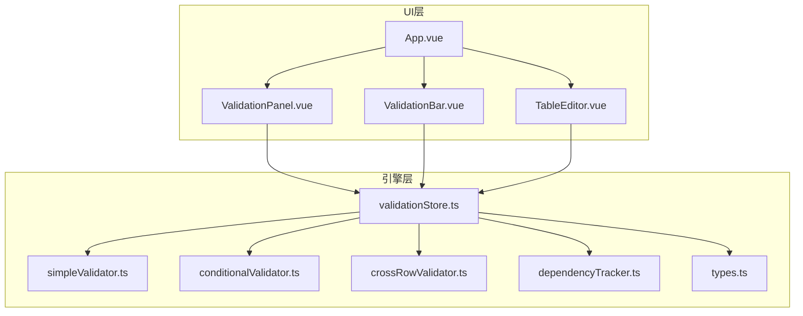
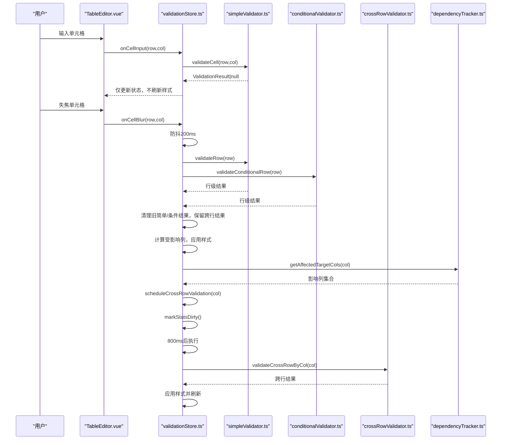
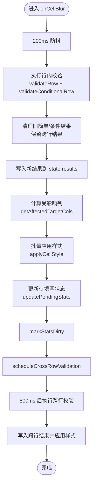
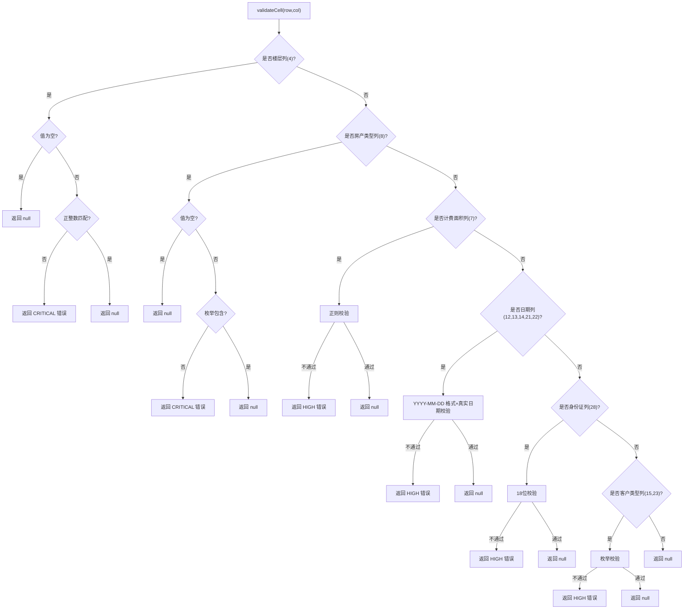
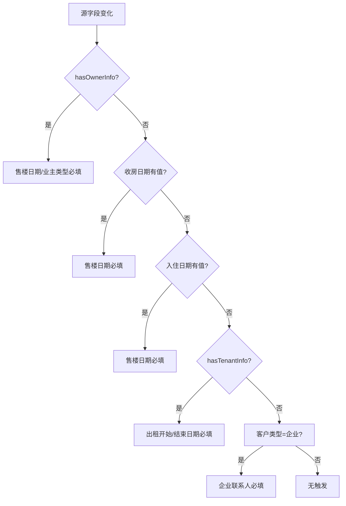
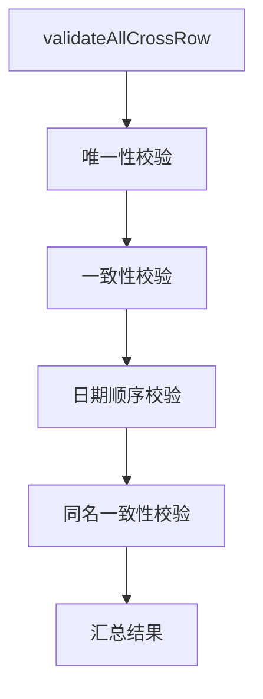
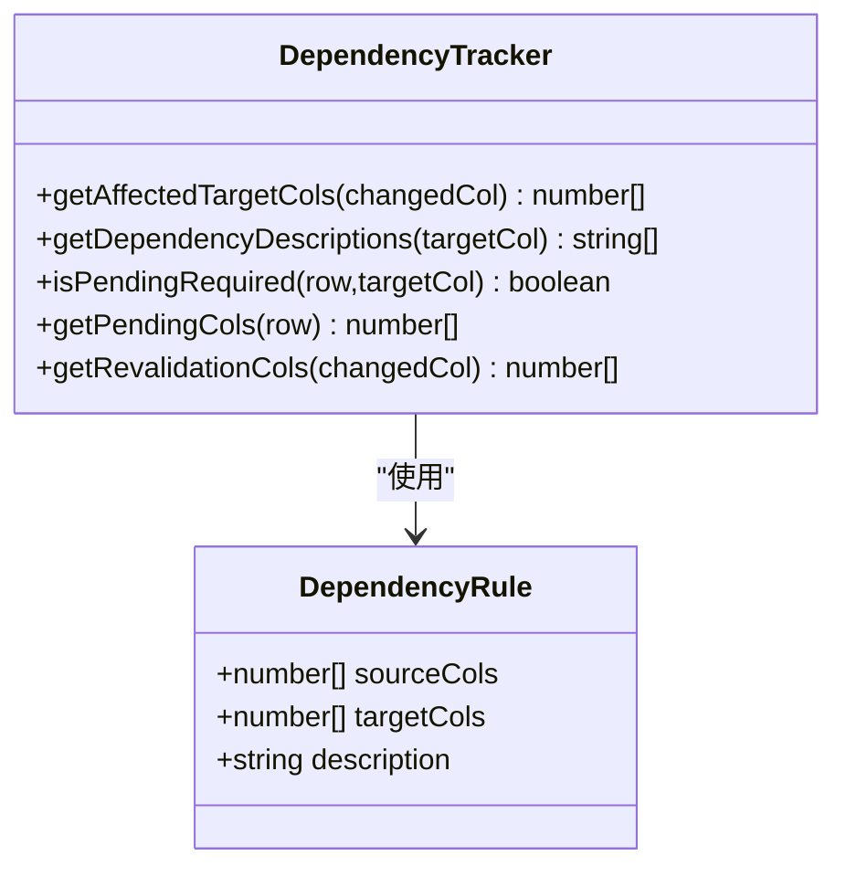
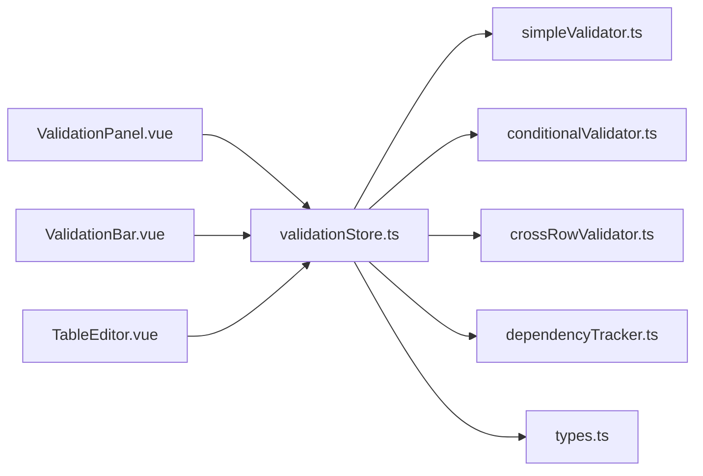

# 校验引擎系统

<cite>
**本文引用的文件**
- [validationStore.ts](file://src/engine/validationStore.ts)
- [simpleValidator.ts](file://src/engine/simpleValidator.ts)
- [conditionalValidator.ts](file://src/engine/conditionalValidator.ts)
- [crossRowValidator.ts](file://src/engine/crossRowValidator.ts)
- [dependencyTracker.ts](file://src/engine/dependencyTracker.ts)
- [types.ts](file://src/engine/types.ts)
- [ValidationPanel.vue](file://src/components/ValidationPanel.vue)
- [ValidationBar.vue](file://src/components/ValidationBar.vue)
- [TableEditor.vue](file://src/components/TableEditor.vue)
- [App.vue](file://src/App.vue)
- [index.ts](file://src/types/index.ts)
</cite>

## 目录
1. [简介](#简介)
2. [项目结构](#项目结构)
3. [核心组件](#核心组件)
4. [架构总览](#架构总览)
5. [详细组件分析](#详细组件分析)
6. [依赖关系分析](#依赖关系分析)
7. [性能考量](#性能考量)
8. [故障排查指南](#故障排查指南)
9. [结论](#结论)
10. [附录](#附录)

## 简介
本技术文档围绕 SmartForm 的校验引擎系统展开，重点解析 validationStore.ts 作为状态管理中心的设计模式、数据结构与调度机制；深入阐述四类校验器的实现原理：基础数据校验 simpleValidator.ts、条件触发校验 conditionalValidator.ts、跨行一致性检查 crossRowValidator.ts，以及数据关联分析 dependencyTracker.ts。文档还涵盖校验规则的定义方式、执行顺序、性能优化策略、错误处理机制、UI 样式应用与用户体验优化，并提供扩展接口与自定义校验器的开发指南。

## 项目结构
SmartForm 的校验引擎位于 src/engine 目录下，采用“分层职责 + 聚合调度”的组织方式：
- validationStore.ts：状态中心与调度中枢，负责缓存统计、样式批处理、防抖与跨行延迟执行、UI 样式应用与导出全量校验。
- simpleValidator.ts：基础规则集合，覆盖必填、格式（面积、日期、身份证、客户类型）等。
- conditionalValidator.ts：条件触发规则，基于依赖关系动态决定是否触发校验。
- crossRowValidator.ts：跨行一致性与唯一性校验，包括唯一性、客户信息一致性、日期顺序、同名客户联系信息一致性。
- dependencyTracker.ts：依赖关系追踪，计算受影响目标列、待填写状态判断与提示文案。
- types.ts：通用类型定义与消息净化。
- UI 层组件：ValidationPanel.vue（校验面板）、ValidationBar.vue（底部状态栏）、TableEditor.vue（编辑器与事件绑定）、App.vue（应用入口）。

图表来源
- [validationStore.ts:1-474](file://src/engine/validationStore.ts#L1-L474)
- [simpleValidator.ts:1-419](file://src/engine/simpleValidator.ts#L1-L419)
- [conditionalValidator.ts:1-325](file://src/engine/conditionalValidator.ts#L1-L325)
- [crossRowValidator.ts:1-276](file://src/engine/crossRowValidator.ts#L1-L276)
- [dependencyTracker.ts:1-158](file://src/engine/dependencyTracker.ts#L1-L158)
- [types.ts:1-48](file://src/engine/types.ts#L1-L48)
- [ValidationPanel.vue:1-438](file://src/components/ValidationPanel.vue#L1-L438)
- [ValidationBar.vue:1-64](file://src/components/ValidationBar.vue#L1-L64)
- [TableEditor.vue:1-399](file://src/components/TableEditor.vue#L1-L399)
- [App.vue:1-70](file://src/App.vue#L1-L70)

章节来源
- [validationStore.ts:1-474](file://src/engine/validationStore.ts#L1-L474)
- [simpleValidator.ts:1-419](file://src/engine/simpleValidator.ts#L1-L419)
- [conditionalValidator.ts:1-325](file://src/engine/conditionalValidator.ts#L1-L325)
- [crossRowValidator.ts:1-276](file://src/engine/crossRowValidator.ts#L1-L276)
- [dependencyTracker.ts:1-158](file://src/engine/dependencyTracker.ts#L1-L158)
- [types.ts:1-48](file://src/engine/types.ts#L1-L48)
- [ValidationPanel.vue:1-438](file://src/components/ValidationPanel.vue#L1-L438)
- [ValidationBar.vue:1-64](file://src/components/ValidationBar.vue#L1-L64)
- [TableEditor.vue:1-399](file://src/components/TableEditor.vue#L1-L399)
- [App.vue:1-70](file://src/App.vue#L1-L70)

## 核心组件
- validationStore.ts：状态中心，维护结果集、错误/警告计数、已填写/总行数、待处理单元格集合；提供 onCellInput/onCellBlur 的调度、跨行延迟执行、样式批处理与全量校验。
- simpleValidator.ts：基础规则库，按列定义必填与格式校验，支持单单元格即时校验与整行/全表校验。
- conditionalValidator.ts：条件触发规则，根据源字段状态动态决定目标字段是否必填。
- crossRowValidator.ts：跨行校验，包括唯一性、一致性、日期顺序与同名客户联系信息一致性。
- dependencyTracker.ts：依赖关系图，计算受影响目标列、待填写状态与提示文案。
- types.ts：统一的严重度、结果与规则类型，消息净化与术语替换。

章节来源
- [validationStore.ts:15-474](file://src/engine/validationStore.ts#L15-L474)
- [simpleValidator.ts:54-419](file://src/engine/simpleValidator.ts#L54-L419)
- [conditionalValidator.ts:17-325](file://src/engine/conditionalValidator.ts#L17-L325)
- [crossRowValidator.ts:17-276](file://src/engine/crossRowValidator.ts#L17-L276)
- [dependencyTracker.ts:7-158](file://src/engine/dependencyTracker.ts#L7-L158)
- [types.ts:1-48](file://src/engine/types.ts#L1-L48)

## 架构总览
校验引擎采用“事件驱动 + 分层调度”模式：
- 用户输入触发 onCellInput（即时格式校验，不触发布局样式变更）。
- 失焦触发 onCellBlur（防抖200ms，执行行内简单与条件校验，更新样式与待填写状态，延迟800ms执行跨行校验）。
- 跨行校验按列粒度延迟执行，避免全表扫描带来的卡顿。
- 统计与样式应用通过批处理与RAF优化，减少渲染抖动。
- 全量导出前运行 runFullValidation，统一收集并应用样式。

图表来源
- [validationStore.ts:248-344](file://src/engine/validationStore.ts#L248-L344)
- [simpleValidator.ts:327-375](file://src/engine/simpleValidator.ts#L327-L375)
- [conditionalValidator.ts:180-220](file://src/engine/conditionalValidator.ts#L180-L220)
- [crossRowValidator.ts:253-275](file://src/engine/crossRowValidator.ts#L253-L275)
- [dependencyTracker.ts:79-88](file://src/engine/dependencyTracker.ts#L79-L88)

## 详细组件分析

### validationStore.ts：状态中心与调度中枢
- 状态模型
  - 结果集：Map<单元格键, ValidationResult[]>，键为“行-列”字符串。
  - 统计：错误数、警告数、已填写行数、总行数。
  - 待处理单元格：Set<单元格键>，用于“待填写”高亮。
- 缓存与统计
  - statsDirty + requestAnimationFrame 合并统计更新，避免频繁遍历。
  - getFilledRowCount/getTotalRowCount 通过缓存的 sheet 数据计算。
- 样式批处理
  - styleBatch + setTimeout 合并样式设置，flushStyleBatch 合并刷新。
  - applyCellStyle/applyAllValidationStyles 区分“日常编辑”与“导出前全量”两种模式。
- 事件调度
  - onCellInput：清除旧结果，执行 validateCell，写入结果，不立即应用样式。
  - onCellBlur：200ms 防抖，执行 validateRow + validateConditionalRow，清理旧简单/条件结果，保留跨行结果，应用样式并更新待填写状态，随后延迟800ms执行跨行校验。
  - 跨行延迟：scheduleCrossRowValidation，按列聚合，避免全表扫描。
- 错误聚合与 UI
  - getWorstResult 从多规则中取最严重级别。
  - getCellErrors/getAllCellErrors 提供 UI 查询接口。
  - runFullValidation 在导出前统一执行三类校验，应用样式并更新统计。
- 清理与资源回收
  - cleanupTimers 清理所有定时器、批处理队列与 RAF。

图表来源
- [validationStore.ts:256-344](file://src/engine/validationStore.ts#L256-L344)

章节来源
- [validationStore.ts:15-474](file://src/engine/validationStore.ts#L15-L474)

### simpleValidator.ts：基础数据校验
- 数据访问与缓存
  - getCellText：安全获取单元格文本，处理空值与日期序列号转换。
  - invalidateDataCache/cacheVersion：数据变更时使缓存失效。
  - getFlowdata：兼容不同 Luckysheet API。
- 规则定义
  - 必填规则：项目名称、楼栋名称、房产简称、楼层、房号、房产类型。
  - 格式规则：计费面积（正数，最多4位小数）、日期（YYYY-MM-DD，严格校验）、身份证号（18位）、客户类型（个人/企业）。
- 接口
  - validateCell：ON_INPUT 仅校验格式类规则，空值不报错。
  - validateRow：执行一行所有简单规则。
  - validateAll：全表校验，分类错误与警告。
  - getFilledRowCount/getTotalRowCount：统计辅助。

图表来源
- [simpleValidator.ts:275-325](file://src/engine/simpleValidator.ts#L275-L325)

章节来源
- [simpleValidator.ts:1-419](file://src/engine/simpleValidator.ts#L1-L419)

### conditionalValidator.ts：条件触发校验
- 条件检测
  - hasOwnerInfo：业主客户名称/类型/电话任一有值。
  - hasTenantInfo：租户客户名称/电话/证件/出租开始日期任一有值。
  - isSaleDateRequired：有业主信息或收房/入住日期有值。
- 规则清单
  - 售楼日期必填（多种触发条件）
  - 业主客户类型必填（有业主信息）
  - 出租开始/结束日期必填（有租户信息）
  - 租户客户名称必填（出租开始或电话非空）
  - 企业联系人必填（客户类型=企业）
  - 租户企业联系人必填（租户客户类型=企业）
- 接口
  - validateConditionalRow：行内条件规则。
  - validateConditionalCell：针对特定列的条件校验。
  - validateConditionalAll：全表条件规则。

图表来源
- [conditionalValidator.ts:19-177](file://src/engine/conditionalValidator.ts#L19-L177)

章节来源
- [conditionalValidator.ts:1-325](file://src/engine/conditionalValidator.ts#L1-L325)

### crossRowValidator.ts：跨行一致性检查
- 唯一性：房产简称在项目内唯一，重复则标记错误。
- 客户信息一致性：同一证件号码对应不同租户名称，标记错误。
- 日期顺序：收房日期不得早于售楼日期。
- 同名客户一致性：同名业主/租户的联系方式与证件号码必须一致。
- 接口
  - validatePropertyNameUniqueness
  - validateCustomerConsistency
  - validateDateOrder
  - validateSameNameConsistency
  - validateAllCrossRow：执行所有跨行规则。
  - validateCrossRowByCol：按列粒度延迟执行。

图表来源
- [crossRowValidator.ts:244-251](file://src/engine/crossRowValidator.ts#L244-L251)

章节来源
- [crossRowValidator.ts:1-276](file://src/engine/crossRowValidator.ts#L1-L276)

### dependencyTracker.ts：数据关联分析
- 依赖规则定义：源列集合 → 目标列集合，附带描述文案。
- 反向索引：构建 sourceToRules，加速查询。
- 接口
  - getAffectedTargetCols：返回受影响目标列（去重）。
  - getDependencyDescriptions：为目标列返回依赖描述。
  - isPendingRequired：判断目标列是否处于“待填写”状态。
  - getPendingCols：返回某行所有“待填写”列。
  - getRevalidationCols：返回源列及受影响目标列集合。

图表来源
- [dependencyTracker.ts:7-158](file://src/engine/dependencyTracker.ts#L7-L158)

章节来源
- [dependencyTracker.ts:1-158](file://src/engine/dependencyTracker.ts#L1-L158)

### UI 集成与用户体验
- TableEditor.vue
  - hook.cellUpdated：输入时调用 onCellInput，轻量即时校验。
  - hook.cellMousedown：失焦时调用 onCellBlur，并延迟显示 tooltip。
  - Tooltip：展示单元格错误消息与严重度。
- ValidationPanel.vue
  - 统计概览：错误/警告/待填写数量。
  - 标签页：校验问题与待填写。
  - 导航：点击跳转到指定单元格。
  - 重新校验：runFullValidation + applyAllValidationStyles。
- ValidationBar.vue
  - 底部状态栏：已填写/总数、错误/警告/OK 状态。
- App.vue
  - 导出前调用 validateBeforeExport，必要时阻止导出。

章节来源
- [TableEditor.vue:102-127](file://src/components/TableEditor.vue#L102-L127)
- [TableEditor.vue:129-156](file://src/components/TableEditor.vue#L129-L156)
- [ValidationPanel.vue:98-201](file://src/components/ValidationPanel.vue#L98-L201)
- [ValidationBar.vue:22-64](file://src/components/ValidationBar.vue#L22-L64)
- [App.vue:29-40](file://src/App.vue#L29-L40)

## 依赖关系分析
- validationStore.ts 依赖 simpleValidator、conditionalValidator、crossRowValidator、dependencyTracker、types。
- UI 组件通过 useValidationStore 暴露的方法与 state 进行交互。
- 类型系统统一了严重度、结果与规则定义，便于扩展与维护。

图表来源
- [validationStore.ts:4-11](file://src/engine/validationStore.ts#L4-L11)
- [ValidationPanel.vue:101-102](file://src/components/ValidationPanel.vue#L101-L102)
- [ValidationBar.vue:23](file://src/components/ValidationBar.vue#L23)
- [TableEditor.vue:18](file://src/components/TableEditor.vue#L18)

章节来源
- [validationStore.ts:1-474](file://src/engine/validationStore.ts#L1-L474)
- [ValidationPanel.vue:1-438](file://src/components/ValidationPanel.vue#L1-L438)
- [ValidationBar.vue:1-64](file://src/components/ValidationBar.vue#L1-L64)
- [TableEditor.vue:1-399](file://src/components/TableEditor.vue#L1-L399)

## 性能考量
- 防抖与节流
  - onCellBlur 200ms 防抖，避免频繁校验。
  - 跨行校验 800ms 延迟，降低全表扫描频率。
- 批处理与合并刷新
  - 样式批处理队列 + setTimeout 合并刷新，最后一次性 setCellFormat。
  - requestAnimationFrame 合并统计更新，避免多次遍历。
- 缓存与懒加载
  - getFlowdata 缓存 sheet 数据，invalidateDataCache 使缓存失效。
  - 仅在需要时读取 Luckysheet API，减少调用次数。
- 选择性执行
  - validateCrossRowByCol 按列粒度执行，避免全表扫描。
  - getAffectedTargetCols 仅对受影响列应用样式。
- UI 优化
  - 导出前 runFullValidation + applyAllValidationStyles，一次性应用样式，避免逐单元格刷新。

章节来源
- [validationStore.ts:238-344](file://src/engine/validationStore.ts#L238-L344)
- [simpleValidator.ts:13-25](file://src/engine/simpleValidator.ts#L13-L25)

## 故障排查指南
- 校验不生效
  - 确认 TableEditor.vue 的 hook.cellUpdated 与 cellMousedown 是否正确调用 onCellInput/onCellBlur。
  - 检查 validationStore.cleanupTimers 是否在组件卸载时被调用。
- 样式异常
  - 检查 applyCellStyle/applyAllValidationStyles 的 useSpaceHack 参数与 Luckysheet API 是否可用。
  - 确认 styleBatch 队列是否被及时 flush。
- 跨行校验未触发
  - 检查 dependencyTracker.getAffectedTargetCols 是否返回正确的受影响列。
  - 确认 scheduleCrossRowValidation 的列参数与 validateCrossRowByCol 的分支逻辑。
- 性能问题
  - 检查 requestAnimationFrame 与 setTimeout 是否被正确取消。
  - 避免在高频事件中直接调用全表校验，优先使用行内或列内校验。

章节来源
- [TableEditor.vue:102-127](file://src/components/TableEditor.vue#L102-L127)
- [validationStore.ts:456-465](file://src/engine/validationStore.ts#L456-L465)
- [dependencyTracker.ts:79-88](file://src/engine/dependencyTracker.ts#L79-L88)

## 结论
SmartForm 的校验引擎通过 validationStore.ts 将基础、条件与跨行三类校验有机整合，采用事件驱动与分层调度，结合缓存、批处理与延迟执行等策略，实现了高性能与良好用户体验。UI 层通过 ValidationPanel 与 ValidationBar 提供直观的统计与导航能力。该设计易于扩展，可通过新增规则与依赖关系快速迭代业务校验需求。

## 附录

### 校验规则定义与扩展指南
- 规则类型与字段
  - Severity：CRITICAL/HIGH/MEDIUM。
  - ValidationResult：包含 isValid、ruleId、severity、message、row、col。
  - ValidationRule：包含 ruleId、description、severity、columns、hasTriggers。
- 新增规则步骤
  - 在 simpleValidator.ts 中添加 validateXxx 函数，返回 ValidationResult|null。
  - 在 validateRow 中调用新规则并加入 results。
  - 若为条件触发规则，参考 conditionalValidator.ts 的模式，定义条件检测与 validateConditionalXxx。
  - 若为跨行规则，参考 crossRowValidator.ts 的模式，实现 validateXxxByCol 并在 validateAllCrossRow 中聚合。
  - 在 dependencyTracker.ts 中为相关列建立依赖关系，以便联动校验与“待填写”提示。
- 消息净化
  - 使用 sanitizeMessage 对规则消息进行术语替换，提升用户可读性。

章节来源
- [types.ts:14-47](file://src/engine/types.ts#L14-L47)
- [simpleValidator.ts:327-375](file://src/engine/simpleValidator.ts#L327-L375)
- [conditionalValidator.ts:180-220](file://src/engine/conditionalValidator.ts#L180-L220)
- [crossRowValidator.ts:244-275](file://src/engine/crossRowValidator.ts#L244-L275)
- [dependencyTracker.ts:17-61](file://src/engine/dependencyTracker.ts#L17-L61)

### UI 样式应用与用户体验优化
- 样式策略
  - 正常：浅灰色边框与白色背景；待填写：浅黄边框与浅黄背景；错误：红色边框与浅红背景。
  - useSpaceHack：在导出前对空单元格填充空格占位符，避免样式丢失。
- 交互优化
  - Tooltip：点击单元格显示错误详情与严重度。
  - 导航：点击面板条目跳转到对应单元格。
  - 统计：底部状态栏实时显示错误/警告/待填写数量。

章节来源
- [validationStore.ts:157-236](file://src/engine/validationStore.ts#L157-L236)
- [ValidationPanel.vue:172-200](file://src/components/ValidationPanel.vue#L172-L200)
- [ValidationBar.vue:22-64](file://src/components/ValidationBar.vue#L22-L64)