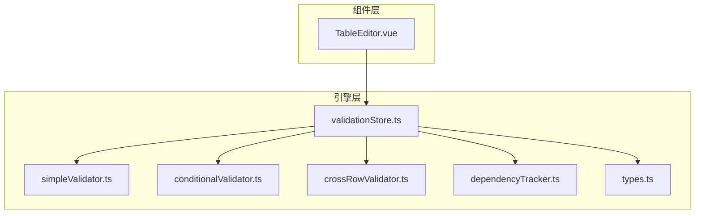
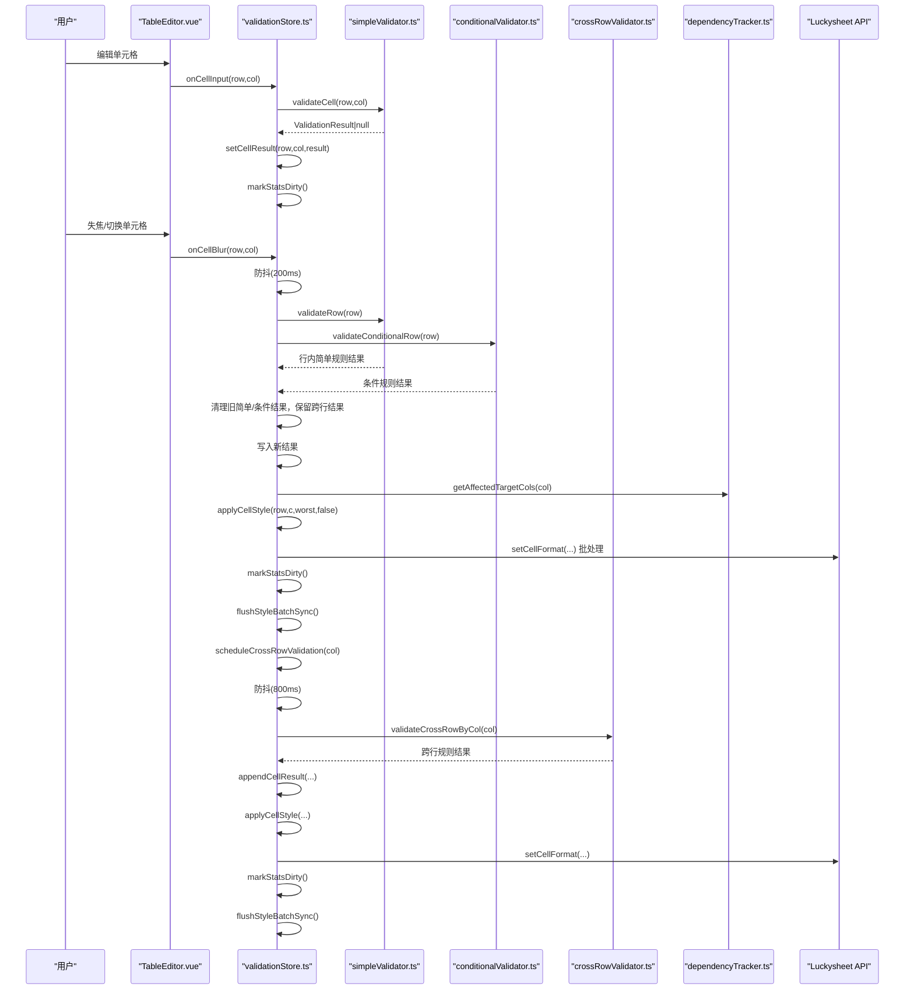
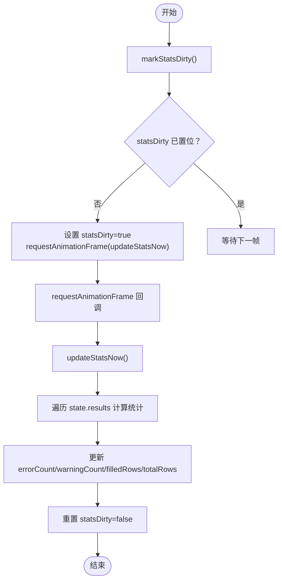
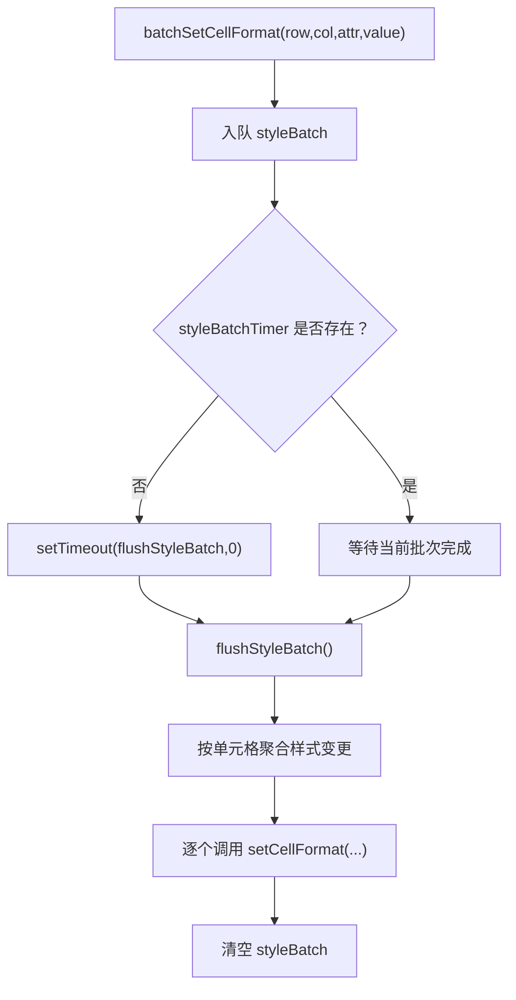
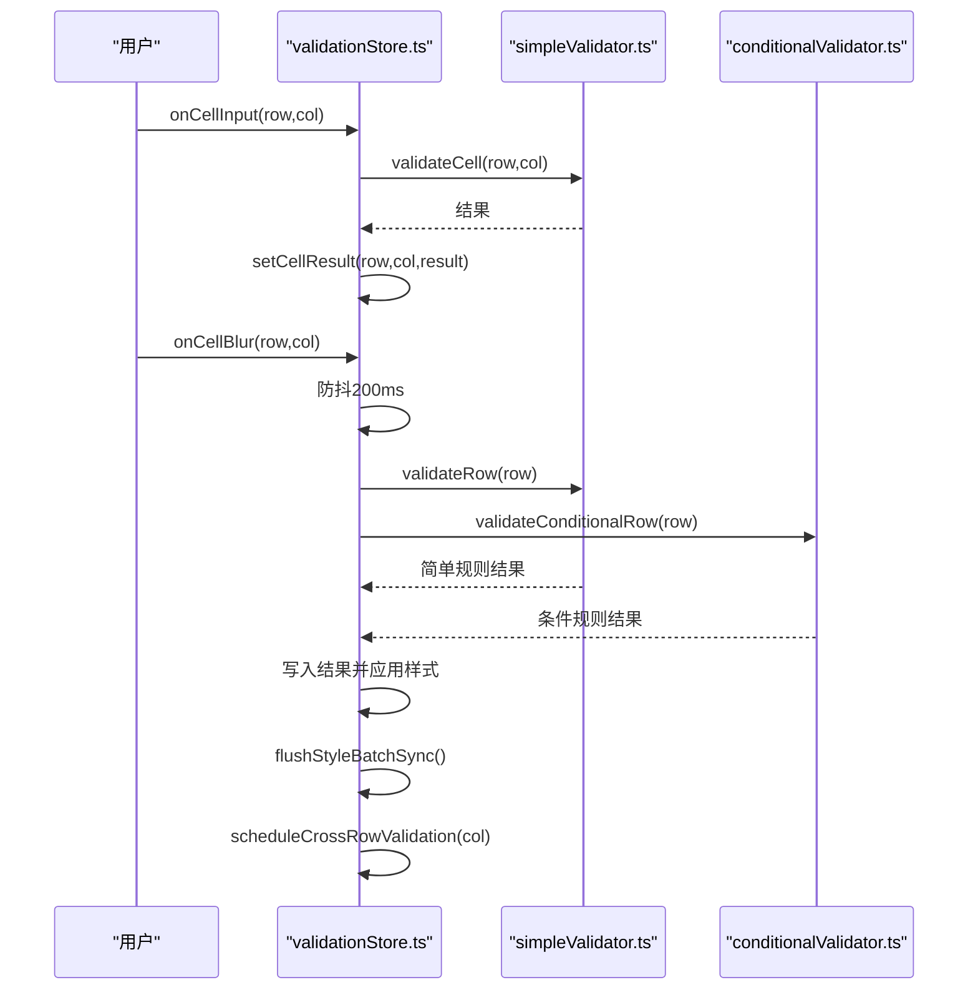
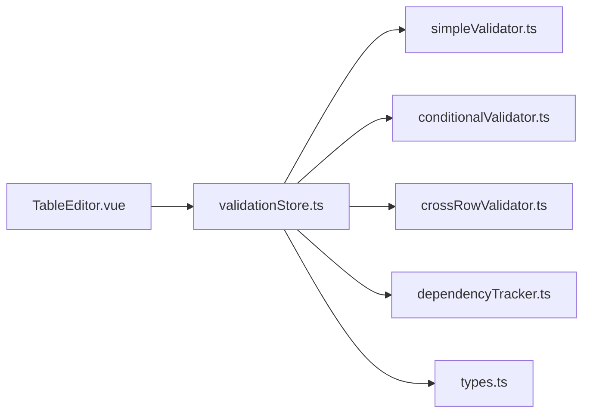

# 校验状态管理核心

<cite>
**本文引用的文件**
- [validationStore.ts](file://src/engine/validationStore.ts)
- [simpleValidator.ts](file://src/engine/simpleValidator.ts)
- [conditionalValidator.ts](file://src/engine/conditionalValidator.ts)
- [crossRowValidator.ts](file://src/engine/crossRowValidator.ts)
- [dependencyTracker.ts](file://src/engine/dependencyTracker.ts)
- [types.ts](file://src/engine/types.ts)
- [TableEditor.vue](file://src/components/TableEditor.vue)
</cite>

## 目录
1. [简介](#简介)
2. [项目结构](#项目结构)
3. [核心组件](#核心组件)
4. [架构总览](#架构总览)
5. [详细组件分析](#详细组件分析)
6. [依赖关系分析](#依赖关系分析)
7. [性能考量](#性能考量)
8. [故障排查指南](#故障排查指南)
9. [结论](#结论)
10. [附录](#附录)

## 简介
本文件聚焦 SmartForm 的校验状态管理核心，围绕 validationStore.ts 展开，系统化阐述以下主题：
- reactive 状态对象设计与 Map 存储结构
- cellKey 生成机制与键空间组织
- 统计缓存系统（statsDirty + requestAnimationFrame）的节流策略
- 错误计数统计、填充行数与总行数计算
- 样式批处理系统（batchSetCellFormat、flushStyleBatch）的异步应用策略
- 防抖机制（onCellInput vs onCellBlur 的差异）
- 跨行校验的延迟执行策略与依赖追踪联动
- 内存清理机制（cleanupTimers）与资源回收
- 最佳实践与性能优化建议

## 项目结构
SmartForm 的校验体系采用“引擎 + 组件”的分层设计：
- 引擎层负责纯逻辑校验与状态管理，包含 validationStore.ts、simpleValidator.ts、conditionalValidator.ts、crossRowValidator.ts、dependencyTracker.ts、types.ts
- 组件层负责与 Luckysheet 的交互与 UI 展示，如 TableEditor.vue

图表来源
- [validationStore.ts:1-474](file://src/engine/validationStore.ts#L1-L474)
- [simpleValidator.ts:1-419](file://src/engine/simpleValidator.ts#L1-L419)
- [conditionalValidator.ts:1-325](file://src/engine/conditionalValidator.ts#L1-L325)
- [crossRowValidator.ts:1-276](file://src/engine/crossRowValidator.ts#L1-L276)
- [dependencyTracker.ts:1-158](file://src/engine/dependencyTracker.ts#L1-L158)
- [types.ts:1-48](file://src/engine/types.ts#L1-L48)
- [TableEditor.vue:1-399](file://src/components/TableEditor.vue#L1-L399)

章节来源
- [validationStore.ts:1-474](file://src/engine/validationStore.ts#L1-L474)
- [TableEditor.vue:1-399](file://src/components/TableEditor.vue#L1-L399)

## 核心组件
本节从状态模型、数据结构、流程控制三个维度解析 validationStore.ts 的关键实现。

- 状态模型
  - reactive 状态对象 state：包含 results（Map）、errorCount、warningCount、filledRows、totalRows、pendingCells（Set）
  - 作用：集中管理校验结果、统计信息与待填写状态，供 UI 与样式应用消费

- 数据结构
  - results：Map<string, ValidationResult[]>，键为 cellKey(row,col)，值为该单元格的多规则校验结果集合
  - pendingCells：Set<string>，记录处于“依赖触发的待填写”状态的单元格键
  - 统计缓存：statsDirty + requestAnimationFrame，避免频繁遍历与昂贵的数据读取

- 流程控制
  - onCellInput/onCellBlur：区分即时格式校验与失焦全量校验
  - 跨行校验延迟执行：scheduleCrossRowValidation + executeCrossRowValidation
  - 样式批处理：batchSetCellFormat + flushStyleBatch，合并 Luckysheet API 调用
  - 内存清理：cleanupTimers，统一撤销防抖、跨行校验、样式批处理与统计刷新

章节来源
- [validationStore.ts:15-22](file://src/engine/validationStore.ts#L15-L22)
- [validationStore.ts:65-95](file://src/engine/validationStore.ts#L65-L95)
- [validationStore.ts:240-315](file://src/engine/validationStore.ts#L240-L315)
- [validationStore.ts:317-344](file://src/engine/validationStore.ts#L317-L344)
- [validationStore.ts:97-148](file://src/engine/validationStore.ts#L97-L148)
- [validationStore.ts:454-465](file://src/engine/validationStore.ts#L454-L465)

## 架构总览
下图展示从用户输入到最终样式应用的端到端流程，以及各模块间的依赖关系。

图表来源
- [validationStore.ts:240-315](file://src/engine/validationStore.ts#L240-L315)
- [validationStore.ts:317-344](file://src/engine/validationStore.ts#L317-L344)
- [simpleValidator.ts:275-325](file://src/engine/simpleValidator.ts#L275-L325)
- [conditionalValidator.ts:183-220](file://src/engine/conditionalValidator.ts#L183-L220)
- [crossRowValidator.ts:256-275](file://src/engine/crossRowValidator.ts#L256-L275)
- [dependencyTracker.ts:79-88](file://src/engine/dependencyTracker.ts#L79-L88)
- [TableEditor.vue:108-124](file://src/components/TableEditor.vue#L108-L124)

## 详细组件分析

### reactive 状态对象与 Map 存储
- 设计要点
  - 使用 Vue reactive 包裹 state，确保响应式更新
  - results 采用 Map<string, ValidationResult[]>，键为 cellKey(row,col)，便于 O(1) 查找与批量更新
  - pendingCells 采用 Set<string>，快速判断“待填写”状态
  - errorCount/warningCount/filledRows/totalRows 作为派生状态，通过统计缓存统一刷新

- 复杂度与性能
  - 单次写入：setCellResult/appendCellResult/setRowResults 均为 O(1) 平摊
  - 统计刷新：updateStatsNow 遍历 state.results，复杂度 O(N)；通过 requestAnimationFrame 合并刷新，避免频繁重排

章节来源
- [validationStore.ts:15-22](file://src/engine/validationStore.ts#L15-L22)
- [validationStore.ts:44-57](file://src/engine/validationStore.ts#L44-L57)

### cellKey 生成机制与键空间组织
- 生成规则：`${row}-${col}`，保证唯一性与可逆性
- 使用场景
  - 作为 Map 的键，定位单元格结果
  - 作为 Set 的成员，标识待填写单元格
  - 在样式批处理与全量样式应用中，用于还原行列坐标

章节来源
- [validationStore.ts:24-26](file://src/engine/validationStore.ts#L24-L26)
- [validationStore.ts:61-95](file://src/engine/validationStore.ts#L61-L95)
- [validationStore.ts:117-135](file://src/engine/validationStore.ts#L117-L135)

### 统计缓存系统（statsDirty + requestAnimationFrame）
- 目标：避免频繁遍历 state.results 与昂贵的 getSheetData 调用
- 机制
  - statsDirty 标记脏位，首次标记时注册 requestAnimationFrame 回调
  - updateStatsNow 一次性计算 errorCount、warningCount、filledRows、totalRows
  - 下次渲染帧再触发，确保多次变更合并为一次统计刷新

图表来源
- [validationStore.ts:30-42](file://src/engine/validationStore.ts#L30-L42)
- [validationStore.ts:44-57](file://src/engine/validationStore.ts#L44-L57)

章节来源
- [validationStore.ts:30-42](file://src/engine/validationStore.ts#L30-L42)
- [validationStore.ts:44-57](file://src/engine/validationStore.ts#L44-L57)

### 校验结果存储结构与错误计数统计
- 存储结构
  - Map<string, ValidationResult[]>：按单元格聚合多规则结果
  - ValidationResult 包含 isValid、ruleId、severity、message、row、col
- 错误计数统计
  - updateStatsNow 遍历 results，按 severity 分类累加
  - 严重度映射：CRITICAL=错误，其余=警告
- 行数统计
  - filledRows：通过 getFilledRowCount 计算非空行数
  - totalRows：通过 getTotalRowCount 计算总行数（不含表头）

章节来源
- [validationStore.ts:44-57](file://src/engine/validationStore.ts#L44-L57)
- [types.ts:4-12](file://src/engine/types.ts#L4-L12)
- [simpleValidator.ts:397-418](file://src/engine/simpleValidator.ts#L397-L418)

### 样式批处理系统（batchSetCellFormat、flushStyleBatch）
- 目标：减少 Luckysheet.setCellFormat 调用次数，提升渲染性能
- 机制
  - batchSetCellFormat：将样式变更入队至 styleBatch，并在 0ms setTimeout 中触发 flushStyleBatch
  - flushStyleBatch：合并同单元格的边框与背景色变更，最后统一刷新
  - flushStyleBatchSync：同步刷新，用于需要立即反馈的场景（如导出前）
  - cancelStyleBatch：取消待执行的样式批处理
- 应用策略
  - 日常编辑：applyCellStyle(false) 不使用空格占位，避免 undo 堆积
  - 导出前：applyAllValidationStyles(true) 使用空格占位，确保空单元格可见

图表来源
- [validationStore.ts:99-148](file://src/engine/validationStore.ts#L99-L148)
- [validationStore.ts:157-236](file://src/engine/validationStore.ts#L157-L236)

章节来源
- [validationStore.ts:99-148](file://src/engine/validationStore.ts#L99-L148)
- [validationStore.ts:157-236](file://src/engine/validationStore.ts#L157-L236)

### 防抖机制：onCellInput vs onCellBlur
- onCellInput（输入时）
  - 仅执行 validateCell（格式类规则），不调用 applyCellStyle
  - 保持 UI 无闪烁，仅维护状态
- onCellBlur（失焦时）
  - 防抖 200ms，合并连续失焦
  - 执行 validateRow + validateConditionalRow，清理旧简单/条件结果，保留跨行结果
  - 应用样式并同步刷新，随后延迟执行跨行校验（800ms 防抖）

图表来源
- [validationStore.ts:240-315](file://src/engine/validationStore.ts#L240-L315)
- [simpleValidator.ts:327-375](file://src/engine/simpleValidator.ts#L327-L375)
- [conditionalValidator.ts:183-220](file://src/engine/conditionalValidator.ts#L183-L220)

章节来源
- [validationStore.ts:240-315](file://src/engine/validationStore.ts#L240-L315)

### 跨行校验的延迟执行策略
- 触发点：onCellBlur 完成行内校验后，scheduleCrossRowValidation(col)
- 延迟策略：800ms 防抖，合并同一列的跨行校验请求
- 执行策略：executeCrossRowValidation(col) 清理旧跨行结果，写入新结果并应用样式
- 规则范围：根据列映射执行唯一性、一致性、日期顺序、同名客户一致性等跨行规则

章节来源
- [validationStore.ts:317-344](file://src/engine/validationStore.ts#L317-L344)
- [crossRowValidator.ts:244-275](file://src/engine/crossRowValidator.ts#L244-L275)

### 依赖追踪与“待填写”状态
- 依赖关系：dependencyTracker 定义源列→目标列的依赖规则
- 影响列计算：getAffectedTargetCols(changedCol) 返回受影响的目标列集合
- “待填写”判定：isPendingRequired(row,col) 根据依赖规则与源字段值判断是否触发
- 样式应用：updatePendingState 将处于“待填写”状态的单元格添加到 pendingCells，并应用特定样式

章节来源
- [dependencyTracker.ts:79-129](file://src/engine/dependencyTracker.ts#L79-L129)
- [validationStore.ts:371-383](file://src/engine/validationStore.ts#L371-L383)

### 内存清理机制（cleanupTimers）
- 目标：防止定时器泄漏与未完成的批处理导致资源占用
- 清理项：onCellBlur 防抖定时器、跨行校验定时器、样式批处理定时器、统计刷新 rAF
- 调用时机：组件卸载时由 TableEditor.vue 调用 cleanupTimers

章节来源
- [validationStore.ts:454-465](file://src/engine/validationStore.ts#L454-L465)
- [TableEditor.vue:319-328](file://src/components/TableEditor.vue#L319-L328)

## 依赖关系分析
- validationStore.ts 依赖 simpleValidator.ts（基础规则与行/列统计）、conditionalValidator.ts（条件规则）、crossRowValidator.ts（跨行规则）、dependencyTracker.ts（依赖追踪）、types.ts（类型定义）
- 组件 TableEditor.vue 通过 useValidationStore() 注入校验能力，绑定 Luckysheet 的 cellUpdated/cellMousedown 钩子，驱动 onCellInput/onCellBlur

图表来源
- [validationStore.ts:1-12](file://src/engine/validationStore.ts#L1-L12)
- [TableEditor.vue:18-22](file://src/components/TableEditor.vue#L18-L22)

章节来源
- [validationStore.ts:1-12](file://src/engine/validationStore.ts#L1-L12)
- [TableEditor.vue:18-22](file://src/components/TableEditor.vue#L18-L22)

## 性能考量
- 状态写入与统计刷新
  - 使用 Map 存储结果，O(1) 查找与更新
  - 统计刷新通过 requestAnimationFrame 合并，避免每写入一次就遍历
- 样式批处理
  - 合并同单元格的多次样式变更，减少 Luckysheet API 调用
  - 仅在必要时同步刷新（如导出前），日常编辑使用异步批处理
- 防抖与延迟执行
  - onCellBlur 200ms 防抖，合并连续失焦
  - 跨行校验 800ms 延迟，避免高频列（如日期列）引发的连锁校验风暴
- 数据缓存
  - simpleValidator.ts 提供数据缓存与版本号，降低重复读取成本
- UI 交互
  - 输入时仅维护状态，不触发样式更新，减少渲染压力

[本节为通用性能讨论，不直接分析具体代码文件]

## 故障排查指南
- 样式未生效
  - 检查是否使用了同步刷新（flushStyleBatchSync）或导出前的全量样式应用（applyAllValidationStyles）
  - 确认 Luckysheet 实例可用（window.luckysheet）
- 统计不准确
  - 确认 markStatsDirty 已被调用（setCellResult/appendCellResult/setRowResults）
  - 检查 requestAnimationFrame 是否被取消（cleanupTimers）
- 跨行校验未触发
  - 检查 scheduleCrossRowValidation 是否被调用
  - 确认 validateCrossRowByCol 的列映射是否覆盖目标列
- 内存泄漏
  - 组件卸载时调用 cleanupTimers，确保所有定时器与批处理被清理
- 依赖触发异常
  - 检查 dependencyTracker 的依赖规则与 isPendingRequired 的判定逻辑

章节来源
- [validationStore.ts:454-465](file://src/engine/validationStore.ts#L454-L465)
- [crossRowValidator.ts:256-275](file://src/engine/crossRowValidator.ts#L256-L275)
- [dependencyTracker.ts:108-129](file://src/engine/dependencyTracker.ts#L108-L129)

## 结论
validationStore.ts 通过 reactive 状态、Map 存储、统计缓存与样式批处理，构建了高性能、可维护的校验状态管理框架。配合防抖与延迟执行策略，有效平衡了用户体验与系统性能。依赖追踪与“待填写”状态进一步增强了业务语义表达。建议在实际工程中遵循本文最佳实践，持续优化批处理粒度与缓存策略，确保大规模数据下的稳定表现。

[本节为总结性内容，不直接分析具体代码文件]

## 附录
- 类型定义参考：Severity、ValidationResult、CellError、Term 替换与消息净化
- 组件集成参考：TableEditor.vue 中的 useValidationStore 注入与 Hook 绑定

章节来源
- [types.ts:1-48](file://src/engine/types.ts#L1-L48)
- [TableEditor.vue:18-22](file://src/components/TableEditor.vue#L18-L22)