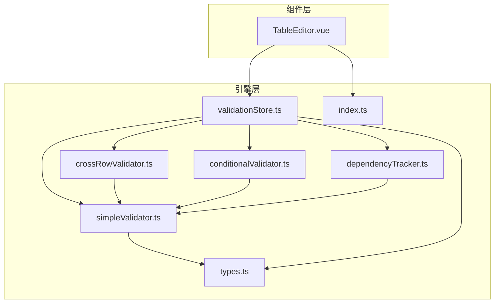
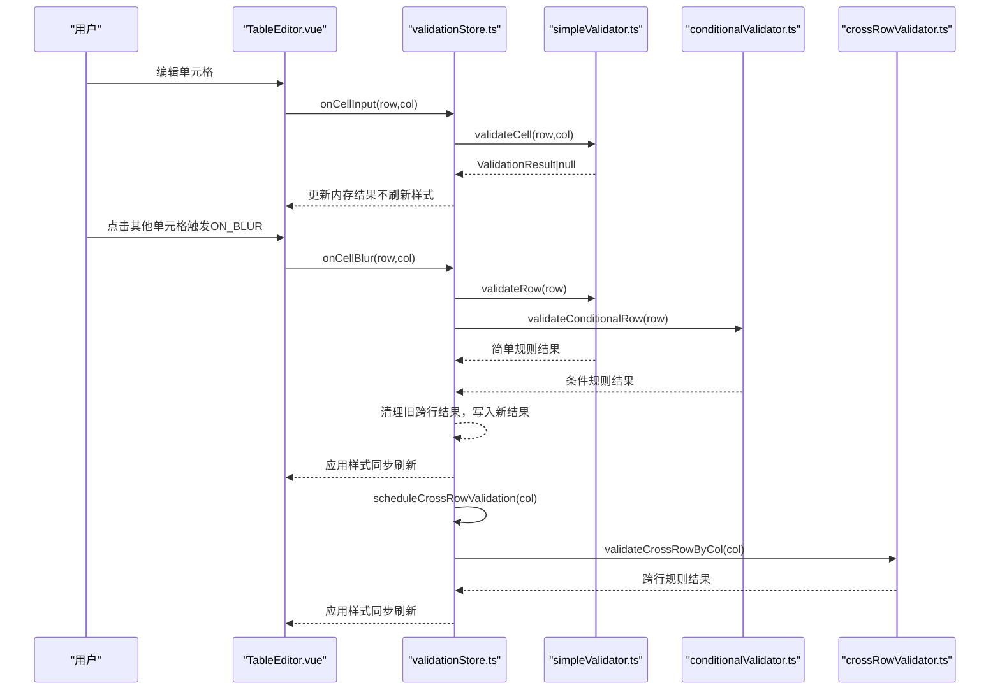
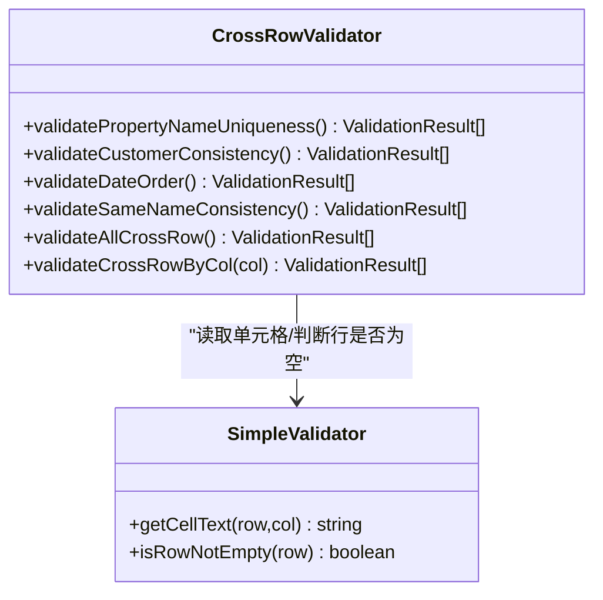
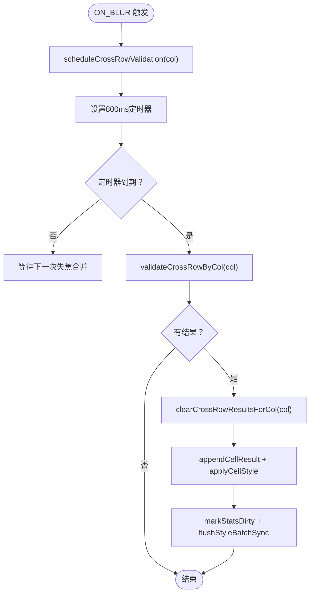
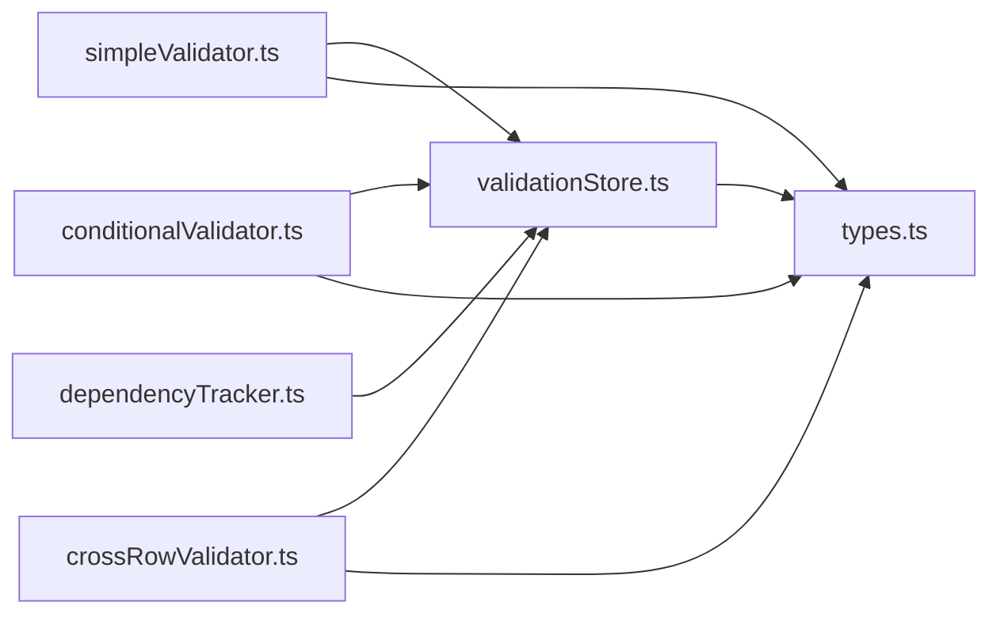

# 跨行数据校验器

<cite>
**本文引用的文件**
- [crossRowValidator.ts](file://src/engine/crossRowValidator.ts)
- [validationStore.ts](file://src/engine/validationStore.ts)
- [simpleValidator.ts](file://src/engine/simpleValidator.ts)
- [conditionalValidator.ts](file://src/engine/conditionalValidator.ts)
- [dependencyTracker.ts](file://src/engine/dependencyTracker.ts)
- [types.ts](file://src/engine/types.ts)
- [index.ts](file://src/types/index.ts)
- [TableEditor.vue](file://src/components/TableEditor.vue)
</cite>

## 目录
1. [简介](#简介)
2. [项目结构](#项目结构)
3. [核心组件](#核心组件)
4. [架构总览](#架构总览)
5. [详细组件分析](#详细组件分析)
6. [依赖关系分析](#依赖关系分析)
7. [性能考量](#性能考量)
8. [故障排查指南](#故障排查指南)
9. [结论](#结论)
10. [附录](#附录)

## 简介
本技术文档聚焦 SmartForm 的跨行数据校验器，系统性阐述 crossRowValidator.ts 的跨行一致性检查机制，包括唯一性验证、数据关联性检查、时间序列验证等跨行校验规则；解释 validateCrossRowByCol 与 validateAllCrossRow 的实现差异及按列触发与全表扫描两种执行策略；覆盖大数据集的性能优化、内存控制与并发校验处理；提供常见跨行校验场景的实现思路与最佳实践，并说明延迟执行机制、与其他校验器的协同工作方式以及错误结果的缓存与更新策略。

## 项目结构
SmartForm 的校验体系采用分层设计：
- 表单引擎层：包含跨行校验器、简单校验器、条件校验器、依赖追踪器与状态存储。
- 组件层：TableEditor.vue 作为入口，绑定 Luckysheet 并驱动校验流程。
- 类型与配置：types.ts 定义通用类型，index.ts 提供表头列定义与列索引映射。

图表来源
- [TableEditor.vue:102-126](file://src/components/TableEditor.vue#L102-L126)
- [validationStore.ts:1-12](file://src/engine/validationStore.ts#L1-L12)
- [crossRowValidator.ts:1-6](file://src/engine/crossRowValidator.ts#L1-L6)
- [simpleValidator.ts:1-6](file://src/engine/simpleValidator.ts#L1-L6)
- [conditionalValidator.ts:1-6](file://src/engine/conditionalValidator.ts#L1-L6)
- [dependencyTracker.ts:1-5](file://src/engine/dependencyTracker.ts#L1-L5)
- [types.ts:1-48](file://src/engine/types.ts#L1-L48)
- [index.ts:44-79](file://src/types/index.ts#L44-L79)

章节来源
- [TableEditor.vue:102-126](file://src/components/TableEditor.vue#L102-L126)
- [validationStore.ts:1-12](file://src/engine/validationStore.ts#L1-L12)
- [crossRowValidator.ts:1-6](file://src/engine/crossRowValidator.ts#L1-L6)
- [simpleValidator.ts:1-6](file://src/engine/simpleValidator.ts#L1-L6)
- [conditionalValidator.ts:1-6](file://src/engine/conditionalValidator.ts#L1-L6)
- [dependencyTracker.ts:1-5](file://src/engine/dependencyTracker.ts#L1-L5)
- [types.ts:1-48](file://src/engine/types.ts#L1-L48)
- [index.ts:44-79](file://src/types/index.ts#L44-L79)

## 核心组件
- 跨行校验器：提供唯一性、一致性、日期顺序等跨行规则的实现。
- 状态存储与调度：负责防抖、延迟执行、样式批处理、统计更新与清理。
- 简单/条件校验器：分别处理格式/必填/枚举类规则与条件依赖规则。
- 依赖追踪器：根据源列变化推导受影响的目标列，辅助“待填写”状态与联动校验。
- 类型系统：统一的校验结果、严重度、消息清洗与列定义。

章节来源
- [crossRowValidator.ts:17-276](file://src/engine/crossRowValidator.ts#L17-L276)
- [validationStore.ts:13-474](file://src/engine/validationStore.ts#L13-L474)
- [simpleValidator.ts:54-419](file://src/engine/simpleValidator.ts#L54-L419)
- [conditionalValidator.ts:17-325](file://src/engine/conditionalValidator.ts#L17-L325)
- [dependencyTracker.ts:7-158](file://src/engine/dependencyTracker.ts#L7-L158)
- [types.ts:1-48](file://src/engine/types.ts#L1-L48)

## 架构总览
跨行校验在用户交互中遵循“输入即时校验 + 失焦延迟校验”的双通道策略：
- 输入阶段（ON_INPUT）：仅执行简单规则，快速反馈，不触碰 Luckysheet API。
- 失焦阶段（ON_BLUR）：执行简单与条件规则，保留跨行结果，随后延迟触发跨行校验，合并样式更新。

图表来源
- [TableEditor.vue:108-124](file://src/components/TableEditor.vue#L108-L124)
- [validationStore.ts:248-344](file://src/engine/validationStore.ts#L248-L344)
- [simpleValidator.ts:275-325](file://src/engine/simpleValidator.ts#L275-L325)
- [conditionalValidator.ts:183-220](file://src/engine/conditionalValidator.ts#L183-L220)
- [crossRowValidator.ts:256-275](file://src/engine/crossRowValidator.ts#L256-L275)

## 详细组件分析

### 跨行校验器（crossRowValidator.ts）
- 功能职责
  - 房产简称唯一性：遍历所有行，统计“房产简称”出现次数，重复即报错。
  - 客户信息一致性：同一“租户证件号码”对应不同“租户客户名称”时报错。
  - 日期先后顺序：收房日期不得早于售楼日期。
  - 同名客户联系信息一致性：同名“业主/租户”的电话必须一致；租户还需证件号码一致。
  - 全量与按列触发：validateAllCrossRow 执行全部跨行规则；validateCrossRowByCol 依据列触发相关规则。

- 数据流与复杂度
  - getFlowdata 从 Luckysheet 获取二维数据，避免重复创建数组。
  - Map 结构用于分组统计，时间复杂度 O(R)，空间复杂度 O(R)（R 为有效行数）。
  - 日期顺序使用字符串比较（YYYY-MM-DD），保证字典序与真实日期一致。
  - 同名一致性分别维护“业主/租户”两类映射，逐行填充并二次校验。

- 错误结果模型
  - 使用统一的 ValidationResult 接口，包含规则标识、严重度、消息与行列坐标。

章节来源
- [crossRowValidator.ts:17-276](file://src/engine/crossRowValidator.ts#L17-L276)
- [types.ts:4-12](file://src/engine/types.ts#L4-L12)

#### 类图：跨行规则与调用关系

图表来源
- [crossRowValidator.ts:17-276](file://src/engine/crossRowValidator.ts#L17-L276)
- [simpleValidator.ts:27-52](file://src/engine/simpleValidator.ts#L27-L52)

### 状态存储与调度（validationStore.ts）
- 核心状态
  - results: Map<cellKey, ValidationResult[]> 存储每个单元格的多条校验结果。
  - errorCount/warningCount/filledRows/totalRows：统计信息，使用 requestAnimationFrame 延迟更新。
  - pendingCells: Set<cellKey> 标记“待填写”状态的单元格。

- 防抖与延迟执行
  - onCellInput：即时校验简单规则，仅更新内存，不刷新样式。
  - onCellBlur：执行简单与条件规则，保留跨行结果，同步刷新样式；随后 scheduleCrossRowValidation 延迟执行跨行校验。
  - 跨行延迟：800ms 定时器，合并多次失焦触发，避免频繁全表扫描。

- 样式批处理
  - batchSetCellFormat 与 flushStyleBatch 将样式变更批量提交，减少 Luckysheet 刷新次数。
  - applyAllValidationStyles 在全量校验时一次性应用样式，支持空格占位以保证渲染一致性。

- 结果清理与更新
  - clearCrossRowResultsForCol：仅清理指定列的跨行结果，保留简单/条件结果。
  - getWorstResult：按严重度优先级选择单元格最差结果，决定最终样式。

- 全量校验
  - runFullValidation：清理定时器，执行简单/条件/跨行全量校验，计算统计并应用样式。

章节来源
- [validationStore.ts:13-474](file://src/engine/validationStore.ts#L13-L474)

#### 流程图：跨行延迟执行

图表来源
- [validationStore.ts:317-344](file://src/engine/validationStore.ts#L317-L344)

### 简单/条件校验器与依赖追踪
- 简单校验器（simpleValidator.ts）
  - 仅执行格式/必填/枚举类规则，ON_INPUT 时使用，不访问跨行数据。
  - 提供 getCellText、isRowNotEmpty、validateCell/validateRow/validateAll 等接口。
  - 日期列、证件号码列、客户类型列等均集中定义，便于扩展。

- 条件校验器（conditionalValidator.ts）
  - 基于源列状态动态触发目标列的必填/一致性规则。
  - 通过 hasOwnerInfo、hasTenantInfo、isSaleDateRequired 等函数判断触发条件。

- 依赖追踪器（dependencyTracker.ts）
  - 定义源列→目标列的依赖规则集合，构建反向索引，支持查询受影响目标列。
  - 提供 isPendingRequired/getPendingCols/getRevalidationCols 等工具，用于“待填写”状态与联动校验。

章节来源
- [simpleValidator.ts:54-419](file://src/engine/simpleValidator.ts#L54-L419)
- [conditionalValidator.ts:17-325](file://src/engine/conditionalValidator.ts#L17-L325)
- [dependencyTracker.ts:7-158](file://src/engine/dependencyTracker.ts#L7-L158)

#### 依赖关系图

图表来源
- [validationStore.ts:1-12](file://src/engine/validationStore.ts#L1-L12)
- [simpleValidator.ts:1-6](file://src/engine/simpleValidator.ts#L1-L6)
- [conditionalValidator.ts:1-6](file://src/engine/conditionalValidator.ts#L1-L6)
- [crossRowValidator.ts:1-6](file://src/engine/crossRowValidator.ts#L1-L6)
- [dependencyTracker.ts:1-5](file://src/engine/dependencyTracker.ts#L1-L5)
- [types.ts:1-48](file://src/engine/types.ts#L1-L48)

### 实现差异：validateCrossRowByCol vs validateAllCrossRow
- validateAllCrossRow
  - 顺序执行所有跨行规则，适合全量校验与导出前检查。
  - 优点：覆盖全面，逻辑清晰。
  - 缺点：对大数据集全表扫描成本高。

- validateCrossRowByCol
  - 仅针对特定列触发相关规则，降低扫描范围。
  - 优点：响应更快，资源占用更少。
  - 缺点：若列间存在隐含依赖，可能遗漏部分问题。

章节来源
- [crossRowValidator.ts:241-275](file://src/engine/crossRowValidator.ts#L241-L275)
- [validationStore.ts:333-344](file://src/engine/validationStore.ts#L333-L344)

### 常见跨行校验场景与实现思路
- 房产唯一性检查
  - 触发列：房产简称（列6）
  - 思路：遍历有效行，统计“房产简称”出现次数，重复即报错。
  - 注意：需结合 isRowNotEmpty 过滤空行，避免误判。

- 客户信息一致性验证
  - 触发列：租户证件号码（列28）
  - 思路：建立“证件号码→客户名称”的映射，若同一证件对应多个不同名称，则报错。

- 日期顺序校验
  - 触发列：售楼日期（列12）、收房日期（列13）
  - 思路：YYYY-MM-DD 字符串比较，确保收房日期≥售楼日期。

- 同名客户联系信息一致性
  - 触发列：业主电话（列18）、租户电话（列25）、租户证件号码（列28）
  - 思路：同名“业主/租户”需保持电话一致；租户还需证件号码一致。

章节来源
- [crossRowValidator.ts:17-239](file://src/engine/crossRowValidator.ts#L17-L239)
- [index.ts:44-79](file://src/types/index.ts#L44-L79)

## 依赖关系分析
- 组件耦合
  - crossRowValidator 依赖 simpleValidator 的单元格读取与行判空能力。
  - validationStore 统一编排三类校验器，负责调度、缓存与样式应用。
  - dependencyTracker 为条件校验与“待填写”状态提供依赖关系支撑。

- 外部依赖
  - Luckysheet API：通过 getSheetData/flowdata/getCellValue/setCellFormat 等接口读写数据与样式。
  - Vue 响应式：使用 reactive 管理状态，配合 requestAnimationFrame 与定时器实现异步更新。

- 潜在循环依赖
  - 当前模块间为单向依赖（校验器→工具），未见循环。

章节来源
- [crossRowValidator.ts:1-6](file://src/engine/crossRowValidator.ts#L1-L6)
- [validationStore.ts:1-12](file://src/engine/validationStore.ts#L1-L12)
- [simpleValidator.ts:1-6](file://src/engine/simpleValidator.ts#L1-L6)
- [dependencyTracker.ts:1-5](file://src/engine/dependencyTracker.ts#L1-L5)

## 性能考量
- 时间复杂度
  - 跨行规则普遍为 O(R) 扫描，R 为有效行数；Map 分组统计 O(R)。
  - validateAllCrossRow 为多规则串联，整体 O(k·R)，k 为规则数。

- 内存使用
  - Map 结构存储分组信息，内存与唯一值数量成正比。
  - results 为每单元格结果列表，内存与错误总数成正比。

- 优化策略
  - 按列触发：优先使用 validateCrossRowByCol，仅扫描相关列影响范围内的行。
  - 批量样式：使用 batchSetCellFormat 与 flushStyleBatch，减少 Luckysheet 刷新次数。
  - 延迟执行：800ms 合并多次失焦，避免频繁全表扫描。
  - 统计懒更新：requestAnimationFrame 合并统计更新，降低主线程压力。
  - 缓存与清理：invalidateDataCache 与 cleanupTimers 防止内存泄漏。

- 并发与线程
  - JavaScript 单线程，校验在主线程执行；通过 requestAnimationFrame 与定时器避免阻塞 UI。
  - 大数据集建议：
    - 导出前使用全量校验（runFullValidation）。
    - 日常编辑使用按列触发与延迟执行。
    - 若数据量极大，可考虑分页/分片校验或服务端校验。

章节来源
- [validationStore.ts:28-57](file://src/engine/validationStore.ts#L28-L57)
- [validationStore.ts:98-149](file://src/engine/validationStore.ts#L98-L149)
- [validationStore.ts:317-344](file://src/engine/validationStore.ts#L317-L344)
- [validationStore.ts:454-465](file://src/engine/validationStore.ts#L454-L465)

## 故障排查指南
- 现象：跨行校验结果未显示或样式异常
  - 检查 onCellBlur 是否被触发（ON_BLUR 防抖 200ms，跨行延迟 800ms）。
  - 确认 validateCrossRowByCol 是否按列正确触发。
  - 查看 applyCellStyle 与 flushStyleBatch 是否正常执行。

- 现象：全量校验后样式未应用
  - 确认 runFullValidation 是否调用 applyAllValidationStyles。
  - 检查 state.results 是否正确写入，getWorstResult 是否返回最差结果。

- 现象：性能下降或卡顿
  - 检查是否存在过多定时器未清理，调用 cleanupTimers。
  - 评估是否频繁触发全量跨行校验，建议改为按列触发。

- 现象：跨行规则未覆盖某些场景
  - 检查 validateCrossRowByCol 的列触发映射是否完整。
  - 若存在隐含依赖，考虑在 validationStore 中扩展联动逻辑。

章节来源
- [validationStore.ts:255-344](file://src/engine/validationStore.ts#L255-L344)
- [validationStore.ts:408-452](file://src/engine/validationStore.ts#L408-L452)
- [validationStore.ts:456-465](file://src/engine/validationStore.ts#L456-L465)

## 结论
crossRowValidator 通过明确的规则边界与与 validationStore 的协作，实现了高效、可扩展的跨行一致性校验。validateCrossRowByCol 与 validateAllCrossRow 的差异化设计兼顾了实时性与完整性。配合防抖、延迟执行、样式批处理与统计懒更新，系统在大数据集下仍能保持良好的用户体验。建议在实际业务中结合列触发策略与全量校验策略，按场景选择最优执行路径，并持续监控内存与性能指标。

## 附录
- 术语与列定义参考
  - 表头列定义与列索引映射详见 index.ts。
  - 校验结果与严重度定义详见 types.ts。

章节来源
- [index.ts:44-79](file://src/types/index.ts#L44-L79)
- [types.ts:1-48](file://src/engine/types.ts#L1-L48)