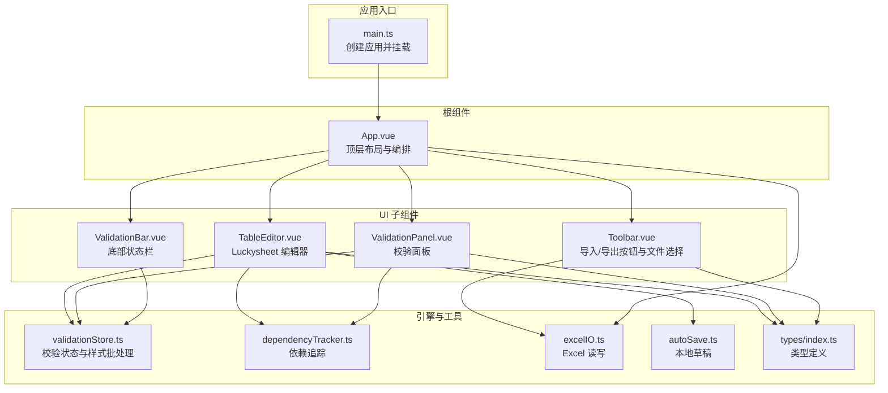
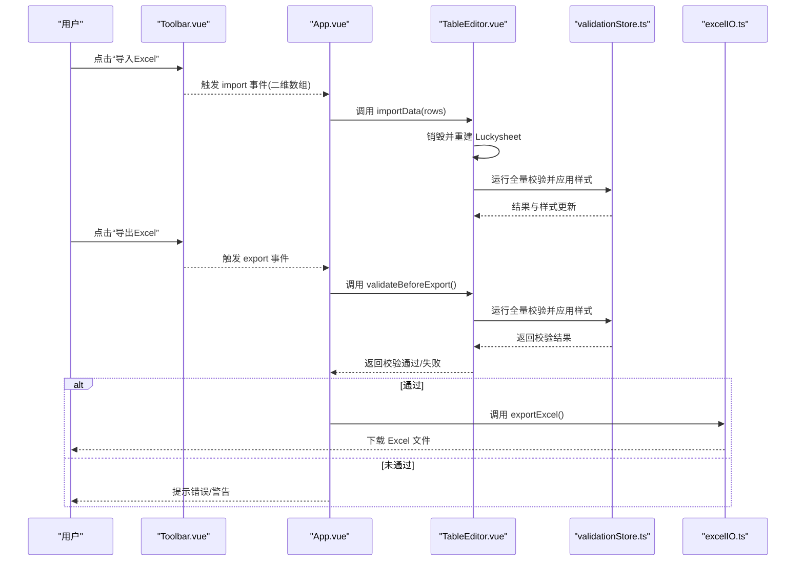
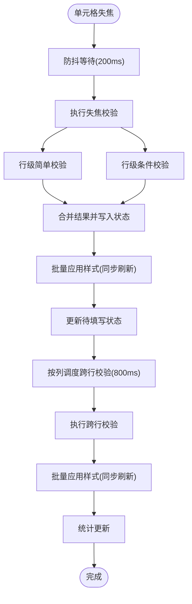
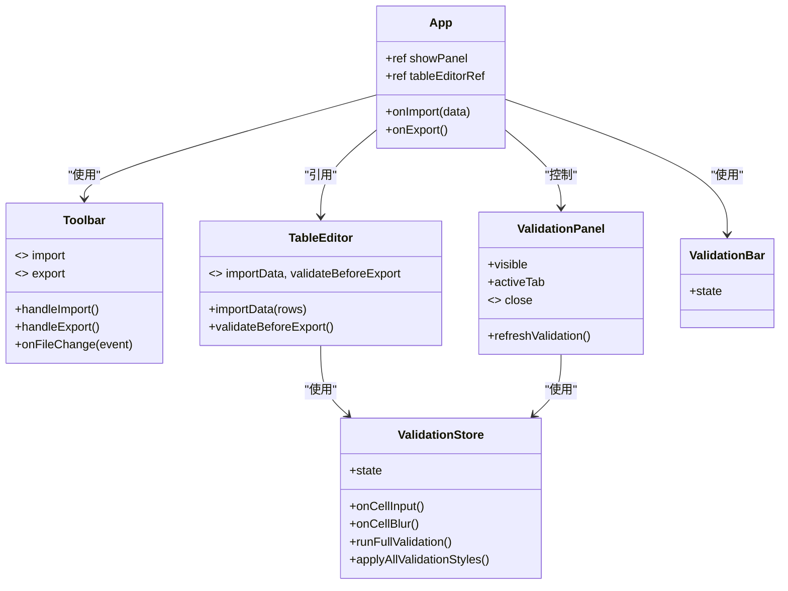
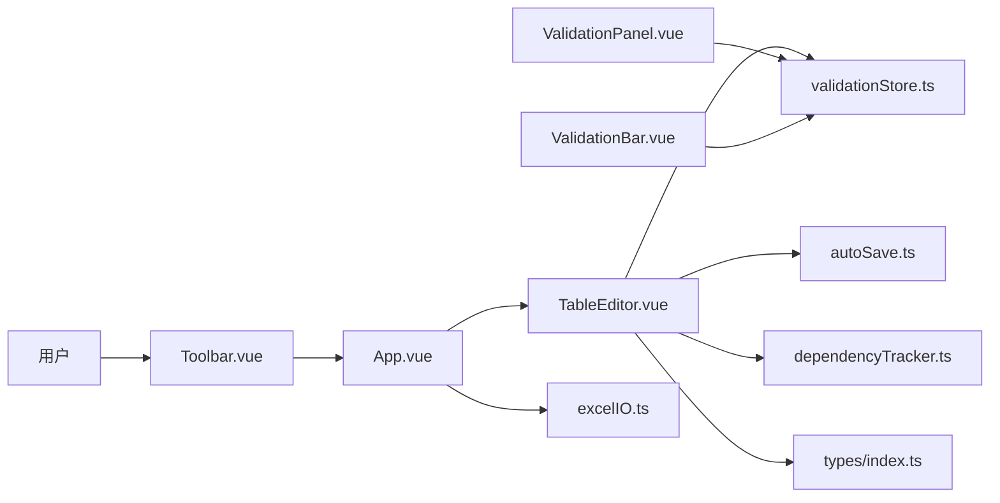

# App 根组件

<cite>
**本文引用的文件**
- [App.vue](file://src/App.vue)
- [main.ts](file://src/main.ts)
- [TableEditor.vue](file://src/components/TableEditor.vue)
- [Toolbar.vue](file://src/components/Toolbar.vue)
- [ValidationPanel.vue](file://src/components/ValidationPanel.vue)
- [ValidationBar.vue](file://src/components/ValidationBar.vue)
- [validationStore.ts](file://src/engine/validationStore.ts)
- [excelIO.ts](file://src/utils/excelIO.ts)
- [autoSave.ts](file://src/utils/autoSave.ts)
- [dependencyTracker.ts](file://src/engine/dependencyTracker.ts)
- [index.ts](file://src/types/index.ts)
</cite>

## 目录
1. [简介](#简介)
2. [项目结构](#项目结构)
3. [核心组件](#核心组件)
4. [架构总览](#架构总览)
5. [详细组件分析](#详细组件分析)
6. [依赖关系分析](#依赖关系分析)
7. [性能考量](#性能考量)
8. [故障排查指南](#故障排查指南)
9. [结论](#结论)
10. [附录](#附录)

## 简介
本文件为 SmartForm 的根组件 App.vue 的深度技术文档。App.vue 作为应用入口与编排中心，负责组织顶层布局、协调子组件协作、管理响应式状态与事件流，并与底层引擎（校验存储、依赖追踪、Excel IO、自动保存）紧密耦合。本文将系统阐述其整体架构、模板结构、响应式数据管理、事件处理机制、样式设计、组件间通信模式、数据流向与状态管理策略，并提供初始化过程、生命周期管理与最佳实践建议。

## 项目结构
SmartForm 采用基于功能域的模块化组织方式，根组件位于 src/App.vue，主要子组件集中在 src/components 下，业务逻辑与状态管理位于 src/engine，通用工具位于 src/utils，类型定义位于 src/types。应用通过 Vite 构建，入口在 src/main.ts 中创建 Vue 应用实例并挂载到 DOM。

图表来源
- [main.ts:1-9](file://src/main.ts#L1-L9)
- [App.vue:1-70](file://src/App.vue#L1-L70)
- [Toolbar.vue:1-83](file://src/components/Toolbar.vue#L1-L83)
- [TableEditor.vue:1-399](file://src/components/TableEditor.vue#L1-L399)
- [ValidationPanel.vue:1-438](file://src/components/ValidationPanel.vue#L1-L438)
- [ValidationBar.vue:1-64](file://src/components/ValidationBar.vue#L1-L64)
- [validationStore.ts:1-474](file://src/engine/validationStore.ts#L1-L474)
- [dependencyTracker.ts:1-158](file://src/engine/dependencyTracker.ts#L1-L158)
- [excelIO.ts:1-105](file://src/utils/excelIO.ts#L1-L105)
- [autoSave.ts:1-71](file://src/utils/autoSave.ts#L1-L71)
- [index.ts:1-79](file://src/types/index.ts#L1-L79)

章节来源
- [main.ts:1-9](file://src/main.ts#L1-L9)
- [App.vue:1-70](file://src/App.vue#L1-L70)

## 核心组件
- 根容器与布局：App.vue 提供垂直布局容器，包含顶部工具栏、主编辑区（表格编辑器与校验面板）、底部校验状态栏。
- 顶层状态：使用响应式布尔值控制校验面板可见性；通过模板引用访问表格编辑器实例，实现父子通信。
- 顶层事件：接收来自工具栏的导入/导出事件，处理导出前的全量校验与样式应用。
- 样式体系：全局重置与根容器样式，保证全屏与自适应布局；各子组件使用 scoped 样式隔离。

章节来源
- [App.vue:1-70](file://src/App.vue#L1-L70)

## 架构总览
App.vue 作为顶层编排者，承担以下职责：
- 布局与路由：通过 Flex 布局划分工具栏、主编辑区与状态栏。
- 事件编排：将工具栏的导入/导出事件转发至表格编辑器或导出工具。
- 状态协调：通过响应式变量驱动校验面板的显示/隐藏。
- 生命周期与资源清理：与表格编辑器共享生命周期钩子，确保自动保存、事件监听与校验定时器的正确释放。

图表来源
- [App.vue:29-39](file://src/App.vue#L29-L39)
- [Toolbar.vue:27-56](file://src/components/Toolbar.vue#L27-L56)
- [TableEditor.vue:239-273](file://src/components/TableEditor.vue#L239-L273)
- [validationStore.ts:408-452](file://src/engine/validationStore.ts#L408-L452)
- [excelIO.ts:61-104](file://src/utils/excelIO.ts#L61-L104)

## 详细组件分析

### App.vue：根组件架构与职责
- 模板结构
  - 顶部工具栏：承载标题、导入/导出按钮与插槽扩展（如“校验面板”按钮）。
  - 主编辑区：包含表格编辑器与校验面板，采用 Flex 布局使编辑器占满剩余空间。
  - 底部校验状态栏：展示填写行数、错误/警告数量与状态提示。
- 响应式数据
  - showPanel：控制校验面板显隐。
  - tableEditorRef：模板引用，指向表格编辑器实例，用于调用其公开方法。
- 事件处理
  - 导入：接收工具栏 import 事件，调用表格编辑器的 importData 方法。
  - 导出：接收工具栏 export 事件，先调用 validateBeforeExport 进行全量校验与样式应用，再执行导出。
- 样式设计
  - 全局重置与根容器高度/宽度设置，确保全屏适配。
  - 主编辑区使用 Flex 布局，相对定位与溢出隐藏，保证表格渲染区域稳定。
- 组件通信
  - 父子通信：App.vue 通过 props 控制校验面板可见性；通过模板引用调用子组件公开方法。
  - 事件通信：Toolbar.vue 通过自定义事件向上冒泡，App.vue 接收并处理。
- 生命周期与资源管理
  - 与 TableEditor.vue 共享生命周期：App.vue 作为顶层容器，TableEditor.vue 负责自动保存、事件监听与校验定时器的启动与清理。
- 最佳实践
  - 使用模板引用而非全局状态传递复杂实例。
  - 将导出前校验与样式应用封装在子组件内，保持根组件职责单一。
  - 通过插槽扩展工具栏按钮，增强可维护性与可扩展性。

章节来源
- [App.vue:1-70](file://src/App.vue#L1-L70)

### Toolbar.vue：导入/导出入口
- 功能概述
  - 提供标题、导入/导出按钮与隐藏的文件输入框。
  - 导入：打开文件选择对话框，读取 Excel 并解析为二维数组，通过事件发射给父组件。
  - 导出：触发 export 事件，交由父组件处理。
- 事件与数据流
  - emit('import', data)：将解析后的数据传给父组件。
  - emit('export')：通知父组件执行导出流程。
- 与 App.vue 的交互
  - App.vue 监听 import 事件并调用表格编辑器的 importData。
  - App.vue 监听 export 事件并执行导出前校验与导出。

章节来源
- [Toolbar.vue:1-83](file://src/components/Toolbar.vue#L1-L83)
- [excelIO.ts:10-56](file://src/utils/excelIO.ts#L10-L56)

### TableEditor.vue：表格编辑器与校验引擎集成
- 功能概述
  - 基于 Luckysheet 的可视化表格编辑器，支持表头构建、列宽配置、单元格样式与 Tooltip 展示。
  - 集成校验引擎：在单元格输入/失焦时进行即时/延迟校验，支持跨行校验与依赖追踪。
  - 自动保存：周期性保存草稿到 localStorage，并在启动时恢复。
  - 导出前校验：运行全量校验并弹窗提示错误/警告，决定是否允许导出。
- 关键流程
  - 初始化：根据表头与可选数据构建初始数据，创建 Luckysheet 实例。
  - 输入校验：onCellInput 调用校验引擎记录结果，不立即应用样式。
  - 失焦校验：onCellBlur 防抖执行，合并简单/条件校验，应用样式并调度跨行校验。
  - 跨行校验：按列延迟执行，更新受影响列的样式与状态。
  - 导出前校验：runFullValidation + applyAllValidationStyles，弹窗提示并返回结果。
- 与 App.vue 的交互
  - 暴露 importData 与 validateBeforeExport 两个方法，供父组件调用。
  - 通过模板引用访问实例，实现父子方法调用。

图表来源
- [TableEditor.vue:108-125](file://src/components/TableEditor.vue#L108-L125)
- [validationStore.ts:256-344](file://src/engine/validationStore.ts#L256-L344)

章节来源
- [TableEditor.vue:1-399](file://src/components/TableEditor.vue#L1-L399)
- [validationStore.ts:1-474](file://src/engine/validationStore.ts#L1-L474)

### ValidationPanel.vue：校验面板
- 功能概述
  - 展示错误/警告统计与待填写项，支持按行分组与标签页切换。
  - 提供导航到单元格、重新校验等功能。
- 与引擎的交互
  - 读取 validationStore.state 的响应式状态，计算错误分组与待填写列表。
  - 调用 runFullValidation 与 applyAllValidationStyles 触发全量校验与样式应用。
  - 通过依赖追踪获取“待填写”的原因描述。
- 与 App.vue 的交互
  - 通过 visible prop 控制显示/隐藏；通过 close 事件通知父组件关闭面板。

章节来源
- [ValidationPanel.vue:1-438](file://src/components/ValidationPanel.vue#L1-L438)
- [validationStore.ts:408-452](file://src/engine/validationStore.ts#L408-L452)
- [dependencyTracker.ts:94-101](file://src/engine/dependencyTracker.ts#L94-L101)

### ValidationBar.vue：底部状态栏
- 功能概述
  - 展示已填写行数/总行数、警告与错误数量，以及无问题状态提示。
- 与引擎的交互
  - 直接读取 validationStore.state 的统计字段，实现响应式更新。

章节来源
- [ValidationBar.vue:1-64](file://src/components/ValidationBar.vue#L1-L64)
- [validationStore.ts:44-57](file://src/engine/validationStore.ts#L44-L57)

### 类关系图（代码级）

图表来源
- [App.vue:18-40](file://src/App.vue#L18-L40)
- [Toolbar.vue:27-56](file://src/components/Toolbar.vue#L27-L56)
- [TableEditor.vue:294-297](file://src/components/TableEditor.vue#L294-L297)
- [ValidationPanel.vue:105-106](file://src/components/ValidationPanel.vue#L105-L106)
- [ValidationBar.vue:22-24](file://src/components/ValidationBar.vue#L22-L24)
- [validationStore.ts:15-22](file://src/engine/validationStore.ts#L15-L22)

## 依赖关系分析
- 组件耦合
  - App.vue 与子组件之间为弱耦合：通过事件与模板引用进行松散耦合。
  - TableEditor.vue 与 validationStore.ts 强耦合：直接调用校验与样式应用函数。
  - ValidationPanel.vue 与 validationStore.ts/dependencyTracker.ts 强耦合：读取状态与依赖描述。
- 外部依赖
  - Luckysheet：作为表格渲染与交互的核心库，App.vue 通过 TableEditor.vue 间接使用。
  - Element Plus：图标与消息提示组件，用于导入/导出交互与提示。
  - xlsx 与 file-saver：Excel 读写与下载。
  - dayjs：时间格式化。
- 数据流向
  - 用户操作（导入/导出）经由 Toolbar.vue 传递至 App.vue。
  - App.vue 将导入数据交给 TableEditor.vue，或将导出请求交给导出工具。
  - TableEditor.vue 内部通过 validationStore.ts 进行校验与样式应用，状态变更通过响应式系统驱动 ValidationPanel.vue 与 ValidationBar.vue 更新。

图表来源
- [App.vue:3-14](file://src/App.vue#L3-L14)
- [Toolbar.vue:1-83](file://src/components/Toolbar.vue#L1-L83)
- [TableEditor.vue:1-399](file://src/components/TableEditor.vue#L1-L399)
- [ValidationPanel.vue:1-438](file://src/components/ValidationPanel.vue#L1-L438)
- [ValidationBar.vue:1-64](file://src/components/ValidationBar.vue#L1-L64)
- [validationStore.ts:1-474](file://src/engine/validationStore.ts#L1-L474)
- [excelIO.ts:1-105](file://src/utils/excelIO.ts#L1-L105)
- [autoSave.ts:1-71](file://src/utils/autoSave.ts#L1-L71)
- [dependencyTracker.ts:1-158](file://src/engine/dependencyTracker.ts#L1-L158)
- [index.ts:1-79](file://src/types/index.ts#L1-L79)

## 性能考量
- 样式批处理：validationStore.ts 对样式更新进行批处理与同步刷新，减少多次 setCellFormat 调用带来的性能开销。
- 防抖与延迟：失焦校验与跨行校验均采用防抖与延迟策略，避免频繁重绘与重复计算。
- 统计缓存：使用 requestAnimationFrame 合并统计更新，降低频繁遍历 sheet 数据的成本。
- 自动保存：30 秒间隔保存草稿，避免高频写入 localStorage。
- 导出优化：导出前一次性应用样式，避免逐单元格更新。

章节来源
- [validationStore.ts:99-148](file://src/engine/validationStore.ts#L99-L148)
- [validationStore.ts:238-344](file://src/engine/validationStore.ts#L238-L344)
- [validationStore.ts:30-57](file://src/engine/validationStore.ts#L30-L57)
- [TableEditor.vue:275-291](file://src/components/TableEditor.vue#L275-L291)
- [autoSave.ts:4-14](file://src/utils/autoSave.ts#L4-L14)

## 故障排查指南
- 导入失败
  - 现象：导入按钮点击后无响应或报错。
  - 排查：确认文件选择对话框是否正常弹出；检查 readExcelFile 的异常分支与 Element Plus 的消息提示。
  - 相关文件：[Toolbar.vue:38-52](file://src/components/Toolbar.vue#L38-L52)，[excelIO.ts:10-56](file://src/utils/excelIO.ts#L10-L56)
- 导出被阻断
  - 现象：点击导出后弹窗提示错误或警告，无法导出。
  - 排查：查看 validateBeforeExport 的错误/警告统计与弹窗逻辑；确认用户是否选择了继续导出。
  - 相关文件：[TableEditor.vue:239-273](file://src/components/TableEditor.vue#L239-L273)
- 校验面板不显示
  - 现象：点击“校验面板”按钮无反应。
  - 排查：确认 showPanel 的双向绑定与按钮点击事件；检查 ValidationPanel.vue 的 visible prop 与过渡动画。
  - 相关文件：[App.vue:5-7](file://src/App.vue#L5-L7)，[ValidationPanel.vue:1-96](file://src/components/ValidationPanel.vue#L1-L96)
- 表格编辑器空白或未渲染
  - 现象：页面空白或表格未出现。
  - 排查：确认 Luckysheet 脚本是否正确引入；检查 initLuckysheet 的容器与配置；查看控制台错误。
  - 相关文件：[TableEditor.vue:56-127](file://src/components/TableEditor.vue#L56-L127)
- 自动保存异常
  - 现象：草稿未保存或无法恢复。
  - 排查：检查 localStorage 权限与 JSON 解析；确认定时器是否正确启动与清理。
  - 相关文件：[autoSave.ts:4-31](file://src/utils/autoSave.ts#L4-L31)，[TableEditor.vue:275-291](file://src/components/TableEditor.vue#L275-L291)

章节来源
- [Toolbar.vue:38-52](file://src/components/Toolbar.vue#L38-L52)
- [TableEditor.vue:239-273](file://src/components/TableEditor.vue#L239-L273)
- [ValidationPanel.vue:1-96](file://src/components/ValidationPanel.vue#L1-L96)
- [TableEditor.vue:56-127](file://src/components/TableEditor.vue#L56-L127)
- [autoSave.ts:4-31](file://src/utils/autoSave.ts#L4-L31)

## 结论
App.vue 作为 SmartForm 的根组件，通过清晰的布局与事件编排，将 Toolbar、TableEditor、ValidationPanel、ValidationBar 有机整合为一体。它将导入/导出等用户操作与表格编辑器的复杂校验流程解耦，借助 validationStore.ts 的状态与批处理机制，实现了高性能、可维护的在线表格编辑体验。遵循本文的最佳实践与故障排查建议，可进一步提升系统的稳定性与用户体验。

## 附录
- 初始化流程
  - main.ts 创建应用并安装 Element Plus 插件，随后挂载 App.vue。
  - App.vue 渲染模板，加载子组件。
  - TableEditor.vue 在 mounted 中检查草稿并初始化 Luckysheet，启动自动保存与事件监听。
- 生命周期管理
  - App.vue 通过模板引用与 TableEditor.vue 共享生命周期，确保自动保存、事件监听与校验定时器的正确清理。
- 最佳实践
  - 将复杂逻辑下沉至引擎层（validationStore.ts、dependencyTracker.ts），根组件保持简洁。
  - 使用模板引用与事件通信替代全局状态，提高可测试性与可维护性。
  - 对关键流程（导入/导出）增加用户确认与错误提示，提升可用性。

章节来源
- [main.ts:1-9](file://src/main.ts#L1-L9)
- [App.vue:18-40](file://src/App.vue#L18-L40)
- [TableEditor.vue:299-328](file://src/components/TableEditor.vue#L299-L328)