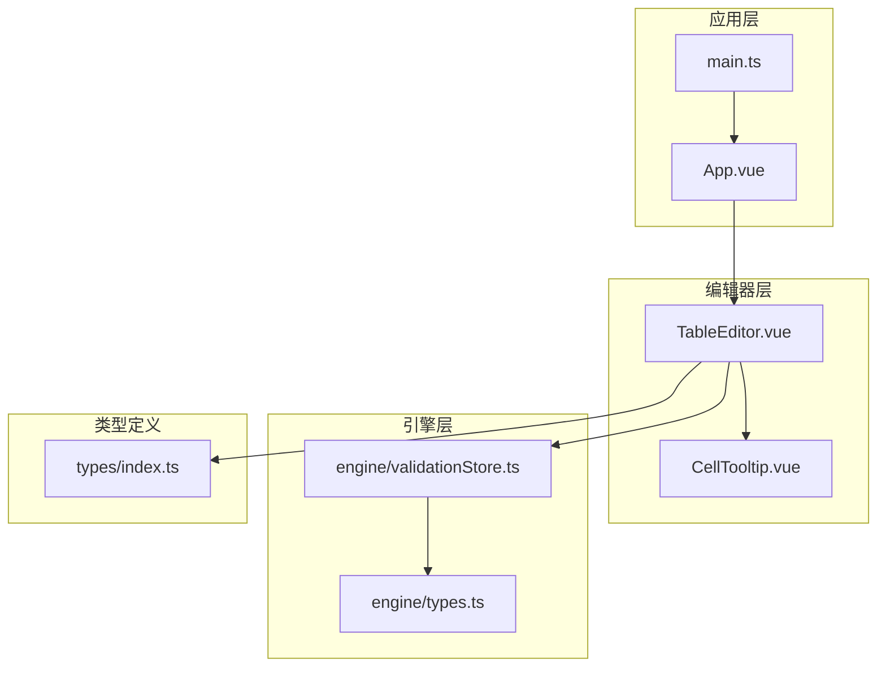
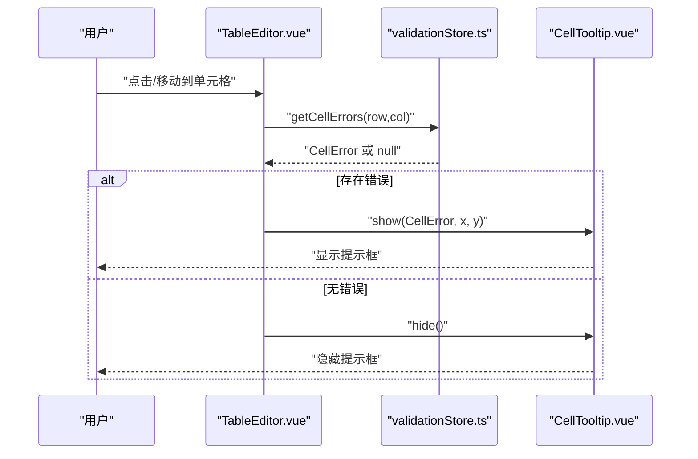
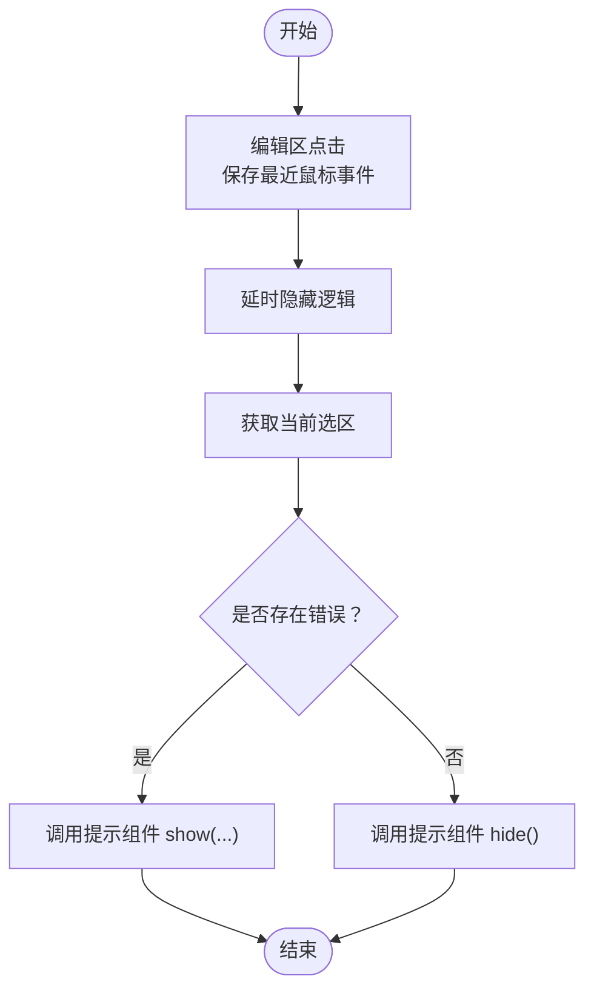
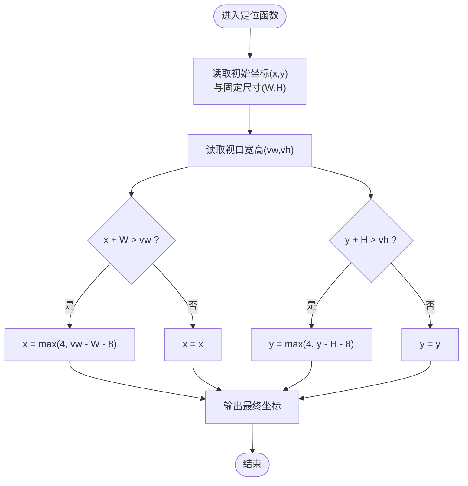
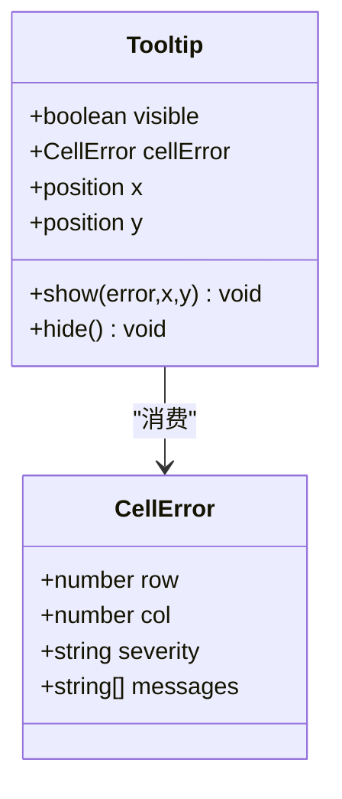
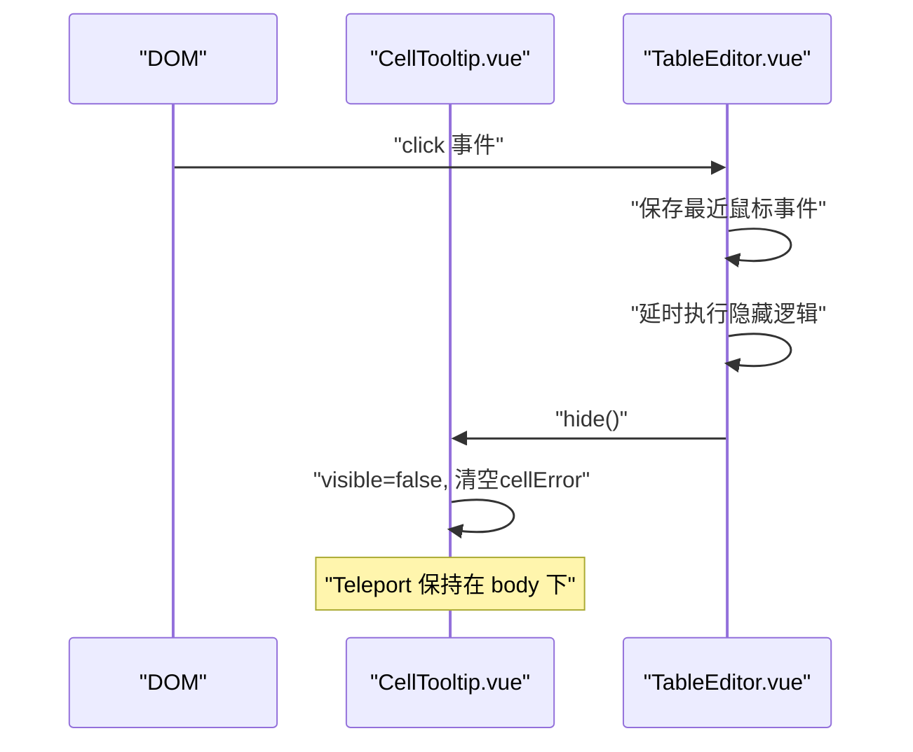
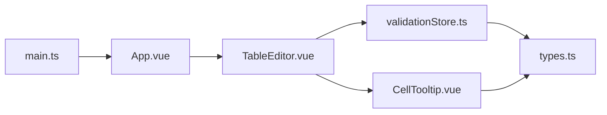

# 单元格提示组件

<cite>
**本文引用的文件**
- [CellTooltip.vue](file://src/components/CellTooltip.vue)
- [TableEditor.vue](file://src/components/TableEditor.vue)
- [types.ts](file://src/engine/types.ts)
- [validationStore.ts](file://src/engine/validationStore.ts)
- [index.ts](file://src/types/index.ts)
- [App.vue](file://src/App.vue)
- [main.ts](file://src/main.ts)
</cite>

## 目录
1. [简介](#简介)
2. [项目结构](#项目结构)
3. [核心组件](#核心组件)
4. [架构总览](#架构总览)
5. [组件详细分析](#组件详细分析)
6. [依赖关系分析](#依赖关系分析)
7. [性能与内存优化](#性能与内存优化)
8. [故障排查指南](#故障排查指南)
9. [结论](#结论)
10. [附录](#附录)

## 简介
本文件针对单元格提示组件 CellTooltip.vue 提供系统化技术文档，覆盖以下关键主题：
- 提示触发机制：如何在用户交互时触发提示展示
- 定位算法：如何根据鼠标位置与视口边界计算最优显示坐标
- 显示策略：如何渲染多条错误消息、严重级别与图标
- 生命周期与 DOM：组件挂载、Teleport 传送、可见性控制
- 动态内容与样式：消息数组驱动、严重级别样式映射、主题适配
- 性能优化与内存管理：最小化重排、延迟隐藏、防抖与节流思路
- 扩展指南：如何自定义样式、交互行为与主题

## 项目结构
CellTooltip.vue 作为独立组件被 TableEditor.vue 引入并在应用根节点挂载。应用通过 main.ts 注册 ElementPlus，并在 App.vue 中组织主界面布局。

图表来源
- [main.ts:1-9](file://src/main.ts#L1-L9)
- [App.vue:1-70](file://src/App.vue#L1-L70)
- [TableEditor.vue:1-200](file://src/components/TableEditor.vue#L1-L200)
- [CellTooltip.vue:1-126](file://src/components/CellTooltip.vue#L1-L126)
- [types.ts:1-48](file://src/engine/types.ts#L1-L48)
- [validationStore.ts:1-445](file://src/engine/validationStore.ts#L1-L445)
- [index.ts:1-79](file://src/types/index.ts#L1-L79)

章节来源
- [main.ts:1-9](file://src/main.ts#L1-L9)
- [App.vue:1-70](file://src/App.vue#L1-L70)
- [TableEditor.vue:1-200](file://src/components/TableEditor.vue#L1-L200)

## 核心组件
- CellTooltip.vue：负责接收错误数据、计算定位、渲染提示内容与样式，并通过 Teleport 将 DOM 传送到 body 下。
- TableEditor.vue：负责与外部表格引擎交互，从验证存储中查询当前单元格错误，并在合适时机调用提示组件的显示/隐藏。
- engine/types.ts 与 engine/validationStore.ts：提供 CellError 类型与查询接口，决定提示内容与严重级别。
- types/index.ts：提供 Luckysheet 相关类型定义，支撑 TableEditor 与提示组件之间的数据契约。

章节来源
- [CellTooltip.vue:1-126](file://src/components/CellTooltip.vue#L1-L126)
- [TableEditor.vue:1-200](file://src/components/TableEditor.vue#L1-L200)
- [types.ts:25-31](file://src/engine/types.ts#L25-L31)
- [validationStore.ts:385-404](file://src/engine/validationStore.ts#L385-L404)
- [index.ts:30-41](file://src/types/index.ts#L30-L41)

## 架构总览
CellTooltip 的工作流由 TableEditor 驱动，通过验证存储获取当前单元格错误，再调用提示组件显示；同时在编辑区点击或切换选区时进行隐藏控制。

图表来源
- [TableEditor.vue:129-156](file://src/components/TableEditor.vue#L129-L156)
- [validationStore.ts:385-404](file://src/engine/validationStore.ts#L385-L404)
- [CellTooltip.vue:48-68](file://src/components/CellTooltip.vue#L48-L68)

## 组件详细分析

### 触发机制与事件监听
- 选区变更触发：在表格引擎的 cellMousedown 钩子中，先触发上次编辑单元格的失焦校验，再延时显示提示，确保选区已更新。
- 编辑区点击隐藏：在编辑区 click 事件中保存最近鼠标事件位置，延时判断当前选区是否仍存在错误，若无则隐藏提示。
- 外部调用：TableEditor 通过 ref 调用提示组件暴露的 show/hide 方法。

图表来源
- [TableEditor.vue:158-182](file://src/components/TableEditor.vue#L158-L182)

章节来源
- [TableEditor.vue:114-124](file://src/components/TableEditor.vue#L114-L124)
- [TableEditor.vue:158-182](file://src/components/TableEditor.vue#L158-L182)

### 定位算法与边界溢出检测
- 基于最近鼠标事件位置加偏移量作为初始坐标。
- 固定提示尺寸（宽度与高度），结合视口尺寸进行边界检测。
- 若超出右/下边界，则反向调整至可视区域内，保证提示不被裁剪。

图表来源
- [CellTooltip.vue:48-60](file://src/components/CellTooltip.vue#L48-L60)

章节来源
- [CellTooltip.vue:48-60](file://src/components/CellTooltip.vue#L48-L60)

### 显示策略与内容渲染
- 多消息渲染：提示内容按 CellError.messages 数组逐条渲染为列表项。
- 严重级别映射：根据 severity 决定样式类与图标，支持“严重”和“高风险”两类。
- 动画与层级：使用固定 z-index 与淡入动画，确保层级高于编辑器内容。

图表来源
- [types.ts:25-31](file://src/engine/types.ts#L25-L31)
- [CellTooltip.vue:27-68](file://src/components/CellTooltip.vue#L27-L68)

章节来源
- [CellTooltip.vue:8-18](file://src/components/CellTooltip.vue#L8-L18)
- [CellTooltip.vue:31-46](file://src/components/CellTooltip.vue#L31-L46)
- [CellTooltip.vue:33-41](file://src/components/CellTooltip.vue#L33-L41)

### 生命周期管理与 DOM 操作
- 组件挂载：通过 <Teleport to="body"> 将提示 DOM 传送到页面 body 下，避免被编辑器容器裁剪。
- 可见性控制：通过响应式变量 visible 控制渲染；隐藏时清空错误数据，释放引用。
- 事件监听：TableEditor 在编辑区绑定 click 事件，用于记录鼠标位置与延时隐藏逻辑。

图表来源
- [CellTooltip.vue:2](file://src/components/CellTooltip.vue#L2)
- [CellTooltip.vue:63-66](file://src/components/CellTooltip.vue#L63-L66)
- [TableEditor.vue:158-182](file://src/components/TableEditor.vue#L158-L182)

章节来源
- [CellTooltip.vue:2](file://src/components/CellTooltip.vue#L2)
- [CellTooltip.vue:63-66](file://src/components/CellTooltip.vue#L63-L66)
- [TableEditor.vue:158-182](file://src/components/TableEditor.vue#L158-L182)

### 样式定制与主题适配
- 背景色、圆角、阴影与最大宽度：统一提示容器外观。
- 间距与分隔线：列表项之间添加分隔线与上边距，提升可读性。
- 严重级别颜色：通过 severity-class 映射不同颜色，便于快速识别风险等级。
- 图标与对齐：图标固定尺寸与上边距，内容与图标顶部对齐，保证一致性。

章节来源
- [CellTooltip.vue:71-125](file://src/components/CellTooltip.vue#L71-L125)

### 数据模型与类型约束
- CellError：包含行列索引、严重级别与消息数组，作为提示组件的输入数据。
- Severity：支持 CRITICAL/HIGH/MEDIUM（注：提示组件当前仅区分 CRITICAL 与 HIGH）。
- 消息文本：可通过工具函数进行术语替换，保证提示文案一致性。

章节来源
- [types.ts:1-48](file://src/engine/types.ts#L1-L48)
- [validationStore.ts:385-404](file://src/engine/validationStore.ts#L385-L404)

## 依赖关系分析
- 组件耦合：TableEditor 依赖 validationStore 查询错误；CellTooltip 依赖 engine/types 的类型定义。
- 外部依赖：应用层使用 ElementPlus，CellTooltip 本身不直接依赖第三方 UI 组件。
- 类型契约：CellError 与 Luckysheet 的行列索引通过 types/index.ts 的接口定义进行约束。

图表来源
- [TableEditor.vue:18-19](file://src/components/TableEditor.vue#L18-L19)
- [validationStore.ts:1-12](file://src/engine/validationStore.ts#L1-L12)
- [types.ts:25-31](file://src/engine/types.ts#L25-L31)
- [CellTooltip.vue:24-25](file://src/components/CellTooltip.vue#L24-L25)
- [App.vue:18-23](file://src/App.vue#L18-L23)
- [main.ts:1-9](file://src/main.ts#L1-L9)

章节来源
- [TableEditor.vue:18-19](file://src/components/TableEditor.vue#L18-L19)
- [validationStore.ts:1-12](file://src/engine/validationStore.ts#L1-L12)
- [types.ts:25-31](file://src/engine/types.ts#L25-L31)
- [CellTooltip.vue:24-25](file://src/components/CellTooltip.vue#L24-L25)
- [App.vue:18-23](file://src/App.vue#L18-L23)
- [main.ts:1-9](file://src/main.ts#L1-L9)

## 性能与内存优化
- 最小化重排：定位采用固定尺寸与简单边界检测，避免复杂布局计算。
- 延迟隐藏：在点击事件中使用延时隐藏，确保事件冒泡与选区更新完成后再隐藏，减少闪烁与误触。
- 引用清理：隐藏时清空错误数据引用，有助于垃圾回收。
- 动画与层级：使用固定 z-index 与短时动画，避免过度昂贵的过渡效果。
- 可扩展建议：
  - 对频繁触发的显示/隐藏增加防抖/节流（例如在高频 hover 场景）。
  - 对消息列表过长时考虑虚拟滚动或截断策略。
  - 对图标与颜色采用 CSS 变量，便于主题切换。

[本节为通用性能指导，不直接分析具体文件，故无章节来源]

## 故障排查指南
- 提示不显示
  - 检查是否正确调用 show 并传入有效 CellError。
  - 确认当前选区确实存在错误（getCellErrors 返回非空）。
  - 检查 Teleport 是否成功将 DOM 插入 body。
- 提示位置异常
  - 确认传入坐标为鼠标事件坐标并加上偏移量。
  - 检查视口尺寸变化是否影响定位（如窗口缩放）。
- 提示无法隐藏
  - 确认点击事件已保存最近鼠标事件并触发延时隐藏逻辑。
  - 检查当前选区是否仍在错误单元格，否则会自动隐藏。
- 样式异常
  - 检查严重级别映射与对应 CSS 类是否生效。
  - 确认主题色与字体大小未被全局样式覆盖。

章节来源
- [TableEditor.vue:129-156](file://src/components/TableEditor.vue#L129-L156)
- [TableEditor.vue:158-182](file://src/components/TableEditor.vue#L158-L182)
- [CellTooltip.vue:48-68](file://src/components/CellTooltip.vue#L48-L68)

## 结论
CellTooltip.vue 以简洁的响应式设计实现了“按需显示、智能定位、可读性强”的单元格提示能力。通过与 TableEditor 和验证存储的协作，它在不侵入业务逻辑的前提下提供了良好的用户体验。建议后续在高频交互场景中加入防抖/节流与虚拟化渲染等优化手段，进一步提升性能与稳定性。

[本节为总结性内容，不直接分析具体文件，故无章节来源]

## 附录

### 扩展指南与最佳实践
- 自定义样式
  - 通过 CSS 变量或主题类名覆盖默认颜色与尺寸。
  - 为严重级别新增类别时，同步扩展 severity-class 与图标映射。
- 交互行为
  - 在 hover 场景增加防抖显示，避免频繁闪烁。
  - 支持键盘导航（Tab/Enter）触发提示，增强可访问性。
- 主题适配
  - 将背景色、阴影与分隔线颜色改为 CSS 变量，便于浅色/深色主题切换。
- 兼容性
  - 确保 Teleport 在目标浏览器可用；必要时提供降级方案。
  - 注意不同分辨率与缩放比例下的定位精度。

[本节为概念性指导，不直接分析具体文件，故无章节来源]