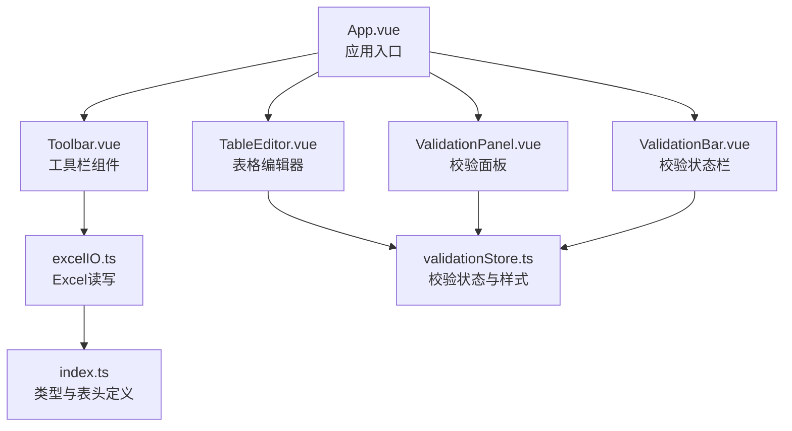
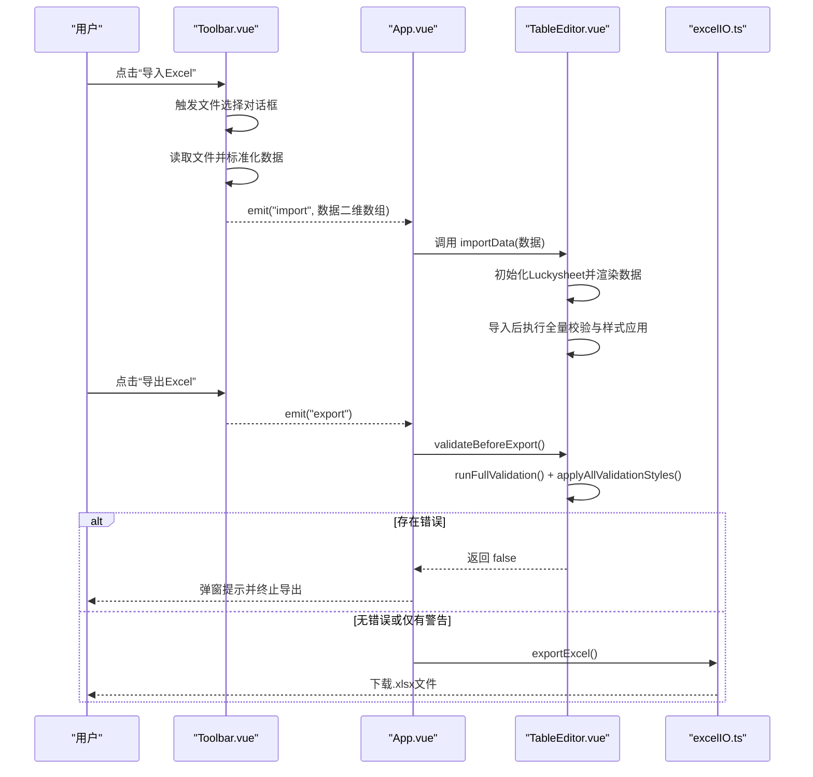
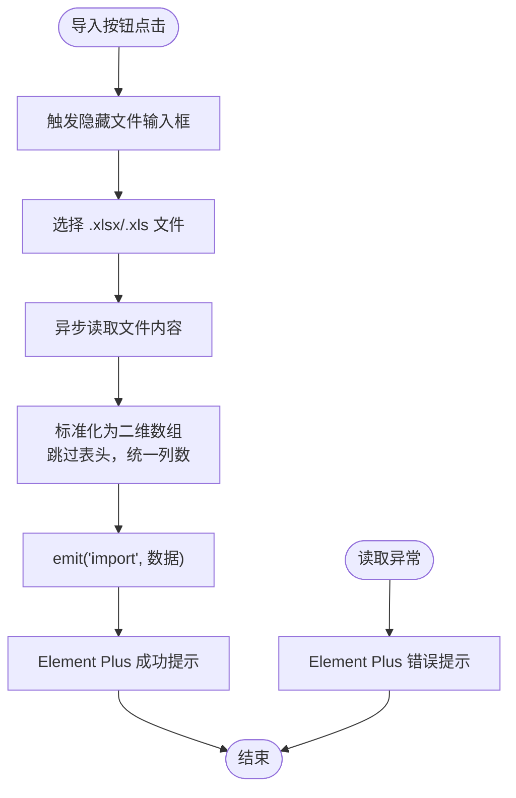
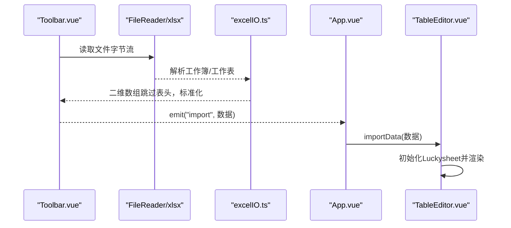
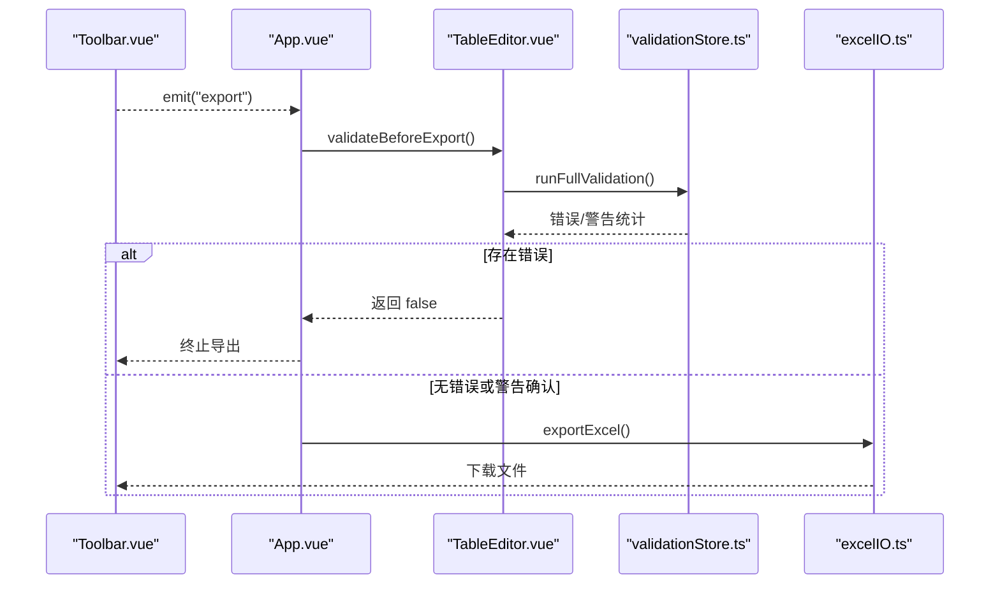
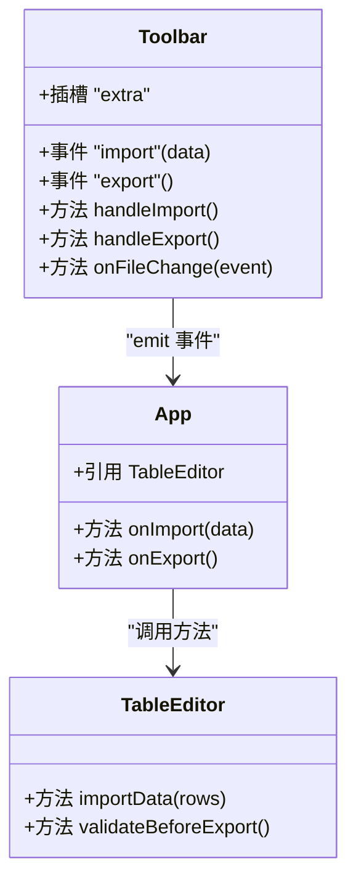
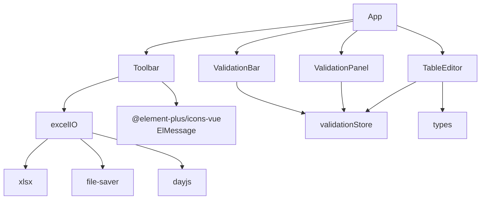

# 工具栏组件

<cite>
**本文档引用的文件**
- [Toolbar.vue](file://src/components/Toolbar.vue)
- [excelIO.ts](file://src/utils/excelIO.ts)
- [App.vue](file://src/App.vue)
- [TableEditor.vue](file://src/components/TableEditor.vue)
- [validationStore.ts](file://src/engine/validationStore.ts)
- [ValidationPanel.vue](file://src/components/ValidationPanel.vue)
- [ValidationBar.vue](file://src/components/ValidationBar.vue)
- [index.ts](file://src/types/index.ts)
- [package.json](file://package.json)
</cite>

## 目录
1. [简介](#简介)
2. [项目结构](#项目结构)
3. [核心组件](#核心组件)
4. [架构总览](#架构总览)
5. [详细组件分析](#详细组件分析)
6. [依赖关系分析](#依赖关系分析)
7. [性能考虑](#性能考虑)
8. [故障排除指南](#故障排除指南)
9. [结论](#结论)
10. [附录](#附录)

## 简介
本文件为 Toolbar.vue 工具栏组件的详细技术文档，面向开发者与产品人员，全面解析工具栏的设计理念、功能布局、用户交互逻辑以及与系统其他模块的集成方式。重点涵盖导入、导出、撤销、重做等核心功能的实现机制；深入阐述组件的插槽系统、事件发射机制与父组件通信方式；解释响应式设计、按钮状态管理与用户体验优化策略；并提供工具栏自定义配置、图标资源管理与国际化支持的实现指南。

## 项目结构
该工具栏组件位于 src/components 目录下，作为应用的顶部控制层，负责触发数据导入与导出流程，并通过插槽扩展更多自定义控件。与之协作的核心模块包括：
- Excel 文件读写工具：excelIO.ts
- 应用入口与事件桥接：App.vue
- 表格编辑器与校验引擎：TableEditor.vue、validationStore.ts
- 校验面板与状态栏：ValidationPanel.vue、ValidationBar.vue
- 类型定义与表头配置：index.ts

图表来源
- [App.vue:1-70](file://src/App.vue#L1-L70)
- [Toolbar.vue:1-83](file://src/components/Toolbar.vue#L1-L83)
- [TableEditor.vue:1-399](file://src/components/TableEditor.vue#L1-L399)
- [excelIO.ts:1-105](file://src/utils/excelIO.ts#L1-L105)
- [validationStore.ts:1-474](file://src/engine/validationStore.ts#L1-L474)
- [ValidationPanel.vue:1-438](file://src/components/ValidationPanel.vue#L1-L438)
- [ValidationBar.vue:1-64](file://src/components/ValidationBar.vue#L1-L64)
- [index.ts:1-79](file://src/types/index.ts#L1-L79)

章节来源
- [App.vue:1-70](file://src/App.vue#L1-L70)
- [Toolbar.vue:1-83](file://src/components/Toolbar.vue#L1-L83)
- [excelIO.ts:1-105](file://src/utils/excelIO.ts#L1-L105)
- [index.ts:1-79](file://src/types/index.ts#L1-L79)

## 核心组件
- 工具栏组件 Toolbar.vue：提供“导入Excel”和“导出Excel”两个核心按钮，支持通过插槽扩展额外控件；负责触发文件选择与数据导入流程，并向父组件发出事件。
- Excel IO 工具 excelIO.ts：封装文件读取与导出逻辑，包含读取.xlsx/.xls 文件为二维数组、构建导出工作簿、设置列宽与文件命名等。
- 应用入口 App.vue：作为父组件，订阅工具栏事件，协调导入数据写入表格编辑器，并在导出前执行校验。
- 表格编辑器 TableEditor.vue：承载 Luckysheet 实例，负责初始化、数据导入、导出前校验、自动保存与键盘/鼠标交互优化。
- 校验引擎 validationStore.ts：维护校验状态、统计信息与样式应用，提供防抖与跨行校验调度机制。
- 校验面板 ValidationPanel.vue：展示校验结果、错误/警告统计与待填写项，支持导航到具体单元格。
- 校验状态栏 ValidationBar.vue：实时显示已填写行数与错误/警告数量。

章节来源
- [Toolbar.vue:1-83](file://src/components/Toolbar.vue#L1-L83)
- [excelIO.ts:1-105](file://src/utils/excelIO.ts#L1-L105)
- [App.vue:1-70](file://src/App.vue#L1-L70)
- [TableEditor.vue:1-399](file://src/components/TableEditor.vue#L1-L399)
- [validationStore.ts:1-474](file://src/engine/validationStore.ts#L1-L474)
- [ValidationPanel.vue:1-438](file://src/components/ValidationPanel.vue#L1-L438)
- [ValidationBar.vue:1-64](file://src/components/ValidationBar.vue#L1-L64)

## 架构总览
工具栏组件采用“事件驱动”的父子通信模式：子组件通过 emit 发出 import/export 事件，父组件在 App.vue 中接收并处理，分别调用表格编辑器的数据导入与导出流程。导入流程通过 Excel IO 工具读取文件并标准化数据，导出流程在导出前执行全量校验并生成文件。

图表来源
- [Toolbar.vue:34-56](file://src/components/Toolbar.vue#L34-L56)
- [App.vue:29-39](file://src/App.vue#L29-L39)
- [TableEditor.vue:239-273](file://src/components/TableEditor.vue#L239-L273)
- [excelIO.ts:61-104](file://src/utils/excelIO.ts#L61-L104)

## 详细组件分析

### 工具栏组件 Toolbar.vue
- 设计理念
  - 简洁明确的控制区：左侧标题区，右侧功能区，中间通过插槽扩展。
  - 事件驱动：通过 emit('import') 和 emit('export') 与父组件通信，解耦业务逻辑。
  - 可访问性：隐藏文件输入框并通过按钮触发，避免不必要的可见性干扰。
- 功能布局
  - 左侧标题：显示当前页面主题与用途。
  - 右侧按钮：导入Excel（主色）、导出Excel（成功色），均使用 Element Plus 图标。
  - 插槽：允许父组件注入自定义控件，如“校验面板”开关等。
- 用户交互逻辑
  - 导入：点击按钮触发隐藏文件输入框，选择 .xlsx/.xls 文件后异步读取并标准化数据，成功后弹出消息提示。
  - 导出：点击按钮向父组件发出导出事件，由父组件决定是否继续执行导出流程。
- 事件发射机制
  - emit('import', data)：导入成功后传递二维字符串数组。
  - emit('export')：导出按钮被点击时触发。
- 插槽系统
  - 默认插槽 name="extra"：父组件可在此插入自定义按钮或控件，如“校验面板”开关。
- 响应式设计与按钮状态管理
  - 使用 Flex 布局，两端对齐，间距统一。
  - 按钮类型区分导入（主色）与导出（成功色），提升视觉层次。
  - 成功/失败消息通过 Element Plus 提示组件反馈，增强可用性。
- 性能与用户体验优化
  - 导入文件读取采用异步 Promise，避免阻塞 UI。
  - 导入完成后清空 input.value，防止重复触发。
  - 导出前由父组件统一校验，减少无效导出。

图表来源
- [Toolbar.vue:34-56](file://src/components/Toolbar.vue#L34-L56)
- [excelIO.ts:10-56](file://src/utils/excelIO.ts#L10-L56)

章节来源
- [Toolbar.vue:1-83](file://src/components/Toolbar.vue#L1-L83)
- [excelIO.ts:10-56](file://src/utils/excelIO.ts#L10-L56)

### 导入功能实现机制
- 文件读取与解析
  - 使用 FileReader 读取二进制数据，借助 xlsx 库解析工作簿与工作表。
  - sheet_to_json 以数组形式读取，header: 1 获取表头行，跳过后作为数据行。
  - 标准化处理：限制每行最大列数为表头列数，不足补空串；日期统一格式化为 YYYY-MM-DD；去除多余空白字符。
- 数据传递
  - 读取成功后通过 emit('import', data) 将二维数组传递给父组件。
  - 父组件接收后调用表格编辑器的 importData 方法，初始化 Luckysheet 并渲染数据。
- 错误处理
  - FileReader 错误与解析异常均捕获并提示用户。

图表来源
- [Toolbar.vue:38-52](file://src/components/Toolbar.vue#L38-L52)
- [excelIO.ts:10-56](file://src/utils/excelIO.ts#L10-L56)
- [App.vue:29-31](file://src/App.vue#L29-L31)
- [TableEditor.vue:184-215](file://src/components/TableEditor.vue#L184-L215)

章节来源
- [excelIO.ts:10-56](file://src/utils/excelIO.ts#L10-L56)
- [App.vue:29-31](file://src/App.vue#L29-L31)
- [TableEditor.vue:184-215](file://src/components/TableEditor.vue#L184-L215)

### 导出功能实现机制
- 导出前校验
  - 父组件在收到导出事件后，调用表格编辑器的 validateBeforeExport 方法。
  - 该方法执行全量校验，应用样式，并根据错误/警告数量决定是否允许导出。
- 导出流程
  - 若无错误或仅警告且用户确认，则调用 exportExcel。
  - exportExcel 从 Luckysheet 获取当前数据，拼接表头与数据行，过滤全空行，设置列宽，生成 .xlsx 文件并下载。
- 撤销/重做
  - 当前版本未实现撤销/重做按钮；如需扩展，可在工具栏增加相应按钮，并结合 Luckysheet 的历史栈 API 或自定义状态管理实现。

图表来源
- [Toolbar.vue:54-56](file://src/components/Toolbar.vue#L54-L56)
- [App.vue:33-39](file://src/App.vue#L33-L39)
- [TableEditor.vue:239-273](file://src/components/TableEditor.vue#L239-L273)
- [validationStore.ts:408-452](file://src/engine/validationStore.ts#L408-L452)
- [excelIO.ts:61-104](file://src/utils/excelIO.ts#L61-L104)

章节来源
- [App.vue:33-39](file://src/App.vue#L33-L39)
- [TableEditor.vue:239-273](file://src/components/TableEditor.vue#L239-L273)
- [validationStore.ts:408-452](file://src/engine/validationStore.ts#L408-L452)
- [excelIO.ts:61-104](file://src/utils/excelIO.ts#L61-L104)

### 插槽系统与事件通信
- 插槽系统
  - Toolbar.vue 提供默认插槽 name="extra"，父组件可在其中放置自定义控件，如“校验面板”开关按钮。
  - App.vue 在使用 Toolbar 时，通过插槽注入按钮，并绑定点击事件以切换校验面板显示状态。
- 事件通信
  - 子组件通过 defineEmits 声明事件类型，确保类型安全。
  - 父组件通过 v-on 监听 import/export 事件，分别处理数据导入与导出流程。
  - 事件参数遵循约定：import 事件携带二维数组；export 事件无参数。

图表来源
- [Toolbar.vue:27-30](file://src/components/Toolbar.vue#L27-L30)
- [App.vue:29-39](file://src/App.vue#L29-L39)
- [TableEditor.vue:294-297](file://src/components/TableEditor.vue#L294-L297)

章节来源
- [Toolbar.vue:7-8](file://src/components/Toolbar.vue#L7-L8)
- [App.vue:3-9](file://src/App.vue#L3-L9)
- [Toolbar.vue:27-30](file://src/components/Toolbar.vue#L27-L30)

### 响应式设计与按钮状态管理
- 布局
  - 使用 Flex 布局实现左右分区，右侧按钮组通过 gap 控制间距，保证在不同屏幕尺寸下的良好表现。
- 状态反馈
  - 成功/失败消息通过 Element Plus 的 ElMessage 提示，确保用户及时感知操作结果。
- 无障碍与可访问性
  - 隐藏文件输入框，通过按钮触发文件选择，避免屏幕阅读器误读。
  - 图标与文字组合，提升识别度。

章节来源
- [Toolbar.vue:59-82](file://src/components/Toolbar.vue#L59-L82)
- [Toolbar.vue:46-49](file://src/components/Toolbar.vue#L46-L49)

### 工具栏自定义配置
- 自定义按钮
  - 通过插槽 name="extra" 注入任意 Element Plus 按钮或组件，实现“校验面板”开关等扩展功能。
- 图标资源管理
  - 使用 @element-plus/icons-vue 提供的 Upload、Download 图标，保持风格一致。
  - 如需替换图标，可在父组件中传入自定义图标组件或通过 CSS 覆盖。
- 国际化支持
  - 文案“导入Excel”“导出Excel”建议通过 i18n 系统管理，父组件在插槽中使用本地化文本。
  - 表头列名与提示信息来自 types/index.ts，可配合 i18n 实现多语言。

章节来源
- [Toolbar.vue:8](file://src/components/Toolbar.vue#L8)
- [Toolbar.vue:23](file://src/components/Toolbar.vue#L23)
- [index.ts:44-75](file://src/types/index.ts#L44-L75)

## 依赖关系分析
- 组件间依赖
  - Toolbar 依赖 excelIO.ts 进行文件读取；依赖 Element Plus 组件库与图标。
  - App 作为父组件，依赖 Toolbar 的事件；同时依赖 TableEditor 的方法与 validationStore 的校验能力。
  - TableEditor 依赖 validationStore 进行校验与样式应用；依赖 types/index.ts 的表头配置。
  - ValidationPanel 与 ValidationBar 依赖 validationStore 的状态进行展示。
- 外部依赖
  - xlsx：Excel 文件解析与导出。
  - file-saver：浏览器端文件下载。
  - dayjs：日期格式化。
  - element-plus：UI 组件与消息提示。

图表来源
- [Toolbar.vue:23-25](file://src/components/Toolbar.vue#L23-L25)
- [excelIO.ts:1-4](file://src/utils/excelIO.ts#L1-L4)
- [package.json:11-24](file://package.json#L11-L24)

章节来源
- [package.json:11-24](file://package.json#L11-L24)
- [excelIO.ts:1-105](file://src/utils/excelIO.ts#L1-L105)

## 性能考虑
- 导入性能
  - 使用异步读取与解析，避免阻塞主线程。
  - 标准化处理按列循环，时间复杂度 O(R*C)，其中 R 为行数，C 为列数。
- 导出性能
  - 导出前执行全量校验与样式应用，建议在大数据量时进行节流或分页处理。
  - 列宽设置与工作簿写入为 O(C) 与 O(R*C)，注意控制数据规模。
- 校验性能
  - validationStore 使用请求动画帧与批量样式刷新，降低频繁 DOM 操作带来的性能损耗。
  - 防抖与跨行校验延迟执行，避免高频输入导致的性能问题。

## 故障排除指南
- 导入失败
  - 现象：弹出“导入失败”提示。
  - 排查：检查文件格式是否为 .xlsx/.xls；确认 FileReader 读取权限；查看控制台错误信息。
  - 处理：更换文件或修复文件损坏问题。
- 导出被阻止
  - 现象：导出前弹窗提示错误或警告，无法导出。
  - 排查：查看校验面板中的错误/警告详情；确认必填字段是否完整。
  - 处理：修正数据后重新尝试导出。
- 样式未生效
  - 现象：单元格颜色/边框未按预期显示。
  - 排查：确认 Luckysheet 实例已正确初始化；检查 applyAllValidationStyles 是否被调用。
  - 处理：在导出前确保执行全量校验与样式应用。

章节来源
- [Toolbar.vue:47-49](file://src/components/Toolbar.vue#L47-L49)
- [TableEditor.vue:240-273](file://src/components/TableEditor.vue#L240-L273)
- [validationStore.ts:199-236](file://src/engine/validationStore.ts#L199-L236)

## 结论
Toolbar.vue 作为应用的顶层控制组件，通过简洁的事件模型与插槽扩展，实现了导入/导出两大核心功能，并与表格编辑器、校验引擎形成清晰的职责边界。其响应式布局与消息反馈提升了用户体验，而完善的错误处理与性能优化保障了稳定性。未来可在工具栏中增加撤销/重做按钮，并进一步完善国际化与可定制化能力。

## 附录
- 相关文件路径
  - [Toolbar.vue](file://src/components/Toolbar.vue)
  - [excelIO.ts](file://src/utils/excelIO.ts)
  - [App.vue](file://src/App.vue)
  - [TableEditor.vue](file://src/components/TableEditor.vue)
  - [validationStore.ts](file://src/engine/validationStore.ts)
  - [ValidationPanel.vue](file://src/components/ValidationPanel.vue)
  - [ValidationBar.vue](file://src/components/ValidationBar.vue)
  - [index.ts](file://src/types/index.ts)
  - [package.json](file://package.json)