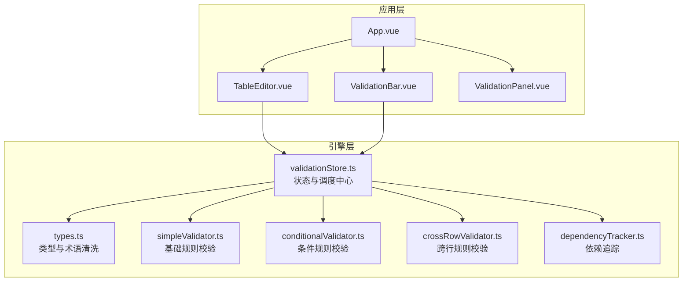
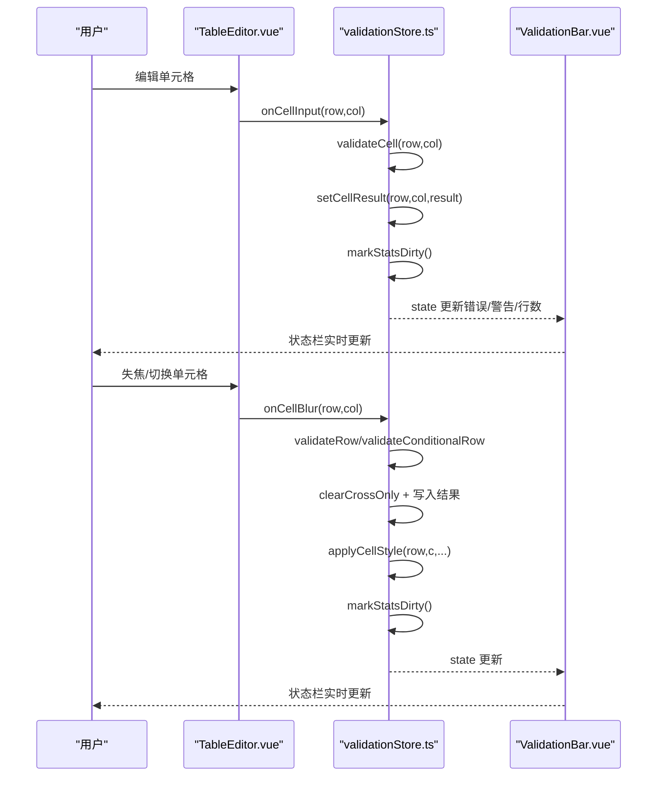
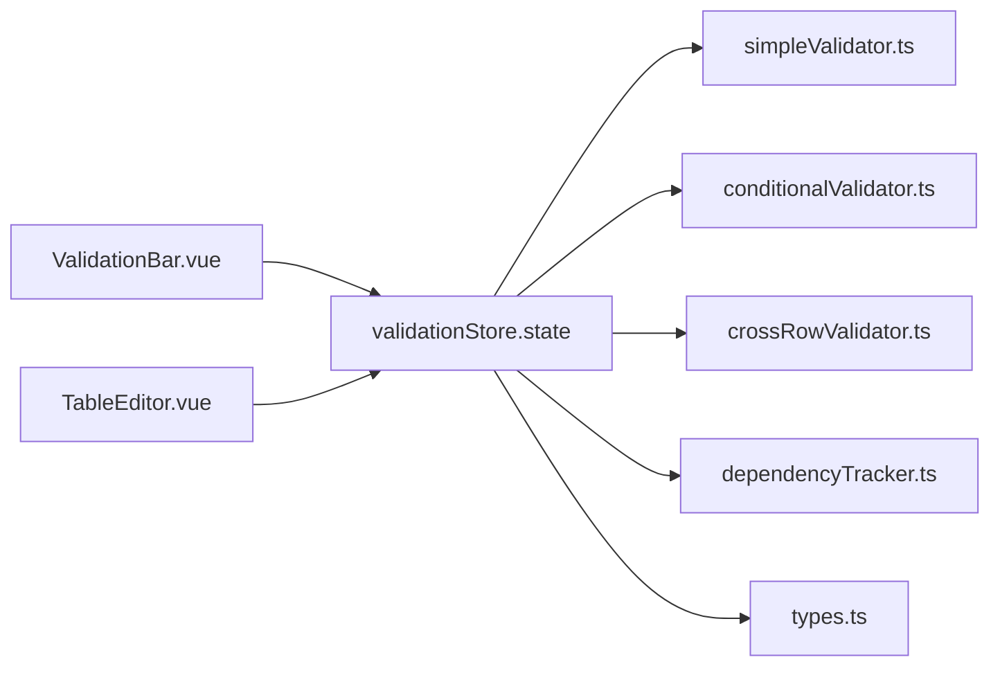

# 校验状态栏组件

<cite>
**本文引用的文件**
- [ValidationBar.vue](file://src/components/ValidationBar.vue)
- [validationStore.ts](file://src/engine/validationStore.ts)
- [types.ts](file://src/engine/types.ts)
- [simpleValidator.ts](file://src/engine/simpleValidator.ts)
- [conditionalValidator.ts](file://src/engine/conditionalValidator.ts)
- [crossRowValidator.ts](file://src/engine/crossRowValidator.ts)
- [dependencyTracker.ts](file://src/engine/dependencyTracker.ts)
- [TableEditor.vue](file://src/components/TableEditor.vue)
- [App.vue](file://src/App.vue)
- [ValidationPanel.vue](file://src/components/ValidationPanel.vue)
</cite>

## 目录
1. [简介](#简介)
2. [项目结构](#项目结构)
3. [核心组件](#核心组件)
4. [架构总览](#架构总览)
5. [详细组件分析](#详细组件分析)
6. [依赖分析](#依赖分析)
7. [性能考量](#性能考量)
8. [故障排查指南](#故障排查指南)
9. [结论](#结论)
10. [附录](#附录)

## 简介
本文件面向 ValidationBar.vue 校验状态栏组件，系统化阐述其实时状态监控的实现原理、错误统计机制与视觉反馈设计；详解组件如何与校验引擎交互、状态数据获取与更新策略；重点说明错误级别分类显示、进度指示器与用户提示信息的展示逻辑；并给出状态栏集成指南、自定义错误类型与用户体验优化建议。读者无需深入代码即可理解组件职责与工作流。

## 项目结构
ValidationBar.vue 位于组件目录，作为应用底部的状态栏，负责展示“已填写行数”、“错误数量”、“警告数量”以及“无问题”提示。它通过依赖校验引擎的状态对象，实现与校验系统的解耦与实时联动。

图表来源
- [App.vue:14](file://src/App.vue#L14)
- [TableEditor.vue:18](file://src/components/TableEditor.vue#L18)
- [ValidationBar.vue:23](file://src/components/ValidationBar.vue#L23)
- [validationStore.ts:15](file://src/engine/validationStore.ts#L15)

章节来源
- [App.vue:14](file://src/App.vue#L14)
- [TableEditor.vue:18](file://src/components/TableEditor.vue#L18)
- [ValidationBar.vue:23](file://src/components/ValidationBar.vue#L23)

## 核心组件
- 组件职责
  - 展示“已填写行数/总行数”、“警告数量”、“错误数量”、“无问题”提示。
  - 通过读取校验引擎状态对象，实现与校验系统的解耦与实时联动。
- 关键数据来源
  - 校验引擎状态对象包含错误计数、警告计数、已填写行数、总行数等。
- 交互方式
  - 组件不直接参与校验计算，仅订阅状态对象并渲染。
  - 用户在表格编辑区的输入与失焦行为由 TableEditor.vue 触发，最终由 validationStore.ts 统一调度与更新状态。

章节来源
- [ValidationBar.vue:1-64](file://src/components/ValidationBar.vue#L1-L64)
- [validationStore.ts:15](file://src/engine/validationStore.ts#L15)

## 架构总览
ValidationBar.vue 与校验引擎之间的交互遵循“状态订阅-渲染”的模式：
- TableEditor.vue 在单元格更新时调用 validationStore.onCellInput/onCellBlur，驱动引擎执行规则校验。
- validationStore.ts 负责聚合各类规则结果、维护状态对象，并在必要时批量刷新样式。
- ValidationBar.vue 仅从 state 中读取计数与行数信息，实现最小化依赖与高内聚。

图表来源
- [TableEditor.vue:108](file://src/components/TableEditor.vue#L108)
- [validationStore.ts:248](file://src/engine/validationStore.ts#L248)
- [validationStore.ts:269](file://src/engine/validationStore.ts#L269)
- [ValidationBar.vue:23](file://src/components/ValidationBar.vue#L23)

## 详细组件分析

### 组件结构与渲染逻辑
- 结构组成
  - 左侧区域显示“已填写行数/总行数”。
  - 右侧区域按优先级显示“警告数量”、“错误数量”，若均无则显示“无问题”提示。
- 渲染策略
  - 使用条件渲染分别展示警告、错误与“无问题”状态。
  - 通过 CSS 类控制颜色与权重，形成清晰的视觉层级。
- 样式设计
  - 警告使用特定颜色与加粗权重；错误使用更醒目的颜色；正常状态使用绿色。
  - 整体采用紧凑布局，左右对齐，保证在窄屏下仍具可读性。

章节来源
- [ValidationBar.vue:1-64](file://src/components/ValidationBar.vue#L1-L64)

### 与校验引擎的交互
- 状态订阅
  - 组件直接导入并订阅 validationStore.state，无需手动订阅或轮询。
- 数据来源
  - 错误计数、警告计数、已填写行数、总行数均由引擎在内部维护与更新。
- 更新触发
  - 引擎通过“脏标记 + requestAnimationFrame”批量刷新统计，避免频繁重绘。
  - 输入与失焦事件在 TableEditor.vue 中触发，最终汇聚到 validationStore.ts 的统一调度。

章节来源
- [ValidationBar.vue:23](file://src/components/ValidationBar.vue#L23)
- [validationStore.ts:15](file://src/engine/validationStore.ts#L15)
- [validationStore.ts:33](file://src/engine/validationStore.ts#L33)

### 错误统计机制与级别分类
- 分类依据
  - 引擎将规则结果按严重度分为“错误（CRITICAL）”和“警告（HIGH/MEDIUM）”两类。
- 统计策略
  - 引擎遍历所有单元格的规则结果，累加错误与警告数量。
  - 通过“脏标记 + RAF”在合适时机一次性更新计数，降低渲染压力。
- 展示策略
  - 状态栏优先显示错误数量，其次显示警告数量，最后在无问题时显示“无问题”。

章节来源
- [validationStore.ts:44](file://src/engine/validationStore.ts#L44)
- [validationStore.ts:48](file://src/engine/validationStore.ts#L48)
- [types.ts:1-12](file://src/engine/types.ts#L1-L12)

### 进度指示器与用户提示
- 进度指标
  - “已填写行数/总行数”用于直观反映数据录入进度。
- 提示信息
  - “无问题”提示在无错误与警告时出现，增强用户信心。
  - 警告与错误分别以不同颜色与图标提示，便于快速识别风险等级。

章节来源
- [ValidationBar.vue:4-17](file://src/components/ValidationBar.vue#L4-L17)
- [validationStore.ts:55](file://src/engine/validationStore.ts#L55)
- [validationStore.ts:56](file://src/engine/validationStore.ts#L56)

### 状态管理、样式定制与响应式适配
- 状态管理
  - validationStore.ts 使用响应式对象集中管理状态，提供统一的读写入口。
  - 通过“脏标记 + RAF”实现统计更新的节流，避免高频渲染。
- 样式定制
  - 组件提供独立的 CSS 类，支持主题色替换与字体大小调整。
  - 颜色方案与语义明确：错误红色、警告橙色、正常绿色。
- 响应式适配
  - 使用弹性布局与间距控制，保证在不同屏幕宽度下的可读性与紧凑性。

章节来源
- [validationStore.ts:15](file://src/engine/validationStore.ts#L15)
- [ValidationBar.vue:26-62](file://src/components/ValidationBar.vue#L26-L62)

### 与校验面板的协同
- ValidationPanel.vue 同样订阅 validationStore.state，提供更丰富的错误分组与导航能力。
- ValidationBar.vue 作为“轻量状态栏”，适合在主界面底部持续展示，减少页面拥挤感。

章节来源
- [ValidationPanel.vue:101](file://src/components/ValidationPanel.vue#L101)
- [App.vue:14](file://src/App.vue#L14)

## 依赖分析
- 组件依赖
  - ValidationBar.vue 仅依赖 validationStore.state，耦合度低，便于复用与替换。
- 引擎依赖
  - validationStore.ts 依赖 simpleValidator、conditionalValidator、crossRowValidator、dependencyTracker 与 types.ts。
- 事件链路
  - TableEditor.vue 通过 onCellInput/onCellBlur 触发引擎，引擎更新状态并通知视图层。

图表来源
- [ValidationBar.vue:23](file://src/components/ValidationBar.vue#L23)
- [validationStore.ts:15](file://src/engine/validationStore.ts#L15)
- [TableEditor.vue:18](file://src/components/TableEditor.vue#L18)

章节来源
- [ValidationBar.vue:23](file://src/components/ValidationBar.vue#L23)
- [validationStore.ts:15](file://src/engine/validationStore.ts#L15)
- [TableEditor.vue:18](file://src/components/TableEditor.vue#L18)

## 性能考量
- 统计更新节流
  - 通过“脏标记 + RAF”在下一帧统一刷新统计，避免频繁遍历与多次渲染。
- 样式批处理
  - applyCellStyle 与 applyAllValidationStyles 使用批处理队列，减少 Luckysheet API 调用次数。
- 防抖与延迟执行
  - onCellBlur 使用防抖（200ms）与跨行校验延迟（800ms），平衡实时性与性能。
- 数据访问优化
  - simpleValidator.ts 对 Luckysheet 数据进行缓存，避免重复创建大数组。

章节来源
- [validationStore.ts:33](file://src/engine/validationStore.ts#L33)
- [validationStore.ts:256](file://src/engine/validationStore.ts#L256)
- [validationStore.ts:322](file://src/engine/validationStore.ts#L322)
- [simpleValidator.ts:18](file://src/engine/simpleValidator.ts#L18)

## 故障排查指南
- 症状：状态栏不更新
  - 检查 TableEditor.vue 是否正确调用 onCellInput/onCellBlur。
  - 确认 validationStore.state 是否被组件订阅。
- 症状：错误计数异常
  - 检查规则结果是否正确设置与合并（appendCellResult/setRowResults）。
  - 确认 sanitizeMessage 是否正确替换术语。
- 症状：样式未生效
  - 确认 applyCellStyle/applyAllValidationStyles 是否在正确时机调用。
  - 检查 Luckysheet API 是否可用（getCellValue/setCellFormat）。
- 症状：性能问题
  - 检查是否存在频繁的 onCellInput 导致过多 RAF 回调。
  - 确认跨行校验是否合理延迟，避免阻塞主线程。

章节来源
- [TableEditor.vue:108](file://src/components/TableEditor.vue#L108)
- [validationStore.ts:65](file://src/engine/validationStore.ts#L65)
- [validationStore.ts:157](file://src/engine/validationStore.ts#L157)
- [simpleValidator.ts:4](file://src/engine/simpleValidator.ts#L4)

## 结论
ValidationBar.vue 以极简的设计实现了高效的实时状态监控：通过订阅 validationStore.state，组件专注于展示，不参与复杂的校验逻辑。配合引擎层的规则拆分、防抖与批处理策略，整体具备良好的性能与可维护性。建议在集成时保持组件的低耦合特性，并根据业务需求扩展错误级别的可视化与交互提示。

## 附录

### 状态栏集成指南
- 在应用根组件中引入并渲染 ValidationBar.vue。
- 确保 TableEditor.vue 正确绑定 onCellInput/onCellBlur 事件，以便触发引擎更新。
- 如需在导出前强制刷新样式，可在导出流程中调用 applyAllValidationStyles。

章节来源
- [App.vue:14](file://src/App.vue#L14)
- [TableEditor.vue:108](file://src/components/TableEditor.vue#L108)
- [validationStore.ts:199](file://src/engine/validationStore.ts#L199)

### 自定义错误类型与严重度
- 新增规则时，应在 types.ts 中定义新的规则标识与严重度。
- 在相应校验模块中返回 ValidationResult，message 将经过术语清洗。
- 若需新增严重度级别，需同步修改引擎的统计与排序逻辑。

章节来源
- [types.ts:1-12](file://src/engine/types.ts#L1-L12)
- [types.ts:41](file://src/engine/types.ts#L41)
- [validationStore.ts:44](file://src/engine/validationStore.ts#L44)

### 用户体验优化建议
- 在状态栏右侧增加“刷新/重新校验”按钮，便于用户主动触发全量校验。
- 为“无问题”状态添加短暂的提示动画，提升正反馈。
- 在移动端适配时，考虑将左右两列改为垂直堆叠，保证信息可读性。
- 为错误与警告提供快捷跳转至 ValidationPanel 的入口，提升问题定位效率。

[本节为通用建议，不直接分析具体文件，故无章节来源]