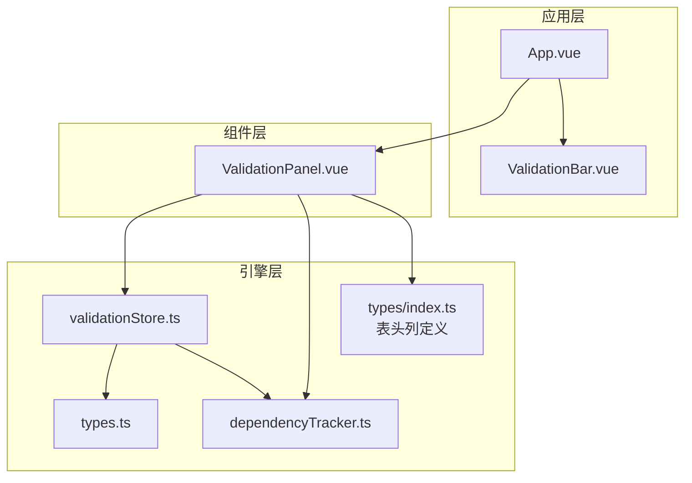
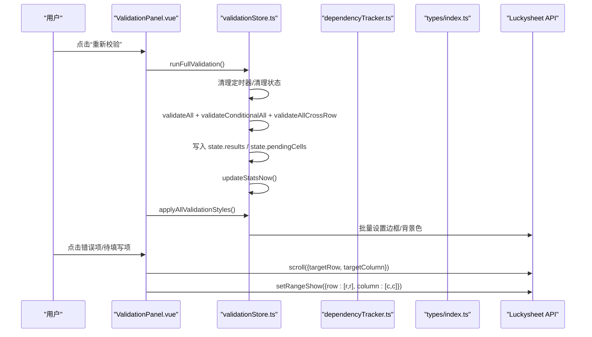
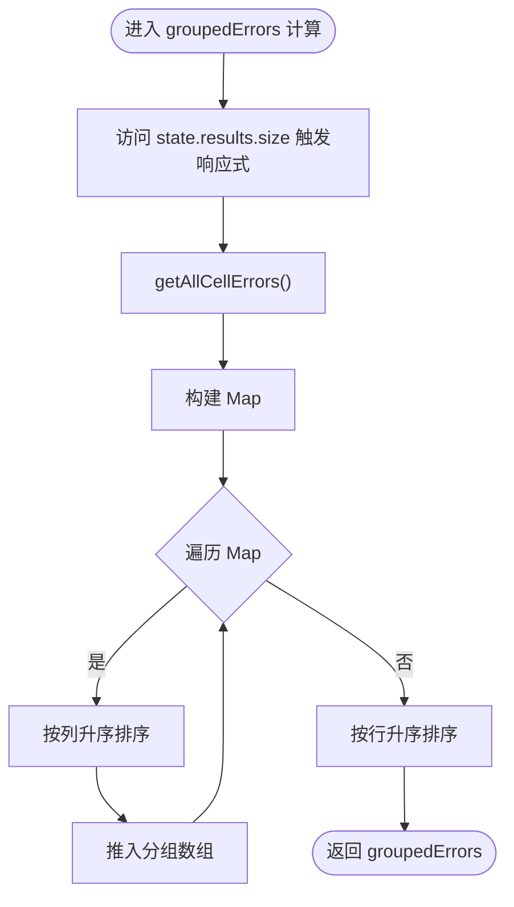
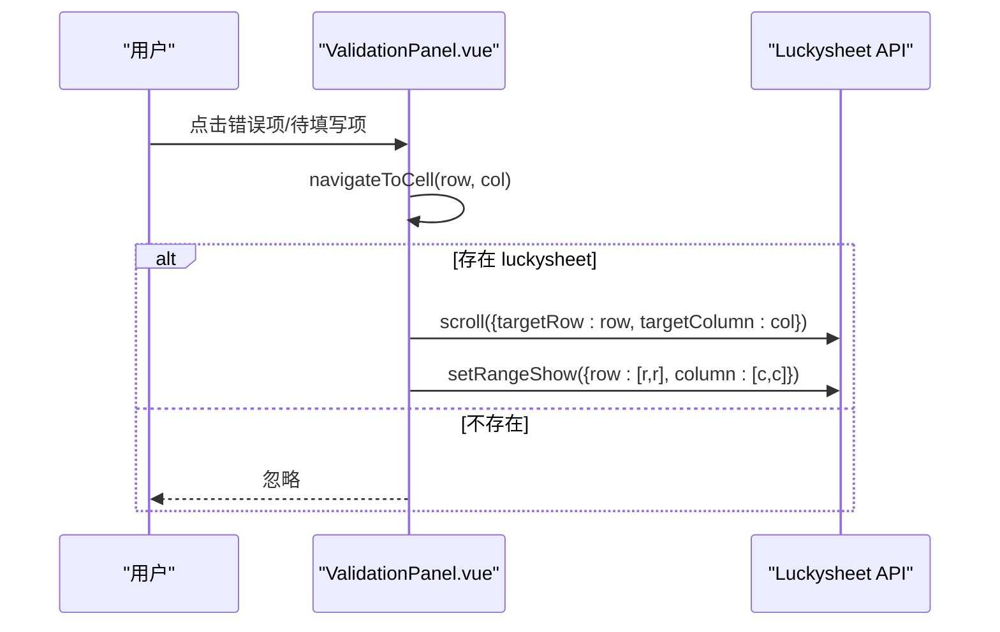
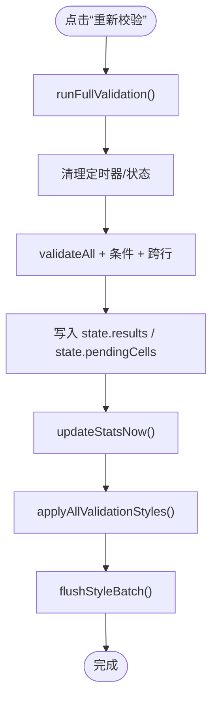
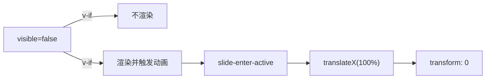
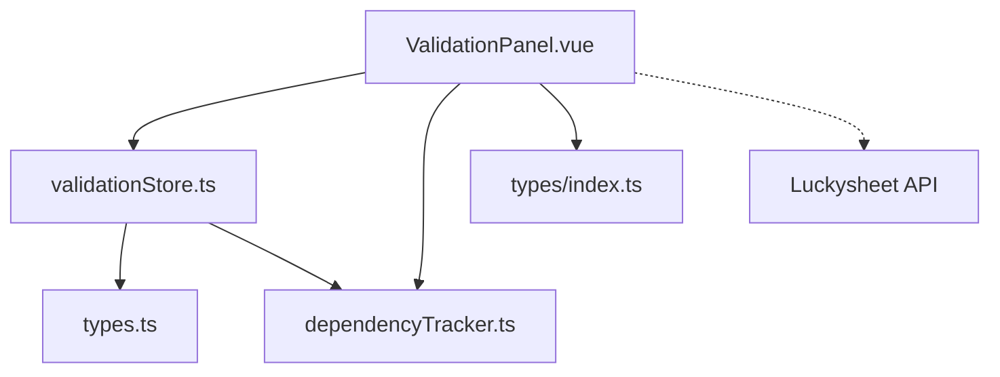

# 校验面板组件

<cite>
**本文档引用的文件**
- [ValidationPanel.vue](file://src/components/ValidationPanel.vue)
- [validationStore.ts](file://src/engine/validationStore.ts)
- [types.ts](file://src/engine/types.ts)
- [dependencyTracker.ts](file://src/engine/dependencyTracker.ts)
- [index.ts](file://src/types/index.ts)
- [App.vue](file://src/App.vue)
- [ValidationBar.vue](file://src/components/ValidationBar.vue)
</cite>

## 目录
1. [简介](#简介)
2. [项目结构](#项目结构)
3. [核心组件](#核心组件)
4. [架构总览](#架构总览)
5. [详细组件分析](#详细组件分析)
6. [依赖关系分析](#依赖关系分析)
7. [性能考虑](#性能考虑)
8. [故障排除指南](#故障排除指南)
9. [结论](#结论)
10. [附录](#附录)

## 简介
本文件为 ValidationPanel.vue 校验面板组件的详细技术文档，聚焦于以下方面：
- 详细校验信息的展示机制与错误列表管理
- 交互设计：选项卡切换、点击导航、重新校验等
- 数据结构：按行分组、严重度分类、待填写状态
- 过滤与排序：按行分组、列内排序、行间排序
- 错误详情展开/收起、定位跳转与批量处理
- 可见性控制、动画效果与用户体验
- 面板定制化配置、错误类型分类与性能优化策略

## 项目结构
ValidationPanel.vue 位于组件层，与引擎层的验证状态管理模块紧密协作，并通过 App.vue 的主布局进行集成。

图表来源
- [App.vue:1-70](file://src/App.vue#L1-L70)
- [ValidationPanel.vue:1-438](file://src/components/ValidationPanel.vue#L1-L438)
- [validationStore.ts:1-474](file://src/engine/validationStore.ts#L1-L474)
- [types.ts:1-48](file://src/engine/types.ts#L1-L48)
- [dependencyTracker.ts:1-158](file://src/engine/dependencyTracker.ts#L1-L158)
- [index.ts:43-79](file://src/types/index.ts#L43-L79)

章节来源
- [App.vue:1-70](file://src/App.vue#L1-L70)
- [ValidationPanel.vue:1-438](file://src/components/ValidationPanel.vue#L1-L438)

## 核心组件
- 组件职责
  - 展示校验统计概览（错误数、警告数、待填写数）
  - 提供“校验问题”和“待填写”两个选项卡
  - 将错误按行分组展示，支持点击定位到表格对应单元格
  - 显示待填写项及其依赖说明
  - 提供“重新校验”按钮，触发全量校验并应用样式
  - 通过过渡动画实现面板滑入/滑出

- 关键数据与计算属性
  - groupedErrors：基于 state.results 按行分组的错误集合，行内按列升序排序，行间按行升序排序
  - pendingList：基于 state.pendingCells 生成的待填写项列表，包含行、列、描述
  - 严重度映射：CRITICAL/HIGH/MEDIUM 对应不同样式类与标签文本

- 交互行为
  - 点击错误项或待填写项：导航到表格对应单元格（滚动+选中）
  - 点击“重新校验”：触发 runFullValidation 并应用样式
  - 选项卡切换：errors/pending 之间切换

章节来源
- [ValidationPanel.vue:98-201](file://src/components/ValidationPanel.vue#L98-L201)
- [validationStore.ts:15-22](file://src/engine/validationStore.ts#L15-L22)
- [validationStore.ts:393-404](file://src/engine/validationStore.ts#L393-L404)
- [dependencyTracker.ts:94-102](file://src/engine/dependencyTracker.ts#L94-L102)

## 架构总览
ValidationPanel.vue 作为视图组件，依赖 validationStore.ts 提供的状态与方法，同时使用 dependencyTracker.ts 的依赖描述与 isPendingRequired 判定逻辑，以及 types/index.ts 中的表头列定义用于列名显示。

图表来源
- [ValidationPanel.vue:196-200](file://src/components/ValidationPanel.vue#L196-L200)
- [validationStore.ts:408-452](file://src/engine/validationStore.ts#L408-L452)
- [validationStore.ts:199-236](file://src/engine/validationStore.ts#L199-L236)
- [ValidationPanel.vue:172-194](file://src/components/ValidationPanel.vue#L172-L194)

## 详细组件分析

### 数据结构与分组算法
- groupedErrors 分组流程
  - 读取 getAllCellErrors()，构建 Map<number, CellError[]>，键为行号
  - 将每个分组内的错误按列升序排序
  - 将分组数组按行升序排序
  - 通过访问 state.results.size 强制响应式追踪，确保变更时重新计算

- pendingList 生成流程
  - 读取 state.pendingCells（Set<string>，格式为 "row-col"）
  - 解析 row/col，查询依赖描述 getDependencyDescriptions(col)
  - 按行优先、列次序排序

- 严重度映射
  - severityClass：根据严重度返回对应的 CSS 类
  - severityLabel：根据严重度返回本地化标签文本

图表来源
- [ValidationPanel.vue:110-130](file://src/components/ValidationPanel.vue#L110-L130)
- [validationStore.ts:393-404](file://src/engine/validationStore.ts#L393-L404)

章节来源
- [ValidationPanel.vue:110-151](file://src/components/ValidationPanel.vue#L110-L151)
- [validationStore.ts:393-404](file://src/engine/validationStore.ts#L393-L404)

### 错误详情展示与交互
- 错误项渲染
  - 显示严重度标签、列名、首条消息、多余消息数量
  - 点击错误项触发 navigateToCell(row, col)
- 待填写项渲染
  - 显示“📋”图标、行与列信息、依赖描述
  - 点击待填写项同样触发 navigateToCell(row, col)

- 定位跳转逻辑
  - scroll：滚动到目标行列
  - setRangeShow：选中目标单元格范围
  - 异常捕获：忽略失败情况，保证交互流畅

图表来源
- [ValidationPanel.vue:172-194](file://src/components/ValidationPanel.vue#L172-L194)

章节来源
- [ValidationPanel.vue:44-86](file://src/components/ValidationPanel.vue#L44-L86)
- [ValidationPanel.vue:172-194](file://src/components/ValidationPanel.vue#L172-L194)

### 重新校验与样式应用
- 重新校验流程
  - runFullValidation：清理定时器与中间状态，执行全量校验，写入 results 与 pendingCells，更新统计
  - applyAllValidationStyles：根据最差严重度批量应用边框与背景色
- 性能优化
  - 批量样式队列：batchSetCellFormat + flushStyleBatch，减少多次 API 调用
  - requestAnimationFrame 刷新统计，避免频繁遍历

图表来源
- [ValidationPanel.vue:196-200](file://src/components/ValidationPanel.vue#L196-L200)
- [validationStore.ts:408-452](file://src/engine/validationStore.ts#L408-L452)
- [validationStore.ts:199-236](file://src/engine/validationStore.ts#L199-L236)

章节来源
- [ValidationPanel.vue:196-200](file://src/components/ValidationPanel.vue#L196-L200)
- [validationStore.ts:408-452](file://src/engine/validationStore.ts#L408-L452)
- [validationStore.ts:99-148](file://src/engine/validationStore.ts#L99-L148)

### 可见性控制与动画效果
- 可见性
  - 通过 props.visible 控制 v-if，实现面板显隐
  - App.vue 提供开关按钮，绑定 showPanel 状态
- 动画
  - 使用 transition name="slide"，配合 slide-enter-active/slide-leave-active
  - 初始态 slide-enter-from/slide-leave-to，实现从右侧滑入/滑出

图表来源
- [ValidationPanel.vue:2-95](file://src/components/ValidationPanel.vue#L2-L95)
- [App.vue:5-7](file://src/App.vue#L5-L7)

章节来源
- [ValidationPanel.vue:2-95](file://src/components/ValidationPanel.vue#L2-L95)
- [App.vue:5-7](file://src/App.vue#L5-L7)

### 错误类型分类与术语替换
- 严重度分类
  - CRITICAL：错误，高风险
  - HIGH：警告，中风险
  - MEDIUM：提示，低风险
- 术语替换
  - sanitizeMessage：对消息文本进行术语替换，提升可读性
- 表头列名
  - HEADER_COLUMNS：提供列名映射，用于显示列标题

章节来源
- [types.ts:1-48](file://src/engine/types.ts#L1-L48)
- [index.ts:43-79](file://src/types/index.ts#L43-L79)

### 依赖追踪与待填写状态
- 依赖规则
  - 依赖关系定义在 dependencyTracker.ts，涵盖业主/租户信息与日期之间的联动
- 待填写判定
  - isPendingRequired：当源字段满足条件时，目标列为“待填写”
- 描述生成
  - getDependencyDescriptions：为待填写项生成本地化描述

章节来源
- [dependencyTracker.ts:18-61](file://src/engine/dependencyTracker.ts#L18-L61)
- [dependencyTracker.ts:108-129](file://src/engine/dependencyTracker.ts#L108-L129)
- [dependencyTracker.ts:94-102](file://src/engine/dependencyTracker.ts#L94-L102)

## 依赖关系分析
- 组件耦合
  - ValidationPanel.vue 依赖 validationStore.ts 的状态与方法
  - 依赖 dependencyTracker.ts 的依赖描述与待填写判定
  - 依赖 types/index.ts 的表头列定义
- 外部依赖
  - Luckysheet API：scroll、setRangeShow、setCellFormat、getCellValue、getSheetData 等
- 可能的循环依赖
  - 未发现直接循环依赖；组件与引擎通过函数调用解耦

图表来源
- [ValidationPanel.vue:98-201](file://src/components/ValidationPanel.vue#L98-L201)
- [validationStore.ts:1-12](file://src/engine/validationStore.ts#L1-L12)
- [dependencyTracker.ts:1-158](file://src/engine/dependencyTracker.ts#L1-L158)
- [index.ts:43-79](file://src/types/index.ts#L43-L79)

章节来源
- [ValidationPanel.vue:98-201](file://src/components/ValidationPanel.vue#L98-L201)
- [validationStore.ts:1-12](file://src/engine/validationStore.ts#L1-L12)

## 性能考虑
- 响应式追踪
  - 在分组计算中访问 state.results.size/state.pendingCells.size，确保变更时重新计算
- 批量样式应用
  - 批处理队列：batchSetCellFormat + flushStyleBatch，减少 API 调用次数
  - 同步刷新：flushStyleBatchSync，用于需要即时反馈的场景
- 统计更新节流
  - requestAnimationFrame 刷新统计，避免频繁遍历 results
- 定时器清理
  - blurDebounceTimer、crossRowTimer、styleBatchTimer、statsRafId 统一清理，防止内存泄漏
- 跨行校验延迟
  - 800ms 延迟执行跨行校验，降低高频输入时的性能压力

章节来源
- [ValidationPanel.vue:112-114](file://src/components/ValidationPanel.vue#L112-L114)
- [validationStore.ts:33-57](file://src/engine/validationStore.ts#L33-L57)
- [validationStore.ts:99-148](file://src/engine/validationStore.ts#L99-L148)
- [validationStore.ts:238-344](file://src/engine/validationStore.ts#L238-L344)
- [validationStore.ts:457-465](file://src/engine/validationStore.ts#L457-L465)

## 故障排除指南
- 面板无法显示
  - 检查 props.visible 是否为 true
  - 确认 App.vue 中 showPanel 状态正确切换
- 点击无反应
  - 确认 Luckysheet 实例存在且可用
  - 检查 navigateToCell 中的 API 调用是否抛错
- 样式未更新
  - 确认 runFullValidation 已调用
  - 检查 applyAllValidationStyles 是否执行
- 统计数字不更新
  - 确认 markStatsDirty 与 updateStatsNow 的调用链
  - 检查 requestAnimationFrame 是否被取消

章节来源
- [ValidationPanel.vue:2-95](file://src/components/ValidationPanel.vue#L2-L95)
- [validationStore.ts:33-57](file://src/engine/validationStore.ts#L33-L57)
- [validationStore.ts:199-236](file://src/engine/validationStore.ts#L199-L236)

## 结论
ValidationPanel.vue 通过清晰的数据分组与交互设计，提供了直观的校验结果浏览体验。结合 validationStore.ts 的高效状态管理与样式批处理，实现了良好的性能表现。依赖追踪模块进一步增强了“待填写”状态的智能提示能力。建议在后续迭代中增加错误详情展开/收起的交互细节与批量处理入口，以进一步提升用户体验。

## 附录
- 配置与扩展建议
  - 可添加“展开全部/收起全部”按钮，便于快速浏览
  - 可增加“按严重度筛选”、“按列筛选”等过滤器
  - 可扩展“批量修复/标记”功能，支持一键修复常见问题
- 最佳实践
  - 保持 visible 的外部控制，避免组件内部状态耦合
  - 使用 requestAnimationFrame 与批处理队列优化渲染
  - 在导出前调用 runFullValidation + applyAllValidationStyles，确保最终状态一致