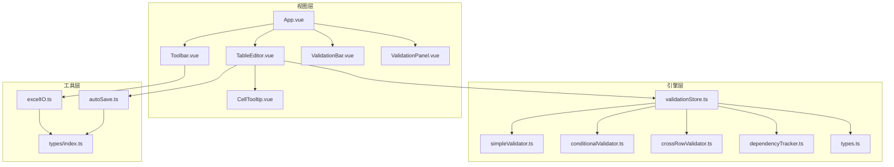
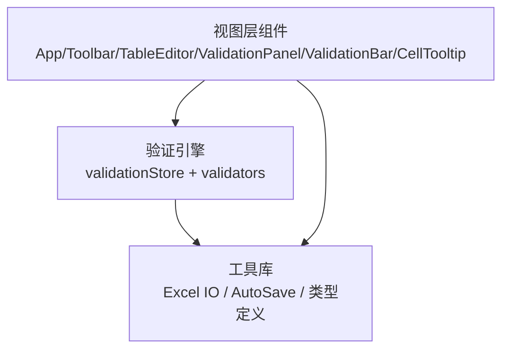
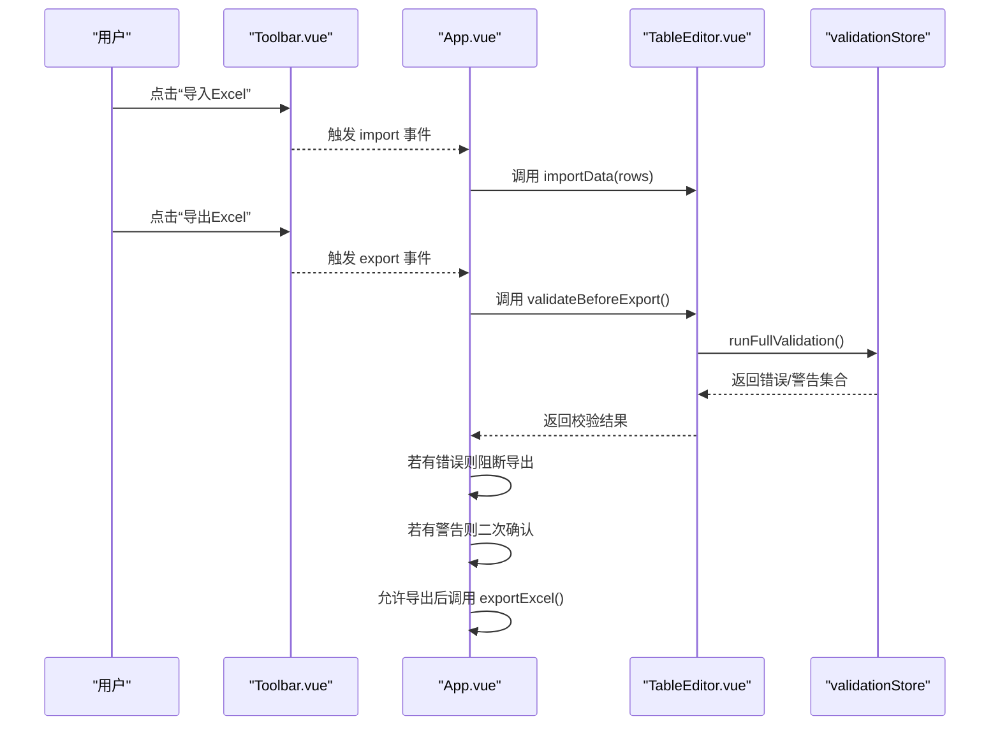
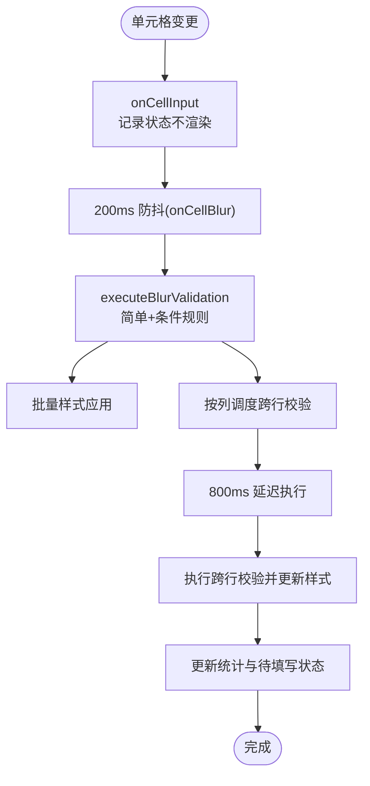
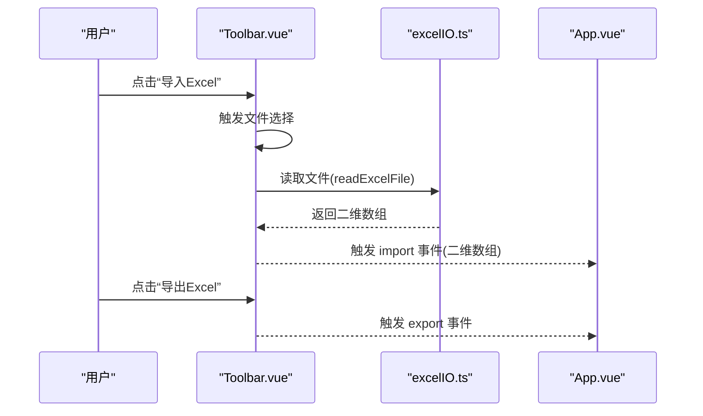
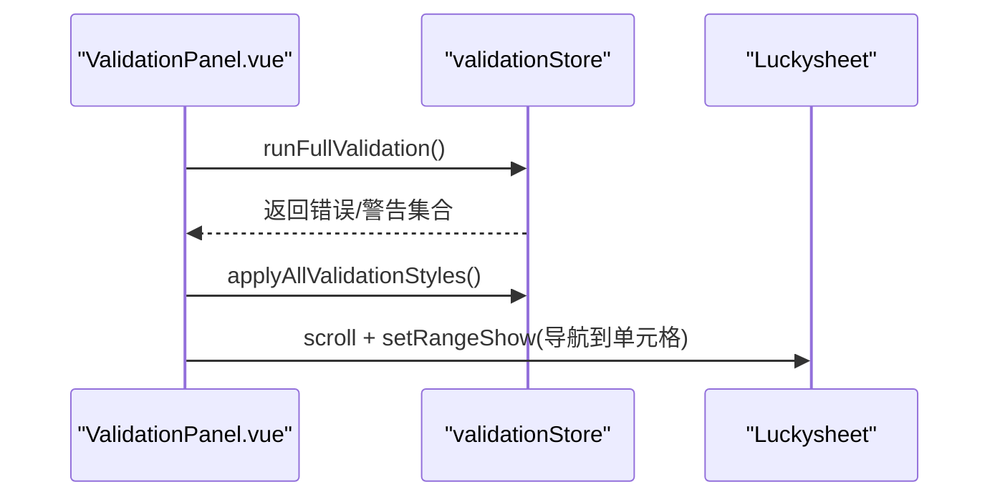
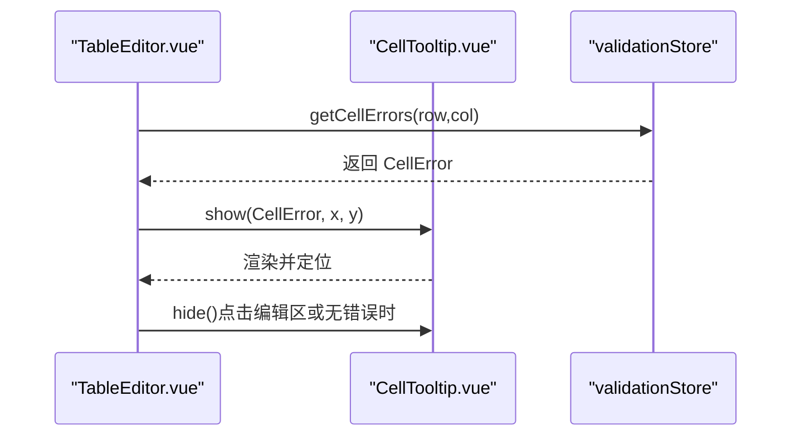
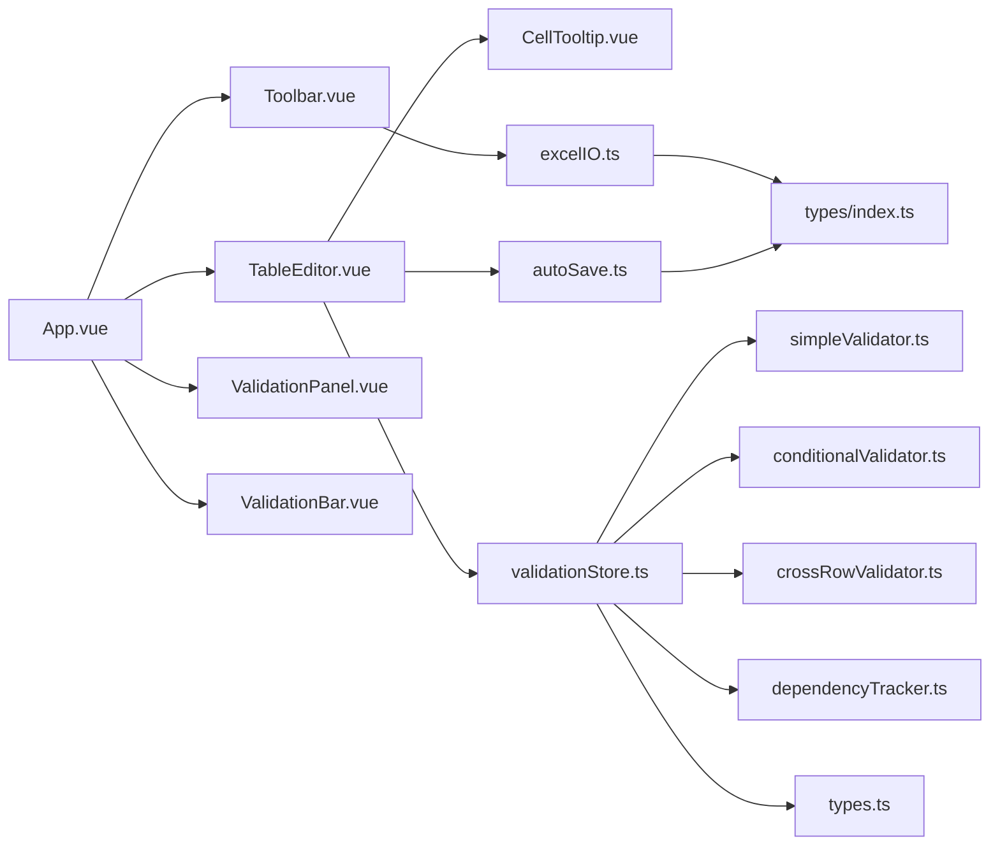

# 核心组件架构

<cite>
**本文档引用的文件**
- [App.vue](file://src/App.vue)
- [TableEditor.vue](file://src/components/TableEditor.vue)
- [Toolbar.vue](file://src/components/Toolbar.vue)
- [ValidationBar.vue](file://src/components/ValidationBar.vue)
- [ValidationPanel.vue](file://src/components/ValidationPanel.vue)
- [CellTooltip.vue](file://src/components/CellTooltip.vue)
- [validationStore.ts](file://src/engine/validationStore.ts)
- [types.ts](file://src/engine/types.ts)
- [simpleValidator.ts](file://src/engine/simpleValidator.ts)
- [conditionalValidator.ts](file://src/engine/conditionalValidator.ts)
- [crossRowValidator.ts](file://src/engine/crossRowValidator.ts)
- [dependencyTracker.ts](file://src/engine/dependencyTracker.ts)
- [index.ts](file://src/types/index.ts)
- [excelIO.ts](file://src/utils/excelIO.ts)
- [autoSave.ts](file://src/utils/autoSave.ts)
</cite>

## 目录
1. [简介](#简介)
2. [项目结构](#项目结构)
3. [核心组件](#核心组件)
4. [架构总览](#架构总览)
5. [组件详解](#组件详解)
6. [依赖关系分析](#依赖关系分析)
7. [性能考量](#性能考量)
8. [故障排查指南](#故障排查指南)
9. [结论](#结论)
10. [附录](#附录)

## 简介
本文件面向 SmartForm 的核心组件架构，围绕根组件 App.vue 与四大核心子组件展开，系统阐述组件层次结构、职责边界、数据流与交互机制。重点包括：
- TableEditor.vue 主编辑器：集成 Luckysheet，承载单元格编辑、样式应用与草稿恢复。
- Toolbar.vue 工具栏：负责导入/导出入口与事件分发。
- ValidationBar.vue 状态栏：展示全局统计与实时状态。
- ValidationPanel.vue 校验面板：提供错误/待填写项的可视化与导航。
- CellTooltip.vue 提示组件：在用户悬停或点击时提供错误信息反馈。

同时，文档解析验证引擎（validationStore.ts 及其子模块）如何支撑上述组件的实时校验、样式渲染与跨行一致性检查，并给出组件通信模式（props、events、refs）、最佳实践与扩展建议。

## 项目结构
SmartForm 采用“根组件 + 功能组件 + 引擎与工具”的分层组织方式：
- 根组件 App.vue 负责布局与顶层事件编排。
- components 子目录包含四个核心 UI 组件。
- engine 子目录封装验证规则、依赖追踪与状态管理。
- utils 子目录提供 Excel IO 与本地草稿能力。
- types 子目录提供类型定义与表头配置。

**图表来源**
- [App.vue:1-70](file://src/App.vue#L1-L70)
- [TableEditor.vue:1-399](file://src/components/TableEditor.vue#L1-L399)
- [Toolbar.vue:1-83](file://src/components/Toolbar.vue#L1-L83)
- [ValidationBar.vue:1-64](file://src/components/ValidationBar.vue#L1-L64)
- [ValidationPanel.vue:1-438](file://src/components/ValidationPanel.vue#L1-L438)
- [CellTooltip.vue:1-126](file://src/components/CellTooltip.vue#L1-L126)
- [validationStore.ts:1-474](file://src/engine/validationStore.ts#L1-L474)
- [simpleValidator.ts:1-419](file://src/engine/simpleValidator.ts#L1-L419)
- [conditionalValidator.ts:1-325](file://src/engine/conditionalValidator.ts#L1-L325)
- [crossRowValidator.ts:1-276](file://src/engine/crossRowValidator.ts#L1-L276)
- [dependencyTracker.ts:1-158](file://src/engine/dependencyTracker.ts#L1-L158)
- [types.ts:1-48](file://src/engine/types.ts#L1-L48)
- [excelIO.ts:1-105](file://src/utils/excelIO.ts#L1-L105)
- [autoSave.ts:1-71](file://src/utils/autoSave.ts#L1-L71)
- [index.ts:1-79](file://src/types/index.ts#L1-L79)

**章节来源**
- [App.vue:1-70](file://src/App.vue#L1-L70)
- [index.ts:1-79](file://src/types/index.ts#L1-L79)

## 核心组件
- App.vue：根容器，协调 Toolbar、TableEditor、ValidationPanel、ValidationBar 的布局与事件流转；通过 refs 与事件桥接导入/导出与校验。
- TableEditor.vue：主编辑器，集成 Luckysheet，负责初始化、单元格事件钩子、草稿恢复、自动保存、导出前校验与 Tooltip 展示。
- Toolbar.vue：工具栏，提供导入/导出按钮与文件选择器，向上游 App.vue 发送 import/export 事件。
- ValidationBar.vue：状态栏，订阅 validationStore 的统计状态，展示错误/警告数量与填写进度。
- ValidationPanel.vue：校验面板，提供错误与待填写项的分组列表、标签页切换、导航至单元格与重新校验功能。
- CellTooltip.vue：提示组件，Teleport 到 body，按严重度渲染错误消息，支持边界自适应定位。

**章节来源**
- [App.vue:1-70](file://src/App.vue#L1-L70)
- [TableEditor.vue:1-399](file://src/components/TableEditor.vue#L1-L399)
- [Toolbar.vue:1-83](file://src/components/Toolbar.vue#L1-L83)
- [ValidationBar.vue:1-64](file://src/components/ValidationBar.vue#L1-L64)
- [ValidationPanel.vue:1-438](file://src/components/ValidationPanel.vue#L1-L438)
- [CellTooltip.vue:1-126](file://src/components/CellTooltip.vue#L1-L126)

## 架构总览
SmartForm 采用“视图层组件 + 验证引擎 + 工具库”的分层架构。视图层组件通过事件与暴露方法与引擎交互，引擎集中管理校验状态、样式批处理与跨行一致性检查，工具库提供 Excel IO 与草稿持久化。

**图表来源**
- [validationStore.ts:1-474](file://src/engine/validationStore.ts#L1-L474)
- [excelIO.ts:1-105](file://src/utils/excelIO.ts#L1-L105)
- [autoSave.ts:1-71](file://src/utils/autoSave.ts#L1-L71)
- [types.ts:1-48](file://src/engine/types.ts#L1-L48)
- [index.ts:1-79](file://src/types/index.ts#L1-L79)

## 组件详解

### App.vue 根组件
- 布局：顶部 Toolbar、中部主编辑区（TableEditor + ValidationPanel）、底部 ValidationBar。
- 事件桥接：Toolbar 的 import/export 事件经由 App.vue 转发至 TableEditor；导出前调用 TableEditor.validateBeforeExport() 并结合 validationStore 的全量校验结果决定是否允许导出。
- 交互控制：通过 showPanel 控制 ValidationPanel 的显隐；通过 tableEditorRef 暴露的方法与实例交互。
- 样式：基础全局样式与容器布局，确保全屏与滚动兼容。

**图表来源**
- [App.vue:18-40](file://src/App.vue#L18-L40)
- [Toolbar.vue:27-56](file://src/components/Toolbar.vue#L27-L56)
- [TableEditor.vue:239-273](file://src/components/TableEditor.vue#L239-L273)
- [validationStore.ts:408-452](file://src/engine/validationStore.ts#L408-L452)
- [excelIO.ts:61-104](file://src/utils/excelIO.ts#L61-L104)

**章节来源**
- [App.vue:1-70](file://src/App.vue#L1-L70)

### TableEditor.vue 主编辑器
- 初始化：通过 window.luckysheet.create 初始化表格，设置语言、冻结首行、默认行列尺寸与列宽配置；注册 hook 实现输入即校验、失焦校验与点击行为。
- 即时校验：cellUpdated 钩子触发 validation.onCellInput，仅记录状态，不立即渲染样式。
- 失焦校验：cellUpdated 后的 200ms 防抖，执行 executeBlurValidation，合并简单/条件规则结果，应用样式并调度跨行校验。
- 跨行校验：按列延迟执行 validateCrossRowByCol，清理旧跨行结果并写入新结果，同步更新样式与统计。
- Tooltip：cellMousedown 触发上次单元格 onBlur，随后根据当前选中区域显示 CellTooltip；点击编辑区隐藏 Tooltip。
- 草稿与自动保存：启动/停止自动保存定时器；导入后全量校验并应用样式；支持草稿恢复对话框。
- 导出前校验：runFullValidation + applyAllValidationStyles，错误弹窗、警告二次确认。

**图表来源**
- [TableEditor.vue:108-127](file://src/components/TableEditor.vue#L108-L127)
- [validationStore.ts:248-344](file://src/engine/validationStore.ts#L248-L344)

**章节来源**
- [TableEditor.vue:1-399](file://src/components/TableEditor.vue#L1-L399)
- [validationStore.ts:1-474](file://src/engine/validationStore.ts#L1-L474)

### Toolbar.vue 工具栏
- 功能：标题、导入/导出按钮、隐藏/显示校验面板按钮。
- 交互：点击导入打开文件选择器；文件读取成功后通过 import 事件向上传递二维数组；点击导出触发 export 事件。
- 文件处理：readExcelFile 使用 xlsx 解析，标准化为字符串二维数组；错误通过 Element Plus 消息提示。

**图表来源**
- [Toolbar.vue:34-56](file://src/components/Toolbar.vue#L34-L56)
- [excelIO.ts:10-56](file://src/utils/excelIO.ts#L10-L56)
- [App.vue:29-39](file://src/App.vue#L29-L39)

**章节来源**
- [Toolbar.vue:1-83](file://src/components/Toolbar.vue#L1-L83)
- [excelIO.ts:1-105](file://src/utils/excelIO.ts#L1-L105)

### ValidationBar.vue 状态栏
- 数据来源：直接订阅 validationStore.state，展示已填写行/总行数、错误数、警告数与“无问题”状态。
- 渲染策略：根据 severity 与计数动态显示不同颜色与文案。

**章节来源**
- [ValidationBar.vue:1-64](file://src/components/ValidationBar.vue#L1-L64)
- [validationStore.ts:15-22](file://src/engine/validationStore.ts#L15-L22)

### ValidationPanel.vue 校验面板
- 结构：概览统计（错误/警告/待填写）、标签页（校验问题/待填写）、列表与底部操作。
- 数据：computed 分组错误（按行）、待填写项（依赖追踪描述）；导航到单元格使用 Luckysheet API。
- 交互：点击错误项跳转到对应单元格；点击“重新校验”触发 runFullValidation + applyAllValidationStyles。

**图表来源**
- [ValidationPanel.vue:196-200](file://src/components/ValidationPanel.vue#L196-L200)
- [validationStore.ts:408-452](file://src/engine/validationStore.ts#L408-L452)

**章节来源**
- [ValidationPanel.vue:1-438](file://src/components/ValidationPanel.vue#L1-L438)
- [dependencyTracker.ts:94-102](file://src/engine/dependencyTracker.ts#L94-L102)

### CellTooltip.vue 提示组件
- 功能：接收 CellError 与坐标，计算边界自适应位置，渲染多条消息与严重度图标。
- 通信：通过 defineExpose 暴露 show/hide 方法，供 TableEditor 调用。
- 渲染：Teleport 到 body，固定定位，带淡入动画。

**图表来源**
- [TableEditor.vue:130-156](file://src/components/TableEditor.vue#L130-L156)
- [CellTooltip.vue:49-68](file://src/components/CellTooltip.vue#L49-L68)
- [validationStore.ts:385-391](file://src/engine/validationStore.ts#L385-L391)

**章节来源**
- [CellTooltip.vue:1-126](file://src/components/CellTooltip.vue#L1-L126)
- [TableEditor.vue:1-399](file://src/components/TableEditor.vue#L1-L399)

## 依赖关系分析
- 组件耦合
  - App.vue 与 TableEditor.vue 通过 ref 与事件双向协作；App.vue 与 Toolbar.vue 通过事件解耦。
  - TableEditor.vue 与 CellTooltip.vue 通过 ref 直接调用；与 validationStore 通过函数调用解耦。
  - ValidationPanel.vue 与 validationStore 通过 state 订阅与函数调用交互。
- 引擎依赖
  - validationStore.ts 作为中央状态与调度中心，依赖 simpleValidator、conditionalValidator、crossRowValidator、dependencyTracker 与 types。
  - 所有校验函数均通过 window.luckysheet API 读取/写入数据，避免直接耦合具体实现。
- 工具依赖
  - excelIO.ts 与 autoSave.ts 依赖 types/index.ts 中的表头与数据结构定义。

**图表来源**
- [App.vue:1-70](file://src/App.vue#L1-L70)
- [TableEditor.vue:1-399](file://src/components/TableEditor.vue#L1-L399)
- [Toolbar.vue:1-83](file://src/components/Toolbar.vue#L1-L83)
- [ValidationPanel.vue:1-438](file://src/components/ValidationPanel.vue#L1-L438)
- [ValidationBar.vue:1-64](file://src/components/ValidationBar.vue#L1-L64)
- [CellTooltip.vue:1-126](file://src/components/CellTooltip.vue#L1-L126)
- [validationStore.ts:1-474](file://src/engine/validationStore.ts#L1-L474)
- [simpleValidator.ts:1-419](file://src/engine/simpleValidator.ts#L1-L419)
- [conditionalValidator.ts:1-325](file://src/engine/conditionalValidator.ts#L1-L325)
- [crossRowValidator.ts:1-276](file://src/engine/crossRowValidator.ts#L1-L276)
- [dependencyTracker.ts:1-158](file://src/engine/dependencyTracker.ts#L1-L158)
- [types.ts:1-48](file://src/engine/types.ts#L1-L48)
- [excelIO.ts:1-105](file://src/utils/excelIO.ts#L1-L105)
- [autoSave.ts:1-71](file://src/utils/autoSave.ts#L1-L71)
- [index.ts:1-79](file://src/types/index.ts#L1-L79)

**章节来源**
- [validationStore.ts:1-474](file://src/engine/validationStore.ts#L1-L474)
- [simpleValidator.ts:1-419](file://src/engine/simpleValidator.ts#L1-L419)
- [conditionalValidator.ts:1-325](file://src/engine/conditionalValidator.ts#L1-L325)
- [crossRowValidator.ts:1-276](file://src/engine/crossRowValidator.ts#L1-L276)
- [dependencyTracker.ts:1-158](file://src/engine/dependencyTracker.ts#L1-L158)
- [excelIO.ts:1-105](file://src/utils/excelIO.ts#L1-L105)
- [autoSave.ts:1-71](file://src/utils/autoSave.ts#L1-L71)
- [index.ts:1-79](file://src/types/index.ts#L1-L79)

## 性能考量
- 防抖与批处理
  - onCellBlur 使用 200ms 防抖，减少频繁校验与样式更新。
  - applyCellStyle 与 applyAllValidationStyles 使用批处理队列，flushStyleBatch 合并多次样式变更，降低 Luckysheet 重绘成本。
- 跨行校验延迟
  - 按列延迟执行跨行校验（800ms），避免全量扫描导致卡顿。
- 统计缓存
  - requestAnimationFrame 批量更新统计，避免高频遍历。
- DOM 与全局事件
  - Shift+滚轮横向滚动通过操作 Luckysheet 自带横向滚动条，避免直接修改 scrollLeft 的无效渲染。
- 本地存储
  - 自动保存周期 30s，避免频繁 IO；草稿恢复采用对话框确认，防止误触。

**章节来源**
- [validationStore.ts:240-344](file://src/engine/validationStore.ts#L240-L344)
- [TableEditor.vue:355-382](file://src/components/TableEditor.vue#L355-L382)
- [autoSave.ts:276-291](file://src/utils/autoSave.ts#L276-L291)

## 故障排查指南
- Luckysheet 未加载
  - 现象：初始化失败或 API 不存在。
  - 排查：确认 CDN 引入；检查 window.luckysheet 是否可用。
  - 相关代码路径：[TableEditor.vue:56-61](file://src/components/TableEditor.vue#L56-L61)
- 导入失败
  - 现象：Element Plus 错误提示。
  - 排查：检查文件格式、大小与浏览器兼容性；查看 readExcelFile 的异常分支。
  - 相关代码路径：[Toolbar.vue:47-49](file://src/components/Toolbar.vue#L47-L49)、[excelIO.ts:49-55](file://src/utils/excelIO.ts#L49-L55)
- 导出前未通过校验
  - 现象：弹窗提示错误数量与前若干条明细；警告需二次确认。
  - 排查：检查 runFullValidation 返回值与 applyAllValidationStyles 是否执行。
  - 相关代码路径：[TableEditor.vue:240-273](file://src/components/TableEditor.vue#L240-L273)、[validationStore.ts:408-452](file://src/engine/validationStore.ts#L408-L452)
- Tooltip 无法显示
  - 现象：点击单元格无提示。
  - 排查：确认 getRange 成功、当前单元格非表头、存在错误；检查 __lastMouseEvent 是否更新。
  - 相关代码路径：[TableEditor.vue:130-156](file://src/components/TableEditor.vue#L130-L156)
- 草稿恢复异常
  - 现象：恢复对话框未弹出或恢复失败。
  - 排查：检查 localStorage 键值、JSON 结构与 loadFromLocal 解析；确认 celldata 存在。
  - 相关代码路径：[TableEditor.vue:218-237](file://src/components/TableEditor.vue#L218-L237)、[autoSave.ts:17-26](file://src/utils/autoSave.ts#L17-L26)

**章节来源**
- [TableEditor.vue:56-61](file://src/components/TableEditor.vue#L56-L61)
- [Toolbar.vue:47-49](file://src/components/Toolbar.vue#L47-L49)
- [excelIO.ts:49-55](file://src/utils/excelIO.ts#L49-L55)
- [TableEditor.vue:240-273](file://src/components/TableEditor.vue#L240-L273)
- [validationStore.ts:408-452](file://src/engine/validationStore.ts#L408-L452)
- [TableEditor.vue:130-156](file://src/components/TableEditor.vue#L130-L156)
- [autoSave.ts:17-26](file://src/utils/autoSave.ts#L17-L26)

## 结论
SmartForm 的核心组件通过清晰的职责划分与事件/方法通信模式，实现了高内聚、低耦合的编辑与校验体系。引擎层将复杂规则抽象为可组合的校验器，配合批处理与延迟策略，有效平衡了实时性与性能。UI 组件以最小侵入的方式接入引擎，既保证了良好的用户体验，也为后续扩展（如新增规则、面板功能）提供了稳定基座。

## 附录

### 组件通信模式速览
- Props 传递
  - ValidationPanel.visible：控制面板显隐。
  - 表头配置：HEADER_COLUMNS 由 types/index.ts 提供，TableEditor 与 Excel 导出共同消费。
- Events 触发
  - Toolbar.import：携带二维数组数据。
  - Toolbar.export：触发导出流程。
  - ValidationPanel.close：关闭面板。
- Refs 使用
  - App.vue 通过 tableEditorRef 调用 importData 与 validateBeforeExport。
  - TableEditor.vue 通过 cellTooltipRef 调用 show/hide。

**章节来源**
- [App.vue:26-39](file://src/App.vue#L26-L39)
- [Toolbar.vue:27-56](file://src/components/Toolbar.vue#L27-L56)
- [ValidationPanel.vue:105-106](file://src/components/ValidationPanel.vue#L105-L106)
- [TableEditor.vue:21-21](file://src/components/TableEditor.vue#L21-L21)
- [index.ts:44-75](file://src/types/index.ts#L44-L75)

### 最佳实践与扩展指南
- 新增校验规则
  - 在 simpleValidator/conditionalValidator/crossRowValidator 中添加规则函数，返回 ValidationResult；在 validationStore 中按需调用并写入状态。
  - 注意区分 ON_INPUT（轻量格式校验）与 ON_BLUR（完整规则校验）的职责边界。
- 优化性能
  - 大表场景下优先使用批处理样式与延迟跨行校验；必要时增加列级缓存与增量更新。
- 用户体验
  - Tooltip 与 ValidationPanel 的消息需简洁明确；严重度分级与颜色搭配保持一致。
- 可维护性
  - 依赖追踪与规则描述尽量集中管理；对外暴露稳定的函数接口，避免直接操作 Luckysheet API。

**章节来源**
- [simpleValidator.ts:275-325](file://src/engine/simpleValidator.ts#L275-L325)
- [conditionalValidator.ts:183-220](file://src/engine/conditionalValidator.ts#L183-L220)
- [crossRowValidator.ts:244-251](file://src/engine/crossRowValidator.ts#L244-L251)
- [validationStore.ts:102-148](file://src/engine/validationStore.ts#L102-L148)