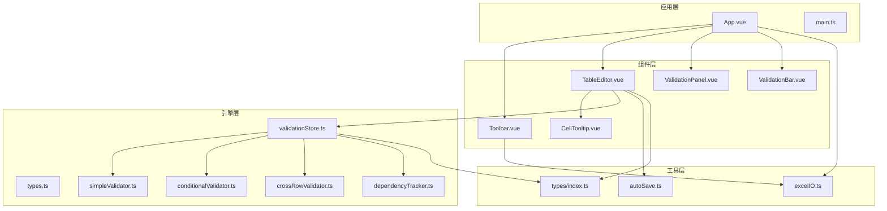
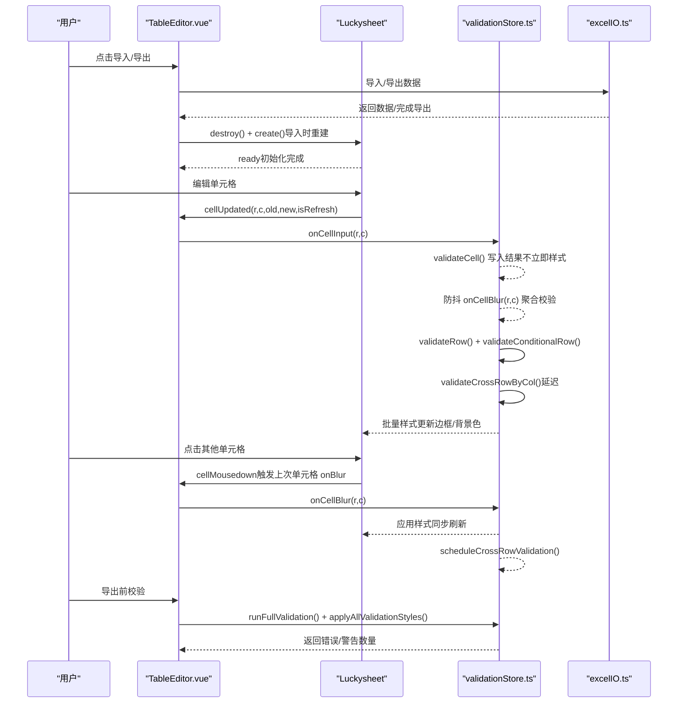
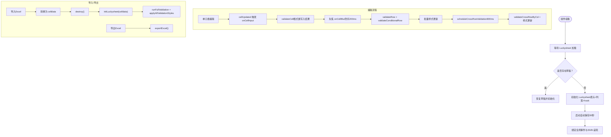
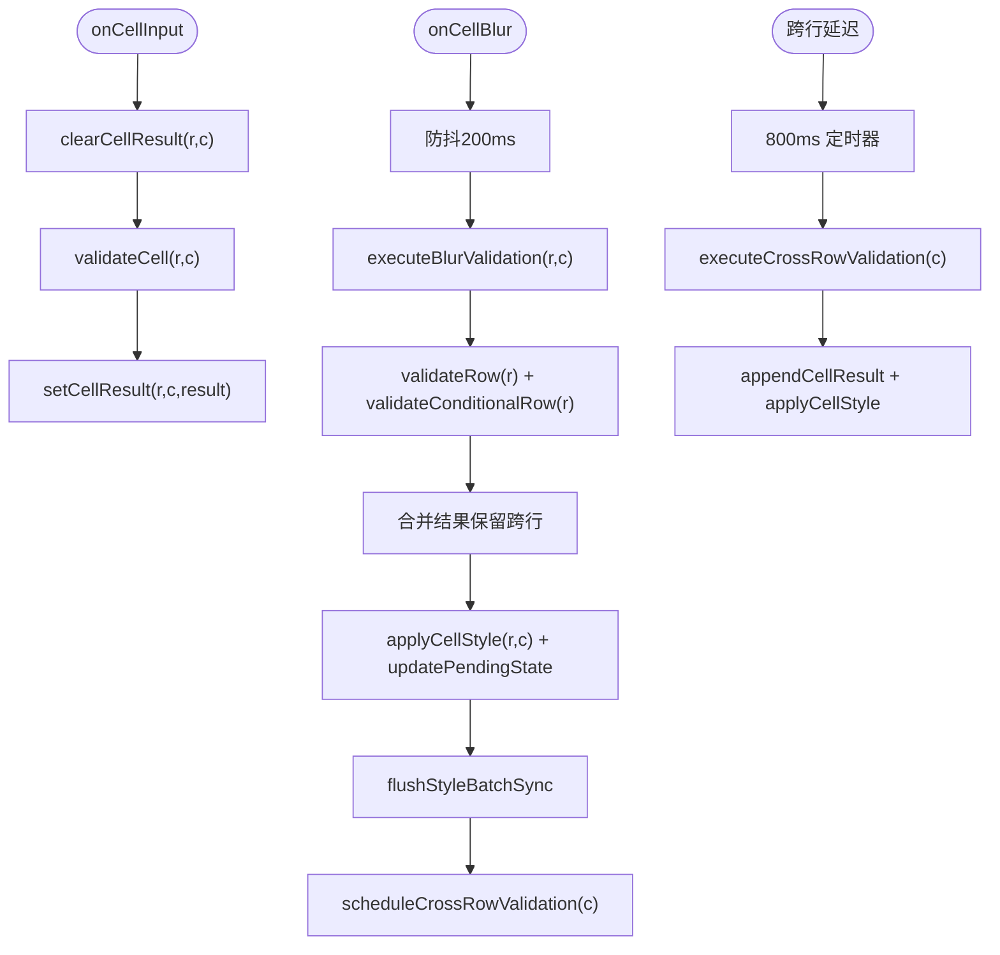
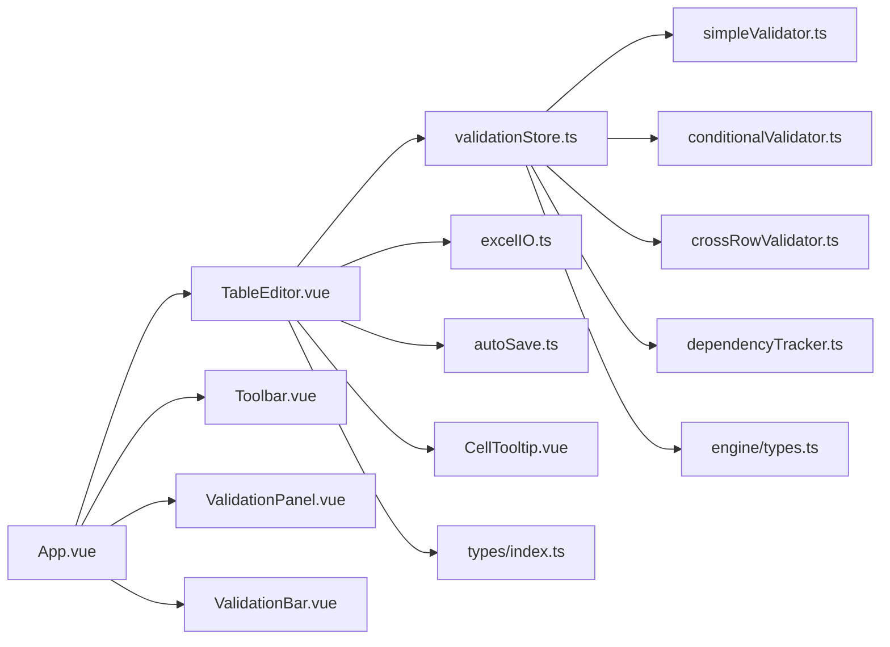

# 表格编辑器组件

<cite>
**本文引用的文件**
- [TableEditor.vue](file://src/components/TableEditor.vue)
- [validationStore.ts](file://src/engine/validationStore.ts)
- [types.ts](file://src/engine/types.ts)
- [excelIO.ts](file://src/utils/excelIO.ts)
- [index.ts](file://src/types/index.ts)
- [simpleValidator.ts](file://src/engine/simpleValidator.ts)
- [conditionalValidator.ts](file://src/engine/conditionalValidator.ts)
- [crossRowValidator.ts](file://src/engine/crossRowValidator.ts)
- [dependencyTracker.ts](file://src/engine/dependencyTracker.ts)
- [autoSave.ts](file://src/utils/autoSave.ts)
- [CellTooltip.vue](file://src/components/CellTooltip.vue)
- [ValidationBar.vue](file://src/components/ValidationBar.vue)
- [ValidationPanel.vue](file://src/components/ValidationPanel.vue)
- [Toolbar.vue](file://src/components/Toolbar.vue)
- [App.vue](file://src/App.vue)
- [main.ts](file://src/main.ts)
</cite>

## 目录
1. [简介](#简介)
2. [项目结构](#项目结构)
3. [核心组件](#核心组件)
4. [架构总览](#架构总览)
5. [详细组件分析](#详细组件分析)
6. [依赖关系分析](#依赖关系分析)
7. [性能考量](#性能考量)
8. [故障排查指南](#故障排查指南)
9. [结论](#结论)
10. [附录](#附录)

## 简介
本文件针对 TableEditor.vue 表格编辑器组件进行全面技术文档化，重点阐述 Luckysheet 集成实现、表格渲染机制、用户交互处理、与校验引擎的联动、数据导入导出流程、数据同步与草稿恢复、错误状态管理、配置选项、API 接口与扩展能力，并提供最佳实践、性能优化建议与常见问题解决方案。

## 项目结构
该项目采用 Vue 3 + TypeScript + Element Plus 的前端架构，围绕“表格编辑器 + 校验引擎 + IO 工具”的模块化设计组织代码。核心文件分布如下：
- 组件层：TableEditor.vue、CellTooltip.vue、ValidationBar.vue、ValidationPanel.vue、Toolbar.vue
- 引擎层：validationStore.ts、simpleValidator.ts、conditionalValidator.ts、crossRowValidator.ts、dependencyTracker.ts、types.ts
- 工具层：excelIO.ts、autoSave.ts
- 类型定义：types/index.ts
- 应用入口：App.vue、main.ts

图表来源
- [App.vue:1-70](file://src/App.vue#L1-L70)
- [main.ts:1-9](file://src/main.ts#L1-L9)
- [Toolbar.vue:1-83](file://src/components/Toolbar.vue#L1-L83)
- [TableEditor.vue:1-399](file://src/components/TableEditor.vue#L1-L399)
- [CellTooltip.vue:1-126](file://src/components/CellTooltip.vue#L1-L126)
- [ValidationBar.vue:1-64](file://src/components/ValidationBar.vue#L1-L64)
- [ValidationPanel.vue:1-438](file://src/components/ValidationPanel.vue#L1-L438)
- [validationStore.ts:1-474](file://src/engine/validationStore.ts#L1-L474)
- [simpleValidator.ts:1-419](file://src/engine/simpleValidator.ts#L1-L419)
- [conditionalValidator.ts:1-325](file://src/engine/conditionalValidator.ts#L1-L325)
- [crossRowValidator.ts:1-276](file://src/engine/crossRowValidator.ts#L1-L276)
- [dependencyTracker.ts:1-158](file://src/engine/dependencyTracker.ts#L1-L158)
- [excelIO.ts:1-105](file://src/utils/excelIO.ts#L1-L105)
- [autoSave.ts:1-71](file://src/utils/autoSave.ts#L1-L71)
- [index.ts:1-79](file://src/types/index.ts#L1-L79)

章节来源
- [App.vue:1-70](file://src/App.vue#L1-L70)
- [main.ts:1-9](file://src/main.ts#L1-L9)

## 核心组件
- TableEditor.vue：Luckysheet 容器与生命周期管理；单元格事件钩子；导入/导出；草稿恢复；自动保存；Shift+滚轮横向滚动增强。
- validationStore.ts：校验状态、统计、样式批处理、防抖/延迟策略、全量校验与清理。
- simpleValidator.ts：基础规则（必填、格式、枚举、日期、身份证、客户类型等）。
- conditionalValidator.ts：条件触发规则（依赖于其他字段的必填/必填条件）。
- crossRowValidator.ts：跨行唯一性、一致性、日期顺序、同名客户一致性。
- dependencyTracker.ts：依赖关系追踪，计算受影响目标列与“待填写”状态。
- excelIO.ts：Excel 读取与导出（XLSX + file-saver）。
- autoSave.ts：本地草稿保存与恢复（localStorage）。
- CellTooltip.vue：单元格错误提示气泡。
- ValidationBar.vue / ValidationPanel.vue：校验统计与面板展示。
- Toolbar.vue：导入/导出按钮与文件选择。
- types/index.ts：表头列、单元格数据、Luckysheet 全局类型、自动保存键。
- engine/types.ts：校验严重度、结果、规则、单元格错误、消息净化。

章节来源
- [TableEditor.vue:1-399](file://src/components/TableEditor.vue#L1-L399)
- [validationStore.ts:1-474](file://src/engine/validationStore.ts#L1-L474)
- [simpleValidator.ts:1-419](file://src/engine/simpleValidator.ts#L1-L419)
- [conditionalValidator.ts:1-325](file://src/engine/conditionalValidator.ts#L1-L325)
- [crossRowValidator.ts:1-276](file://src/engine/crossRowValidator.ts#L1-L276)
- [dependencyTracker.ts:1-158](file://src/engine/dependencyTracker.ts#L1-L158)
- [excelIO.ts:1-105](file://src/utils/excelIO.ts#L1-L105)
- [autoSave.ts:1-71](file://src/utils/autoSave.ts#L1-L71)
- [CellTooltip.vue:1-126](file://src/components/CellTooltip.vue#L1-L126)
- [ValidationBar.vue:1-64](file://src/components/ValidationBar.vue#L1-L64)
- [ValidationPanel.vue:1-438](file://src/components/ValidationPanel.vue#L1-L438)
- [Toolbar.vue:1-83](file://src/components/Toolbar.vue#L1-L83)
- [types/index.ts:1-79](file://src/types/index.ts#L1-L79)
- [engine/types.ts:1-48](file://src/engine/types.ts#L1-L48)

## 架构总览
TableEditor 作为核心容器，负责：
- 初始化 Luckysheet 并注入表头与列宽配置；
- 注册 cellUpdateBefore、cellUpdated、cellMousedown 等钩子；
- 与校验引擎协作：输入即校验（轻量）、失焦聚合校验（含跨行延迟）、导出前全量校验；
- 与 IO 工具协作：导入 Excel 数据、导出 Excel；
- 与工具层协作：自动保存草稿、恢复草稿；
- 与 UI 层协作：CellTooltip 错误提示、ValidationBar/ValidationPanel 展示。

图表来源
- [TableEditor.vue:55-127](file://src/components/TableEditor.vue#L55-L127)
- [validationStore.ts:248-344](file://src/engine/validationStore.ts#L248-L344)
- [excelIO.ts:61-104](file://src/utils/excelIO.ts#L61-L104)

## 详细组件分析

### TableEditor.vue 组件详解
- 模板与容器
  - 提供 Luckysheet 容器节点与 CellTooltip 子组件。
- 生命周期与初始化
  - onMounted：延时等待 Luckysheet 加载，检查并恢复草稿，初始化 Luckysheet，启动自动保存，绑定全局鼠标事件与 Shift+滚轮横向滚动。
  - onBeforeUnmount：停止自动保存、移除事件监听、清理校验定时器。
- Luckysheet 初始化
  - 构建表头行 celldata 与列宽配置，冻结首行，设置语言、工具栏、统计栏、默认行列尺寸、允许添加行等。
  - 注册 hook：
    - cellUpdateBefore：禁止编辑表头行；
    - cellUpdated：记录上次编辑单元格，触发 onCellInput；
    - cellMousedown：触发上次单元格 onBlur，延迟显示 Tooltip。
- 数据导入
  - 将二维数组转换为 celldata，destroy 后重建，随后执行全量校验并应用样式。
- 导出前校验
  - 调用 runFullValidation，若存在错误则弹窗提示；若存在警告则二次确认。
- 自动保存与草稿恢复
  - 每 30 秒保存一次当前 celldata 至 localStorage；启动时尝试恢复草稿。
- 用户交互增强
  - Shift+滚轮横向滚动：捕获 wheel 事件，修改 Luckysheet 横向滚动条 scrollLeft，触发其内部 scroll 事件以更新虚拟滚动。

图表来源
- [TableEditor.vue:293-328](file://src/components/TableEditor.vue#L293-L328)
- [TableEditor.vue:55-127](file://src/components/TableEditor.vue#L55-L127)
- [TableEditor.vue:184-215](file://src/components/TableEditor.vue#L184-L215)
- [TableEditor.vue:275-291](file://src/components/TableEditor.vue#L275-L291)

章节来源
- [TableEditor.vue:1-399](file://src/components/TableEditor.vue#L1-L399)

### 校验引擎 validationStore.ts
- 状态与统计
  - results：按单元格键存储 ValidationResult 数组；
  - errorCount/warningCount/filledRows/totalRows：通过 requestAnimationFrame 批量更新，避免频繁遍历；
  - pendingCells：待填写集合。
- 样式批处理
  - styleBatch 队列 + flushStyleBatch，合并多次 setCellFormat 调用，最后统一刷新；
  - applyAllValidationStyles：导出前全量应用样式（含空格占位 hack）。
- 输入/失焦/跨行策略
  - onCellInput：仅 validateCell，不更新样式；
  - onCellBlur：防抖 200ms，执行行级简单+条件校验，保留跨行结果，更新受影响列样式，延迟执行跨行校验；
  - scheduleCrossRowValidation：800ms 延迟，执行 validateCrossRowByCol。
- 全量校验
  - runFullValidation：清理定时器，清空结果与待填写，依次执行简单、条件、跨行全量校验，更新统计与待填写状态。

图表来源
- [validationStore.ts:248-344](file://src/engine/validationStore.ts#L248-L344)

章节来源
- [validationStore.ts:1-474](file://src/engine/validationStore.ts#L1-L474)

### 规则实现模块
- simpleValidator.ts：必填、格式（面积、日期、身份证、客户类型、楼层、房号、房产类型）。
- conditionalValidator.ts：条件触发规则（售楼日期、业主/租户客户类型、企业联系人、出租开始/结束日期、租户客户名称等）。
- crossRowValidator.ts：跨行唯一性（房产简称）、一致性（租户证件号码与客户名称）、日期顺序（收房/售楼）、同名客户一致性（电话/证件）。
- dependencyTracker.ts：依赖关系定义与查询，计算受影响目标列、待填写状态与描述。

章节来源
- [simpleValidator.ts:1-419](file://src/engine/simpleValidator.ts#L1-L419)
- [conditionalValidator.ts:1-325](file://src/engine/conditionalValidator.ts#L1-L325)
- [crossRowValidator.ts:1-276](file://src/engine/crossRowValidator.ts#L1-L276)
- [dependencyTracker.ts:1-158](file://src/engine/dependencyTracker.ts#L1-L158)

### IO 与数据同步
- excelIO.ts
  - 导入：FileReader + XLSX，跳过表头，标准化每行最多 30 列，日期格式化为 YYYY-MM-DD。
  - 导出：读取 Luckysheet flowdata，构建包含表头的二维数组，过滤全空行，设置列宽，生成 xlsx 并下载。
- autoSave.ts
  - 保存：将 celldata 与时间戳写入 localStorage；
  - 恢复：读取草稿，区分“恢复/忽略”，导入后执行全量校验与样式应用；
  - 当前数据：遍历 flowdata，收集非空单元格为 celldata。
- 类型定义
  - HEADER_COLUMNS：30 列表头定义；
  - CellData/LuckysheetGlobal：Luckysheet 单元格与全局 API 类型；
  - AUTO_SAVE_KEY：localStorage 键名。

章节来源
- [excelIO.ts:1-105](file://src/utils/excelIO.ts#L1-L105)
- [autoSave.ts:1-71](file://src/utils/autoSave.ts#L1-L71)
- [index.ts:1-79](file://src/types/index.ts#L1-L79)

### UI 与交互
- CellTooltip.vue：Teleport 到 body，根据严重度显示不同图标与颜色，边界自适应定位。
- ValidationBar.vue：展示已填写行数与错误/警告计数。
- ValidationPanel.vue：分页签展示错误与待填写项，支持导航到单元格、重新校验。
- Toolbar.vue：导入/导出按钮与文件选择，向上抛出 import/export 事件。

章节来源
- [CellTooltip.vue:1-126](file://src/components/CellTooltip.vue#L1-L126)
- [ValidationBar.vue:1-64](file://src/components/ValidationBar.vue#L1-L64)
- [ValidationPanel.vue:1-438](file://src/components/ValidationPanel.vue#L1-L438)
- [Toolbar.vue:1-83](file://src/components/Toolbar.vue#L1-L83)

## 依赖关系分析
- 组件耦合
  - TableEditor 依赖 validationStore、excelIO、autoSave、CellTooltip、types；
  - App.vue 作为编排者，协调 Toolbar、TableEditor、ValidationPanel、ValidationBar。
- 校验引擎内聚
  - validationStore 聚合 simple/conditional/crossRow/dependency 模块，统一状态与样式输出。
- 外部依赖
  - Luckysheet 全局 API（getSheetData/flowdata/getCellValue/setCellValue/setCellFormat/getRange/destroy）；
  - XLSX 与 file-saver 用于 Excel IO；
  - Element Plus 用于 UI 组件与消息提示。

图表来源
- [TableEditor.vue:13-22](file://src/components/TableEditor.vue#L13-L22)
- [validationStore.ts:1-12](file://src/engine/validationStore.ts#L1-L12)
- [App.vue:1-16](file://src/App.vue#L1-L16)

章节来源
- [TableEditor.vue:13-22](file://src/components/TableEditor.vue#L13-L22)
- [validationStore.ts:1-12](file://src/engine/validationStore.ts#L1-L12)
- [App.vue:1-16](file://src/App.vue#L1-L16)

## 性能考量
- 样式批处理
  - 使用 styleBatch 队列与 flushStyleBatch 合并 setCellFormat 调用，减少 Luckysheet 重绘次数。
- 防抖与延迟
  - onCellBlur 防抖 200ms，跨行校验延迟 800ms，降低 CPU 压力与闪烁。
- 统计缓存
  - requestAnimationFrame 批量更新 errorCount/warningCount/filledRows/totalRows，避免高频遍历。
- 数据缓存
  - simpleValidator 中缓存 flowdata 与版本号，invalidateDataCache 在数据变更时失效。
- DOM 事件节流
  - Shift+滚轮横向滚动在捕获阶段阻止默认行为，避免 Luckysheet 内部竖向滚动干扰。
- 导出优化
  - 导出前一次性 applyAllValidationStyles，避免逐单元格刷新。

章节来源
- [validationStore.ts:98-148](file://src/engine/validationStore.ts#L98-L148)
- [validationStore.ts:240-344](file://src/engine/validationStore.ts#L240-L344)
- [simpleValidator.ts:10-25](file://src/engine/simpleValidator.ts#L10-L25)
- [TableEditor.vue:355-382](file://src/components/TableEditor.vue#L355-L382)

## 故障排查指南
- Luckysheet 未加载
  - 现象：控制台提示未加载，请检查 CDN 引入；
  - 处理：确认页面已正确引入 Luckysheet 资源。
- 导入失败
  - 现象：导入弹出错误消息；
  - 处理：检查文件格式（.xlsx/.xls）、文件大小限制、浏览器兼容性。
- 导出前被拦截
  - 现象：存在错误或警告导致无法导出；
  - 处理：打开校验面板查看具体问题，修复后再次导出。
- 草稿恢复
  - 现象：启动时询问是否恢复草稿；
  - 处理：确认恢复将覆盖当前编辑内容，忽略则重新开始。
- 样式不生效
  - 现象：单元格边框/背景色未更新；
  - 处理：确认 Luckysheet 实例可用；导出前使用 applyAllValidationStyles；检查批处理刷新时机。
- Shift+滚轮无效
  - 现象：横向滚动无效果；
  - 处理：确保事件监听已注册；确认 #luckysheet-scrollbar-x 存在且可滚动。

章节来源
- [TableEditor.vue:57-61](file://src/components/TableEditor.vue#L57-L61)
- [excelIO.ts:49-55](file://src/utils/excelIO.ts#L49-L55)
- [TableEditor.vue:240-273](file://src/components/TableEditor.vue#L240-L273)
- [autoSave.ts:17-26](file://src/utils/autoSave.ts#L17-L26)
- [validationStore.ts:111-136](file://src/engine/validationStore.ts#L111-L136)

## 结论
TableEditor.vue 通过与校验引擎的深度集成，实现了“输入即校验 + 失焦聚合 + 跨行延迟”的高效校验策略；借助样式批处理与防抖/延迟机制，兼顾了用户体验与性能表现。配合 Excel IO 与自动保存，形成完整的数据导入导出与容错闭环。建议在复杂业务场景下进一步抽象规则与依赖关系，提升可维护性与扩展性。

## 附录

### 配置选项与 API 接口
- 暴露给父组件的 API
  - importData(rows: string[][]): void —— 导入二维数组数据；
  - validateBeforeExport(): Promise<boolean> —— 导出前校验并提示。
- 校验引擎对外接口（useValidationStore 返回）
  - state：校验状态与统计；
  - onCellInput(row, col): void —— 即时校验；
  - onCellBlur(row, col): void —— 失焦校验；
  - runFullValidation(): { errors, warnings } —— 全量校验；
  - getCellErrors(row, col): CellError | null —— 获取单元格错误；
  - getAllCellErrors(): CellError[] —— 获取所有错误；
  - applyAllValidationStyles(): void —— 应用全量样式；
  - setRowResults(row, results): void —— 设置整行结果；
  - cleanupTimers(): void —— 清理定时器与待处理任务。
- 类型定义
  - HeaderColumn、CellData、AutoSaveData、LuckysheetGlobal；
  - Severity、ValidationResult、ValidationRule、CellError。

章节来源
- [TableEditor.vue:293-297](file://src/components/TableEditor.vue#L293-L297)
- [validationStore.ts:467-473](file://src/engine/validationStore.ts#L467-L473)
- [types/index.ts:1-79](file://src/types/index.ts#L1-L79)
- [engine/types.ts:1-48](file://src/engine/types.ts#L1-L48)

### 最佳实践
- 规则设计
  - 将“格式类”规则置于 ON_INPUT，将“必填/跨行”规则置于 ON_BLUR/全量校验；
  - 使用 dependencyTracker 明确依赖关系，减少重复校验。
- 性能优化
  - 批量样式更新、防抖与延迟、统计缓存、数据缓存；
  - 导出前一次性应用样式，避免逐单元格刷新。
- 用户体验
  - 导入后自动全量校验并应用样式，帮助用户快速定位问题；
  - Shift+滚轮横向滚动提升长表头浏览效率；
  - Tooltip 边界自适应，避免遮挡。
- 数据安全
  - 自动保存间隔与草稿恢复策略，防止意外关闭丢失数据；
  - 导出前全量校验与二次确认，避免错误数据流出。

### 常见问题与解决方案
- 表头行可编辑
  - 现象：表头行可编辑；
  - 解决：cellUpdateBefore 中对 r===0 返回 false。
- 校验样式未及时更新
  - 现象：编辑后样式未变化；
  - 解决：确认 onCellBlur 已触发并执行 applyCellStyle；检查 flushStyleBatch 是否被取消。
- 跨行校验未触发
  - 现象：修改关键列后跨行规则未报错；
  - 解决：确认 scheduleCrossRowValidation 已在 800ms 后执行；检查 validateCrossRowByCol 的列范围。
- 导入后数据丢失
  - 现象：导入后部分数据消失；
  - 解决：检查导入逻辑是否正确转换 celldata；确认 initLuckysheet 参数传递。