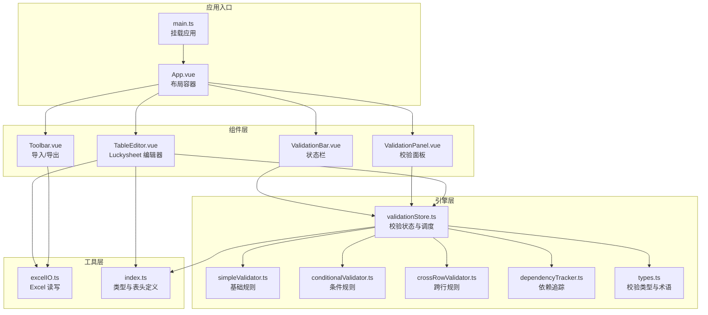
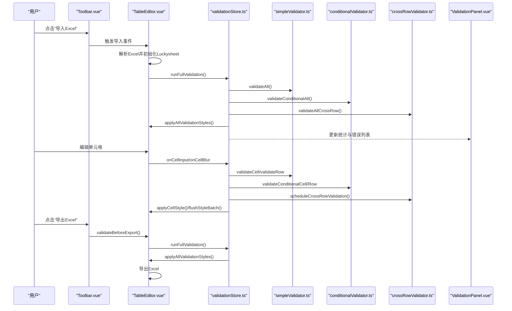
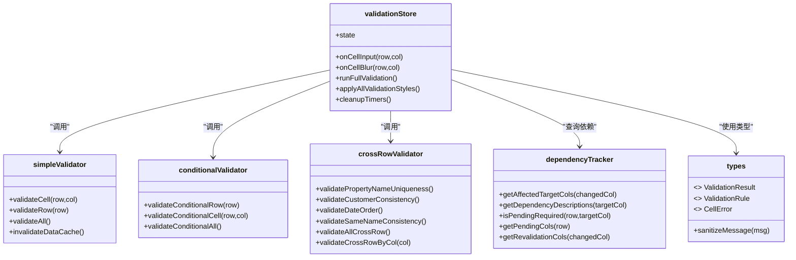
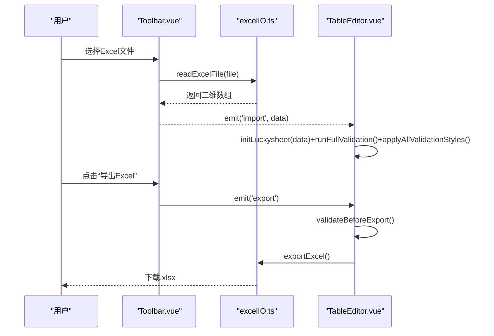
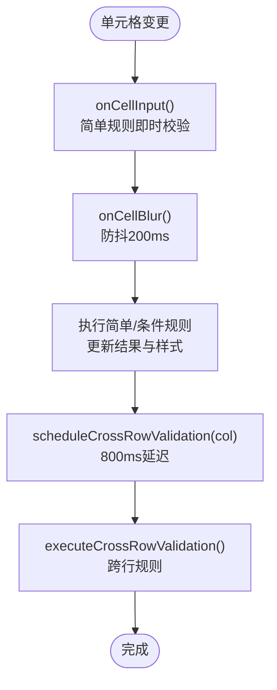
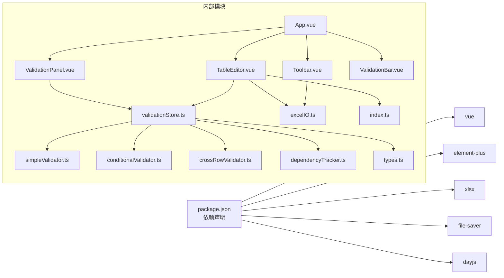

# 项目概述

<cite>
**本文档引用的文件**
- [package.json](file://package.json)
- [main.ts](file://src/main.ts)
- [App.vue](file://src/App.vue)
- [TableEditor.vue](file://src/components/TableEditor.vue)
- [Toolbar.vue](file://src/components/Toolbar.vue)
- [ValidationPanel.vue](file://src/components/ValidationPanel.vue)
- [ValidationBar.vue](file://src/components/ValidationBar.vue)
- [validationStore.ts](file://src/engine/validationStore.ts)
- [simpleValidator.ts](file://src/engine/simpleValidator.ts)
- [conditionalValidator.ts](file://src/engine/conditionalValidator.ts)
- [crossRowValidator.ts](file://src/engine/crossRowValidator.ts)
- [dependencyTracker.ts](file://src/engine/dependencyTracker.ts)
- [types.ts](file://src/engine/types.ts)
- [index.ts](file://src/types/index.ts)
- [excelIO.ts](file://src/utils/excelIO.ts)
</cite>

## 目录
1. [简介](#简介)
2. [项目结构](#项目结构)
3. [核心组件](#核心组件)
4. [架构总览](#架构总览)
5. [详细组件分析](#详细组件分析)
6. [依赖分析](#依赖分析)
7. [性能考虑](#性能考虑)
8. [故障排查指南](#故障排查指南)
9. [结论](#结论)
10. [附录](#附录)

## 简介
SmartForm 是一个基于 Vue 3 与 Luckysheet 的在线 Excel 表格编辑与校验工具，专注于物业数据的批量导入与实时校验。它通过直观的电子表格界面，结合多维度的业务规则引擎，帮助用户在录入阶段即刻发现并修正错误，显著提升数据质量与导入效率。

- 核心目标
  - 提供“所见即所得”的在线表格编辑体验，降低学习成本
  - 在编辑过程中即时反馈格式与必填规则，失焦时进行更深入的条件与跨行校验
  - 通过术语替换与本地草稿恢复机制，提升易用性与容错性
  - 支持 Excel 文件导入/导出，便于与现有工作流衔接

- 主要特性
  - 实时单元格校验与批量样式应用
  - 条件触发规则（如“填写业主信息则售楼日期必填”）
  - 跨行唯一性、一致性与日期顺序校验
  - 自动保存草稿与恢复
  - 侧边校验面板与统计栏，可视化展示校验结果

- 技术栈概览
  - 前端框架：Vue 3（Composition API）
  - UI 组件库：Element Plus
  - 电子表格内核：Luckysheet
  - 数据处理：xlsx（读写 Excel）、file-saver（下载）
  - 时间处理：dayjs
  - 类型系统：TypeScript

- 价值主张
  - 降低物业数据导入门槛：无需复杂配置，直接拖拽 Excel 即可导入
  - 强化数据质量：从源头拦截错误，减少二次返工
  - 提升协作效率：可视化校验面板与错误定位，便于团队协同纠错
  - 与 SaaS 模板对齐：内置 30 列标准字段，适配常见物业导入场景

- 与其他工具的区别
  - 更贴近业务：内置“条件触发 + 跨行一致性”的强校验策略
  - 更关注体验：即时提示、自动草稿、侧边面板、术语替换
  - 更易集成：基于 Luckysheet 的 Web 端能力，无需服务端渲染

## 项目结构
项目采用按功能域划分的组织方式，核心分为三部分：
- 组件层：表格编辑器、工具栏、校验面板、状态栏等 UI 组件
- 引擎层：校验存储、简单规则、条件规则、跨行规则、依赖追踪
- 工具层：Excel IO、自动保存

**图表来源**
- [main.ts:1-9](file://src/main.ts#L1-L9)
- [App.vue:1-70](file://src/App.vue#L1-L70)
- [Toolbar.vue:1-83](file://src/components/Toolbar.vue#L1-L83)
- [TableEditor.vue:1-399](file://src/components/TableEditor.vue#L1-L399)
- [ValidationPanel.vue:1-438](file://src/components/ValidationPanel.vue#L1-L438)
- [ValidationBar.vue:1-64](file://src/components/ValidationBar.vue#L1-L64)
- [validationStore.ts:1-474](file://src/engine/validationStore.ts#L1-L474)
- [simpleValidator.ts:1-419](file://src/engine/simpleValidator.ts#L1-L419)
- [conditionalValidator.ts:1-325](file://src/engine/conditionalValidator.ts#L1-L325)
- [crossRowValidator.ts:1-276](file://src/engine/crossRowValidator.ts#L1-L276)
- [dependencyTracker.ts:1-158](file://src/engine/dependencyTracker.ts#L1-L158)
- [types.ts:1-48](file://src/engine/types.ts#L1-L48)
- [index.ts:1-79](file://src/types/index.ts#L1-L79)
- [excelIO.ts:1-105](file://src/utils/excelIO.ts#L1-L105)

**章节来源**
- [package.json:1-26](file://package.json#L1-L26)
- [main.ts:1-9](file://src/main.ts#L1-L9)
- [App.vue:1-70](file://src/App.vue#L1-L70)

## 核心组件
- 应用入口与挂载
  - main.ts：创建 Vue 应用实例，安装 Element Plus 插件并挂载根组件
  - App.vue：应用容器，组合 Toolbar、TableEditor、ValidationPanel、ValidationBar，并协调导入/导出流程

- 表格编辑器
  - TableEditor.vue：封装 Luckysheet，负责初始化、单元格钩子、自动保存、草稿恢复、导入/导出前校验、Shift+滚轮横向滚动优化

- 工具栏与状态栏
  - Toolbar.vue：提供导入 Excel 与导出 Excel 的按钮，触发文件读取与导出流程
  - ValidationBar.vue：展示已填写行数、错误/警告数量与总体状态

- 校验面板
  - ValidationPanel.vue：展示错误与待填写项，支持按行分组、跳转到单元格、重新校验

- 校验引擎
  - validationStore.ts：集中管理校验状态、防抖与跨行延迟执行、样式批处理、全量校验与清理
  - simpleValidator.ts：基础必填/格式规则（日期、数字、枚举、身份证号等）
  - conditionalValidator.ts：条件触发规则（如“填写业主信息则售楼日期必填”）
  - crossRowValidator.ts：跨行唯一性、一致性、日期顺序校验
  - dependencyTracker.ts：依赖关系追踪，计算受影响目标列与“待填写”状态
  - types.ts：校验严重度、结果、规则、单元格错误等类型定义与术语替换

- 工具函数
  - excelIO.ts：读取 Excel 文件为二维数组；导出当前表格为 Excel，标准化日期与列宽
  - index.ts：Luckysheet 类型声明、30 列表头定义、自动保存键名

**章节来源**
- [main.ts:1-9](file://src/main.ts#L1-L9)
- [App.vue:18-40](file://src/App.vue#L18-L40)
- [TableEditor.vue:55-127](file://src/components/TableEditor.vue#L55-L127)
- [Toolbar.vue:27-56](file://src/components/Toolbar.vue#L27-L56)
- [ValidationPanel.vue:98-201](file://src/components/ValidationPanel.vue#L98-L201)
- [ValidationBar.vue:22-24](file://src/components/ValidationBar.vue#L22-L24)
- [validationStore.ts:15-474](file://src/engine/validationStore.ts#L15-L474)
- [simpleValidator.ts:54-419](file://src/engine/simpleValidator.ts#L54-L419)
- [conditionalValidator.ts:178-325](file://src/engine/conditionalValidator.ts#L178-L325)
- [crossRowValidator.ts:17-276](file://src/engine/crossRowValidator.ts#L17-L276)
- [dependencyTracker.ts:7-158](file://src/engine/dependencyTracker.ts#L7-L158)
- [types.ts:1-48](file://src/engine/types.ts#L1-L48)
- [excelIO.ts:10-105](file://src/utils/excelIO.ts#L10-L105)
- [index.ts:1-79](file://src/types/index.ts#L1-L79)

## 架构总览
SmartForm 的控制流围绕“Luckysheet + 校验引擎 + UI 组件”的交互展开。用户在表格中输入/修改数据，系统通过 validationStore 调度 simple/conditional/crossRow 规则，实时更新样式与状态，并通过 ValidationPanel 与 ValidationBar 展示结果。

**图表来源**
- [Toolbar.vue:34-56](file://src/components/Toolbar.vue#L34-L56)
- [TableEditor.vue:239-273](file://src/components/TableEditor.vue#L239-L273)
- [validationStore.ts:408-452](file://src/engine/validationStore.ts#L408-L452)
- [simpleValidator.ts:275-395](file://src/engine/simpleValidator.ts#L275-L395)
- [conditionalValidator.ts:183-324](file://src/engine/conditionalValidator.ts#L183-L324)
- [crossRowValidator.ts:244-251](file://src/engine/crossRowValidator.ts#L244-L251)
- [excelIO.ts:61-104](file://src/utils/excelIO.ts#L61-L104)

## 详细组件分析

### 校验引擎类图
校验引擎通过 validationStore 统一调度各规则模块，形成清晰的职责边界与依赖关系。

**图表来源**
- [validationStore.ts:15-474](file://src/engine/validationStore.ts#L15-L474)
- [simpleValidator.ts:275-395](file://src/engine/simpleValidator.ts#L275-L395)
- [conditionalValidator.ts:183-324](file://src/engine/conditionalValidator.ts#L183-L324)
- [crossRowValidator.ts:244-251](file://src/engine/crossRowValidator.ts#L244-L251)
- [dependencyTracker.ts:79-157](file://src/engine/dependencyTracker.ts#L79-L157)
- [types.ts:4-47](file://src/engine/types.ts#L4-L47)

**章节来源**
- [validationStore.ts:15-474](file://src/engine/validationStore.ts#L15-L474)
- [simpleValidator.ts:275-395](file://src/engine/simpleValidator.ts#L275-L395)
- [conditionalValidator.ts:183-324](file://src/engine/conditionalValidator.ts#L183-L324)
- [crossRowValidator.ts:244-251](file://src/engine/crossRowValidator.ts#L244-L251)
- [dependencyTracker.ts:79-157](file://src/engine/dependencyTracker.ts#L79-L157)
- [types.ts:4-47](file://src/engine/types.ts#L4-L47)

### 导入/导出流程
- 导入：Toolbar.vue 通过 file-saver 读取 Excel，转换为二维数组后传递给 TableEditor.vue，后者重建 Luckysheet 并触发全量校验
- 导出：TableEditor.vue 在导出前执行全量校验并应用样式，随后通过 xlsx 将当前数据导出为 Excel，设置列宽并命名文件

**图表来源**
- [Toolbar.vue:34-56](file://src/components/Toolbar.vue#L34-L56)
- [excelIO.ts:10-56](file://src/utils/excelIO.ts#L10-L56)
- [TableEditor.vue:239-273](file://src/components/TableEditor.vue#L239-L273)

**章节来源**
- [Toolbar.vue:34-56](file://src/components/Toolbar.vue#L34-L56)
- [excelIO.ts:10-104](file://src/utils/excelIO.ts#L10-L104)
- [TableEditor.vue:184-215](file://src/components/TableEditor.vue#L184-L215)

### 校验流程（防抖与跨行延迟）
- 即时校验：onCellInput 仅执行简单规则，不触发布局刷新
- 失焦校验：onCellBlur 防抖 200ms，合并简单/条件规则结果，更新样式并触发跨行延迟校验
- 跨行延迟：按列调度，800ms 后执行跨行规则，避免频繁全表扫描

**图表来源**
- [validationStore.ts:248-344](file://src/engine/validationStore.ts#L248-L344)

**章节来源**
- [validationStore.ts:248-344](file://src/engine/validationStore.ts#L248-L344)

### 表头与列宽配置
- 表头列定义：30 列，涵盖项目、楼栋、房间、计费面积、房产类型、关联信息、日期、客户类型/名称/电话/证件、备注等
- 列宽：按列定义的宽度映射到 Luckysheet 的 columnlen 配置，冻结首行，提升可读性

**章节来源**
- [index.ts:44-79](file://src/types/index.ts#L44-L79)
- [TableEditor.vue:47-53](file://src/components/TableEditor.vue#L47-L53)
- [TableEditor.vue:74-94](file://src/components/TableEditor.vue#L74-L94)

## 依赖分析
- 外部依赖
  - vue：响应式与组件体系
  - element-plus：UI 组件与图标
  - xlsx：Excel 读写
  - file-saver：浏览器端下载
  - dayjs：日期格式化
- 内部耦合
  - 组件层通过 emits/props 与引擎层解耦
  - 引擎层通过统一的 validationStore 调度规则，避免循环依赖
  - 工具层与引擎层通过类型与常量解耦

**图表来源**
- [package.json:11-24](file://package.json#L11-L24)
- [App.vue:20-23](file://src/App.vue#L20-L23)
- [TableEditor.vue:18-19](file://src/components/TableEditor.vue#L18-L19)
- [Toolbar.vue:25](file://src/components/Toolbar.vue#L25)
- [excelIO.ts:1-4](file://src/utils/excelIO.ts#L1-L4)
- [validationStore.ts:2-11](file://src/engine/validationStore.ts#L2-L11)
- [types.ts:1-47](file://src/engine/types.ts#L1-L47)
- [index.ts:1-79](file://src/types/index.ts#L1-L79)

**章节来源**
- [package.json:11-24](file://package.json#L11-L24)
- [App.vue:20-23](file://src/App.vue#L20-L23)
- [TableEditor.vue:18-19](file://src/components/TableEditor.vue#L18-L19)
- [Toolbar.vue:25](file://src/components/Toolbar.vue#L25)
- [excelIO.ts:1-4](file://src/utils/excelIO.ts#L1-L4)
- [validationStore.ts:2-11](file://src/engine/validationStore.ts#L2-L11)
- [types.ts:1-47](file://src/engine/types.ts#L1-L47)
- [index.ts:1-79](file://src/types/index.ts#L1-L79)

## 性能考虑
- 样式批处理：通过批量队列与 flushStyleBatch 减少 Luckysheet 的多次重绘
- 请求动画帧统计：通过 requestAnimationFrame 合并统计更新，避免频繁遍历
- 跨行延迟：按列调度跨行规则，限制高频扫描
- 数据缓存：simpleValidator 对 Luckysheet 数据进行缓存，版本号递增以失效缓存
- 自动保存：30s 间隔写入 localStorage，避免频繁 I/O

**章节来源**
- [validationStore.ts:99-148](file://src/engine/validationStore.ts#L99-L148)
- [validationStore.ts:30-57](file://src/engine/validationStore.ts#L30-L57)
- [validationStore.ts:317-344](file://src/engine/validationStore.ts#L317-L344)
- [simpleValidator.ts:10-25](file://src/engine/simpleValidator.ts#L10-L25)

## 故障排查指南
- Luckysheet 未加载
  - 现象：控制台提示未加载 Luckysheet
  - 排查：确认页面已正确引入 Luckysheet 资源，TableEditor.vue 中的初始化逻辑依赖 window.luckysheet
  - 参考：[TableEditor.vue:57-61](file://src/components/TableEditor.vue#L57-L61)

- 导入失败
  - 现象：导入弹窗报错
  - 排查：检查文件格式（.xlsx/.xls）、文件大小与权限；查看 readExcelFile 的异常分支
  - 参考：[Toolbar.vue:43-49](file://src/components/Toolbar.vue#L43-L49)，[excelIO.ts:10-56](file://src/utils/excelIO.ts#L10-L56)

- 导出前无法通过校验
  - 现象：导出弹窗提示错误/警告数量
  - 排查：根据 ValidationPanel 展示的错误逐项修正；必要时点击“重新校验”
  - 参考：[TableEditor.vue:239-273](file://src/components/TableEditor.vue#L239-L273)，[ValidationPanel.vue:196-200](file://src/components/ValidationPanel.vue#L196-L200)

- 草稿未恢复
  - 现象：启动后未出现草稿恢复提示
  - 排查：确认 localStorage 中存在草稿键；检查时间戳格式与数据完整性
  - 参考：[TableEditor.vue:217-237](file://src/components/TableEditor.vue#L217-L237)，[index.ts:78](file://src/types/index.ts#L78)

- 术语替换未生效
  - 现象：提示信息未按预期替换
  - 排查：确认 TERM_REPLACEMENTS 映射与 sanitizeMessage 的调用链
  - 参考：[types.ts:34-47](file://src/engine/types.ts#L34-L47)，[validationStore.ts:68-69](file://src/engine/validationStore.ts#L68-L69)

**章节来源**
- [TableEditor.vue:57-61](file://src/components/TableEditor.vue#L57-L61)
- [Toolbar.vue:43-49](file://src/components/Toolbar.vue#L43-L49)
- [excelIO.ts:10-56](file://src/utils/excelIO.ts#L10-L56)
- [TableEditor.vue:239-273](file://src/components/TableEditor.vue#L239-L273)
- [ValidationPanel.vue:196-200](file://src/components/ValidationPanel.vue#L196-L200)
- [TableEditor.vue:217-237](file://src/components/TableEditor.vue#L217-L237)
- [index.ts:78](file://src/types/index.ts#L78)
- [types.ts:34-47](file://src/engine/types.ts#L34-L47)
- [validationStore.ts:68-69](file://src/engine/validationStore.ts#L68-L69)

## 结论
SmartForm 通过“Luckysheet + Vue 3 + Element Plus”的组合，构建了面向物业数据导入的高可用在线表格工具。其核心优势在于：
- 以用户体验为中心的设计：即时提示、自动草稿、侧边面板与术语替换
- 以业务规则为核心的强校验：基础/条件/跨行三层校验，覆盖必填、格式、唯一性、一致性与日期顺序
- 以工程化为导向的实现：防抖与跨行延迟、样式批处理、缓存与清理机制

对于初学者，建议从导入/导出与校验面板入手，逐步熟悉各字段含义与规则；对于有经验的开发者，可基于引擎层扩展规则或优化性能。

## 附录
- 实际使用场景示例
  - 批量导入：将 Excel 文件拖入工具，系统自动解析并填充表格，同时进行全量校验
  - 实时纠错：编辑单元格时即时提示格式错误，失焦后触发条件与跨行校验
  - 导出前确认：导出前自动执行全量校验，错误/警告数量可视化呈现，确认后导出

- 术语替换
  - “住户客户类型”替换为“租户客户类型”
  - “住户联系人”替换为“租户企业联系人”
  - “住户”替换为“租户”

**章节来源**
- [types.ts:34-47](file://src/engine/types.ts#L34-L47)
- [excelIO.ts:61-104](file://src/utils/excelIO.ts#L61-L104)